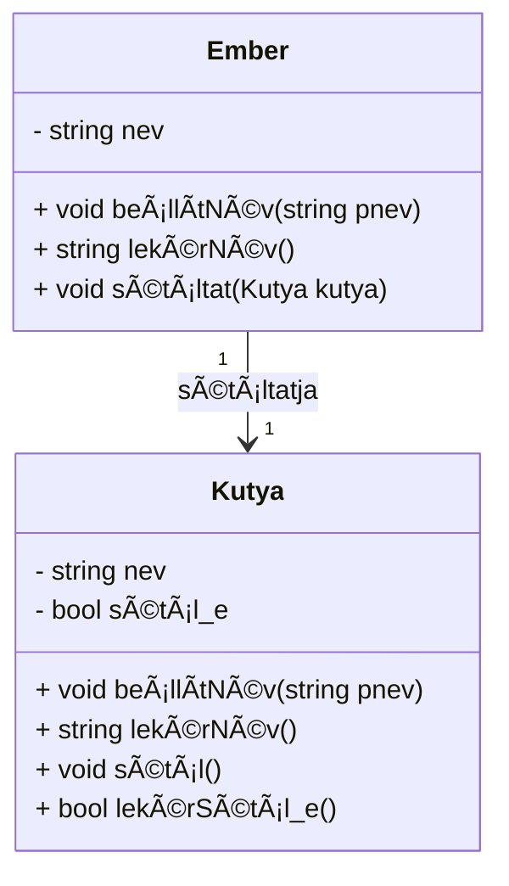

 
## Contents

- **Actors and behaviors**  
- **From structure to class**  
- **Encapsulation**  
- **Constructors**  
  - Member variable initialization  
  - Object lifetime  
  - Default constructor  
  - Copy constructor  
- **Summary**

---

Here's the **English translation** of the slide titled **"Szereplők és viselkedések"** (Actors and Behaviors):

---

## Actors and Behaviors

- **Rozi is walking Blöki.**  
- **Blöki is walking.**

---

This slide illustrates the difference between *who performs an action* and *who is affected*, useful in object-oriented thinking to distinguish between objects (Rozi, Blöki) and their behaviors (methods like `walk()`, `walkWith()` etc.).

 Here’s the **English translation** of the slide titled **"Felelősségek"** (Responsibilities):

---

## Responsibilities

- **Rozi (human)**  
  ☠walks Blöki (dog).

- **Blöki (dog)**  
  ☠walks.

---

 

### Implementation in C: dog

---

#### Constants and Includes
```c
#include <stdio.h>
#include <string.h>

#define NEV_HOSSZ_MAX 20    // Maximum name length
#define FALSE 0             // Logical false
#define TRUE 1              // Logical true
```

#### Struct Definition
```c
typedef struct {
    char nev[NEV_HOSSZ_MAX]; // Name of the dog
    int setal_e;             // Walking flag (is walking?)
} Kutya;
```

#### Functions

```c
void kutyaBeallitNev(Kutya* kutyap, char* pnev) {
    strcpy(kutyap->nev, pnev); // Sets the dog's name
}
```

```c
void kutyaBeallitSetal_e(Kutya* kutyap, int psetel_e) {
    kutyap->setal_e = psetel_e; // Sets the walking state
}
```

```c
char* kutyaLekerNev(Kutya* kutyap) {
    return kutyap->nev; // Gets the dog's name
}
```

```c
void kutyaSetal(Kutya* kutyap) {
    kutyap->setal_e = TRUE;
    printf("%s sétál.", kutyap->nev); // "%s is walking."
}
```

---

This is a basic object-oriented-style approach in C using structs and functions, simulating what would be class behavior in C++.


### Implementation in C: human

#### Struct for `Ember` (Human)
```c
typedef struct {
    char nev[NEV_HOSSZ_MAX]; // name
} Ember;
```

#### Function: `emberBeallitNev`
Sets the name of the human.
```c
void emberBeallitNev(Ember* emberp, char* pnev) {
    strcpy(emberp->nev, pnev);
}
```

#### Function: `emberLekerNev`
Gets the human’s name.
```c
char* emberLekerNev(Ember* emberp) {
    return emberp->nev;
}
```

#### Function: `emberSetaltat`
Prints a message that the human is walking the dog, then sets the dog to walk.
```c
void emberSetaltat(Ember* emberp, Kutya* kutyap) {
    printf("%s sétáltatja %s-t.", emberLekerNev(emberp), kutyaLekerNev(kutyap));
    kutyaSetal(kutyap); // makes the dog walk
}
```

---

### 🧪 `main()` Function:
```c
int main() {
    Kutya bloki;
    kutyaBeallitNev(&bloki, "Blöki");
    bloki.setal_e = FALSE;

    Ember rozi;
    emberBeallitNev(&rozi, "Rozi");
    emberSetaltat(&rozi, &bloki);

    return 0;
}
```

---

### 💡 Output (`Kimenet`):
```
Rozi sétáltatja Blöki-t. Blöki sétál.
```

This example emulates basic object interaction using structs and functions in C, mimicking object-oriented behavior.


This slide explains the **transition from procedural C-style programming to object-oriented programming (OOP)** in C++. Here's a translated and summarized explanation:

---

### 🔄 **Converting to Object-Oriented Approach**

#### ✅ **Transformation:**
- **Structure types** → become **Classes**
- **Functions** → become **Member functions (methods)**  
  *(Responsibilities are assigned to the class)*
- **Structure instances** → become **Objects**

---

### 🔠**Encapsulation (Egységbezárás):**
- All **member variables are private**
- Can be **accessed and modified only through member functions**

---

This slide captures the core idea of object-oriented refactoring: organizing code around **data and behavior**, encapsulating it into classes, and controlling access through methods.

Let me know if you'd like to see how the C "dog" and "human" examples would be rewritten in C++ with classes!

This slide demonstrates how **responsibilities (functions) and knowledge (variables)** are assigned to classes in object-oriented programming. Here's a breakdown and translation:

---

### 📌 Assigning Responsibilities to Classes

#### 👤 **Human (Ember)**
- **Knowledge (member variable)**: `name`
- **Responsibility (member function)**:  
  ‣ Walks a dog (`kutya`)

#### 🶠**Dog (Kutya)**
- **Knowledge (member variables)**:  
  ‣ `name`,  
  ‣ whether it is walking (`sétált-e`)
- **Responsibility (member function)**:  
  ‣ Walk (`sétál`)

---

This approach shows **good object-oriented design**, where:
- Data and behavior are grouped together.
- Each class is responsible for its own data and actions.

Would you like to see this example implemented in actual C++ code using classes?


This slide shows how the previously defined *C-style struct for a dog (`Kutya`)* is transformed into an **object-oriented C++ class**. Here's a breakdown of what's happening:

---

### 🶠**C++ Class Implementation: `Kutya`**

#### 🔒 Private Members
```cpp
string nev;     // dog's name
bool setal_e;   // is the dog walking?
```
These are hidden from outside the class, which enforces encapsulation.

#### 🔓 Public Member Functions
- `void beallitNev(string pnev)`: sets the dog's name.
- `void beallitSetal_e(bool psetel_e)`: sets whether the dog is walking.
- `string lekerNev() const`: returns the name without modifying any member.
- `void setal()`: marks the dog as walking and prints a message.

```cpp
void Kutya::setal() {
    setal_e = true;
    cout << nev << " sétál. ";
}
```

This clearly reflects **good OOP design** principles:
- Encapsulation (private data).
- Access via public methods.
- Clear separation between interface (declaration) and implementation (definition outside class with `Kutya::`).


Sure! Here's the same C++ code, now with detailed **comments in English** explaining each part:

```cpp
#include <iostream>   // For standard input/output operations
#include <string>     // For using the string class

using namespace std;  // To avoid prefixing std:: before standard library elements

// Definition of the class 'Kutya' (Dog)
class Kutya {
private:
    // Private member variables: can only be accessed through class methods
    string nev;     // Dog's name
    bool setal_e;   // Flag indicating whether the dog is walking

public:
    // Public method to set the dog's name
    void beallitNev(string pnev) {
        nev = pnev;
    }

    // Public method to set the 'walking' flag
    void beallitSetal_e(bool psetel_e) {
        setal_e = psetel_e;
    }

    // Public method to return the dog's name
    // 'const' means this method does not modify any member variables
    string lekerNev() const {
        return nev;
    }

    // Declaration of the method that will define the dog walking behavior
    void setal();
};

// Definition of the 'setal' method outside the class
void Kutya::setal() {
    setal_e = true;                        // Set walking flag to true
    cout << nev << " sétál. ";            // Output that the dog is walking
}
```

Let me know if you’d like the comments in Hungarian or if you’d like the main function added to test this class! 

Here is the C++ code from the slide with **comments** added to explain each part clearly:

```cpp
// Class representing a person
class Ember {
private:
    string nev; // Person's name

public:
    // Method to set the person's name
    void beallitNev(string pnev) {
        nev = pnev;
    }

    // Method to retrieve the person's name
    string lekerNev() {
        return nev;
    }

    // Method for walking a dog (calls dog's walk function)
    void setaltat(Kutya& kutya) {
        // Print out that this person is walking the dog
        cout << nev << " sétáltatja " << kutya.lekerNev() << "-t. ";

        // Tell the dog to walk
        kutya.setal();
    }
};
```

```cpp
int main() {
    Kutya bloki;                            // Create a dog object named Blöki
    bloki.beallitNev("Blöki");             // Set dog's name
    bloki.beallitSetal_e(false);           // Initially not walking
    // bloki.setal_e = false;              // Can't access directly (private)

    Ember rozi;                             // Create a person object named Rozi
    rozi.beallitNev("Rozi");               // Set person's name
    rozi.setaltat(bloki);                  // Rozi walks Blöki

    return 0;
}

// Output: Rozi sétáltatja Blöki-t. Blöki sétál.
```

Let me know if you’d like this translated into Hungarian or if you want the full program in one block!

The slide presents an introduction to **UML (Unified Modeling Language)**, including the types of diagrams and their standardization:

---

### 🧩 UML (Unified Modeling Language)

- **Standardization:**
  - Maintained by **OMG (Object Management Group)**
  - Follows standard: **ISO/IEC 19505-2**

---

### 📊 Diagram Típusok (Diagram Types)

#### **Struktúra (Structure)**
- **Osztálydiagram (Class Diagram)**  
  → Describes the static structure: classes, attributes, relationships  
- *(... more structural diagrams not listed)*

#### **Viselkedés (Behavior)**
- **Ãllapot automata (State Machine Diagram)**  
  → Shows states and transitions of objects
- **Együttműködési diagram (Collaboration Diagram)**  
  → Emphasizes interaction between objects
- **Szekvencia diagram (Sequence Diagram)**  
  → Focuses on the order of messages exchanged over time
- *(... more behavioral diagrams not listed)*

---

Let me know if you want an example UML diagram or a visual explanation of one!


This slide shows a **UML class diagram** of the `Ember` (Human) and `Kutya` (Dog) classes, with annotated elements for understanding the structure:

---

### 🔷 UML Osztálydiagram (Class Diagram)

#### 🧱 **Class: Ember**
- **Attributes:**
  - `- név: string`  
    *(private attribute storing the name)*
- **Methods:**
  - `+ beállítNév(string)` — sets the name
  - `+ lekérNév(): string` — gets the name
  - `+ sétáltat(Kutya)` — calls the dog’s `sétál()` method

#### 🶠**Class: Kutya**
- **Attributes:**
  - `- név: string` — name of the dog
  - `- sétál_e: bool` — whether it’s walking
- **Methods:**
  - `+ beállítNév(string)`
  - `+ lekérNév(): string`
  - `+ sétál()` — sets `sétál_e` to true and prints a message
  - `+ lekérSétál_e(): bool` — returns if the dog is walking

---

### 🔠**Association**
- The line labeled **â€sétáltatjaâ€** with `1..1` at both ends means:
  - One `Ember` interacts with one `Kutya` (1-to-1 association).

---

### 🧩 Legend
- `+` → **public** member
- `-` → **private** member

---

Would you like a similar diagram generated or converted into code/markdown?

Here's a **Markdown version** of the UML class diagram for `Ember` and `Kutya`:

---

### UML Class Diagram (Markdown Representation)

#### 📦 Class: `Ember`

| Access | Attribute / Method             | Type        |
|--------|-------------------------------|-------------|
| `-`    | `név`                         | `string`    |
| `+`    | `beállítNév(pnev)`            | `void`      |
| `+`    | `lekérNév()`                  | `string`    |
| `+`    | `sétáltat(kutya: Kutya)`      | `void`      |

---

#### 🶠Class: `Kutya`

| Access | Attribute / Method             | Type        |
|--------|-------------------------------|-------------|
| `-`    | `név`                         | `string`    |
| `-`    | `sétál_e`                     | `bool`      |
| `+`    | `beállítNév(pnev)`            | `void`      |
| `+`    | `lekérNév()`                  | `string`    |
| `+`    | `sétál()`                     | `void`      |
| `+`    | `lekérSétál_e()`              | `bool`      |

---

#### 🔠Association

| `Ember`          | Association    | `Kutya`         |
|------------------|----------------|------------------|
| `1`              | sétáltatja     | `1`              |

---

Let me know if you want this turned into a Mermaid diagram or actual C++ code snippet!

Here's the **UML class diagram using Mermaid syntax** that matches the image:



To render this, you can use tools that support Mermaid like:

- [Live Editor](https://mermaid.live/)
- VS Code (with the **"Markdown Preview Mermaid Support"** extension)
- GitHub (inside Markdown if enabled)

Let me know if you want a sequence diagram or state diagram next!


The slide explains **association types in UML class diagrams** and their characteristics:

---

### 🔗 **UML Class Diagram: Association**

#### 📌 **Types of Associations (Típusai):**
- **Tartalmazás (Composition):**  
  Represented with a **filled diamond (â—†)**.  
  Indicates strong ownership (whole-part relationship), e.g., a class that **contains another class as a member** (not shared).

- **Hivatkozás tartalmazása (Aggregation):**  
  Represented with an **empty diamond (â—‡)**.  
  Weaker ownership, often means a **reference/pointer to another class**.

- **Metódus argumentuma:**  
  Association via method parameters (object passed as an argument).

- **Metódus visszatérési értéke:**  
  Association when an object is returned from a method.

- **Lokális objektum metódusban:**  
  Local objects created inside methods.

- **Szülő-gyerek kapcsolat:**  
  Parent-child or inheritance relationship (to be covered in the next session).

---

#### 🔤 **Other Properties of Associations:**
- **Neve (Name):**  
  Optional label describing the nature of the relationship (e.g., "sétáltatja" = walks).

- **Iránya (Direction):**  
  Shows **which class knows about the other** (arrow indicates navigability).

- **Számossága (Multiplicity):**  
  Specifies how many instances are involved, e.g.  
  `1`, `0..1`, `*`, `1..*` etc.

---

Let me know if you'd like an example or if you'd like to represent this in Mermaid syntax too.

This slide explains the concept of a **constructor** in C++:

---

### ğŸ› ï¸ **Constructor**

#### 🔹 What is it?
A **special member function** of a class that is automatically called when an object is created.

#### ✅ **Characteristics:**
- Its **name is the same as the class name**.
- It **does not have a return type** (not even `void`).
- Its job is to **create and initialize** class variables (attributes).

#### 🔠**When does it run?**
- It **runs exactly once**, **when the object is created**.
- After that, it **cannot be called again manually**.

---

Let me know if you'd like an example of a constructor in C++ or the difference between default and parameterized constructors.

Here's the commented version of the constructor example shown in the slide:

```cpp
class Kutya {
    // ...
public:
    // Constructor definition (method 1 - using assignment)
    Kutya(const string &pnev) {
        nev = pnev;           // Initialize the 'nev' attribute with the parameter
        setal_e = false;      // Set the 'setal_e' flag to false
    }

    // OR (method 2 - using member initializer list)
    Kutya(const string &pnev) : nev(pnev), setal_e(false) {
        // This constructor does the same as the one above,
        // but uses an initializer list which is more efficient
    }
};
```

### 🔹 How to use (called automatically on object creation):
```cpp
Kutya bloki("Blöki");
// This calls the constructor and initializes the object
// nev = "Blöki", setal_e = false
```

Let me know if you want a breakdown of member initializer lists vs assignment or want to add a default constructor too.

This slide presents a **UML class diagram** with constructors, showing the relationship between the `Ember` (Person) and `Kutya` (Dog) classes. Here's a breakdown:

---

### 🔷 **Ember class**
- **Attribute:**
  - `- név: string` — private name field.
- **Operations (Methods):**
  - `+ Ember(pnév: string)` — constructor that initializes the name.
  - `+ beállítNév(string)` — sets the name.
  - `+ lekerNév(): string` — returns the name.
  - `+ sétáltat(Kutya)` — makes a `Kutya` walk (calls its `sétál()` method).

---

### 🔷 **Kutya class**
- **Attributes:**
  - `- név: string` — private name.
  - `- sétál_e: bool` — whether the dog is walking.
- **Operations:**
  - `+ Kutya(pnév: string)` — constructor, sets name and default walking state.
  - `+ beállítNév(string)` — sets the dog's name.
  - `+ lekérNév(): string` — returns the dog's name.
  - `+ sétál()` — marks the dog as walking and prints a message.
  - `+ lekérSétál_e(): bool` — returns whether the dog is walking.

---

### 🔗 **Association**
- The labeled arrow `sétáltatja` from `Ember` to `Kutya` with multiplicity `1–1` indicates:
  - One person walks one dog, and vice versa (1-to-1 relationship).
  - This is likely realized through a method call in `Ember` referencing a `Kutya` instance.

---

Let me know if you want the C++ code that implements this UML or a graphical version of it generated!

This slide shows how to **call constructors in C++** and demonstrates their practical use in the `main()` function. Here's the commented version of the code:

```cpp
int main(){
    // Creating a Kutya (Dog) object named "bloki" using the constructor
    Kutya bloki("Blöki");

    // Creating an Ember (Person) object named "rozi" using the constructor
    Ember rozi("Rozi");

    // Rozi walks Blöki – this calls the 'setaltat' method of Ember
    rozi.setaltat(bloki);

    return 0;
}
```

---

### 🖨 Output:
```plaintext
Rozi sétáltatja Blöki-t. Blöki sétál.
```

This output comes from the combination of:
- `Ember::setaltat(Kutya&)` printing `"Rozi sétáltatja Blöki-t. "`
- `Kutya::setal()` printing `"Blöki sétál."`

Let me know if you'd like the full source code implementation for both classes!

This slide presents a **UML class diagram demonstrating aggregation** (hivatkozás tartalmazása) between `Ember` (Person) and `Kutya` (Dog).

---

### 💡 Key Concepts Illustrated:

#### 🔷 Aggregation (Aggregáció):
- Shown with a **white diamond** on the line between `Ember` and `Kutya`.
- Represents a **"has-a" relationship**.
- Indicates that `Ember` contains a **reference** to a `Kutya` but does **not own it** entirely (their lifetimes are independent).
- In this case:  
  `Ember` *has a* `Kutya` (kutyája = his/her dog).

---

### 📠Class Structure Summary:

#### `Ember` (Person)
- **Attribute:**
  - `- név: string` → Private name attribute
- **Methods:**
  - `+ Ember(pnév: string)` → Constructor
  - `+ beállítNév(string)` → Setter for name
  - `+ lekerNév(): string` → Getter for name
  - `+ sétáltat(Kutya)` → Method to walk the dog

#### `Kutya` (Dog)
- **Attributes:**
  - `- név: string` → Private name
  - `- sétál_e: bool` → Whether the dog is walking
- **Methods:**
  - `+ Kutya(pnév: string)` → Constructor
  - `+ beállítNév(string)`
  - `+ lekerNév(): string`
  - `+ sétál()`
  - `+ lekerSétál_e(): bool`

---

### 🔠Multiplicity:
- `1`—`1`: One person is associated with one dog and vice versa.

Let me know if you’d like to see the code version that matches this diagram!

This slide presents a C++ code example demonstrating how **constructors** and **aggregation (reference-based relationship)** are used together in Object-Oriented Programming.

---

### 🔠Code Breakdown with Comments:

#### 🧱 Class `Ember`:

```cpp
class Ember {
private:
    string nev;           // Stores the name of the person
    Kutya& kutyaja;       // Reference to a 'Kutya' object (aggregation)

public:
    // Constructor initializing 'nev' and 'kutyaja' using an initializer list
    Ember(const string &pnev, Kutya& kutya) :
        nev(pnev), kutyaja(kutya) {
    }

    // Method that makes the person walk the dog
    void setaltat() {
        cout << nev << " sétáltatja " << kutyaja.lekerNev() << "-t. ";
        kutyaja.setal(); // The dog starts walking
    }
};
```

---

#### 🚀 Main Function:

```cpp
int main() {
    Kutya bloki("Blöki");          // Dog object named Blöki
    Ember rozi("Rozi", bloki);     // Person object named Rozi, referencing Blöki
    rozi.setaltat();               // Rozi walks Blöki
    return 0;
}
```

---

### 🧠 Key Takeaways:
- The constructor of `Ember` accepts a reference to a `Kutya`, showing **aggregation**.
- `setaltat()` demonstrates **interaction between objects**.
- `Kutya` must exist before `Ember` can refer to it — typical in aggregation.

Would you like me to show a version with full class implementations or visual representation in UML for this specific example?

This UML class diagram on **slide 21** illustrates the concept of **composition** (tartalmazás) in object-oriented design, specifically between the classes `Ember` and `Kutya`.

---

### 🧩 Key Concepts Represented:

#### 🔷 Composition (Tartalmazás)
- Represented by the **filled diamond** near the `Ember` class.
- Implies a **strong ownership**: `Ember` **contains** `Kutya`, and their lifetimes are tightly coupled.
- If `Ember` is destroyed, its `Kutya` should be destroyed too.

---

### 🔠Class Breakdown:

#### **Ember**
- `- név: string` — Private attribute for the name.
- `+ Ember(pnév: string)` — Constructor.
- `+ beállítNév(string)` — Sets the name.
- `+ lekerNév(): string` — Gets the name.
- `+ sétáltat(Kutya)` — Calls a method on the `Kutya`.

#### **Kutya**
- `- név: string` — Private attribute for the dog's name.
- `- sétál_e: bool` — Whether the dog is walking.
- `+ Kutya(pnév: string)` — Constructor.
- `+ beállítNév(string)` — Sets the name.
- `+ lekérNév(): string` — Gets the name.
- `+ sétál()` — Sets `sétál_e` to true.
- `+ lekérSétál_e(): bool` — Gets the `sétál_e` status.

---

### 🔠Relationship:
- **Multiplicity**: `1 — 1`  
  Each `Ember` has exactly **one** `Kutya`, and vice versa.
- **Label**: `kutyája` — indicating the role of the `Kutya` instance within `Ember`.

---

Let me know if you want this relationship reflected in code, or a difference between **aggregation** and **composition** explained with examples.


This slide (22) demonstrates **composition** in C++ using constructors, where an `Ember` object contains a `Kutya` object as a **member variable**. Let’s break it down and comment it for clarity:

---

### ✅ **C++ Code with Comments:**

```cpp
class Ember {
private:
    string nev;       // Name of the Ember (person)
    Kutya kutyaja;    // Contains a Kutya (dog) object – composition

public:
    // Constructor of Ember that also constructs the contained Kutya
    Ember(const string &pnev, const string& kutyaNev)
        : nev(pnev), kutyaja(kutyaNev) // Member initializer list
    {
    }

    // Other member functions (not shown here, like setaltat)…
};
```

```cpp
int main() {
    // Create an Ember named "Rozi" and their dog named "Blöki"
    Ember rozi("Rozi", "Blöki");

    // Have Rozi walk her dog
    rozi.setaltat();
}
```

---

### 💡 Notes:

- `Kutya kutyaja;` implies that **`Ember` owns and manages** the lifecycle of `kutyaja`. When `rozi` is destroyed, `Blöki` is too.
- The constructor of `Kutya` must accept a `string` (like `Kutya(string nev)`) for this to compile.
- This is a classic example of **composition** in C++.

Let me know if you want to see how `Kutya` is implemented or how to write the `setaltat()` function!

This slide answers the question **“When is an object created in C++?â€** and explains three different situations where object construction occurs.

---

### ✅ **Commented Code Explanation**

#### 🔹 1. **Static Object Creation**

```cpp
Kutya bloki("Blöki");
```

- A **local object** named `bloki` is created **statically** on the stack.
- Constructor is called immediately.
- It will be automatically destroyed at the end of the scope.

#### 🔹 2. **Dynamic Object Creation**

```cpp
Kutya* morcos;
morcos = new Kutya("Morcos");
```

- `morcos` is a **pointer** to a `Kutya` object.
- The object itself is created **dynamically** on the heap.
- You must use `delete morcos;` later to clean up memory!

#### 🔹 3. **Pass-by-Value (Object Copy)**

```cpp
void kiirKutya(Kutya pkutya) {
    ...
}

kiirKutya(bloki);
```

- When `bloki` is passed **by value**, a **copy constructor** is called.
- A temporary object `pkutya` is created and then destroyed when the function ends.

---

### 💡 Summary

| Scenario                      | Object Location | Constructor Call | Destructor Trigger   |
|------------------------------|------------------|------------------|----------------------|
| `Kutya bloki("Blöki")`       | Stack            | Yes              | End of scope         |
| `new Kutya("Morcos")`        | Heap             | Yes              | Must use `delete`    |
| `kiirKutya(bloki)`           | Stack copy       | Copy constructor | End of function scope|

Let me know if you want the `Kutya` class definition with constructor and destructor included!


This slide explains **when an object is NOT created** in C++ — even though it may seem like something is "new" or being declared. These are **non-construction** situations.

---

### ⌠When C++ does **NOT** create a new object:

#### 🔹 1. **Pointer Declaration**

```cpp
Kutya* morcos;
```

- Only a **pointer** to a `Kutya` is declared.
- No `Kutya` object is created — just space for the pointer.
- Constructor is **not called**.

#### 🔹 2. **Reference Binding**

```cpp
Kutya& morgo = bloki;
```

- `morgo` is an **alias** for `bloki`.
- It refers to the existing object, so no new object is created.
- Again, no constructor call.

#### 🔹 3. **Pass by Reference**

```cpp
void kiirKutya(Kutya& pkutya) {
    ...
}

kiirKutya(bloki);
```

- `pkutya` is a **reference** to the original object `bloki`.
- The function uses the same memory; no copy is made.
- So, no constructor is triggered.

---

### 🧠 Summary

| Code Example                    | Object Created? | Why Not?                          |
|--------------------------------|------------------|-----------------------------------|
| `Kutya* morcos;`               | ⌠No             | Only pointer declared             |
| `Kutya& morgo = bloki;`        | ⌠No             | Just a reference (alias)          |
| `kiirKutya(Kutya& pkutya)`     | ⌠No             | Uses existing object by reference |

Let me know if you'd like examples where constructors **are** or **aren’t** called, side-by-side!


This slide explains the **destructor** in C++, a special kind of member function.

---

### 🧹 Destructor (Only in C++)

A **destructor** is a special member function whose job is to free the resources (especially dynamic memory) used by an object before it gets destroyed.

---

### 🔧 Key Properties

- 🆔 **Name**: Same as class, but with a `~` (tilde) prefix  
  Example: `~Kutya()`

- 🔙 **No return type** — not even `void`.

- ⌠**Takes no parameters** — so it can't be overloaded.

- 🔂 **One per class** — no multiple destructors allowed.

---

### â± When is the destructor automatically called?

1. **When the object goes out of scope**  
   Example:
   ```cpp
   {
       Kutya bloki("Blöki");
   } // destructor called here
   ```

2. **When `delete` is used on a dynamically allocated object**
   ```cpp
   Kutya* morcos = new Kutya("Morcos");
   delete morcos; // destructor is called here
   ```

---

### 🧠 Why is this important?

To prevent **memory leaks**, especially if:
- Your class uses `new` or opens files/sockets.
- You're managing dynamic arrays or linked structures.

Let me know if you'd like to see an example with constructor and destructor in action!

Here’s a **commented version** of the code from slide 26 that demonstrates how **destructors** work in C++:

---

```cpp
class Kutya {
    // ... other members

public:
    // Destructor is automatically called when object is destroyed
    ~Kutya() {
        cout << nev << " kutyus elhalálozott. ";
    }
};
```

---

```cpp
int main() {
    // Static object: destructor is called automatically at end of scope
    Kutya bloki("Blöki");

    // Dynamic object: we must manually delete it to trigger the destructor
    Kutya* morcosp = new Kutya("Morcos");

    // Static object again
    Ember rozi("Rozi");

    // Destructor is called here for 'Morcos'
    delete morcosp;

    // Rozi sétáltatja Blökit – this calls member function setaltat()
    rozi.setaltat(bloki);

    return 0;
}
```

---

### 💡 Output Explanation:

```
Morcos kutyus elhalálozott. 
Rozi sétáltatja Blöki-t. 
Blöki sétál. 
Blöki kutyus elhalálozott.
```

- `"Morcos"` is deleted manually via `delete` → destructor runs first.
- `"Blöki"` is destroyed automatically at the end of `main()` → destructor runs last.

Let me know if you want to expand this with constructors or a memory management example!

This slide summarizes the **types of constructors in C++**:

---

### 🛠 **Konstruktor típusok (Types of Constructors)**

#### 🔹 **Nem speciális konstruktorok**  
Regular constructors:
- Can have parameters.
- Differentiated by their parameter list (just like overloaded functions).

#### 🔹 **Alapértelmezett konstruktor (Default constructor)**
- No parameters.  
  Example:
  ```cpp
  class Kutya {
  public:
      Kutya() { /* default initialization */ }
  };
  ```

#### 🔹 **Alapértelmezett alapértelmezett konstruktor**  
- If **no constructors** are written at all, the compiler provides a **default one automatically**.

#### 🔹 **Másoló konstruktor (Copy constructor)**  
- Takes **one parameter**: a reference to another object of the same class.  
  Example:
  ```cpp
  Kutya(const Kutya& other);
  ```

#### 🔹 **Alapértelmezett másoló konstruktor**  
- If not defined explicitly, the compiler generates a **default copy constructor** that performs a **shallow copy** (copies each member).

---

If you’d like, I can show you examples for each one in C++!

This slide explains the **default constructor** in C++:

---

### 🔧 **Alapértelmezett konstruktor** (Default Constructor)

#### ✅ Definition:
- A **constructor** with **no parameters**,  
  or **all parameters have default values**.

#### 🕓 When is it called?
- When an object is created **without passing any arguments**.  
  Example use cases:
  - Creating an object array:  
    ```cpp
    class Kutya {
    public:
        Kutya() {
            cout << "Alapértelmezett kutya\n";
        }
    };

    Kutya tomb[3]; // calls default constructor 3 times
    ```

#### 📌 Example:
```cpp
class Kutya {
public:
    Kutya() {
        cout << "Default Kutya created!\n";
    }
};

int main() {
    Kutya bloki; // default constructor called
}
```

Let me know if you want a custom code example or explanation!

This slide explains details about the **default constructor in C++**, particularly the **syntax and nuances** around object instantiation.

---

### 🧱 **Alapértelmezett konstruktor C++-ban** (Default Constructor in C++)

#### ✅ **C++ Syntax Example**:
```cpp
class sx {
public:
    sx(); // declaration
};

sx::sx() { // definition
    // constructor body
}
```

---

### â— Important Rule:

#### 🛑 Don’t write empty parentheses when creating **static objects**:
```cpp
sx x;     // ✅ OK
sx x();   // 🚫 Wrong — this is interpreted as a function declaration!
```

---

### ✅ **Valid Use Cases with Empty Parentheses**:

1. **Temporary object in function call**:
```cpp
fv( sx() );  // OK, unnamed temporary object
```

2. **Creating object as function argument directly**:
```cpp
// Standard:
Kutya bloki("Blöki");
Ember rozi("Rozi", bloki);

// Alternatively (temporary object):
Ember rozi("Rozi", Kutya("Blöki"));
```

This slide emphasizes **syntax precision**, especially avoiding the **most common mistake**: `sx x();` is not object creation but a **function declaration** in C++.

Let me know if you want visual UML or code flow to match this!


This slide explains the concept of the **implicitly-declared default constructor** (or in Hungarian, *alapértelmezett alapértelmezett konstruktor*) in C++.

---

### 🧱 **Alapértelmezett alapértelmezett konstruktor**

#### ✅ What is it?
- It is **automatically created by the compiler** if **you do not provide any constructor**.

#### âš™ï¸ What does it do?
- It does **nothing** — it simply allows the object to be created with no arguments and **no custom initialization logic**.

#### â—Important rule:
- As soon as you **define any constructor**, this **default-default constructor is no longer generated**.
- If your class still needs a no-argument constructor, **you must explicitly define it yourself**.

---

### ✅ Example:

```cpp
class Dog {
    string name;
};

// Works: compiler provides Dog()
Dog d1;
```

```cpp
class Dog {
public:
    Dog(string pname) { name = pname; }
};

// ⌠Error: Dog d1; won't work — no default constructor!
```

✅ Fix:
```cpp
class Dog {
public:
    Dog() {}  // manually add it
    Dog(string pname) { name = pname; }
};
```

Let me know if you want a code visualization or UML showing this!

This slide introduces the **copy constructor** in C++ (Hungarian: *Másoló konstruktor*).

---

### 📌 **Másoló konstruktor (Copy Constructor)**

#### 🔷 Definition:
A **copy constructor** is a special constructor that:
- Has **exactly one parameter**, which is a **reference to an object of the same class**.
- This reference is usually marked as `const` to prevent modifications.

#### 💡 Purpose:
- Creates a **new object** as a **copy** of an existing one.
- **Copies all data members** from the source object.
- Ensures a new instance is created **rather than just referencing** the same object.

---

### 🧱 Example:

```cpp
class Dog {
    string name;
public:
    Dog(const string& pname) : name(pname) {}

    // Copy constructor
    Dog(const Dog& other) {
        name = other.name;
    }

    void bark() {
        cout << name << " says woof!" << endl;
    }
};
```

### ✅ Usage:

```cpp
Dog d1("Fido");
Dog d2 = d1;  // copy constructor is called here
d2.bark();    // prints: Fido says woof!
```

---

Let me know if you’d like this visualized in UML or code comments!

This slide shows a **C++ example of a copy constructor** (*másoló konstruktor*), focusing on the syntax and typical use.

---

### 📌 **Copy Constructor Syntax in C++**

```cpp
class sx {
public:
    sx(const sx &psx); // declaration
};

sx::sx(const sx &psx) {
    // definition (copy logic goes here)
}
```

- `const sx &psx`: receives a reference to a **constant object** of the same class.
- Used to **copy the contents** from `psx` to the new object being created.

---

### ğŸ› ï¸ **Typical Use Case in C++**
Copy constructors are **automatically called** when:
- Passing an object **by value** (as a function argument).
- Returning an object **by value** from a function.
- Initializing one object from another, like:

```cpp
sx a;
sx b = a; // Copy constructor is called here
```

---

If you'd like, I can show a full example with real data and output.


Here’s a translation and brief explanation of the content from slide 33 titled **"Alapértelmezett másoló konstruktor csak C++-ban"** (Default Copy Constructor – C++ only):

---

### 🔠Default Copy Constructor (in C++ only)

#### 🧠 **What happens if you don’t define a copy constructor yourself?**
- The **compiler automatically generates one** for you.

#### 📋 Behavior:
- **Structs**: When passed by value, a similar mechanism applies.
- **Each member is copied**, but for **dynamic data**, only the pointer is copied!

---

### âš ï¸ Important Consequences:

- **Two pointers** will point to the **same memory**.
- If **one changes** the data, the **other sees the change**.
- If one is **deleted (e.g., via destructor)**:
  - The other cannot delete the same memory.
  - ⤠Results in **memory protection error / crash** (double free).

---

This is why it's important to define your own copy constructor (and often destructor) when your class manages **dynamic memory**—otherwise, it can lead to bugs and crashes due to shared ownership without proper handling.

Let me know if you’d like a full example showing this issue in code!


This slide shows a **UML class diagram** representing **"többes tartalmazás"** — which means **multiple containment** (or aggregation) in object-oriented modeling.

---

### 🔠Explanation (Slide 34)

**Title**: `Osztálydiagram: Többes tartalmazás`  
**Translation**: Class Diagram: Multiple Containment

---

### 👤 `Ember` (Human):
- Has a private attribute: `- név: string`
- Public methods:
  - `Ember(pnév: string)` – constructor
  - `beállítNév(string)` – set name
  - `lekerNév(): string` – get name
  - `sétáltat(Kutya)` – walks a dog

---

### 🶠`Kutya` (Dog):
- Attributes:
  - `- név: string` – name
  - `- sétál_e: bool` – whether it's walking
- Methods:
  - Constructor: `Kutya(pnév: string)`
  - Name setter and getter
  - `sétál()` – initiate walking
  - `lekérSétál_e(): bool` – check if walking

---

### 📠Association:
- An **Ember** contains **multiple Kutya** (`kutyák`) – this is shown by:
  - Diamond on the `Ember` side (composition or aggregation)
  - Multiplicity:
    - `1` near `Ember`
    - `*` (many) near `Kutya`
  - Label: `kutyák` (plural for dogs)

### â„¹ï¸ `több` = "many/multiple"

---

This UML diagram means:  
> **One `Ember` can own multiple `Kutya` objects**.

Let me know if you want a C++ implementation for this structure!


This slide illustrates how to implement a **one-to-many relationship using a `vector` in C++**.

---

### 🧠 Title:  
**`1-több kapcsolat megvalósítása vectorral`**  
**Translation**: Implementing One-to-Many Relationship with `vector`

---

### 👤 Class: `Ember`

```cpp
class Ember {
private:
    string nev;                     // Name of the person
    vector<Kutya> kutyak;          // A vector that stores multiple dogs

public:
    Ember(const string &pnev, const string &kutyaNev, unsigned int kutyaSzam)
        : nev(pnev) {
        for (unsigned int i = 0; i < kutyaSzam; i++)
            kutyak.push_back(Kutya(kutyaNev + string(1, '1' + i)));
    }
};
```

---

### 🧩 Breakdown:

- `vector<Kutya> kutyak;`  
  A dynamic array to store multiple `Kutya` objects.

- `kutyaNev + string(1, '1' + i)`  
  Creates unique dog names by appending characters like `"1"`, `"2"`... to the base name (e.g., `"Blöki1"`, `"Blöki2"`).

- `push_back(...)`  
  Inserts a new `Kutya` object at the end of the vector.

- `for` loop  
  Repeats the insertion `kutyaSzam` times to add multiple dogs.

---

### 🖼 Annotations in the image (translated):

- `tömb típusú kutyákat tároló tároló` → vector stores an array of dogs  
- `alapértelmezett konstruktor: nulla elemű tömb` → vector is initially empty  
- `beszúrás a végére` → insert at the end  
- `hozzáfűzés` → string concatenation  
- `string is vector` → strings are essentially vectors of characters  
- `1 db` → one character  
- `szám karakter` → numeric character  
- `elemszám` → number of elements  
- `kezdőérték` → starting value  
- `konstruktor hívás` → constructor call

---

Would you like me to show how to print out these dogs after they’ve been created?

This slide explains the **first method of creating multiple `Kutya` (Dog) objects using the default constructor** in C++.

---

### 🧠 Title:  
**`Több kutya létrehozása: 1. változat – Alapértelmezett konstruktorral`**  
**Translation**: Creating multiple dogs: Version 1 – With default constructor

---

### 👇 Code Explanation:

```cpp
Kutya otKutya[5];  // Array of 5 Kutya objects (default constructor used)
```

This line creates **five `Kutya` objects** using the default constructor.

---

#### 🔠First Loop:
```cpp
for(unsigned int i = 0; i < 5; i++)
    cout << i+1 << ". kutya neve: " << otKutya[i].lekerNev() << endl;
```
**Prints the default names** (likely empty or `"kutya"` if initialized so inside the class).

📤 Output:
```
1. kutya neve: kutya
2. kutya neve: kutya
3. kutya neve: kutya
4. kutya neve: kutya
5. kutya neve: kutya
```

---

#### 🛠 Second Loop (Setting Names):

```cpp
for(unsigned int i = 0; i < 5; i++)
    otKutya[i].beallitNev(string("Kutya") + string(1, '1' + i));
```

Creates names like `"Kutya1"`, `"Kutya2"`, ..., `"Kutya5"` using string concatenation.

- `string(1, '1' + i)` converts the number to a **character** (not a number), e.g. `'1'+0` → `'1'`

---

#### 🔠Third Loop (Printing Again):

```cpp
for(unsigned int i = 0; i < 5; i++)
    cout << i+1 << ". kutya neve: " << otKutya[i].lekerNev() << endl;
```

📤 Output:
```
1. kutya neve: Kutya1
2. kutya neve: Kutya2
3. kutya neve: Kutya3
4. kutya neve: Kutya4
5. kutya neve: Kutya5
```

---

Let me know if you want the `Kutya` class definition or the same example using `std::vector` instead of an array!

This slide demonstrates the **second approach to creating multiple `Kutya` objects** using a **parameterized constructor with dynamic memory allocation** in C++.

---

### 🧠 Title:  
**`Több kutya létrehozása: 2. változat – Dinamikusan paraméteres konstruktorral`**  
**Translation**: Creating multiple dogs: Version 2 – Dynamically with parameterized constructor

---

### 📌 Code Breakdown:

```cpp
Kutya* otKutyap[5];
```
Declares an array of 5 **pointers** to `Kutya` objects.

---

### 🔠First Loop – **Object Creation**:

```cpp
for (unsigned int i = 0; i < 5; i++)
    otKutyap[i] = new Kutya(string("Morci") + string(1, '1' + i));
```

- `new Kutya(...)` dynamically creates each `Kutya` object.
- `string("Morci") + string(1, '1'+i)` creates names like `"Morci1"`, `"Morci2"`, ..., `"Morci5"`.

---

### 🔠Second Loop – **Output Names**:

```cpp
for (unsigned int i = 0; i < 5; i++)
    cout << i+1 << ". kutya neve: " << otKutyap[i]->lekerNev() << endl;
```

Prints the names using the `lekerNev()` method (assumed to return the dog's name).

📤 Output:
```
1. kutya neve: Morci1
2. kutya neve: Morci2
3. kutya neve: Morci3
4. kutya neve: Morci4
5. kutya neve: Morci5
```

---

### 🧹 Third Loop – **Memory Cleanup**:

```cpp
for (unsigned int i = 0; i < 5; i++)
    delete otKutyap[i];
```

Releases the memory allocated using `new`.

---

### ✅ Summary:
- This version uses **dynamic memory** (`new` and `delete`).
- Allows more flexible runtime creation of objects.
- You **must clean up** manually with `delete`.

Let me know if you'd like the third version using `std::vector<Kutya*>` or any OOP explanation on constructors/destructors.


This slide shows the **third version** of creating multiple objects in C++ using a **`vector` with a parameterized constructor**.

---

### 📘 Title:
**Több kutya létrehozása: 3. változat – vectorban paraméteres konstruktorral**  
**Translation**: Creating multiple dogs: Version 3 – using a vector with a parameterized constructor

---

### 🧱 Code Explanation:

```cpp
#include <vector>
using namespace std;
```
Includes the vector library and uses the `std` namespace.

---

```cpp
vector<Kutya> otKutyav;
```
Declares a vector to store `Kutya` objects — dynamic array-style container.

---

### 🔠First Loop – **Object Creation with Constructor**:
```cpp
for (unsigned int i = 0; i < 5; i++)
    otKutyav.push_back(Kutya(string("Morcos") + string(1, '1'+i)));
```

- Each iteration:
  - Creates a new `Kutya` object with a name like `"Morcos1"`, `"Morcos2"`, etc.
  - Adds it to the end of the vector with `push_back`.

---

### 🔠Second Loop – **Display Output**:
```cpp
for (unsigned int i = 0; i < otKutyav.size(); i++)
    cout << i+1 << ". kutya neve: " << otKutyav[i].lekerNev() << endl;
```

- Iterates over the vector and prints the names using the `lekerNev()` method.

📤 Output:
```
1. kutya neve: Morcos1
2. kutya neve: Morcos2
3. kutya neve: Morcos3
4. kutya neve: Morcos4
5. kutya neve: Morcos5
```

---

### ✅ Benefits of Using `vector`:
- No need to manage memory manually (`new`/`delete`).
- Grows dynamically.
- Cleaner and safer than raw arrays or pointers.

Let me know if you’d like to see how this compares to using pointers or arrays in more detail!

This slide titled **"Tartalom"** (Content) serves as the **table of contents** for the presentation. Here's a translation and explanation of each bullet point:

---

### 📋 **Tartalom (Contents)**

1. **Szereplők és viselkedések**  
   → *Actors and behaviors* — likely refers to classes and objects, and how they interact.

2. **Struktúrától az osztályig**  
   → *From struct to class* — showing the evolution from simple structures to full-fledged classes in C++.

3. **Egységbezárás**  
   → *Encapsulation* — a fundamental concept in object-oriented programming (OOP), hiding internal data from outside access.

4. **Konstruktorok (Constructors)**  
   Subtopics:
   - **Tagváltozó inicializálás**  
     → *Member variable initialization* — how to initialize attributes in constructors.
   - **Objektumok élettartama**  
     → *Object lifetime* — how long objects live and when constructors/destructors are called.
   - **Alapértelmezett konstruktor**  
     → *Default constructor* — a constructor with no parameters.
   - **Másoló konstruktor**  
     → *Copy constructor* — used to create a copy of an existing object.

5. **Összefoglalás**  
   → *Summary* — wrapping up all the covered topics.

---

Let me know if you’d like a summarized version of any section from this presentation!


# Summary 

---

## Comprehensive Summary of the Lecture on Object-Oriented Programming in C++

This lecture navigated the evolution of programming paradigms from procedural to object-oriented thinking. Anchored in C and C++ code examples, it elaborated foundational OOP principles—actors and behaviors, responsibilities, encapsulation, class design, constructors, object lifecycles, and modeling with UML. By the end, students gained both theoretical insights and practical code patterns to structure robust, maintainable software in C++.

### 1. From Actors to Objects: Defining Roles and Behaviors

The lecture opened by distinguishing **actors** (entities that perform actions) from **behaviors** (the actions themselves). Using the everyday scenario “Rozi is walking Blöki,†it showcased how two actors can interact: Rozi (the human) initiates walking Blöki (the dog), and Blöki responds by walking. This simple illustration seeded the concept of classes (Rozi, Blöki) encapsulating both data (names, states) and operations (`walk()`, `walkWith()`). The key takeaway: in OOP, objects model real-world actors, and methods represent their behaviors, establishing a clear mapping between domain concepts and program structures.

### 2. Assigning Responsibilities: Encapsulation of Data and Methods

Building on actors and behaviors, the lecture introduced the notion of **responsibilities**—grouping related data and functions within classes. The **Human** class holds a `name` attribute and a `walkDog()` method, while the **Dog** class holds `name` and `isWalking` attributes combined with a `walk()` method. Responsibilities align with the **Single Responsibility Principle**: each class manages its own data and behavior. In C, this separation was simulated via `struct` definitions and standalone functions like `dogSetName()`, `dogWalk()`. These illustrate how OOP is an organizational lens—data and operations coalesce into logical units.

### 3. Structs to Classes: Transitioning from C to C++

In C, structures (`struct`) merely bundle data; functions operating on these structs live separately. The lecture demonstrated a C-style `Kutya` struct with functions for name manipulation and walking state. Transitioning to C++, the same struct morphs into a **class**, with functions becoming **member methods**. This transition highlights two benefits:

1. **Encapsulation**: private data prevents direct external modification.
2. **Clarity**: method names are scoped within the class, avoiding naming collisions and clarifying intent.

The class definition syntax was introduced:

```cpp
class Dog {
private:
  std::string name;
  bool isWalking;
public:
  void setName(const std::string&);
  void walk();
  // …
};
```

This encapsulates data and exposes only necessary interfaces.

### 4. Encapsulation: Controlling Access to Internal State

Encapsulation, or “egységbezárás,†ensures that a class’s internal state is shielded. Data members are declared `private` and can only be accessed or modified via `public` methods. This pattern guards invariants (e.g., a dog cannot be simultaneously marked walking and not walking) and minimizes unintended side effects from external code. The lecture contrasted direct struct member access in C—prone to inconsistent states—with C++’s controlled access via getters and setters (`getName()`, `setName()`). Students saw how encapsulation promotes **maintainability** and **robustness**.

### 5. UML Overview: Visualizing Classes and Relationships

The lecture introduced **UML (Unified Modeling Language)**, standardized by OMG (ISO/IEC 19505-2) for modeling software structure and behavior. It covered two primary diagram categories:

* **Structure Diagrams**: Class diagrams showing classes, attributes, methods, and relationships.
* **Behavior Diagrams**: Sequence diagrams, state machine diagrams, collaboration diagrams capturing dynamic interactions.

A UML class diagram for `Human` and `Dog` illustrated attributes (`- name: string`, `- isWalking: bool`) and operations (`+ walk()`, `+ walkDog()`). The **association** “walks†was labeled and annotated with multiplicities (`1..1`), emphasizing one-to-one relationships.

### 6. UML Associations: Aggregation vs. Composition

Understanding relationships between classes is critical. The lecture dissected:

* **Aggregation** (hivatkozás tartalmazása): white diamond, weaker link; the container holds a reference without ownership semantics. E.g., a `Human` has-a `Dog*`; lifetimes are independent.
* **Composition** (tartalmazás): filled diamond, strong ownership; the contained object’s lifetime is tied to its parent. E.g., `Human` contains a `Dog` member; destroying the `Human` destroys its `Dog`.

Multiplicity (e.g., `1`, `0..*`, `*`) quantifies how many instances participate. Labels and navigability arrows clarify direction of knowledge.

### 7. Constructors: Initializing Objects Safely

Constructors are special class methods invoked automatically upon object creation. They share the class name, have no return type, and run exactly once. Three types were examined:

1. **Default Constructor**: no parameters or all parameters have default values. Useful for static arrays (`Dog dogs[5];`) where the compiler calls the default constructor repeatedly. A pitfall: declaring `Dog d();` is interpreted as a function declaration.

2. **Parameterized Constructor**: accepts arguments for custom initialization. More efficient when implemented using **initializer lists**:

   ```cpp
   Dog(const std::string& n) : name(n), isWalking(false) {}
   ```

3. **Copy Constructor**: takes `const ClassName&` to create a new object as a copy of an existing one. Automatically provided by the compiler if none is defined, performing a shallow copy of each member. Necessitates careful handling for classes owning dynamic resources to avoid double-frees or dangling pointers.

Students saw how to declare constructors in-class and define them outside using the scope resolution operator (`Dog::Dog(...)`).

### 8. Object Lifecycle: Creation and Destruction

A deep dive into **when and where** objects live:

* **Static Allocation**: objects declared in local scope (`Dog d("Fido");`) are created on the stack and automatically destroyed at scope exit.
* **Dynamic Allocation**: using `new` places objects on the heap; they persist until explicitly `delete`d. This gives flexibility but demands careful memory management to prevent leaks.
* **Pass-by-Value**: passing an object to a function by value invokes the copy constructor to create a temporary, destroyed at function exit.
* **References and Pointers**: declaring a pointer (`Dog* p;`) or binding a reference (`Dog& r = d;`) does not create a new object; therefore, no constructor is called.

### 9. Destructors: Cleaning Up

Destructors, named `~ClassName()`, are automatically executed when an object is destroyed—either at scope end for static objects or upon `delete` for dynamic objects. They have no return type and take no parameters. Proper destructor definitions ensure that resources acquired during the object’s life (heap memory, file handles) are released, preventing memory leaks and resource exhaustion. The lecture presented examples of output tracing destructors to visualize lifecycle ordering.

### 10. One-to-Many Relationships and Containers

Beyond one-to-one, the lecture addressed one-to-many associations. Three implementation strategies in C++ were compared:

1. **Static Arrays**:

   ```cpp
   Dog dogs[5]; // calls default constructor 5 times
   ```

   Pros: simple; cons: fixed size, manual indexing.

2. **Dynamic Pointers Array**:

   ```cpp
   Dog* dogs[5];
   for (int i = 0; i < 5; ++i)
     dogs[i] = new Dog("Name" + std::to_string(i));
   // cleanup: delete each pointer
   ```

   Pros: runtime flexibility in initialization; cons: manual memory management.

3. **std::vector**:

   ```cpp
   std::vector<Dog> dogs;
   for (int i = 0; i < 5; ++i)
     dogs.push_back(Dog("Name" + std::to_string(i)));
   ```

   Pros: automatic resizing, exception safety, no explicit `new`/`delete`; cons: potential reallocations (mitigated via `reserve`).

This section cemented the utility of C++ standard library containers for memory-safe, scalable object collections.

### 11. Composition in Practice

The final code examples blended constructors and composition. A `Human` class contained a `Dog` member, both initialized through an initializer list:

```cpp
class Human {
private:
  std::string name;
  Dog dog; // composition: dog’s lifetime tied to human’s
public:
  Human(const std::string &n, const std::string &dogName)
    : name(n), dog(dogName) {}
  void walkDog() { dog.walk(); }
};
```

In `main()`, creating a `Human` object also constructs its `Dog`. Upon program exit, destructors run in reverse order: dog then human. This illustrates object ownership and automatic cleanup in composition.

### 12. Best Practices and Summary

The lecture concluded by reinforcing OOP best practices:

* **Encapsulate** data and functionality in cohesive classes.
* **Leverage constructors/destructors** to manage resource lifecycles automatically.
* **Use initializer lists** for performance and clarity.
* **Prefer standard containers** (`std::vector`, `std::unique_ptr`) over raw pointers for safety.
* **Model relationships** explicitly via UML before coding: choose composition for strong ownership, aggregation for looser coupling.

Understanding these principles arms developers to build modular, maintainable, and resilient C++ applications. By marrying conceptual clarity with practical code examples—from simple `Dog` and `Human` interactions to multi-object collections—the lecture laid a solid foundation for further exploration of inheritance, polymorphism, and design patterns in object-oriented design.
