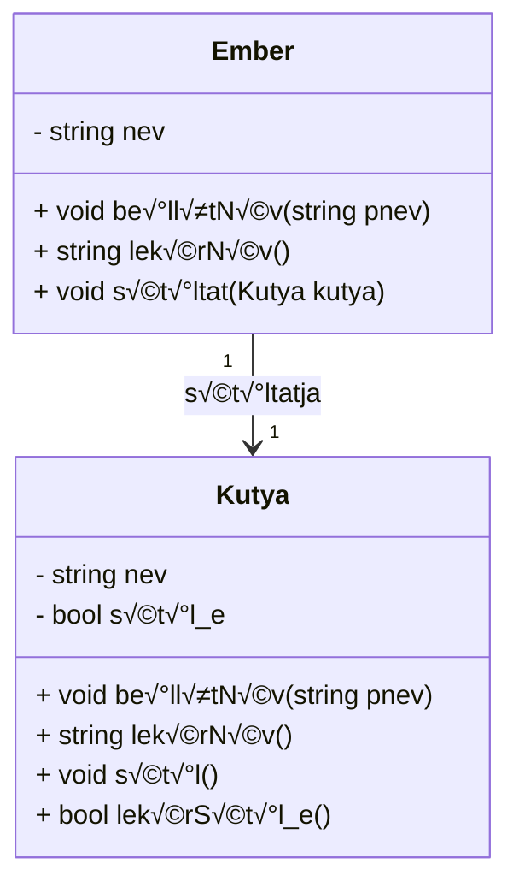

Here is the **English translation** of Slide 7:

---

### **Programming Paradigms and Programming Languages**

- **Command-driven languages**
  - **Machine code**
    - EDVAC, 1944 (Neumann)
    - Assembly, 1954
  - **High-level languages**
    - Fortran, 1957; C, 1973

- **Functional programming:**
  - LISP, 1958

- **Structured programming**
  - Algol 58 (1958)  
    Algol 60 (1960)
  - Edsger W. Dijkstra:  
    *"The structured programming theorem"*, 1966

- **Object-oriented programming**
  - SIMULA 1 (1962) and Simula 67 (1967)

---

Let me know if you want the next one or anything else translated!

Here is the **English translation** of Slide 8:  
**Structured Programming (Dijkstra)**

---

This slide visually represents the concept of abstraction layers in computing and structured programming, following Dijkstra's model. Here's a breakdown of the diagram from bottom to top:

1. **Computer (számítógép)**  
   – The physical hardware.

2. **Machine A (A gép):**  
   – "Implementation of machine A on the computer"  
   – This is a software layer that provides an abstract machine on top of the physical hardware.

3. **Machine B (B gép):**  
   – "Implementation of machine B on machine A"

4. **Machine C (C gép):**  
   – "Implementation of machine C on machine B"

5. **User functions on machine C (Felhasználói funkciók a C gépen):**  
   – High-level applications or user interactions built on top of these abstraction layers.

---

This layered model is key in structured programming, showing how complexity is managed by building systems in hierarchical, modular layers.


Here’s the **English explanation and translation** of Slide 9:

---

### **Structured Programming: Relationship Between Functions**

This slide illustrates how **functions are layered and interact across abstraction levels** in a structured programming model.

- **Felhasználói funkciók** = *User functions*
- **C gép** = *Machine C*  
- **B gép** = *Machine B*  
- **A gép** = *Machine A*

**Explanation:**

- Each layer (A, B, C) represents an abstraction level.
- Arrows show **dependencies or function calls** between layers.
- Higher-level functions (e.g., in C gép or User functions) **rely on or call functions** from lower-level machines (B gép, A gép).
- The layered structure encourages **modular design**, where each level builds upon the functionality of the one below it.

This concept is key in Dijkstra’s vision of structured programming — to minimize complexity by separating concerns and using clearly defined abstraction layers.

---

Here’s the **English translation and explanation** of **Slide 10**:

---

### **Structured Programming: Transparent Functions**

- **Felhasználói funkciók** = *User functions*  
- **C gép** = *Machine C*  
- **B gép** = *Machine B*  
- **A gép** = *Machine A*

**What the diagram shows:**

This slide builds on the previous one (Slide 9) and introduces the idea of **transparent functions**.

- A function in **Machine A** (highlighted in green) is being accessed **directly** by functions in **higher-level layers** (Machine B and C, even user functions).
- This direct dependency breaks the **ideal abstraction boundary**.
- In structured programming, this is considered **bad practice**, because:
  - It violates encapsulation.
  - It increases **tight coupling**.
  - It makes **code harder to maintain** and test.

**"Transparent"** here means the function is exposed in such a way that it allows unintended access across layers.

---

Here’s the **English translation and explanation** of **Slide 11**:

---

### **Structured Programming: Violation of Layered Structure**

- **Felhasználói funkciók** = *User functions*  
- **C gép** = *Machine C*  
- **B gép** = *Machine B*  
- **A gép** = *Machine A*

---

### üö® Violation Illustrated:
The red arrow shows a **direct call from a higher-level function in Machine B** to a **lower-level internal function in Machine A**, **skipping its own layer** (B ‚Üí A instead of B ‚Üí B ‚Üí A).

---

### ‚ùå Why This Is a Problem:

- **Breaks modular design**: Each layer should only interact with the one directly below it.
- **Increases coupling**: Makes future changes or testing harder.
- **Reduces maintainability**: Understanding and debugging becomes more complex.
- **Defeats abstraction**: The whole point of layered architecture is lost.

---

This slide is emphasizing the importance of **strict layering** in structured programming — where **each layer should only rely on the one directly beneath it**.


Here’s the **English translation and interpretation** of **Slide 12**:

---

### **Modular Programming**

The image shows colored **puzzle pieces**, symbolizing how different parts of a program (modules) fit together.

---

### üß© Concept:

- Each **module** represents a **self-contained piece of functionality**.
- Like puzzle pieces, **modules should fit together cleanly** through well-defined interfaces.
- **Modular programming** encourages:
  - **Separation of concerns**
  - **Maintainability**
  - **Reusability**
  - **Ease of testing and debugging**

---

It’s a visual metaphor: **well-designed modules are like puzzle pieces**—distinct in function but integral to the complete picture (software system).

Here’s the **English translation and explanation** of **Slide 13**:

---

### **Model-Based Software Design**

The diagram shows two domains:

- **Model Space (Modell tér)**  
- **Reality (Valóság)**  

---

#### üí° Elements & Arrows:

1. **Feladat modell** = *Task Model*  
   - Represents what the system should do (requirements).
   - Created through **modeling** from real-world systems that satisfy requirements.

2. **Implementációs modell** = *Implementation Model*  
   - Describes how the system will be implemented.
   - Developed from the task model through **design**.

3. **Követelményeket kielégítő rendszerek** = *Requirement-Satisfying Systems*  
   - Real systems that fulfill user or business requirements.

4. **Megvalósítható rendszerek** = *Implementable Systems*  
   - Systems that can be realistically implemented given technical constraints.

---

#### 🔄 Process Flow:

- Real systems (bottom) are **modeled** into the **task model** (top-left).
- The task model is used for **designing** the implementation model (top-right).
- That implementation model is then **implemented** into a real system (bottom-right).
- The intersection point (green dot) shows where requirements meet feasibility.

---

This slide introduces how **software engineering bridges the gap between the real world and code** via modeling and abstraction.

Want to go on with Slide 14?

Here’s the **English translation** of **Slide 14**:

---

### **Languages Covered in This Course**

- **1980**, Bell Labs (Bjarne Stroustrup) begins development of C++: making C capable of object-oriented programming.  
  **1983**, the first C++ implementation is completed.
- **1985**, the first commercial C++ compiler and Bjarne Stroustrup’s book *"The C++ Programming Language"* are released.
- **1989**, **C++ v2.0** (multiple inheritance...); **C++ v2.1** (templates and exception handling...)
- **1991**, the **first public release of Python**.
- **1998**, **ANSI C++ standard** (ISO/IEC 14882:1998).
- **1995**, **Sun Microsystems**, Java programming language v1.0: pointer-free object-oriented language for writing programs on a virtual machine.
- **2000**, **Python 2.0**.
- **2002**, **Microsoft** (Anders Hejlsberg), **C# programming language**: pointer-free C++ variant designed for writing programs on the .NET platform.

---

Let me know if you’d like to continue to the next slide or if you want a timeline summary!

Here’s the **English translation and summary** of **Slide 15**:

---

### **Most Important Programming Languages in 2022**  
*(According to IEEE data: CareerBuilder, GitHub, Google, Hacker News, the IEEE, Reddit, Stack Overflow, and Twitter)*

#### üìä Chart (Popularity Score):
- **Python** – 100  
- **C** – 96.8  
- **C++** – 88.58  
- **C#** – 86.99  
- **Java** – 70.22  
- **SQL** – 47.37  
- **JavaScript** – 40.48  
- **R** – 18.92  
- **HTML** – 17.97

---

#### üìù Notes:
- Python's interpreter is **written in C**.
- The **Java Virtual Machine (JVM)** is **written in C++** (by Oracle).
- The **C# virtual machine** (Common Language Runtime / CLR) is written in **C/C++ and Assembly**.
 

---

Let me know if you'd like to continue with Slide 16!

Here is the **English translation and summary** of **Slide 16**:

---

### **Popular Programming Languages by Energy Demand**  
*(When Running Machine Learning Algorithms)*

---

#### üîå **Energy Efficiency Ranking (lower = better)**

From the chart, you can observe:

- **Most efficient (lowest energy consumption):**
  - **C**
  - **C++**
  - **Java**

- **Mid-range:**
  - **C#**
  - **JavaScript**
  - **TypeScript**, etc.

- **Least efficient (highest energy consumption):**
  - **Python**
  - **R**
  - **Ruby**
  - **Perl**

The chart visualizes how different languages **consume energy** when executing **AI/ML workloads**.

---

#### üìö Source:
[ResearchGate publication](https://www.researchgate.net/publication/320436353_Energy_efficiency_across_programming_languages_how_do_energy_time_and_memory_relate)

This study measures energy, time, and memory trade-offs between languages.

---

Let me know if you want a comparison summary or the next slide!

Here’s the **English translation** of **Slide 17**:

---

### **The C++ Programming Language**

#### üîπ C++ is an extension of the C programming language:
- For **object-oriented programming (OOP)**
- For **generic programming** (template-based development)
- With **standard container templates** (STL – Standard Template Library)

#### üîπ Characteristics of C++:
- Contains **fewer than 50 keywords**
- **No other programming language has more operators**

---

This slide highlights C++’s power through its features: OOP, templates, and STL, while also noting its concise keyword set and rich operator support.

Want to keep going with Slide 18?

Here’s the **English translation** of **Slide 18**:

---

### **Namespaces in C++**

#### üîπ Creating a Namespace

```cpp
namespace mySpace {
    int myVariable;
}
```

---

### 🧠 Explanation:

This slide shows how to **define a namespace** in C++ using the `namespace` keyword.

- `mySpace` is the **namespace name**.
- `myVariable` is a variable **declared inside** that namespace.

You would access it like this:

```cpp
mySpace::myVariable;
```

Namespaces help **avoid name conflicts** in larger programs or when using multiple libraries.

Would you like to continue to Slide 19?

Here’s the **English translation and explanation** of **Slide 19**:

---

### **Namespaces in C++ (continued)**

#### üîπ Referring to a namespace member using the scope resolution operator:
```cpp
mySpace::myVariable = 1;
```

#### üîπ Opening a namespace:
```cpp
using namespace mySpace;
myVariable = 2;
```

---

### 🧠 Explanation:

- The `::` operator accesses elements inside a specific namespace explicitly.
- The `using namespace` directive imports all elements of the namespace into the current scope, so you don't need to write `mySpace::` every time.

**Tip:** While `using namespace` can be convenient, it's generally best avoided in headers or large scopes to prevent naming conflicts.

Would you like to continue with Slide 20?

Here’s the **English translation and explanation** of **Slide 20**:

---

### **Using Streams in C++**

#### üîπ Predefined stream types (from `<iostream>`, in the `std` namespace):
- **Input:** `istream`
- **Output:** `ostream`

#### üîπ Predefined stream objects (also from `<iostream>`, `std` namespace):
- **Input stream:** `cin`
- **Output stream:** `cout`
- **Error stream:** `cerr`

#### üîπ Operators:
- **Insertion (output):** `stream << element`  
  Example: `std::cout << "Hello";`
- **Extraction (input):** `stream >> element`  
  Example: `std::cin >> userInput;`

---

This slide summarizes how **standard input/output** works in C++, using streams and the `<<` / `>>` operators.

Would you like Slide 21 next?

Here’s the **English translation and explanation** of **Slide 21**:

---

### **Hello World! in C++**

#### üîπ Using the `::` (scope resolution) operator

```cpp
#include <iostream>

int main() {
    std::cout << "Hello World!" << std::endl;
    return 0;
}
```

---

### 🧠 Explanation:

- `std::cout` accesses the **standard output stream** from the `std` namespace.
- `std::endl` outputs a newline and flushes the stream.
- The `::` operator is used to **explicitly reference** elements within a namespace.

This is the classic **"Hello, World!"** program in C++.

Want to move on to Slide 22?

Here’s the **English translation and explanation** of **Slide 22**:

---

### **Hello World! in C++**

#### üîπ With Namespace Opened

```cpp
#include <iostream>
using namespace std;

int main() {
    cout << "Hello World!" << endl;
    return 0;
}
```

---

### 🧠 Explanation:

- `using namespace std;` makes all names in the `std` namespace directly accessible, so you don't need to prefix them with `std::`.
- This simplifies the syntax, but it's generally best used in **small programs or examples**, not in **headers or large-scale software**, to avoid name collisions.

Would you like to move on to Slide 23?

Here’s the **English translation and explanation** of **Slide 23**:

---

### **Using Streams in C++: Example**

```cpp
#include <iostream>
using namespace std;

int main() {
    int n;
    cout << "Enter an integer: ";
    cin >> n;
    cout << "The value: " << n << '\n';
    return 0;
}
```

---

### 🧠 Explanation:

- This simple program:
  - Prompts the user to **enter an integer**.
  - Reads the input using `cin`.
  - Outputs the value using `cout`.

- `'\n'` is a newline character (similar to `std::endl` but without flushing the stream).

This is a basic demonstration of **input/output streams** in action.

Ready for Slide 24?

Here’s the **English translation and explanation** of **Slide 24**:

---

### **Standard I/O in C++**

```cpp
#include <iostream>
using namespace std;

int main() {
    int a;

    // standard input
    cin >> a;

    // standard output
    cout << "a=" << a << endl;

    // standard error
    cerr << "There is a problem!" << endl;

    return 0;
}
```

---

### 🧠 Key Points:

- `cin` ‚Üí standard input (keyboard)
- `cout` ‚Üí standard output (console)
- `cerr` ‚Üí standard error (usually console too, often unbuffered)
- `"Baj van!"` means **"There is a problem!"** in Hungarian — often used for error messages.

This slide demonstrates all three core I/O streams in C++.

Want to continue with Slide 25?

Here’s the **English translation and explanation** of **Slide 25**:

---

### **Constants in C++**

#### üîπ Constant variable:
```cpp
const double PI = 3.1415926536;
```
- `PI` is declared as a **constant** of type `double`, meaning its value cannot be changed after initialization.

---

#### üîπ Constant parameter variable:
```cpp
void Print(const int i) {
    cout << i;
}
```
- `i` is a **read-only parameter**. It cannot be modified inside the `Print` function.

---

### 🧠 Key Takeaways:
- Use `const` to protect values from accidental changes.
- It's especially helpful for:
  - **Parameters** you don’t want to modify
  - **Global or configuration values** (like π)

Ready for Slide 26?

Here’s the **English translation and explanation** of **Slide 26**:

---

### **`const` and Pointers in C++**

#### üîπ 1. The data pointed to by `a` **cannot be modified**:
```cpp
const int *a;
```
- You **can change** the pointer (`a` can point somewhere else),  
  but you **cannot change** the value it points to.

---

#### üîπ 2. The pointer `a` itself **cannot be changed**:
```cpp
int* const a;
```
- The **value can be modified** through `a`,  
  but **`a` always points to the same location**.

---

#### üîπ 3. Neither `b` nor the value it points to **can be changed**:
```cpp
const int* const b;
```
- Both the **pointer is constant** and the **pointed value is constant**.

---

### 🧠 Tip:

Think of `const` as binding the **thing immediately to its left** (or right if nothing is on the left):
- `const int*` ‚Üí const data
- `int* const` ‚Üí const pointer
- `const int* const` ‚Üí const data, const pointer

Want to continue with Slide 27?

Here’s the **English translation and explanation** of **Slide 27**:

---

### **Boolean Type in C++**

#### üîπ Type: `bool`  
- The `bool` type represents **logical (true/false)** values.

#### üîπ Possible values:  
- `true` or `false`

---

#### üîπ Boolean constants:
```cpp
const bool igaz = true;   // "igaz" means "true" in Hungarian
const bool hamis = false; // "hamis" means "false"
```

---

### 🧠 Tip:

- Booleans are commonly used in **conditions**, **flags**, and **control flow** like `if`, `while`, and `for`.
- Declaring constants for logic can improve **code readability**.

Ready for Slide 28?

Here’s the **English translation and explanation** of **Slide 28**:

---

### **Function Overloading in C++: Functions with the Same Name**

```cpp
#include <iostream>
using namespace std;

int Abs(const int i) {
    return i < 0 ? -i : i;
}

double Abs(const double d) {
    return d < 0.0 ? -d : d;
}
```

---

### 🧠 Explanation:

This slide demonstrates **function overloading** — defining multiple functions with the same name but **different parameter types**:

- `Abs(int)` handles integers.
- `Abs(double)` handles floating-point numbers.

The compiler chooses the correct version based on the **type of argument** passed.

---

Let me know if you’d like to continue to Slide 29!

Here’s the **English translation and explanation** of **Slide 29**:

---

### **Using Functions with the Same Name in C++**

```cpp
int main() {
    int n;
    double f;

    cout << "Enter an integer number: ";
    cin >> n;

    cout << "Enter a real number: ";
    cin >> f;

    cout << "The absolute value of the integer: " << Abs(n) << '\n';
    cout << "The absolute value of the real number: " << Abs(f) << '\n';

    return 0;
}
```

---

### 🧠 Explanation:

This example demonstrates the use of **function overloading** from the previous slide in action:

- The user enters an integer and a floating-point number.
- `Abs(n)` calls the version of `Abs` for integers.
- `Abs(f)` calls the version of `Abs` for doubles.

The correct function is automatically chosen based on the **type of the argument**.

Would you like to go on to Slide 30?

Here’s the **English translation and explanation** of **Slide 30**:

---

### **How does the compiler choose between functions with the same name?**

1. **Based on the number of arguments**:  
   Can the function be called with the given number of parameters?

2. **Based on the type of arguments**:  
   Does the function require fewer type conversions than others with the same name?

---

### 🧠 In the previous example:
- You **can't decide based on the number of arguments**, since both functions take one argument.
- The compiler **chooses based on the type** of the argument:
  - `Abs(int)` is selected for `int`
  - `Abs(double)` is selected for `double`

---

This slide explains the **function overload resolution rules** in C++ — essentially how the compiler decides which version of a function to use.

Continue with Slide 31?

Here’s the **English translation and explanation** of **Slide 31**:

---

### **Default Argument Values in C++**

#### üîπ In C++, you can assign **default values** to function parameters:
```cpp
void greet(string name = "Guest");
```

---

#### üîπ Rule:
In a function declaration, **once a parameter has a default value**, **all following parameters must also have default values**.

‚úÖ Valid:
```cpp
void func(int a, int b = 2, int c = 3);
```

‚ùå Invalid:
```cpp
void func(int a = 1, int b, int c = 3);  // Error: `b` must also have a default
```

---

#### üîπ If a function has `n` parameters and `m` of them have defaults:
- You can call the function with **n-m, n-m+1, ..., n arguments**.

---

### 🧠 Summary:
Default arguments simplify function calls and make your code cleaner, especially when most calls use the same value(s).

Ready to continue to Slide 32?

Here’s the **English translation and explanation** of **Slide 32**:

---

### **Default Argument Values in C++**

```cpp
#include <iostream>
using namespace std;

void test(int a, int b = 2, int c = 3) {
    cout << a << b << c << '\n';
}

int main() {
    test(1);        // Will print 123
    test(2, 1);     // Will print 213
    test(3, 2, 1);  // Will print 321
    return 0;
}
```

---

### 🧠 Explanation:

- `b` and `c` have default values.
- If only `a` is passed, `b = 2`, `c = 3` are used.
- If `a` and `b` are passed, only `c` gets its default value.
- If all three are passed, no default is needed.

---

### üîç Comments in Hungarian:
- `// 123 fog kiíródni` → “123 will be printed”
- `// 213 fogkiíródni` → “213 will be printed”
- `// 321 fogkiíródni` → “321 will be printed”

Want to move on to Slide 33?

Here’s the **English translation and explanation** of **Slide 33**:

---

### **Memory Management in C++**

```cpp
#include <iostream>
using namespace std;

int main() {
    int *p = 0, *q = 0;         // pointers initialized to null (pointing nowhere)
    p = new int;                // allocate memory for one integer
    q = new int[5];             // allocate memory for an array of 5 integers
    delete p;                   // free memory for one integer
    delete[] q;                 // free memory for array
    return 0;
}
```

---

### 🧠 Explanation:

- `new` is used for dynamic memory allocation.
  - `new int` ‚Üí allocates memory for a single integer.
  - `new int[5]` ‚Üí allocates memory for an array of 5 integers.
- `delete` is used to release memory.
  - `delete p` ‚Üí for a single variable.
  - `delete[] q` ‚Üí for arrays.

⚠️ **Important:** Always pair `new` with `delete` and `new[]` with `delete[]` to avoid memory leaks or undefined behavior.

---

Would you like to continue to Slide 34?

Here’s the **English translation and explanation** of **Slide 34**:

---

### **Parameter Passing by Value in C++**

```cpp
int a;
fv(a);

void fv(int b) {
    // function body
}
```

---

### 🧠 Explanation:

- The slide shows **value passing** in C++.  
- When `fv(a)` is called:
  - A copy of the value stored in variable `a` is made.
  - This copy is passed to function `fv` as parameter `b`.

---

### üß© Memory Illustration:

- Both `a` and `b` hold the **same value** (`00 00 00 01`), but in **different memory locations**.
- The memory address (e.g., `E00A010B`) is reused in the illustration to show the **content**, not the actual location of `a` and `b`.

---

### ‚úÖ Key Point:

- **Changes to `b` inside `fv` will not affect `a`** in the calling function.
- This is the default behavior in C++ for basic types like `int`, `char`, `float`, etc.

Would you like the next slide?

Here’s the **English translation and explanation** of **Slide 35**:

---

### **Parameter Passing by Value in C++**

---

#### üîî Important:
> **Whatever we do with the copy, it does not affect the original variable!**

---

### 🧠 Explanation:

- This slide emphasizes that when passing by **value**, a **copy** of the variable is made.
- Any modification done to the parameter inside the function affects **only the copy**.
- The **original variable remains unchanged** after the function call.

---

### üí° Visual:
The memory block labeled `b` is shown separately, indicating it's a **duplicate** of another variable's value (like `a` from the previous slide), but **not the same memory location**.


Here is the **English translation and explanation** of **Slide 36**:

---

### **Passing Variable Address (by Pointer) in C++**

---

#### üßæ Code Example:

```cpp
int a;
fv(&a);        // Pass the address of a

void fv(int* p) {
    // Function receives pointer to a
}
```

---

### 🧠 Explanation:

- The function `fv` receives a **pointer to an integer**.
- `&a` means "the address of `a`", so `p` points to `a`.
- Inside `fv`, modifying `*p` will **directly affect `a`**, since `p` refers to its memory location.

---

### üß© Memory Diagram:

- `a` is stored at address `E00A010B` with value `00 00 00 01`.
- `p` stores the **address of `a`**, so when dereferenced (`*p`), it accesses the value of `a`.

---

This demonstrates **pass-by-pointer**, which allows functions to **modify the original variable**.

Would you like the next slide translated as well?

Here’s the **English translation and explanation** of **Slide 38**:

---

### üìò **Passing by Address (Reference) in C++**

---

#### C++ Code:
```cpp
int a;
fv(a);          // Passing variable 'a' by reference

void fv(int &b) // Reference parameter
{
    // Function body...
}
```

---

### 🧠 Concept:

This demonstrates **pass-by-reference** using the `&` symbol in the parameter.

- When you write `int &b`, `b` becomes an alias (reference) to `a`.
- This means **no new memory is created** for `b`. It uses the **same address** as `a`.
- Any modification to `b` inside `fv()` **directly modifies** the original variable `a`.

---

### üí° Diagram Explanation:

- Both `a` and `b` point to the same memory address: `E00A010B`.
- The value stored there is `00 00 00 01` (which is `1`).
- There is **no copy** of the data like in pass-by-value; they are truly the same variable.

---

### ‚úÖ Key Takeaway:
Use reference parameters when:
- You want to **modify the original variable**, or
- You want to **avoid copying** large data structures (for performance).

Would you like the next slide explained too?

Here’s the **English translation and explanation** of **Slide 39**:

---

### üìò **Pass by Reference in C++ (continued)**

---

#### üí° Important:
> **"A reference directly reads/writes the original variable!"**

---

#### C++ Code:
```cpp
void fv(int &b) {
    // b is a reference to the original variable
}
```

---

### 🧠 Concept Recap:

- When a parameter is passed by reference (using `&`), the function does **not create a new copy** of the argument.
- Instead, it directly operates on the **original memory** of the variable.
- Any modification done to `b` inside `fv()` will **immediately affect** the variable that was passed.

---

### üìä Diagram Explanation:

- The memory address `E00A010B` holds the value `00 00 00 01` (which is `1`).
- Variable `b` is just another name (alias) for that memory.
- The value and address match exactly with the original variable (e.g., `a` from the previous slide).

---

### ‚úÖ Key Takeaway:
This is **pass-by-reference**. It’s used for:
- Performance (avoids copying large objects).
- Allowing the function to **change** the caller's variable.

Want to continue with the next one?


Here's the **translation and explanation** of **Slide 40**:

---

## üìò **Parameter Passing in C++**
### *(by value, pointer, and reference)*

---

### ‚úÖ Code Example Summary

```cpp
#include <iostream>
using namespace std;

void NotChange(int b) {
    b = 2; // Passed by value - does NOT change 'a'
}

void Change(int *p) {
    *p = 3; // Passed by pointer - modifies the original 'a'
}

void Change(int &b) {
    b = 4; // Passed by reference - modifies the original 'a'
}

int main() {
    int a = 0;
    
    NotChange(a);     // a remains 0
    cout << "a=" << a << endl;  // Output: a=0

    Change(&a);       // a is modified to 3 (pointer)
    cout << "a=" << a << endl;  // Output: a=3

    Change(a);        // a is modified to 4 (reference)
    cout << "a=" << a << endl;  // Output: a=4

    return 0;
}
```

---

### üí° Key Concepts

- 🟢 `NotChange(int b)` → **Passed by value** → A **copy** of `a` is modified → `a` remains unchanged.
- 🔴 `Change(int *p)` → **Passed by pointer** → The **original value** pointed by `p` is changed.
- 🟣 `Change(int &b)` → **Passed by reference** → The original variable is **directly modified**.

---

### 🧠 Takeaway:

| Method       | What Happens               | Can Modify Caller Variable? |
|--------------|----------------------------|------------------------------|
| `int b`      | Copy made                  | ‚ùå No                        |
| `int *p`     | Pointer used               | ‚úÖ Yes                       |
| `int &b`     | Reference used             | ‚úÖ Yes                       |

---

Let me know if you want a visual comparison or a summary table!

Here’s the English **translation of Slide 41** titled *“OOP alapkövei”* (Fundamentals of OOP):

---

## üî∑ Fundamentals of OOP

- **OOA**: Object-Oriented Analysis  
- **OOD**: Object-Oriented Design  
- **OOP**: Object-Oriented Programming  
  - Encompasses the **entire development process**  
  - **Not just** implementation

---

This slide emphasizes that OOP is more than just writing code—it starts from analyzing the problem (OOA), designing the solution (OOD), and finally implementing it (OOP).


Here is the **English translation of Slide 42**, titled *“OOP alapfogalmai”* (Basic Concepts of OOP):

---

## üî∑ Basic Concepts of OOP

- **Class**
  - Member variables or **attributes**
  - Member functions or **methods**

- **Object**
  - A realized instance of a class

- **Analogy**
  - Type ‚Üí Class  
  - Variable ‚Üí Object

---

This slide introduces the building blocks of OOP: classes as blueprints and objects as actual instances, drawing a helpful analogy with basic data types and variables.


Here is the **English translation of Slide 43**, titled *“OOP alapkövei”* (Fundamentals of OOP):

---

## üî∑ Fundamentals of OOP

- **Encapsulation**
  - Data access is only possible through methods within the class (member functions)

- **Inheritance**
  - Class capabilities can be reused

- **Polymorphism**
  - Objects can take on multiple roles

---

This slide outlines the three core principles of Object-Oriented Programming: **encapsulation**, **inheritance**, and **polymorphism**—which support abstraction, code reuse, and flexibility in software design.

Here is the **English translation of Slide 44**, titled *“Hozzáférést módosító szók osztályon belül”* (Access Modifiers within a Class):

---

## üîê Access Modifiers within a Class

- **public**: Attributes and methods accessible to anyone  
- **private**: Attributes and methods accessible only from objects of the same class  
- **protected**: Attributes and methods accessible from objects of the same class and derived (sub)classes  

---

These access modifiers are used to control visibility and encapsulation in object-oriented programming.

Here is the **English translation of Slide 45**, titled *"Osztály deklarációja C++-ban"* (Class Declaration in C++):

---

## Class Declaration in C++

### Syntax:
```cpp
class className {
    access_modifier:
        attributes
    access_modifier:
        methods
};
```

### Example:
```cpp
class store {
private:
    int i;
public:
    void set(int pi) {
        i = pi;
    }
    int get();
};

int store::get() {
    return i;
}
```

---

This slide introduces the basic structure of a class in C++, including attribute and method declarations, as well as method implementation outside the class.


Here is the **English translation of Slide 46**, titled *"Objektum létrehozása és törlése C++-ban"* (Creating and Deleting Objects in C++):

---

## Creating and Deleting Objects in C++

### ‚óè Static Object
- **Creation**: `ClassName objectName;`
- **Accessing members**: `objectName.memberName`
- **Deletion**: Automatically deleted at the end of scope

### ‚óè Dynamic Object
- **Creation**: `ClassName *objectPointer = new ClassName;`
- **Accessing members**: `objectPointer->memberName`
- **Deletion**: `delete objectPointer;`

---

### Example:
```cpp
store s;
s.set(9);
cout << s.get();      // Outputs: 9

store *ps = new store;
(*ps).set(5);
cout << (*ps).get();  // Outputs: 5

ps->set(4);
cout << ps->get();    // Outputs: 4

delete ps;
```

---

This slide demonstrates how to create and manage static and dynamic objects in C++. Let me know if you'd like a summary or flashcards of these concepts!

Here is the **English translation of Slide 47**, titled *Összefoglalás* (Summary):

---

## Summary

- **Introduction**
- **Requirements**
- **Programming paradigms and languages**
- **Fundamentals of object-oriented programming**
- **Class declarations**
- **Creating objects**
- **Parameter passing in object-oriented languages**
- **Summary**

---

This slide wraps up the presentation and outlines the key topics covered regarding object-oriented programming (OOP) in C++. Let me know if you'd like a full summary or a flashcard set for review!


----
5 m√°sodpercig gondolkozott


Below is a comprehensive \~2,000-word summary of the translated slide content, organized into thematic sections. All material is drawn from the uploaded slides .

---

### Introduction

This presentation offers a sweeping overview of programming paradigms, the evolution of programming languages, core language constructs—particularly in C++—and the fundamentals of object-oriented programming (OOP). It begins by categorizing paradigms from low‐level machine code to high‐level languages and structured approaches, then explores modular and model‐based design. A historical timeline traces major language developments, followed by analyses of popularity and energy efficiency. The latter half of the course focuses on concrete C++ features—namespaces, streams, memory management, parameter passing—and culminates with OOP principles, class syntax, and object lifecycle management .

---

### 1. Programming Paradigms and Early Languages

* **Command‚Äêdriven languages**:

  * *Machine code* (EDVAC, 1944; Assembly, 1954) provided the first programmable instructions executed directly by hardware.
  * *High‚Äêlevel languages* such as Fortran (1957) and C (1973) introduced human-readable syntax and abstractions over raw machine operations.
* **Functional programming** emerged with LISP (1958), emphasizing computation via function application and immutability.
* **Structured programming**, championed by Algol 58/60 and formalized in Dijkstra’s “The structured programming theorem” (1966), promoted clarity through sequence, selection, and iteration constructs, reducing unstructured jumps.
* **Object‚Äêoriented programming** began with SIMULA 1 (1962) and Simula 67 (1967), introducing classes, objects, and inheritance to model real‚Äêworld entities and relationships .

---

### 2. Structured Programming and Abstraction Layers

Dijkstra’s model illustrates computing as hierarchical layers of abstract machines:

1. **Physical hardware** at the base (“Computer”)
2. **Machine A**: software abstraction over hardware
3. **Machine B**: abstraction on top of A
4. **Machine C**: abstraction on top of B
5. **User functions**: applications leveraging machine C

Each layer offers services to the one above while hiding internal complexity. Properly layered calls ensure modularity and maintainability. Violations—such as “transparent functions” that allow higher‐level code to call lower‐level functions directly—break encapsulation, increase coupling, and undermine abstraction. A strict layered discipline (each layer only calling the one immediately beneath it) guards against such breakdowns .

---

### 3. Modular Programming

Modular programming extends structured principles by encapsulating functionality into discrete “modules,” akin to puzzle pieces fitting together via well‐defined interfaces. Each module:

* Encapsulates a self‚Äêcontained set of functions or data.
* Exposes only necessary interfaces, hiding implementation details.
* Can be developed, tested, and maintained independently.

This approach improves separation of concerns, reusability, and ease of debugging. Modules interlock through interfaces, allowing large systems to be assembled from interchangeable parts without exposing internal logic .

---

### 4. Model‚ÄêBased Software Design

Model‚Äêbased design bridges the gap between real‚Äêworld requirements and implementable systems through successive abstractions:

1. **Reality**: actual systems fulfilling requirements.
2. **Task model**: formal representation of what the system should do (requirements modeling).
3. **Implementation model**: design blueprint for how to realize the task model.
4. **Implementable systems**: practical software/hardware realizations.

Arrows indicate transformation processes—modeling real systems into task models, designing implementation models from requirements, and implementing code from designs. The intersection (green dot) marks the meeting point of feasibility and requirements. This framework emphasizes iteration between models and real‐world constraints to ensure both correctness and practicability .

---

### 5. Timeline of Major Programming Languages

Key milestones in language development include:

* **1957**: Fortran introduces formula translation for scientific computing.
* **1958**: LISP pioneers functional paradigms.
* **1960s**: Algol and Simula lay foundations for structured and OOP.
* **1973**: C brings a powerful, portable systems language.
* **1980–1985**: Bjarne Stroustrup develops and releases C++ for object‐ and generic programming.
* **1991**: Python debuts as a high‚Äêlevel, readable scripting language.
* **1995**: Java introduces pointer‚Äêfree OOP on a virtual machine (JVM).
* **1998**: ANSI C++ standard (ISO/IEC 14882) stabilizes the language.
* **2000**: Python 2.0 adds new features to the language’s core.
* **2002**: Microsoft releases C# for the .NET platform, blending C++’s power with safe, managed code.

This chronology highlights the interplay of paradigm shifts and implementation platforms, reflecting evolving application domains—from scientific computing to enterprise systems and web applications .

---

### 6. Popularity and Energy Efficiency of Languages

#### Popularity (2022 IEEE data)

A composite score from sources like GitHub, Stack Overflow, and IEEE rates languages by usage and demand:

* **Python**: 100
* **C**: 96.8
* **C++**: 88.6
* **C#**: 87.0
* **Java**: 70.2
* **SQL**: 47.4
* **JavaScript**: 40.5
* **R**: 18.9
* **HTML**: 18.0

Notes: Python’s interpreter is written in C; JVM is implemented in C++; CLR (C# runtime) uses C/C++ and assembly .

#### Energy Efficiency (ML workloads)

A study measuring energy, time, and memory trade‚Äêoffs ranked languages by power consumption during machine learning tasks:

* **Most efficient**: C, C++, Java
* **Mid‚Äêrange**: C#, JavaScript, TypeScript
* **Least efficient**: Python, R, Ruby, Perl

This reflects trade‚Äêoffs between developer productivity and runtime performance; lower‚Äêlevel compiled languages excel in energy‚Äêsensitive contexts .

---

### 7. Core C++ Language Constructs

#### Language Essence

C++ extends C with:

* **Object‚Äêoriented programming** (classes, inheritance, polymorphism)
* **Generic programming** (templates)
* **Standard Template Library (STL)** containers and algorithms

It boasts fewer than 50 keywords but the richest set of operators among languages .

#### Namespaces

* **Definition**:

  ```cpp
  namespace mySpace {
      int myVariable;
  }
  ```
* **Access**: `mySpace::myVariable`
* **Using directive**:

  ```cpp
  using namespace mySpace;
  myVariable = 2;
  ```

Namespaces prevent name collisions in large projects but should be used judiciously (avoid `using namespace` in headers) .

#### Streams and I/O

C++ I/O is based on `<iostream>`:

* **Types**: `istream`, `ostream`
* **Objects**: `cin`, `cout`, `cerr`
* **Operators**:

  * Insertion: `std::cout << "Hello";`
  * Extraction: `std::cin >> userInput;`

Example “Hello World!”:

```cpp
#include <iostream>
int main() {
    std::cout << "Hello World!" << std::endl;
    return 0;
}
```

Opening the `std` namespace simplifies syntax at the expense of potential conflicts .

---

### 8. Constants, Pointers, and References

#### Constants

* **Variable**: `const double PI = 3.1415926536;`
* **Parameter**: `void Print(const int i);`

`const` protects values and improves clarity for read‚Äêonly parameters .

#### Pointers and `const`

1. `const int *a;` — pointer to constant data (data immutable, pointer mutable)
2. `int * const a;` — constant pointer to mutable data
3. `const int * const b;` — constant pointer to constant data

“const binds to the thing on its left (or right if none on left)” aids memorization .

#### Boolean Type

* `bool` type with values `true` or `false`
* Constants: `const bool igaz = true;`, `const bool hamis = false;`
  Used in conditions, flags, and control structures for readability .

---

### 9. Function Overloading and Default Arguments

#### Overloading

Multiple functions with the same name but different signatures:

```cpp
int Abs(const int i) { /*...*/ }
double Abs(const double d) { /*...*/ }
```

The compiler selects based on argument types and required conversions .

Example usage:

```cpp
cout << Abs(n);   // calls int version
cout << Abs(f);   // calls double version
```

#### Overload Resolution

1. Number of arguments
2. Matching argument types (fewer conversions preferred) .

#### Default Arguments

* Syntax: `void func(int a, int b = 2, int c = 3);`
* Rule: once a parameter has a default, all following must too.
* Call variations: `func(1); func(2,1); func(3,2,1);` print `123`, `213`, `321` respectively .

---

### 10. Memory Management

Dynamic allocation with `new`/`delete`:

```cpp
int *p = new int;        // single int
int *q = new int[5];     // array
delete p;                // free single
delete[] q;              // free array
```

Pairing `new` with `delete` and `new[]` with `delete[]` avoids leaks and undefined behavior .

---

### 11. Parameter Passing Mechanisms

C++ offers three primary methods:

1. **Pass by value** (`void fv(int b)`):

   * Copy of argument passed; changes to `b` don’t affect caller.
   * Memory illustration distinguishes `a` and `b` copies .
2. **Pass by pointer** (`void fv(int *p)`):

   * Address of `a` passed; dereferencing `*p` alters `a`.
   * Enables modification of caller variable .
3. **Pass by reference** (`void fv(int &b)`):

   * `b` aliases `a`; no copy made.
   * Direct modifications to `b` reflect in `a`.
   * Efficient for large objects and in‚Äêplace updates .

Combined example:

```cpp
NotChange(a);   // a remains 0
Change(&a);     // a ‚Üí 3
Change(a);      // a ‚Üí 4
```

Results demonstrate how each method affects the caller’s variable .

---

### 12. Fundamentals of Object-Oriented Programming

OOP spans analysis, design, and implementation:

* **OOA**: Object‚ÄêOriented Analysis
* **OOD**: Object‚ÄêOriented Design
* **OOP**: coding and implementation

Three pillars of OOP:

1. **Encapsulation**: Data and methods bundled together; access controlled via interfaces.
2. **Inheritance**: New classes reuse and extend existing ones.
3. **Polymorphism**: Objects of different classes accessed through a common interface, enabling flexibility and code reuse .

---

### 13. Class Declaration and Object Lifecycle in C++

#### Access Modifiers

* `public`: accessible to all
* `private`: accessible only within the class
* `protected`: accessible within the class and derived subclasses .

#### Class Syntax

```cpp
class store {
private:
    int i;
public:
    void set(int pi) { i = pi; }
    int get();
};
int store::get() { return i; }
```

#### Object Creation

* **Static**: `store s;` — lifetime bound to scope, automatic cleanup.
* **Dynamic**: `store *ps = new store;` — manual `delete ps;` required.
  Example usage:

```cpp
s.set(9);
cout << s.get();        // 9

ps->set(4);
cout << ps->get();      // 4
delete ps;
```

Understanding static vs. dynamic allocation is crucial for memory management and program stability .

---

### Conclusion

This summary captures the essence of the course content: from foundational paradigms and abstraction strategies to the detailed syntax and semantics of C++ and core object‐oriented principles. By understanding layered architectures, modular design, and the historical evolution of languages, students appreciate the rationale behind modern software engineering practices. Mastery of C++ constructs—namespaces, I/O streams, memory control, and parameter passing—provides a solid base for implementing robust, efficient applications. Finally, OOP concepts and class mechanisms empower developers to model complex systems with clarity, reusability, and maintainability. This integrated perspective equips learners to tackle real‐world software challenges with both theoretical insight and practical skills .
 
## Contents

- **Actors and behaviors**  
- **From structure to class**  
- **Encapsulation**  
- **Constructors**  
  - Member variable initialization  
  - Object lifetime  
  - Default constructor  
  - Copy constructor  
- **Summary**

---

Here's the **English translation** of the slide titled **"Szereplők és viselkedések"** (Actors and Behaviors):

---

## Actors and Behaviors

- **Rozi is walking Blöki.**  
- **Blöki is walking.**

---

This slide illustrates the difference between *who performs an action* and *who is affected*, useful in object-oriented thinking to distinguish between objects (Rozi, Blöki) and their behaviors (methods like `walk()`, `walkWith()` etc.).

 Here’s the **English translation** of the slide titled **"Felelősségek"** (Responsibilities):

---

## Responsibilities

- **Rozi (human)**  
  ☐ walks Blöki (dog).

- **Blöki (dog)**  
  ‚òê walks.

---

 

### Implementation in C: dog

---

#### Constants and Includes
```c
#include <stdio.h>
#include <string.h>

#define NEV_HOSSZ_MAX 20    // Maximum name length
#define FALSE 0             // Logical false
#define TRUE 1              // Logical true
```

#### Struct Definition
```c
typedef struct {
    char nev[NEV_HOSSZ_MAX]; // Name of the dog
    int setal_e;             // Walking flag (is walking?)
} Kutya;
```

#### Functions

```c
void kutyaBeallitNev(Kutya* kutyap, char* pnev) {
    strcpy(kutyap->nev, pnev); // Sets the dog's name
}
```

```c
void kutyaBeallitSetal_e(Kutya* kutyap, int psetel_e) {
    kutyap->setal_e = psetel_e; // Sets the walking state
}
```

```c
char* kutyaLekerNev(Kutya* kutyap) {
    return kutyap->nev; // Gets the dog's name
}
```

```c
void kutyaSetal(Kutya* kutyap) {
    kutyap->setal_e = TRUE;
    printf("%s sétál.", kutyap->nev); // "%s is walking."
}
```

---

This is a basic object-oriented-style approach in C using structs and functions, simulating what would be class behavior in C++.


### Implementation in C: human

#### Struct for `Ember` (Human)
```c
typedef struct {
    char nev[NEV_HOSSZ_MAX]; // name
} Ember;
```

#### Function: `emberBeallitNev`
Sets the name of the human.
```c
void emberBeallitNev(Ember* emberp, char* pnev) {
    strcpy(emberp->nev, pnev);
}
```

#### Function: `emberLekerNev`
Gets the human’s name.
```c
char* emberLekerNev(Ember* emberp) {
    return emberp->nev;
}
```

#### Function: `emberSetaltat`
Prints a message that the human is walking the dog, then sets the dog to walk.
```c
void emberSetaltat(Ember* emberp, Kutya* kutyap) {
    printf("%s sétáltatja %s-t.", emberLekerNev(emberp), kutyaLekerNev(kutyap));
    kutyaSetal(kutyap); // makes the dog walk
}
```

---

### üß™ `main()` Function:
```c
int main() {
    Kutya bloki;
    kutyaBeallitNev(&bloki, "Blöki");
    bloki.setal_e = FALSE;

    Ember rozi;
    emberBeallitNev(&rozi, "Rozi");
    emberSetaltat(&rozi, &bloki);

    return 0;
}
```

---

### üí° Output (`Kimenet`):
```
Rozi sétáltatja Blöki-t. Blöki sétál.
```

This example emulates basic object interaction using structs and functions in C, mimicking object-oriented behavior.


This slide explains the **transition from procedural C-style programming to object-oriented programming (OOP)** in C++. Here's a translated and summarized explanation:

---

### 🔄 **Converting to Object-Oriented Approach**

#### ‚úÖ **Transformation:**
- **Structure types** ‚Üí become **Classes**
- **Functions** ‚Üí become **Member functions (methods)**  
  *(Responsibilities are assigned to the class)*
- **Structure instances** ‚Üí become **Objects**

---

### 🔐 **Encapsulation (Egységbezárás):**
- All **member variables are private**
- Can be **accessed and modified only through member functions**

---

This slide captures the core idea of object-oriented refactoring: organizing code around **data and behavior**, encapsulating it into classes, and controlling access through methods.

Let me know if you'd like to see how the C "dog" and "human" examples would be rewritten in C++ with classes!

This slide demonstrates how **responsibilities (functions) and knowledge (variables)** are assigned to classes in object-oriented programming. Here's a breakdown and translation:

---

### üìå Assigning Responsibilities to Classes

#### 👤 **Human (Ember)**
- **Knowledge (member variable)**: `name`
- **Responsibility (member function)**:  
  ‚Ä£ Walks a dog (`kutya`)

#### üê∂ **Dog (Kutya)**
- **Knowledge (member variables)**:  
  ‚Ä£ `name`,  
  ‣ whether it is walking (`sétált-e`)
- **Responsibility (member function)**:  
  ‣ Walk (`sétál`)

---

This approach shows **good object-oriented design**, where:
- Data and behavior are grouped together.
- Each class is responsible for its own data and actions.

Would you like to see this example implemented in actual C++ code using classes?


This slide shows how the previously defined *C-style struct for a dog (`Kutya`)* is transformed into an **object-oriented C++ class**. Here's a breakdown of what's happening:

---

### üê∂ **C++ Class Implementation: `Kutya`**

#### üîí Private Members
```cpp
string nev;     // dog's name
bool setal_e;   // is the dog walking?
```
These are hidden from outside the class, which enforces encapsulation.

#### üîì Public Member Functions
- `void beallitNev(string pnev)`: sets the dog's name.
- `void beallitSetal_e(bool psetel_e)`: sets whether the dog is walking.
- `string lekerNev() const`: returns the name without modifying any member.
- `void setal()`: marks the dog as walking and prints a message.

```cpp
void Kutya::setal() {
    setal_e = true;
    cout << nev << " sétál. ";
}
```

This clearly reflects **good OOP design** principles:
- Encapsulation (private data).
- Access via public methods.
- Clear separation between interface (declaration) and implementation (definition outside class with `Kutya::`).


Sure! Here's the same C++ code, now with detailed **comments in English** explaining each part:

```cpp
#include <iostream>   // For standard input/output operations
#include <string>     // For using the string class

using namespace std;  // To avoid prefixing std:: before standard library elements

// Definition of the class 'Kutya' (Dog)
class Kutya {
private:
    // Private member variables: can only be accessed through class methods
    string nev;     // Dog's name
    bool setal_e;   // Flag indicating whether the dog is walking

public:
    // Public method to set the dog's name
    void beallitNev(string pnev) {
        nev = pnev;
    }

    // Public method to set the 'walking' flag
    void beallitSetal_e(bool psetel_e) {
        setal_e = psetel_e;
    }

    // Public method to return the dog's name
    // 'const' means this method does not modify any member variables
    string lekerNev() const {
        return nev;
    }

    // Declaration of the method that will define the dog walking behavior
    void setal();
};

// Definition of the 'setal' method outside the class
void Kutya::setal() {
    setal_e = true;                        // Set walking flag to true
    cout << nev << " sétál. ";            // Output that the dog is walking
}
```

Let me know if you’d like the comments in Hungarian or if you’d like the main function added to test this class! 

Here is the C++ code from the slide with **comments** added to explain each part clearly:

```cpp
// Class representing a person
class Ember {
private:
    string nev; // Person's name

public:
    // Method to set the person's name
    void beallitNev(string pnev) {
        nev = pnev;
    }

    // Method to retrieve the person's name
    string lekerNev() {
        return nev;
    }

    // Method for walking a dog (calls dog's walk function)
    void setaltat(Kutya& kutya) {
        // Print out that this person is walking the dog
        cout << nev << " sétáltatja " << kutya.lekerNev() << "-t. ";

        // Tell the dog to walk
        kutya.setal();
    }
};
```

```cpp
int main() {
    Kutya bloki;                            // Create a dog object named Blöki
    bloki.beallitNev("Blöki");             // Set dog's name
    bloki.beallitSetal_e(false);           // Initially not walking
    // bloki.setal_e = false;              // Can't access directly (private)

    Ember rozi;                             // Create a person object named Rozi
    rozi.beallitNev("Rozi");               // Set person's name
    rozi.setaltat(bloki);                  // Rozi walks Blöki

    return 0;
}

// Output: Rozi sétáltatja Blöki-t. Blöki sétál.
```

Let me know if you’d like this translated into Hungarian or if you want the full program in one block!

The slide presents an introduction to **UML (Unified Modeling Language)**, including the types of diagrams and their standardization:

---

### üß© UML (Unified Modeling Language)

- **Standardization:**
  - Maintained by **OMG (Object Management Group)**
  - Follows standard: **ISO/IEC 19505-2**

---

### 📊 Diagram Típusok (Diagram Types)

#### **Strukt√∫ra (Structure)**
- **Oszt√°lydiagram (Class Diagram)**  
  ‚Üí Describes the static structure: classes, attributes, relationships  
- *(... more structural diagrams not listed)*

#### **Viselkedés (Behavior)**
- **Állapot automata (State Machine Diagram)**  
  ‚Üí Shows states and transitions of objects
- **Együttműködési diagram (Collaboration Diagram)**  
  ‚Üí Emphasizes interaction between objects
- **Szekvencia diagram (Sequence Diagram)**  
  ‚Üí Focuses on the order of messages exchanged over time
- *(... more behavioral diagrams not listed)*

---

Let me know if you want an example UML diagram or a visual explanation of one!


This slide shows a **UML class diagram** of the `Ember` (Human) and `Kutya` (Dog) classes, with annotated elements for understanding the structure:

---

### üî∑ UML Oszt√°lydiagram (Class Diagram)

#### üß± **Class: Ember**
- **Attributes:**
  - `- név: string`  
    *(private attribute storing the name)*
- **Methods:**
  - `+ beállítNév(string)` — sets the name
  - `+ lekérNév(): string` — gets the name
  - `+ sétáltat(Kutya)` — calls the dog’s `sétál()` method

#### üê∂ **Class: Kutya**
- **Attributes:**
  - `- név: string` — name of the dog
  - `- sétál_e: bool` — whether it’s walking
- **Methods:**
  - `+ beállítNév(string)`
  - `+ lekérNév(): string`
  - `+ sétál()` — sets `sétál_e` to true and prints a message
  - `+ lekérSétál_e(): bool` — returns if the dog is walking

---

### 🔁 **Association**
- The line labeled **„sétáltatja”** with `1..1` at both ends means:
  - One `Ember` interacts with one `Kutya` (1-to-1 association).

---

### üß© Legend
- `+` ‚Üí **public** member
- `-` ‚Üí **private** member

---

Would you like a similar diagram generated or converted into code/markdown?

Here's a **Markdown version** of the UML class diagram for `Ember` and `Kutya`:

---

### UML Class Diagram (Markdown Representation)

#### 📦 Class: `Ember`

| Access | Attribute / Method             | Type        |
|--------|-------------------------------|-------------|
| `-`    | `név`                         | `string`    |
| `+`    | `beállítNév(pnev)`            | `void`      |
| `+`    | `lekérNév()`                  | `string`    |
| `+`    | `sétáltat(kutya: Kutya)`      | `void`      |

---

#### üê∂ Class: `Kutya`

| Access | Attribute / Method             | Type        |
|--------|-------------------------------|-------------|
| `-`    | `név`                         | `string`    |
| `-`    | `sétál_e`                     | `bool`      |
| `+`    | `beállítNév(pnev)`            | `void`      |
| `+`    | `lekérNév()`                  | `string`    |
| `+`    | `sétál()`                     | `void`      |
| `+`    | `lekérSétál_e()`              | `bool`      |

---

#### 🔁 Association

| `Ember`          | Association    | `Kutya`         |
|------------------|----------------|------------------|
| `1`              | sétáltatja     | `1`              |

---

Let me know if you want this turned into a Mermaid diagram or actual C++ code snippet!

Here's the **UML class diagram using Mermaid syntax** that matches the image:



To render this, you can use tools that support Mermaid like:

- [Live Editor](https://mermaid.live/)
- VS Code (with the **"Markdown Preview Mermaid Support"** extension)
- GitHub (inside Markdown if enabled)

Let me know if you want a sequence diagram or state diagram next!


The slide explains **association types in UML class diagrams** and their characteristics:

---

### üîó **UML Class Diagram: Association**

#### 📌 **Types of Associations (Típusai):**
- **Tartalmaz√°s (Composition):**  
  Represented with a **filled diamond (‚óÜ)**.  
  Indicates strong ownership (whole-part relationship), e.g., a class that **contains another class as a member** (not shared).

- **Hivatkoz√°s tartalmaz√°sa (Aggregation):**  
  Represented with an **empty diamond (‚óá)**.  
  Weaker ownership, often means a **reference/pointer to another class**.

- **Metódus argumentuma:**  
  Association via method parameters (object passed as an argument).

- **Metódus visszatérési értéke:**  
  Association when an object is returned from a method.

- **Lokális objektum metódusban:**  
  Local objects created inside methods.

- **Szülő-gyerek kapcsolat:**  
  Parent-child or inheritance relationship (to be covered in the next session).

---

#### 🔤 **Other Properties of Associations:**
- **Neve (Name):**  
  Optional label describing the nature of the relationship (e.g., "sétáltatja" = walks).

- **Ir√°nya (Direction):**  
  Shows **which class knows about the other** (arrow indicates navigability).

- **Sz√°moss√°ga (Multiplicity):**  
  Specifies how many instances are involved, e.g.  
  `1`, `0..1`, `*`, `1..*` etc.

---

Let me know if you'd like an example or if you'd like to represent this in Mermaid syntax too.

This slide explains the concept of a **constructor** in C++:

---

### 🛠️ **Constructor**

#### üîπ What is it?
A **special member function** of a class that is automatically called when an object is created.

#### ‚úÖ **Characteristics:**
- Its **name is the same as the class name**.
- It **does not have a return type** (not even `void`).
- Its job is to **create and initialize** class variables (attributes).

#### 🔁 **When does it run?**
- It **runs exactly once**, **when the object is created**.
- After that, it **cannot be called again manually**.

---

Let me know if you'd like an example of a constructor in C++ or the difference between default and parameterized constructors.

Here's the commented version of the constructor example shown in the slide:

```cpp
class Kutya {
    // ...
public:
    // Constructor definition (method 1 - using assignment)
    Kutya(const string &pnev) {
        nev = pnev;           // Initialize the 'nev' attribute with the parameter
        setal_e = false;      // Set the 'setal_e' flag to false
    }

    // OR (method 2 - using member initializer list)
    Kutya(const string &pnev) : nev(pnev), setal_e(false) {
        // This constructor does the same as the one above,
        // but uses an initializer list which is more efficient
    }
};
```

### üîπ How to use (called automatically on object creation):
```cpp
Kutya bloki("Blöki");
// This calls the constructor and initializes the object
// nev = "Blöki", setal_e = false
```

Let me know if you want a breakdown of member initializer lists vs assignment or want to add a default constructor too.

This slide presents a **UML class diagram** with constructors, showing the relationship between the `Ember` (Person) and `Kutya` (Dog) classes. Here's a breakdown:

---

### üî∑ **Ember class**
- **Attribute:**
  - `- név: string` — private name field.
- **Operations (Methods):**
  - `+ Ember(pnév: string)` — constructor that initializes the name.
  - `+ beállítNév(string)` — sets the name.
  - `+ lekerNév(): string` — returns the name.
  - `+ sétáltat(Kutya)` — makes a `Kutya` walk (calls its `sétál()` method).

---

### üî∑ **Kutya class**
- **Attributes:**
  - `- név: string` — private name.
  - `- sétál_e: bool` — whether the dog is walking.
- **Operations:**
  - `+ Kutya(pnév: string)` — constructor, sets name and default walking state.
  - `+ beállítNév(string)` — sets the dog's name.
  - `+ lekérNév(): string` — returns the dog's name.
  - `+ sétál()` — marks the dog as walking and prints a message.
  - `+ lekérSétál_e(): bool` — returns whether the dog is walking.

---

### üîó **Association**
- The labeled arrow `sétáltatja` from `Ember` to `Kutya` with multiplicity `1–1` indicates:
  - One person walks one dog, and vice versa (1-to-1 relationship).
  - This is likely realized through a method call in `Ember` referencing a `Kutya` instance.

---

Let me know if you want the C++ code that implements this UML or a graphical version of it generated!

This slide shows how to **call constructors in C++** and demonstrates their practical use in the `main()` function. Here's the commented version of the code:

```cpp
int main(){
    // Creating a Kutya (Dog) object named "bloki" using the constructor
    Kutya bloki("Blöki");

    // Creating an Ember (Person) object named "rozi" using the constructor
    Ember rozi("Rozi");

    // Rozi walks Blöki – this calls the 'setaltat' method of Ember
    rozi.setaltat(bloki);

    return 0;
}
```

---

### üñ® Output:
```plaintext
Rozi sétáltatja Blöki-t. Blöki sétál.
```

This output comes from the combination of:
- `Ember::setaltat(Kutya&)` printing `"Rozi sétáltatja Blöki-t. "`
- `Kutya::setal()` printing `"Blöki sétál."`

Let me know if you'd like the full source code implementation for both classes!

This slide presents a **UML class diagram demonstrating aggregation** (hivatkoz√°s tartalmaz√°sa) between `Ember` (Person) and `Kutya` (Dog).

---

### üí° Key Concepts Illustrated:

#### 🔷 Aggregation (Aggregáció):
- Shown with a **white diamond** on the line between `Ember` and `Kutya`.
- Represents a **"has-a" relationship**.
- Indicates that `Ember` contains a **reference** to a `Kutya` but does **not own it** entirely (their lifetimes are independent).
- In this case:  
  `Ember` *has a* `Kutya` (kuty√°ja = his/her dog).

---

### üìê Class Structure Summary:

#### `Ember` (Person)
- **Attribute:**
  - `- név: string` → Private name attribute
- **Methods:**
  - `+ Ember(pnév: string)` → Constructor
  - `+ beállítNév(string)` → Setter for name
  - `+ lekerNév(): string` → Getter for name
  - `+ sétáltat(Kutya)` → Method to walk the dog

#### `Kutya` (Dog)
- **Attributes:**
  - `- név: string` → Private name
  - `- sétál_e: bool` → Whether the dog is walking
- **Methods:**
  - `+ Kutya(pnév: string)` → Constructor
  - `+ beállítNév(string)`
  - `+ lekerNév(): string`
  - `+ sétál()`
  - `+ lekerSétál_e(): bool`

---

### 🔁 Multiplicity:
- `1`—`1`: One person is associated with one dog and vice versa.

Let me know if you’d like to see the code version that matches this diagram!

This slide presents a C++ code example demonstrating how **constructors** and **aggregation (reference-based relationship)** are used together in Object-Oriented Programming.

---

### üîç Code Breakdown with Comments:

#### üß± Class `Ember`:

```cpp
class Ember {
private:
    string nev;           // Stores the name of the person
    Kutya& kutyaja;       // Reference to a 'Kutya' object (aggregation)

public:
    // Constructor initializing 'nev' and 'kutyaja' using an initializer list
    Ember(const string &pnev, Kutya& kutya) :
        nev(pnev), kutyaja(kutya) {
    }

    // Method that makes the person walk the dog
    void setaltat() {
        cout << nev << " sétáltatja " << kutyaja.lekerNev() << "-t. ";
        kutyaja.setal(); // The dog starts walking
    }
};
```

---

#### üöÄ Main Function:

```cpp
int main() {
    Kutya bloki("Blöki");          // Dog object named Blöki
    Ember rozi("Rozi", bloki);     // Person object named Rozi, referencing Blöki
    rozi.setaltat();               // Rozi walks Blöki
    return 0;
}
```

---

### 🧠 Key Takeaways:
- The constructor of `Ember` accepts a reference to a `Kutya`, showing **aggregation**.
- `setaltat()` demonstrates **interaction between objects**.
- `Kutya` must exist before `Ember` can refer to it — typical in aggregation.

Would you like me to show a version with full class implementations or visual representation in UML for this specific example?

This UML class diagram on **slide 21** illustrates the concept of **composition** (tartalmaz√°s) in object-oriented design, specifically between the classes `Ember` and `Kutya`.

---

### üß© Key Concepts Represented:

#### üî∑ Composition (Tartalmaz√°s)
- Represented by the **filled diamond** near the `Ember` class.
- Implies a **strong ownership**: `Ember` **contains** `Kutya`, and their lifetimes are tightly coupled.
- If `Ember` is destroyed, its `Kutya` should be destroyed too.

---

### üîç Class Breakdown:

#### **Ember**
- `- név: string` — Private attribute for the name.
- `+ Ember(pnév: string)` — Constructor.
- `+ beállítNév(string)` — Sets the name.
- `+ lekerNév(): string` — Gets the name.
- `+ sétáltat(Kutya)` — Calls a method on the `Kutya`.

#### **Kutya**
- `- név: string` — Private attribute for the dog's name.
- `- sétál_e: bool` — Whether the dog is walking.
- `+ Kutya(pnév: string)` — Constructor.
- `+ beállítNév(string)` — Sets the name.
- `+ lekérNév(): string` — Gets the name.
- `+ sétál()` — Sets `sétál_e` to true.
- `+ lekérSétál_e(): bool` — Gets the `sétál_e` status.

---

### 🔁 Relationship:
- **Multiplicity**: `1 — 1`  
  Each `Ember` has exactly **one** `Kutya`, and vice versa.
- **Label**: `kutyája` — indicating the role of the `Kutya` instance within `Ember`.

---

Let me know if you want this relationship reflected in code, or a difference between **aggregation** and **composition** explained with examples.


This slide (22) demonstrates **composition** in C++ using constructors, where an `Ember` object contains a `Kutya` object as a **member variable**. Let’s break it down and comment it for clarity:

---

### ‚úÖ **C++ Code with Comments:**

```cpp
class Ember {
private:
    string nev;       // Name of the Ember (person)
    Kutya kutyaja;    // Contains a Kutya (dog) object – composition

public:
    // Constructor of Ember that also constructs the contained Kutya
    Ember(const string &pnev, const string& kutyaNev)
        : nev(pnev), kutyaja(kutyaNev) // Member initializer list
    {
    }

    // Other member functions (not shown here, like setaltat)…
};
```

```cpp
int main() {
    // Create an Ember named "Rozi" and their dog named "Blöki"
    Ember rozi("Rozi", "Blöki");

    // Have Rozi walk her dog
    rozi.setaltat();
}
```

---

### üí° Notes:

- `Kutya kutyaja;` implies that **`Ember` owns and manages** the lifecycle of `kutyaja`. When `rozi` is destroyed, `Blöki` is too.
- The constructor of `Kutya` must accept a `string` (like `Kutya(string nev)`) for this to compile.
- This is a classic example of **composition** in C++.

Let me know if you want to see how `Kutya` is implemented or how to write the `setaltat()` function!

This slide answers the question **“When is an object created in C++?”** and explains three different situations where object construction occurs.

---

### ‚úÖ **Commented Code Explanation**

#### üîπ 1. **Static Object Creation**

```cpp
Kutya bloki("Blöki");
```

- A **local object** named `bloki` is created **statically** on the stack.
- Constructor is called immediately.
- It will be automatically destroyed at the end of the scope.

#### üîπ 2. **Dynamic Object Creation**

```cpp
Kutya* morcos;
morcos = new Kutya("Morcos");
```

- `morcos` is a **pointer** to a `Kutya` object.
- The object itself is created **dynamically** on the heap.
- You must use `delete morcos;` later to clean up memory!

#### üîπ 3. **Pass-by-Value (Object Copy)**

```cpp
void kiirKutya(Kutya pkutya) {
    ...
}

kiirKutya(bloki);
```

- When `bloki` is passed **by value**, a **copy constructor** is called.
- A temporary object `pkutya` is created and then destroyed when the function ends.

---

### üí° Summary

| Scenario                      | Object Location | Constructor Call | Destructor Trigger   |
|------------------------------|------------------|------------------|----------------------|
| `Kutya bloki("Blöki")`       | Stack            | Yes              | End of scope         |
| `new Kutya("Morcos")`        | Heap             | Yes              | Must use `delete`    |
| `kiirKutya(bloki)`           | Stack copy       | Copy constructor | End of function scope|

Let me know if you want the `Kutya` class definition with constructor and destructor included!


This slide explains **when an object is NOT created** in C++ — even though it may seem like something is "new" or being declared. These are **non-construction** situations.

---

### ‚ùå When C++ does **NOT** create a new object:

#### üîπ 1. **Pointer Declaration**

```cpp
Kutya* morcos;
```

- Only a **pointer** to a `Kutya` is declared.
- No `Kutya` object is created — just space for the pointer.
- Constructor is **not called**.

#### üîπ 2. **Reference Binding**

```cpp
Kutya& morgo = bloki;
```

- `morgo` is an **alias** for `bloki`.
- It refers to the existing object, so no new object is created.
- Again, no constructor call.

#### üîπ 3. **Pass by Reference**

```cpp
void kiirKutya(Kutya& pkutya) {
    ...
}

kiirKutya(bloki);
```

- `pkutya` is a **reference** to the original object `bloki`.
- The function uses the same memory; no copy is made.
- So, no constructor is triggered.

---

### 🧠 Summary

| Code Example                    | Object Created? | Why Not?                          |
|--------------------------------|------------------|-----------------------------------|
| `Kutya* morcos;`               | ‚ùå No             | Only pointer declared             |
| `Kutya& morgo = bloki;`        | ‚ùå No             | Just a reference (alias)          |
| `kiirKutya(Kutya& pkutya)`     | ‚ùå No             | Uses existing object by reference |

Let me know if you'd like examples where constructors **are** or **aren’t** called, side-by-side!


This slide explains the **destructor** in C++, a special kind of member function.

---

### üßπ Destructor (Only in C++)

A **destructor** is a special member function whose job is to free the resources (especially dynamic memory) used by an object before it gets destroyed.

---

### üîß Key Properties

- 🆔 **Name**: Same as class, but with a `~` (tilde) prefix  
  Example: `~Kutya()`

- 🔙 **No return type** — not even `void`.

- ❌ **Takes no parameters** — so it can't be overloaded.

- 🔂 **One per class** — no multiple destructors allowed.

---

### ‚è± When is the destructor automatically called?

1. **When the object goes out of scope**  
   Example:
   ```cpp
   {
       Kutya bloki("Blöki");
   } // destructor called here
   ```

2. **When `delete` is used on a dynamically allocated object**
   ```cpp
   Kutya* morcos = new Kutya("Morcos");
   delete morcos; // destructor is called here
   ```

---

### 🧠 Why is this important?

To prevent **memory leaks**, especially if:
- Your class uses `new` or opens files/sockets.
- You're managing dynamic arrays or linked structures.

Let me know if you'd like to see an example with constructor and destructor in action!

Here’s a **commented version** of the code from slide 26 that demonstrates how **destructors** work in C++:

---

```cpp
class Kutya {
    // ... other members

public:
    // Destructor is automatically called when object is destroyed
    ~Kutya() {
        cout << nev << " kutyus elhal√°lozott. ";
    }
};
```

---

```cpp
int main() {
    // Static object: destructor is called automatically at end of scope
    Kutya bloki("Blöki");

    // Dynamic object: we must manually delete it to trigger the destructor
    Kutya* morcosp = new Kutya("Morcos");

    // Static object again
    Ember rozi("Rozi");

    // Destructor is called here for 'Morcos'
    delete morcosp;

    // Rozi sétáltatja Blökit – this calls member function setaltat()
    rozi.setaltat(bloki);

    return 0;
}
```

---

### üí° Output Explanation:

```
Morcos kutyus elhal√°lozott. 
Rozi sétáltatja Blöki-t. 
Blöki sétál. 
Blöki kutyus elhalálozott.
```

- `"Morcos"` is deleted manually via `delete` ‚Üí destructor runs first.
- `"Blöki"` is destroyed automatically at the end of `main()` → destructor runs last.

Let me know if you want to expand this with constructors or a memory management example!

This slide summarizes the **types of constructors in C++**:

---

### 🛠 **Konstruktor típusok (Types of Constructors)**

#### üîπ **Nem speci√°lis konstruktorok**  
Regular constructors:
- Can have parameters.
- Differentiated by their parameter list (just like overloaded functions).

#### 🔹 **Alapértelmezett konstruktor (Default constructor)**
- No parameters.  
  Example:
  ```cpp
  class Kutya {
  public:
      Kutya() { /* default initialization */ }
  };
  ```

#### 🔹 **Alapértelmezett alapértelmezett konstruktor**  
- If **no constructors** are written at all, the compiler provides a **default one automatically**.

#### 🔹 **Másoló konstruktor (Copy constructor)**  
- Takes **one parameter**: a reference to another object of the same class.  
  Example:
  ```cpp
  Kutya(const Kutya& other);
  ```

#### 🔹 **Alapértelmezett másoló konstruktor**  
- If not defined explicitly, the compiler generates a **default copy constructor** that performs a **shallow copy** (copies each member).

---

If you’d like, I can show you examples for each one in C++!

This slide explains the **default constructor** in C++:

---

### 🔧 **Alapértelmezett konstruktor** (Default Constructor)

#### ‚úÖ Definition:
- A **constructor** with **no parameters**,  
  or **all parameters have default values**.

#### üïì When is it called?
- When an object is created **without passing any arguments**.  
  Example use cases:
  - Creating an object array:  
    ```cpp
    class Kutya {
    public:
        Kutya() {
            cout << "Alapértelmezett kutya\n";
        }
    };

    Kutya tomb[3]; // calls default constructor 3 times
    ```

#### üìå Example:
```cpp
class Kutya {
public:
    Kutya() {
        cout << "Default Kutya created!\n";
    }
};

int main() {
    Kutya bloki; // default constructor called
}
```

Let me know if you want a custom code example or explanation!

This slide explains details about the **default constructor in C++**, particularly the **syntax and nuances** around object instantiation.

---

### 🧱 **Alapértelmezett konstruktor C++-ban** (Default Constructor in C++)

#### ‚úÖ **C++ Syntax Example**:
```cpp
class sx {
public:
    sx(); // declaration
};

sx::sx() { // definition
    // constructor body
}
```

---

### ‚ùó Important Rule:

#### 🛑 Don’t write empty parentheses when creating **static objects**:
```cpp
sx x;     // ‚úÖ OK
sx x();   // 🚫 Wrong — this is interpreted as a function declaration!
```

---

### ‚úÖ **Valid Use Cases with Empty Parentheses**:

1. **Temporary object in function call**:
```cpp
fv( sx() );  // OK, unnamed temporary object
```

2. **Creating object as function argument directly**:
```cpp
// Standard:
Kutya bloki("Blöki");
Ember rozi("Rozi", bloki);

// Alternatively (temporary object):
Ember rozi("Rozi", Kutya("Blöki"));
```

This slide emphasizes **syntax precision**, especially avoiding the **most common mistake**: `sx x();` is not object creation but a **function declaration** in C++.

Let me know if you want visual UML or code flow to match this!


This slide explains the concept of the **implicitly-declared default constructor** (or in Hungarian, *alapértelmezett alapértelmezett konstruktor*) in C++.

---

### 🧱 **Alapértelmezett alapértelmezett konstruktor**

#### ‚úÖ What is it?
- It is **automatically created by the compiler** if **you do not provide any constructor**.

#### ⚙️ What does it do?
- It does **nothing** — it simply allows the object to be created with no arguments and **no custom initialization logic**.

#### ‚ùóImportant rule:
- As soon as you **define any constructor**, this **default-default constructor is no longer generated**.
- If your class still needs a no-argument constructor, **you must explicitly define it yourself**.

---

### ‚úÖ Example:

```cpp
class Dog {
    string name;
};

// Works: compiler provides Dog()
Dog d1;
```

```cpp
class Dog {
public:
    Dog(string pname) { name = pname; }
};

// ❌ Error: Dog d1; won't work — no default constructor!
```

‚úÖ Fix:
```cpp
class Dog {
public:
    Dog() {}  // manually add it
    Dog(string pname) { name = pname; }
};
```

Let me know if you want a code visualization or UML showing this!

This slide introduces the **copy constructor** in C++ (Hungarian: *Másoló konstruktor*).

---

### 📌 **Másoló konstruktor (Copy Constructor)**

#### üî∑ Definition:
A **copy constructor** is a special constructor that:
- Has **exactly one parameter**, which is a **reference to an object of the same class**.
- This reference is usually marked as `const` to prevent modifications.

#### üí° Purpose:
- Creates a **new object** as a **copy** of an existing one.
- **Copies all data members** from the source object.
- Ensures a new instance is created **rather than just referencing** the same object.

---

### üß± Example:

```cpp
class Dog {
    string name;
public:
    Dog(const string& pname) : name(pname) {}

    // Copy constructor
    Dog(const Dog& other) {
        name = other.name;
    }

    void bark() {
        cout << name << " says woof!" << endl;
    }
};
```

### ‚úÖ Usage:

```cpp
Dog d1("Fido");
Dog d2 = d1;  // copy constructor is called here
d2.bark();    // prints: Fido says woof!
```

---

Let me know if you’d like this visualized in UML or code comments!

This slide shows a **C++ example of a copy constructor** (*másoló konstruktor*), focusing on the syntax and typical use.

---

### üìå **Copy Constructor Syntax in C++**

```cpp
class sx {
public:
    sx(const sx &psx); // declaration
};

sx::sx(const sx &psx) {
    // definition (copy logic goes here)
}
```

- `const sx &psx`: receives a reference to a **constant object** of the same class.
- Used to **copy the contents** from `psx` to the new object being created.

---

### 🛠️ **Typical Use Case in C++**
Copy constructors are **automatically called** when:
- Passing an object **by value** (as a function argument).
- Returning an object **by value** from a function.
- Initializing one object from another, like:

```cpp
sx a;
sx b = a; // Copy constructor is called here
```

---

If you'd like, I can show a full example with real data and output.


Here’s a translation and brief explanation of the content from slide 33 titled **"Alapértelmezett másoló konstruktor csak C++-ban"** (Default Copy Constructor – C++ only):

---

### 🔁 Default Copy Constructor (in C++ only)

#### 🧠 **What happens if you don’t define a copy constructor yourself?**
- The **compiler automatically generates one** for you.

#### üìã Behavior:
- **Structs**: When passed by value, a similar mechanism applies.
- **Each member is copied**, but for **dynamic data**, only the pointer is copied!

---

### ⚠️ Important Consequences:

- **Two pointers** will point to the **same memory**.
- If **one changes** the data, the **other sees the change**.
- If one is **deleted (e.g., via destructor)**:
  - The other cannot delete the same memory.
  - ‚û§ Results in **memory protection error / crash** (double free).

---

This is why it's important to define your own copy constructor (and often destructor) when your class manages **dynamic memory**—otherwise, it can lead to bugs and crashes due to shared ownership without proper handling.

Let me know if you’d like a full example showing this issue in code!


This slide shows a **UML class diagram** representing **"többes tartalmazás"** — which means **multiple containment** (or aggregation) in object-oriented modeling.

---

### üîç Explanation (Slide 34)

**Title**: `Osztálydiagram: Többes tartalmazás`  
**Translation**: Class Diagram: Multiple Containment

---

### 👤 `Ember` (Human):
- Has a private attribute: `- név: string`
- Public methods:
  - `Ember(pnév: string)` – constructor
  - `beállítNév(string)` – set name
  - `lekerNév(): string` – get name
  - `sétáltat(Kutya)` – walks a dog

---

### üê∂ `Kutya` (Dog):
- Attributes:
  - `- név: string` – name
  - `- sétál_e: bool` – whether it's walking
- Methods:
  - Constructor: `Kutya(pnév: string)`
  - Name setter and getter
  - `sétál()` – initiate walking
  - `lekérSétál_e(): bool` – check if walking

---

### üìé Association:
- An **Ember** contains **multiple Kutya** (`kutyák`) – this is shown by:
  - Diamond on the `Ember` side (composition or aggregation)
  - Multiplicity:
    - `1` near `Ember`
    - `*` (many) near `Kutya`
  - Label: `kuty√°k` (plural for dogs)

### ℹ️ `több` = "many/multiple"

---

This UML diagram means:  
> **One `Ember` can own multiple `Kutya` objects**.

Let me know if you want a C++ implementation for this structure!


This slide illustrates how to implement a **one-to-many relationship using a `vector` in C++**.

---

### 🧠 Title:  
**`1-több kapcsolat megvalósítása vectorral`**  
**Translation**: Implementing One-to-Many Relationship with `vector`

---

### 👤 Class: `Ember`

```cpp
class Ember {
private:
    string nev;                     // Name of the person
    vector<Kutya> kutyak;          // A vector that stores multiple dogs

public:
    Ember(const string &pnev, const string &kutyaNev, unsigned int kutyaSzam)
        : nev(pnev) {
        for (unsigned int i = 0; i < kutyaSzam; i++)
            kutyak.push_back(Kutya(kutyaNev + string(1, '1' + i)));
    }
};
```

---

### üß© Breakdown:

- `vector<Kutya> kutyak;`  
  A dynamic array to store multiple `Kutya` objects.

- `kutyaNev + string(1, '1' + i)`  
  Creates unique dog names by appending characters like `"1"`, `"2"`... to the base name (e.g., `"Blöki1"`, `"Blöki2"`).

- `push_back(...)`  
  Inserts a new `Kutya` object at the end of the vector.

- `for` loop  
  Repeats the insertion `kutyaSzam` times to add multiple dogs.

---

### 🖼 Annotations in the image (translated):

- `tömb típusú kutyákat tároló tároló` → vector stores an array of dogs  
- `alapértelmezett konstruktor: nulla elemű tömb` → vector is initially empty  
- `beszúrás a végére` → insert at the end  
- `hozzáfűzés` → string concatenation  
- `string is vector` ‚Üí strings are essentially vectors of characters  
- `1 db` ‚Üí one character  
- `sz√°m karakter` ‚Üí numeric character  
- `elemsz√°m` ‚Üí number of elements  
- `kezdőérték` → starting value  
- `konstruktor hívás` → constructor call

---

Would you like me to show how to print out these dogs after they’ve been created?

This slide explains the **first method of creating multiple `Kutya` (Dog) objects using the default constructor** in C++.

---

### 🧠 Title:  
**`Több kutya létrehozása: 1. változat – Alapértelmezett konstruktorral`**  
**Translation**: Creating multiple dogs: Version 1 – With default constructor

---

### üëá Code Explanation:

```cpp
Kutya otKutya[5];  // Array of 5 Kutya objects (default constructor used)
```

This line creates **five `Kutya` objects** using the default constructor.

---

#### 🔁 First Loop:
```cpp
for(unsigned int i = 0; i < 5; i++)
    cout << i+1 << ". kutya neve: " << otKutya[i].lekerNev() << endl;
```
**Prints the default names** (likely empty or `"kutya"` if initialized so inside the class).

📤 Output:
```
1. kutya neve: kutya
2. kutya neve: kutya
3. kutya neve: kutya
4. kutya neve: kutya
5. kutya neve: kutya
```

---

#### üõ† Second Loop (Setting Names):

```cpp
for(unsigned int i = 0; i < 5; i++)
    otKutya[i].beallitNev(string("Kutya") + string(1, '1' + i));
```

Creates names like `"Kutya1"`, `"Kutya2"`, ..., `"Kutya5"` using string concatenation.

- `string(1, '1' + i)` converts the number to a **character** (not a number), e.g. `'1'+0` ‚Üí `'1'`

---

#### 🔁 Third Loop (Printing Again):

```cpp
for(unsigned int i = 0; i < 5; i++)
    cout << i+1 << ". kutya neve: " << otKutya[i].lekerNev() << endl;
```

📤 Output:
```
1. kutya neve: Kutya1
2. kutya neve: Kutya2
3. kutya neve: Kutya3
4. kutya neve: Kutya4
5. kutya neve: Kutya5
```

---

Let me know if you want the `Kutya` class definition or the same example using `std::vector` instead of an array!

This slide demonstrates the **second approach to creating multiple `Kutya` objects** using a **parameterized constructor with dynamic memory allocation** in C++.

---

### 🧠 Title:  
**`Több kutya létrehozása: 2. változat – Dinamikusan paraméteres konstruktorral`**  
**Translation**: Creating multiple dogs: Version 2 – Dynamically with parameterized constructor

---

### üìå Code Breakdown:

```cpp
Kutya* otKutyap[5];
```
Declares an array of 5 **pointers** to `Kutya` objects.

---

### 🔁 First Loop – **Object Creation**:

```cpp
for (unsigned int i = 0; i < 5; i++)
    otKutyap[i] = new Kutya(string("Morci") + string(1, '1' + i));
```

- `new Kutya(...)` dynamically creates each `Kutya` object.
- `string("Morci") + string(1, '1'+i)` creates names like `"Morci1"`, `"Morci2"`, ..., `"Morci5"`.

---

### 🔁 Second Loop – **Output Names**:

```cpp
for (unsigned int i = 0; i < 5; i++)
    cout << i+1 << ". kutya neve: " << otKutyap[i]->lekerNev() << endl;
```

Prints the names using the `lekerNev()` method (assumed to return the dog's name).

📤 Output:
```
1. kutya neve: Morci1
2. kutya neve: Morci2
3. kutya neve: Morci3
4. kutya neve: Morci4
5. kutya neve: Morci5
```

---

### 🧹 Third Loop – **Memory Cleanup**:

```cpp
for (unsigned int i = 0; i < 5; i++)
    delete otKutyap[i];
```

Releases the memory allocated using `new`.

---

### ‚úÖ Summary:
- This version uses **dynamic memory** (`new` and `delete`).
- Allows more flexible runtime creation of objects.
- You **must clean up** manually with `delete`.

Let me know if you'd like the third version using `std::vector<Kutya*>` or any OOP explanation on constructors/destructors.


This slide shows the **third version** of creating multiple objects in C++ using a **`vector` with a parameterized constructor**.

---

### üìò Title:
**Több kutya létrehozása: 3. változat – vectorban paraméteres konstruktorral**  
**Translation**: Creating multiple dogs: Version 3 – using a vector with a parameterized constructor

---

### üß± Code Explanation:

```cpp
#include <vector>
using namespace std;
```
Includes the vector library and uses the `std` namespace.

---

```cpp
vector<Kutya> otKutyav;
```
Declares a vector to store `Kutya` objects — dynamic array-style container.

---

### 🔁 First Loop – **Object Creation with Constructor**:
```cpp
for (unsigned int i = 0; i < 5; i++)
    otKutyav.push_back(Kutya(string("Morcos") + string(1, '1'+i)));
```

- Each iteration:
  - Creates a new `Kutya` object with a name like `"Morcos1"`, `"Morcos2"`, etc.
  - Adds it to the end of the vector with `push_back`.

---

### 🔁 Second Loop – **Display Output**:
```cpp
for (unsigned int i = 0; i < otKutyav.size(); i++)
    cout << i+1 << ". kutya neve: " << otKutyav[i].lekerNev() << endl;
```

- Iterates over the vector and prints the names using the `lekerNev()` method.

📤 Output:
```
1. kutya neve: Morcos1
2. kutya neve: Morcos2
3. kutya neve: Morcos3
4. kutya neve: Morcos4
5. kutya neve: Morcos5
```

---

### ‚úÖ Benefits of Using `vector`:
- No need to manage memory manually (`new`/`delete`).
- Grows dynamically.
- Cleaner and safer than raw arrays or pointers.

Let me know if you’d like to see how this compares to using pointers or arrays in more detail!

This slide titled **"Tartalom"** (Content) serves as the **table of contents** for the presentation. Here's a translation and explanation of each bullet point:

---

### üìã **Tartalom (Contents)**

1. **Szereplők és viselkedések**  
   → *Actors and behaviors* — likely refers to classes and objects, and how they interact.

2. **Struktúrától az osztályig**  
   → *From struct to class* — showing the evolution from simple structures to full-fledged classes in C++.

3. **Egységbezárás**  
   → *Encapsulation* — a fundamental concept in object-oriented programming (OOP), hiding internal data from outside access.

4. **Konstruktorok (Constructors)**  
   Subtopics:
   - **Tagváltozó inicializálás**  
     → *Member variable initialization* — how to initialize attributes in constructors.
   - **Objektumok élettartama**  
     → *Object lifetime* — how long objects live and when constructors/destructors are called.
   - **Alapértelmezett konstruktor**  
     → *Default constructor* — a constructor with no parameters.
   - **Másoló konstruktor**  
     → *Copy constructor* — used to create a copy of an existing object.

5. **Összefoglalás**  
   → *Summary* — wrapping up all the covered topics.

---

Let me know if you’d like a summarized version of any section from this presentation!


# Summary 

---

## Comprehensive Summary of the Lecture on Object-Oriented Programming in C++

This lecture navigated the evolution of programming paradigms from procedural to object-oriented thinking. Anchored in C and C++ code examples, it elaborated foundational OOP principles—actors and behaviors, responsibilities, encapsulation, class design, constructors, object lifecycles, and modeling with UML. By the end, students gained both theoretical insights and practical code patterns to structure robust, maintainable software in C++.

### 1. From Actors to Objects: Defining Roles and Behaviors

The lecture opened by distinguishing **actors** (entities that perform actions) from **behaviors** (the actions themselves). Using the everyday scenario “Rozi is walking Blöki,” it showcased how two actors can interact: Rozi (the human) initiates walking Blöki (the dog), and Blöki responds by walking. This simple illustration seeded the concept of classes (Rozi, Blöki) encapsulating both data (names, states) and operations (`walk()`, `walkWith()`). The key takeaway: in OOP, objects model real-world actors, and methods represent their behaviors, establishing a clear mapping between domain concepts and program structures.

### 2. Assigning Responsibilities: Encapsulation of Data and Methods

Building on actors and behaviors, the lecture introduced the notion of **responsibilities**—grouping related data and functions within classes. The **Human** class holds a `name` attribute and a `walkDog()` method, while the **Dog** class holds `name` and `isWalking` attributes combined with a `walk()` method. Responsibilities align with the **Single Responsibility Principle**: each class manages its own data and behavior. In C, this separation was simulated via `struct` definitions and standalone functions like `dogSetName()`, `dogWalk()`. These illustrate how OOP is an organizational lens—data and operations coalesce into logical units.

### 3. Structs to Classes: Transitioning from C to C++

In C, structures (`struct`) merely bundle data; functions operating on these structs live separately. The lecture demonstrated a C-style `Kutya` struct with functions for name manipulation and walking state. Transitioning to C++, the same struct morphs into a **class**, with functions becoming **member methods**. This transition highlights two benefits:

1. **Encapsulation**: private data prevents direct external modification.
2. **Clarity**: method names are scoped within the class, avoiding naming collisions and clarifying intent.

The class definition syntax was introduced:

```cpp
class Dog {
private:
  std::string name;
  bool isWalking;
public:
  void setName(const std::string&);
  void walk();
  // …
};
```

This encapsulates data and exposes only necessary interfaces.

### 4. Encapsulation: Controlling Access to Internal State

Encapsulation, or “egységbezárás,” ensures that a class’s internal state is shielded. Data members are declared `private` and can only be accessed or modified via `public` methods. This pattern guards invariants (e.g., a dog cannot be simultaneously marked walking and not walking) and minimizes unintended side effects from external code. The lecture contrasted direct struct member access in C—prone to inconsistent states—with C++’s controlled access via getters and setters (`getName()`, `setName()`). Students saw how encapsulation promotes **maintainability** and **robustness**.

### 5. UML Overview: Visualizing Classes and Relationships

The lecture introduced **UML (Unified Modeling Language)**, standardized by OMG (ISO/IEC 19505-2) for modeling software structure and behavior. It covered two primary diagram categories:

* **Structure Diagrams**: Class diagrams showing classes, attributes, methods, and relationships.
* **Behavior Diagrams**: Sequence diagrams, state machine diagrams, collaboration diagrams capturing dynamic interactions.

A UML class diagram for `Human` and `Dog` illustrated attributes (`- name: string`, `- isWalking: bool`) and operations (`+ walk()`, `+ walkDog()`). The **association** “walks” was labeled and annotated with multiplicities (`1..1`), emphasizing one-to-one relationships.

### 6. UML Associations: Aggregation vs. Composition

Understanding relationships between classes is critical. The lecture dissected:

* **Aggregation** (hivatkoz√°s tartalmaz√°sa): white diamond, weaker link; the container holds a reference without ownership semantics. E.g., a `Human` has-a `Dog*`; lifetimes are independent.
* **Composition** (tartalmazás): filled diamond, strong ownership; the contained object’s lifetime is tied to its parent. E.g., `Human` contains a `Dog` member; destroying the `Human` destroys its `Dog`.

Multiplicity (e.g., `1`, `0..*`, `*`) quantifies how many instances participate. Labels and navigability arrows clarify direction of knowledge.

### 7. Constructors: Initializing Objects Safely

Constructors are special class methods invoked automatically upon object creation. They share the class name, have no return type, and run exactly once. Three types were examined:

1. **Default Constructor**: no parameters or all parameters have default values. Useful for static arrays (`Dog dogs[5];`) where the compiler calls the default constructor repeatedly. A pitfall: declaring `Dog d();` is interpreted as a function declaration.

2. **Parameterized Constructor**: accepts arguments for custom initialization. More efficient when implemented using **initializer lists**:

   ```cpp
   Dog(const std::string& n) : name(n), isWalking(false) {}
   ```

3. **Copy Constructor**: takes `const ClassName&` to create a new object as a copy of an existing one. Automatically provided by the compiler if none is defined, performing a shallow copy of each member. Necessitates careful handling for classes owning dynamic resources to avoid double-frees or dangling pointers.

Students saw how to declare constructors in-class and define them outside using the scope resolution operator (`Dog::Dog(...)`).

### 8. Object Lifecycle: Creation and Destruction

A deep dive into **when and where** objects live:

* **Static Allocation**: objects declared in local scope (`Dog d("Fido");`) are created on the stack and automatically destroyed at scope exit.
* **Dynamic Allocation**: using `new` places objects on the heap; they persist until explicitly `delete`d. This gives flexibility but demands careful memory management to prevent leaks.
* **Pass-by-Value**: passing an object to a function by value invokes the copy constructor to create a temporary, destroyed at function exit.
* **References and Pointers**: declaring a pointer (`Dog* p;`) or binding a reference (`Dog& r = d;`) does not create a new object; therefore, no constructor is called.

### 9. Destructors: Cleaning Up

Destructors, named `~ClassName()`, are automatically executed when an object is destroyed—either at scope end for static objects or upon `delete` for dynamic objects. They have no return type and take no parameters. Proper destructor definitions ensure that resources acquired during the object’s life (heap memory, file handles) are released, preventing memory leaks and resource exhaustion. The lecture presented examples of output tracing destructors to visualize lifecycle ordering.

### 10. One-to-Many Relationships and Containers

Beyond one-to-one, the lecture addressed one-to-many associations. Three implementation strategies in C++ were compared:

1. **Static Arrays**:

   ```cpp
   Dog dogs[5]; // calls default constructor 5 times
   ```

   Pros: simple; cons: fixed size, manual indexing.

2. **Dynamic Pointers Array**:

   ```cpp
   Dog* dogs[5];
   for (int i = 0; i < 5; ++i)
     dogs[i] = new Dog("Name" + std::to_string(i));
   // cleanup: delete each pointer
   ```

   Pros: runtime flexibility in initialization; cons: manual memory management.

3. **std::vector**:

   ```cpp
   std::vector<Dog> dogs;
   for (int i = 0; i < 5; ++i)
     dogs.push_back(Dog("Name" + std::to_string(i)));
   ```

   Pros: automatic resizing, exception safety, no explicit `new`/`delete`; cons: potential reallocations (mitigated via `reserve`).

This section cemented the utility of C++ standard library containers for memory-safe, scalable object collections.

### 11. Composition in Practice

The final code examples blended constructors and composition. A `Human` class contained a `Dog` member, both initialized through an initializer list:

```cpp
class Human {
private:
  std::string name;
  Dog dog; // composition: dog’s lifetime tied to human’s
public:
  Human(const std::string &n, const std::string &dogName)
    : name(n), dog(dogName) {}
  void walkDog() { dog.walk(); }
};
```

In `main()`, creating a `Human` object also constructs its `Dog`. Upon program exit, destructors run in reverse order: dog then human. This illustrates object ownership and automatic cleanup in composition.

### 12. Best Practices and Summary

The lecture concluded by reinforcing OOP best practices:

* **Encapsulate** data and functionality in cohesive classes.
* **Leverage constructors/destructors** to manage resource lifecycles automatically.
* **Use initializer lists** for performance and clarity.
* **Prefer standard containers** (`std::vector`, `std::unique_ptr`) over raw pointers for safety.
* **Model relationships** explicitly via UML before coding: choose composition for strong ownership, aggregation for looser coupling.

Understanding these principles arms developers to build modular, maintainable, and resilient C++ applications. By marrying conceptual clarity with practical code examples—from simple `Dog` and `Human` interactions to multi-object collections—the lecture laid a solid foundation for further exploration of inheritance, polymorphism, and design patterns in object-oriented design.
 

**Contents**

- **Scopes**  
- **Inheritance**  
  - C++: Change of access permissions during inheritance  
  - C++: Accessing base class with scope operator  
  - Calling the base class constructor  
- **UML class diagram**  
- **Redefinition of member functions**  
- **Virtual member functions**

---

 Here's the English translation of the slide titled **"Hatókörök (scope) C++-ban"**:

---

**Scopes in C++**

- **Global**  
- **Namespace**  
- **File**  
- **Class**  
- **Object**  
- **Function**  
- **Block**

---

Here is the English translation of the slide titled **"Globális hatókör C++" (Global Scope in C++)**:

---

**Global Scope in C++**

- Refers to the entire project consisting of multiple source files.  
- The scope of variables defined outside of procedures (functions).  
- Within a project, all global variables and global procedures are visible, usable, and callable without restrictions.  
- If we use the `extern` modifier, we indicate that memory allocation is not needed because it was already allocated in another source file.

---

Here is the English translation of the slide titled **"Fájl hatókör C++" (File Scope in C++)**:

---

**File Scope in C++**

- If we don’t want our program objects to end up in the global scope, we should use file-level scope!  
- This can be achieved by using the `static` keyword.  
- **Motivation:** It prevents name conflicts with program objects of the same name in other modules.

---

Here's the English translation of the slide titled **"Osztály és objektum hatókör"** (Class and Object Scope):

---

**Class and Object Scope**

- An **object** can access its own  
  - variables: attributes  
  - see: encapsulation (previous lecture)  
- An **object** can access its **class**  
  - functions: member functions or methods  
  - **static variables**  
- A **class’s static member functions** can access  
  - the class’s **static variables**

---

Let me know if you'd like code examples to better understand how these access rules work in C++.


Here’s a breakdown and translation of the slide titled **"Osztály és objektum hatókör: C++ példa"** (Class and Object Scope: C++ Example):

---

### üßæ **Code Summary (C++):**

```cpp
class store {
private:
    static int classVariable;
    int objectVariable;

public:
    store(int objectVar) : objectVariable(objectVar) {}

    int getObjectVariable() {
        return objectVariable;
    }

    static void setClassVariable(int classVar) {
        classVariable = classVar;
    }

    static int getClassVariable() {
        return classVariable;
    }
};

int store::classVariable = 0;

int main() {
    store s1(1), s2(2);

    cout << "s1.objectVariable=" << s1.getObjectVariable()
         << " s1.classVariable=" << s1.getClassVariable() << endl; // 1 0

    cout << "s2.objectVariable=" << s2.getObjectVariable()
         << " s2.classVariable=" << s2.getClassVariable() << endl; // 2 0

    s2.setClassVariable(3); // changes classVariable for ALL objects

    cout << "s1.objectVariable=" << s1.getObjectVariable()
         << " s1.classVariable=" << s1.getClassVariable() << endl; // 1 3

    store::setClassVariable(4);

    cout << "s2.objectVariable=" << s2.getObjectVariable()
         << " s2.classVariable=" << s2.getClassVariable() << endl; // 2 4

    return 0;
}
```

---

### üîç **Explanation:**

- `objectVariable` is an instance variable ‚Üí unique to each object (`s1`, `s2`).
- `classVariable` is a static variable ‚Üí **shared** among all objects of the class.
- `getObjectVariable()` accesses the object's own variable.
- `getClassVariable()` and `setClassVariable()` are static, working on the shared class variable.
- You can also access `classVariable` using the class name directly: `store::classVariable`.

---

Sure! Here's the **C++ code with detailed comments** explaining each part clearly:

```cpp
#include <iostream>
using namespace std;

// Define a class called 'store'
class store {
private:
    // Static member shared by all instances of the class
    static int classVariable;

    // Instance (object-level) member, unique for each object
    int objectVariable;

public:
    // Constructor initializes objectVariable with the passed value
    store(int objectVar) : objectVariable(objectVar) {}

    // Getter for the instance variable
    int getObjectVariable() {
        return objectVariable;
    }

    // Static setter for the class (static) variable
    static void setClassVariable(int classVar) {
        classVariable = classVar;
    }

    // Static getter for the class (static) variable
    static int getClassVariable() {
        return classVariable;
    }
};

// Define and initialize the static class variable
int store::classVariable = 0;

int main() {
    // Create two store objects with different object-level values
    store s1(1), s2(2);

    // Output the object and class variables for s1
    cout << "s1.objectVariable = " << s1.getObjectVariable()
         << " s1.classVariable = " << s1.getClassVariable() << endl; // Output: 1 0

    // Output the object and class variables for s2
    cout << "s2.objectVariable = " << s2.getObjectVariable()
         << " s2.classVariable = " << s2.getClassVariable() << endl; // Output: 2 0

    // Change the static (shared) class variable using s2
    s2.setClassVariable(3); // Affects all objects of class store

    // Check how s1 now sees the updated static value
    cout << "s1.objectVariable = " << s1.getObjectVariable()
         << " s1.classVariable = " << s1.getClassVariable() << endl; // Output: 1 3

    // Update static variable again using the class name directly
    store::setClassVariable(4);

    // Output the values from s2 again
    cout << "s2.objectVariable = " << s2.getObjectVariable()
         << " s2.classVariable = " << s2.getClassVariable() << endl; // Output: 2 4

    return 0;
}
```

---

### üìù Key Points in the Comments:
- Shows the difference between **object-level (`objectVariable`)** and **class-level (`classVariable`)**.
- Explains why we use `static` for shared data and functions.
- Highlights how one object can change static data for all.

Let me know if you want a UML diagram or flowchart of this class behavior!

This slide provides a **UML class diagram** representation of the `store` class and its two instances, `s1` and `s2`.

Here’s a breakdown and explanation:

---

### **Class Diagram Elements**

#### **class store**
- **`- classVariable: int`**  
  A private **static** class variable shared by all instances (`-` means private).

- **`+ store(v: int)`**  
  Public constructor that initializes the object with a value. (`+` means public)

- **`+ setClassVariable(v: int)`**  
  Static function to set the shared `classVariable`.

- **`+ getClassVariable(): int`**  
  Static function to return the shared `classVariable`.

- **`+ setObjectVariable(v: int)`**  
  *Note:* This method is shown in the diagram but **not implemented** in the previous code. It would set the `objectVariable`.

- **`+ getObjectVariable(): int`**  
  Returns the object's individual variable.

---

### **Instances**

#### **s1: store**
- **`- objectVariable: int`**  
  Private instance variable specific to `s1`.

#### **s2: store**
- **`- objectVariable: int`**  
  Private instance variable specific to `s2`.

---

### üîç **Purpose of Diagram**
This UML class diagram visually shows:
- The separation between **class-level (static)** and **object-level** members.
- That both `s1` and `s2` share the same class definition but have their own individual `objectVariable`.
- That all instances share the same `classVariable`.

 

### **Namespace in C++**

- A portion of the source code enclosed in a named block.  
- Placing program objects (variables, functions, classes) into namespaces is simple.  
- A namespace can be continued as many times as needed.  
- Identical names can exist in different namespaces.  
- **Syntax:**
  ```cpp
  namespace namespace_name {
      declarations and definitions
  };
  ```

---

Namespaces help organize code and avoid name collisions, especially in larger projects or when integrating third-party libraries.

Let me know if you want an example showing how to use namespaces in practice!

Here's the English translation of the slide titled **"Névtér folytatás C++"** (Namespace continuation in C++):

---

### **Namespace – Continued in C++**

- **Namespaces can be nested.**
  ```cpp
  namespace X {
      int a;
      namespace Y {
          int a;
      };
  };
  ```

- **Access with scope resolution operator:**  
  `X::Y::a`

- **The global scope is also a namespace.**  
  You can refer to it like this:  
  `::szamol(7, 5);` (calls `szamol` from global scope)

---

This shows how you can organize code hierarchically using nested namespaces and also how to refer to variables/functions at various scope levels, including the global one.


---

### **Namespace – Continued in C++**

- You don't always have to write the full path  
  (e.g., `X::Y::a`)
- You can **expand** a namespace with the `using` directive.
- **Syntax:**
  ```cpp
  using namespace namespace_name;
  ```
- **Examples:**
  ```cpp
  using namespace X;
  using namespace X::Y;
  ```
- **You can also expose individual elements of a namespace:**
  ```cpp
  using X::bekeres();
  ```

---

üí° This is especially useful for making code cleaner and avoiding repetitive namespace qualifiers, but should be used with caution in header files to avoid name clashes.

Would you like a code snippet showing both full and `using`-based namespace usage?

This slide shows a **C++ namespace example**, demonstrating how to use functions with the same name from different namespaces, and how to resolve conflicts using `using`.

---

### ‚úÖ **Corrected and Commented Code:**

```cpp
#include <iostream>
using namespace std;

// Define namespace A with function fv()
namespace A {
    int fv() {
        return 1;
    }
}

// Define namespace B with a function of the same name
namespace B {
    int fv() {
        return 2;
    }
}

// Continue namespace A and define fv2() that calls A::fv()
namespace A {
    int fv2() {
        return fv(); // Calls A::fv()
    }
}

int main() {
    using B::fv;     // Bring B::fv into scope (overrides A::fv for now)
    using A::fv2;    // Bring A::fv2 into scope

    int i = fv() + fv2(); // fv() resolves to B::fv ‚Üí 2
                          // fv2() resolves to A::fv2 ‚Üí A::fv() ‚Üí 1
                          // Total = 2 + 1 = 3

    std::cout << i; // Output: 3
    return 0;
}
```

---

### 🧠 **Explanation:**

- `namespace A` and `namespace B` both define a function named `fv()`.
- In `main()`, `using B::fv;` makes **B::fv** the active version in scope.
- `fv2()` is defined in A and internally calls A’s own `fv()` because it’s in the same namespace.
- So:
  - `fv()` ‚Üí `B::fv()` ‚Üí `2`
  - `fv2()` ‚Üí `A::fv()` ‚Üí `1`
  - `i = 2 + 1 = 3`

---

Let me know if you want a visual diagram or a version without `using` for comparison!


Great! Here's the **same example without using `using` directives**, making all namespace calls explicit for clarity:

---

### 🔄 **Version without `using` directives:**

```cpp
#include <iostream>

namespace A {
    int fv() {
        return 1;
    }
}

namespace B {
    int fv() {
        return 2;
    }
}

// Continue namespace A
namespace A {
    int fv2() {
        return fv(); // A::fv() is called here implicitly because it's in the same namespace
    }
}

int main() {
    int i = B::fv() + A::fv2(); // Explicit calls
    std::cout << i;             // Output: 3
    return 0;
}
```

---

### ‚úÖ **Why this is useful:**

- Avoids ambiguity and potential name collisions.
- Makes it crystal clear which namespace each function is coming from.
- Preferred in **header files** or large codebases to maintain clarity and prevent unexpected behavior.

---

Let me know if you want this visualized in a diagram or want more examples with nested namespaces!

Here’s the English translation of the slide titled **"Függvény hatókör"** (Function Scope):

---

### **Function Scope**

- **The scope of parameters:**
  - Valid throughout the entire procedure or function in which they are defined.

- **Parameters can be shadowed** by local variables defined within blocks.

---

### 🧠 Example:

```cpp
void example(int x) {
    int x = 10; // Shadows the parameter x
    std::cout << x << std::endl; // Prints 10, not the parameter
}
```

This slide emphasizes that function parameters behave like local variables but **can be hidden** (shadowed) by block-level variables with the same name.

Want a visualization or more complex example?

Let’s expand on the idea of **shadowing parameters in function scope** with a few examples and explanations 👇

---

### 🔁 What is **Shadowing**?

**Shadowing** means a local variable **with the same name as a parameter** (or outer variable) **hides** or **overrides** it **within its block**.

---

### ‚úÖ **Example 1: Basic Shadowing**

```cpp
#include <iostream>
using namespace std;

void greet(string name) {
    string name = "Alex"; // ‚ùó Shadows the parameter 'name'
    cout << "Hello, " << name << "!" << endl;
}

int main() {
    greet("Taylor"); // Output: Hello, Alex!
    return 0;
}
```

üí° Even though `"Taylor"` was passed as a parameter, the function prints `"Alex"` because the **local `name` hides the parameter**.

---

### ‚úÖ **Example 2: Inner Block Shadowing**

```cpp
void display(int x) {
    cout << "Outer x = " << x << endl;

    {
        int x = 99; // Shadows 'x' from function parameter
        cout << "Inner x = " << x << endl;
    }

    cout << "Back to outer x = " << x << endl;
}
```

**Output:**
```
Outer x = 5
Inner x = 99
Back to outer x = 5
```

📌 Inside the `{}`, a new `x` is declared — the original `x` is still intact outside the block.

---

### ⚠️ **Why It Matters**

- It can cause confusion or bugs if not intentional.
- Readability suffers if variables with the same name are reused too closely.

---

Want me to show you how compilers typically detect and warn about shadowing (e.g., with `-Wshadow` in GCC)?


Awesome — let’s dive into **how compilers detect and warn about variable shadowing**, especially in C++.

---

### 🛠️ **Compiler Warnings: Shadowing Detection**

Most modern compilers can warn you when a variable **shadows** another. This helps catch subtle bugs early.

---

### ‚úÖ **GCC / Clang**

You can enable shadow warnings with the flag:

```bash
-Wshadow
```

üîç This warns you if a **local variable declaration hides another variable**, like a function parameter or a global variable.

---

### üìå **Example Code** (with shadow warning):

```cpp
#include <iostream>
using namespace std;

void print(int value) {
    int value = 42;  // ‚ùó Shadows the parameter 'value'
    cout << value << endl;
}
```

### üîß Compile with warning enabled:

```bash
g++ -Wshadow -o test test.cpp
```

### ⚠️ GCC output:

```
warning: declaration of ‘value’ shadows a parameter [-Wshadow]
```

---

### ‚úÖ **MSVC (Microsoft Visual C++)**

In MSVC, shadowing warnings are usually part of **warning level 4 (`/W4`)**.

To enable it:

```bash
cl /W4 test.cpp
```

It may not always catch shadowing like GCC/Clang, so tools like **static analyzers (e.g., Cppcheck, clang-tidy)** are recommended for deeper analysis.

---

### üß∞ **Bonus: clang-tidy**

A powerful tool that checks for shadowing and many other issues.

```bash
clang-tidy test.cpp --checks=-*,clang-analyzer-core.*,cppcoreguidelines-avoid-shadow
```

---

### ‚úÖ Good Practice

Avoid reusing names for:

- Function parameters
- Local variables in nested scopes
- Global or class-level variables

➡️ Use different names or naming conventions (e.g., `_param`, `m_var`, etc.)

---

Want me to give you a sample Makefile or VS Code task to automate this with `-Wshadow` and `clang-tidy`?

Here's the English translation of the slide titled **"Blokk hatókör"** (Block Scope):

---

### **Block Scope**

- **The validity range of block-level objects**:
  - It is limited to the block in which the object was declared (i.e., the area between `{` and `}`).

- **If a program object is declared with the same name in an inner block**, it hides (or shadows) the object with the same name from the outer block.

- **In nested blocks**, the compiler searches for objects **from the innermost block outward**.

- **Technical implementation**: handled with a **stack**.  
  (When entering the block, the object is created; when exiting the block, it is destroyed.)

---

Would you like a C++ example to visualize shadowing and lifetime within nested blocks?

Great! Let’s look at a clear **C++ example of block scope**, including **variable lifetime**, **shadowing**, and **stack-based behavior** as described in the slide.

---

### ‚úÖ **C++ Example: Block Scope and Shadowing**

```cpp
#include <iostream>
using namespace std;

int main() {
    int x = 10; // Declared in the outer block
    cout << "Outer x = " << x << endl;

    {
        // New block starts
        int x = 20; // Shadows outer x
        cout << "Inner x = " << x << endl;
    }

    // We're back in the outer block
    cout << "Outer x again = " << x << endl;

    return 0;
}
```

---

### üìå **Output:**

```
Outer x = 10
Inner x = 20
Outer x again = 10
```

---

### 🧠 **What This Shows:**

- The inner `x` hides the outer `x` within its block.
- When the inner block ends, its `x` is destroyed — this is the **stack-based lifetime** in action.
- The outer `x` remains unchanged and visible again after the inner block.

---

### 🔁 Visualization: Scope Stack

| Block Level | Variable | Value | Active |
|-------------|----------|-------|--------|
| Outer       | `x`      | 10    | ‚úÖ     |
| Inner       | `x`      | 20    | ‚úÖ     ‚Üê shadows outer `x` |
| Back to Outer | `x`   | 10    | ‚úÖ     |

---

Want to go further and add a function or loop block to see more variations?

## Inheritance 

Here is the English translation of the slide titled **"Öröklés fogalma"** (The Concept of Inheritance):

---

### **The Concept of Inheritance**

- During inheritance, a new class is defined by **extending an existing class**.
  - The existing class is called the **base (parent) class**.
  - The new class is called the **derived (child) class**.

- The **derived class**:
  - Inherits **all members** of the base class.
  - Can **define new members**.
  - Can **override (or hide)** members of the base class.

---

Would you like a C++ code example that shows how inheritance, member access, and overriding work?

Here’s the English translation of the slide titled **"Öröklés folyamata"** (The Process of Inheritance):

---

### **The Process of Inheritance**

- The **derived class** is a specialized version of the base class  
  (it contains additional members compared to the base).
  
  - Example:  
    *living being* ‚Üí *animal* ‚Üí *mammal* ‚Üí *dog*

- In case of multiple children, **inheritance trees (or graphs)** appear.

- A **derived class can take the role of its base class** – this is **compatibility**:
  - A derived object can be passed in place of the base class.
  - A base class pointer or reference can refer to any of its derived classes.
  - Example: We can create an array or list that contains various mammals like dogs and humans.

- **Multiple inheritance**: a class can have **multiple direct base classes**
  - Supported by **C++** and **Python**

---

Would you like a code example showing polymorphism, inheritance trees, or multiple inheritance in C++?

Here’s the English translation of the slide titled **"Az öröklődés előnyei"** (The Advantages of Inheritance):

---

### **The Advantages of Inheritance**

- **It promotes**:
  - Organizing capabilities into a **hierarchy**
  - **Code reuse**

- **Changes made in the base class automatically appear in the derived classes**
  - If we built every class from scratch, we would have to **implement each change manually** in every one.

---

This highlights two key benefits of inheritance in object-oriented programming:
1. **Reduced redundancy**
2. **Easier maintenance and updates**

Let me know if you’d like a practical example that shows how a change in a base class affects all derived classes.

This slide shows an **inheritance tree** (**Öröklődési fa**) in Hungarian, representing a biological class hierarchy, which is also a good analogy for object-oriented inheritance in programming.

---

### üå≥ **Inheritance Tree (English Translation)**

```
           LivingBeing (élőlény)
         /        |        \
     Animal     Plant     Fungus
      / | \
 Mammal Bird Fish
  /     \
Human   Dog
```

---

### 🧠 Interpretation in Object-Oriented Programming (OOP)

- **LivingBeing** could be a base class (`class LivingBeing`).
- **Animal**, **Plant**, and **Fungus** would be derived from it.
- **Animal** would have its own derived classes: **Mammal**, **Bird**, **Fish**.
- **Mammal** would be further extended into **Human** and **Dog**.

---

### ‚úÖ Example in C++ (basic structure):

```cpp
class LivingBeing {};
class Animal : public LivingBeing {};
class Plant : public LivingBeing {};
class Fungus : public LivingBeing {};

class Mammal : public Animal {};
class Bird : public Animal {};
class Fish : public Animal {};

class Human : public Mammal {};
class Dog : public Mammal {};
```

This example reflects the structure in the diagram and demonstrates **single inheritance**.

Want me to show how methods are inherited and overridden in this hierarchy?


Here's an explanation and English summary of the slide titled **"C++ szintaxis"** (C++ Syntax), which shows how to declare a class with inheritance, including **multiple inheritance**:

---

### üìå **C++ Inheritance Syntax (Generic Template)**

```cpp
class className : inheritType ParentClass1, inheritType ParentClass2 {
    // New data members
    int newDataMember1;
    float newDataMember2;

public:
    // New methods
    void newMethod1();
    void newMethod2();

    // Overridden base class methods
    void overWrittenMethod1();
    void overWrittenMethod2();
};
```

---

### üîç **Explanation of Key Parts:**

- `inheritType`: the access specifier for inheritance, usually one of:
  - `public`: inherited members keep their access levels
  - `protected`: inherited `public` members become `protected`
  - `private`: all inherited members become `private`
- `ParentClass1`, `ParentClass2`: base classes
- New members and methods can be added
- Base class methods can be overridden (redefined in the derived class)

---

### ‚úÖ **Example with Real Values:**

```cpp
class FlyingAnimal {
public:
    void fly() {}
};

class SwimmingAnimal {
public:
    void swim() {}
};

class Duck : public FlyingAnimal, public SwimmingAnimal {
public:
    void quack() {}
    void swim() { /* overridden swim */ }
};
```

This demonstrates **multiple inheritance**, where `Duck` inherits from both `FlyingAnimal` and `SwimmingAnimal`.

Let me know if you want this example fully implemented or want to explore virtual inheritance to avoid diamond problems!

Sure! Here's your class definition with clear, detailed **C++ comments** explaining each part:

```cpp
// Declaration of a class that inherits from two parent classes
// 'inheritType' can be 'public', 'protected', or 'private'
class className : inheritType ParentClass1, inheritType ParentClass2 {

    // --- Private (or default) section: data members specific to this class ---

    // An integer data member unique to this derived class
    int newDataMember1;

    // A floating-point data member unique to this derived class
    float newDataMember2;

public:
    // --- Public section: accessible from outside the class ---

    // A new method introduced in the derived class
    void newMethod1();

    // Another new method added to extend functionality
    void newMethod2();

    // --- Member overrides: methods from parent classes can be overridden ---

    // Redefines a method with the same name from ParentClass1 or ParentClass2
    void overWrittenMethod1();

    // Another overridden method from the base classes
    void overWrittenMethod2();
};
```

---

Let me know if you'd like to turn this into a real example using `public` inheritance and actual base classes (like `Animal`, `Mammal`, etc.) or if you want to include constructors and method implementations!

Here’s the English translation of the slide titled **"Megjegyzések"** (Remarks):

---

### **Remarks**

- In a class definition, **only direct base classes** need to be specified.
- The base class must be **defined before** the derived class definition.
- **Inheritance is not the same** as creating a member variable in the new class with the type of the base class:
  - In both cases, the base class is present in the derived class.
  - But inheritance features **won’t work** with member variables:
    - Access control (protected/private)
    - **Virtual functions**
    - Polymorphism, method overriding, etc.

---

### üí° Key Insight:

This slide warns that while you can include a base class as a **member object**, it won’t provide **true inheritance behavior** like:
- Virtual dispatch
- Implicit conversions (e.g., `Derived*` ‚Üí `Base*`)
- Access control propagation

Let me know if you'd like a code example comparing **composition** vs **inheritance**!

Here is the English translation of the slide titled **"Osztályok és forrásfájlok"** (Classes and Source Files):

---

### **Classes and Source Files in C++**

- In C++, each class is **typically stored in a separate file**
- The **header file (.h)** contains the **class definition**
- The **source file (.cpp)**:
  - Includes the declarations from the header using `#include "base.h"`
  - Contains the **implementation of member functions**

---

### ‚úÖ C++ File Structure Example

#### `base.h` (Header File)
```cpp
class Base {
public:
    void greet();
};
```

#### `base.cpp` (Implementation File)
```cpp
#include "base.h"
#include <iostream>

void Base::greet() {
    std::cout << "Hello from Base!" << std::endl;
}
```

This file organization improves code clarity, reusability, and maintainability — especially in larger projects.

Here’s the English translation of the slide titled **"Jogosultságok változása C++-ban"** (Changes in Access Control in C++):

---

### **Changes in Access Control in C++**

- When defining a **derived class**, you can specify how the **accessibility of inherited members** changes.
  - This is also referred to as the **inheritance type**.

---

### üîì **Possible Inheritance Types in C++:**

- `private` (default in C++)
- `protected`
- `public`

---

### ⚠️ **Important Distinction:**

> The **inheritance type** and the **access level of a class member** are **two separate concepts**.

---

### ‚úÖ Example

```cpp
class Base {
public:
    int a;
protected:
    int b;
private:
    int c;
};

// Inherited privately (default if not specified)
class Derived : private Base {
    // 'a' becomes private
    // 'b' becomes private
    // 'c' is inaccessible
};
```

Let me know if you want a table or diagram showing how each access modifier behaves under different inheritance types!

Here is the English explanation of the slide titled **"Jogosults√°g t√°bl√°zat"** (Access Control Table):

---

### üîê **Access Control Table (C++ member access)**

| Access from ‚Üí                    | **public** | **protected** | **private** |
|----------------------------------|------------|---------------|-------------|
| From outside the class           | ‚úÖ yes     | ‚ùå no         | ‚ùå no       |
| From derived class methods       | ‚úÖ yes     | ‚úÖ yes        | ‚ùå no       |
| From within the same class       | ‚úÖ yes     | ‚úÖ yes        | ‚úÖ yes      |

---

### 🧠 Summary of Access Specifiers

- `public`: Accessible **everywhere** (outside, derived class, and inside class).
- `protected`: Accessible **only** in the class itself and **its derived classes**.
- `private`: Accessible **only** in the class itself (not even in derived classes).

This table is a great reference when designing class hierarchies and deciding what should be visible where.

Want a code example that shows what happens if you try to access each type from different scopes?

Here is the English translation and explanation of the slide titled **"Az öröklődés típusai C++-ban"** (Types of Inheritance in C++):

---

### üìò **Types of Inheritance in C++**

- **Inheritance can only restrict access**, it cannot make access more permissive.
- A **`private`** member in the base class is **inherited**, but **not accessible** by the derived class.

---

### 🔄 Effects of Different Inheritance Types:

| Inheritance Type | Effect on inherited `public` and `protected` members |
|------------------|--------------------------------------------------------|
| `private`        | Both `public` and `protected` members become `private` in the derived class |
| `protected`      | Both `public` and `protected` members become `protected` in the derived class |
| `public`         | Access levels stay the same in the derived class       |

---

### ‚úÖ Example

```cpp
class Base {
public:
    int pub;
protected:
    int prot;
private:
    int priv;
};

class Derived : private Base {
    // pub and prot become private
    // priv is inaccessible
};
```

---

Let me know if you'd like a visual diagram or code samples for each inheritance type in action!

Here is the translated and explained version of the slide titled:

---

### **Effect of Inheritance Types on Access Control in C++**

This table shows how the accessibility of members in the base class (`ős`) changes in the derived class depending on the **type of inheritance** used (`származtatás típusa`).

| Inheritance Type ‚Üí <br> Base Class Member Access ‚Üì | **private inheritance** | **protected inheritance** | **public inheritance** |
|-----------------------------------------------------|--------------------------|----------------------------|-------------------------|
| **private** member in base class                    | ‚ùå Not accessible        | ‚ùå Not accessible          | ‚ùå Not accessible       |
| **protected** member in base class                  | ➡️ becomes `private`     | ➡️ remains `protected`     | ➡️ remains `protected`  |
| **public** member in base class                     | ➡️ becomes `private`     | ➡️ becomes `protected`     | ✅ remains `public`     |

---

### üîë Summary:

- **Private members** of the base class are **never accessible** in the derived class—regardless of inheritance type.
- The **inheritance type** only affects how `protected` and `public` members of the base class behave **in the derived class**.
- **Private inheritance** makes all accessible members more restrictive (everything becomes private).
- **Protected inheritance** preserves access for the derived class but hides it from outside.
- **Public inheritance** keeps the original access levels.

Let me know if you want a diagram or a code sample that demonstrates each row of the table!


Ah, gotcha! You want the transposed table to **exactly match the layout** from your slide, where the `private` members of the base class are all marked as **"not accessible"** (like "NEM HOZZÁFÉRHETŐ") and grouped in one **vertical column**. Here's that version:

---

### **Effect of Inheritance Type on Access to Base Class Members**

| **Inheritance Type**       | **private (base)** | **protected (base)** | **public (base)** |
|----------------------------|---------------------|------------------------|--------------------|
| `private` inheritance      | ❌ NEM HOZZÁFÉRHETŐ | ➡️ `private`           | ➡️ `private`       |
| `protected` inheritance    | ❌ NEM HOZZÁFÉRHETŐ | ➡️ `protected`         | ➡️ `protected`     |
| `public` inheritance       | ❌ NEM HOZZÁFÉRHETŐ | ➡️ `protected`         | ✅ `public`        |

---

### üîç Notes:
- The left column is **inheritance type used in the derived class**.
- The top row is the **original access modifier in the base class**.
- This matches the layout from **Slide 27**, keeping all inaccessible cases in one column.


Here’s the original C++ code exactly as shown on the slide:

```cpp
class c1 {
private: 
    void A() {}
    void B() {}
public:
    void C() { A(); } // 1
protected: 
    void D() {}
};

class c2 : protected c1 {
public: 
    void D() {}
protected:
    void A() {
        B(); // 2
        C(); // 3
        D(); // 4
    }
private: 
    void E() {}
};

class c3 : public c2 {
public: 
    void F() {
        A(); // 5
        E(); // 6
    }
};

int main() {
    c1 t1; 
    c2 t2; 
    c3 t3;
    t1.C(); // 7
    t2.C(); // 8
    t3.D(); // 9
    t3.E(); // 10
    return 0;
}
```

Here is the original code with detailed **inline comments** explaining access levels, inheritance, and expected behavior at each step:

```cpp
class c1 {
private: 
    void A() {}              // Private: only accessible inside c1
    void B() {}              // Private: only accessible inside c1
public:
    void C() { A(); }        // Public: accessible anywhere, calls private A() internally // 1
protected: 
    void D() {}              // Protected: accessible in c1 and its subclasses
};

class c2 : protected c1 {     // Protected inheritance: public and protected members of c1 become protected in c2
public: 
    void D() {}               // Overrides D() from c1 with a public one (this hides the original D)
protected:
    void A() {                // This is a new method, not the same as c1::A (private in c1, so not inherited)
        B(); // 2             // Error: B is private in c1, so not accessible in c2
        C(); // 3             // OK: C() became protected in c2, callable here
        D(); // 4             // Calls the overridden D() from c2 (public), accessible here
    }
private: 
    void E() {}              // Private: only accessible inside c2
};

class c3 : public c2 {        // Public inheritance: c2's public/protected members keep their levels in c3
public: 
    void F() {
        A(); // 5            // Error: A() is protected in c2, accessible here in a method of c3
        E(); // 6            // Error: E() is private in c2, so not accessible in c3
    }
};

int main() {
    c1 t1; 
    c2 t2; 
    c3 t3;

    t1.C(); // 7             // OK: C is public in c1
    t2.C(); // 8             // Error: C is protected in c2 (due to protected inheritance from c1)
    t3.D(); // 9             // OK: D is public in c2 and inherited as public in c3
    t3.E(); // 10            // Error: E is private in c2, so not accessible from outside
    return 0;
}
```

### Summary of issues:
- // 2, 5, 6, 8, and 10 cause **access errors** due to C++ access rules.
- // 1, 3, 4, 7, and 9 are **valid** usages.

Let me know if you'd like a cleaned-up, working version or a table summarizing what works and what doesn’t.


Thanks for sharing the code slide! Here's a **detailed breakdown** of each marked line and what works or fails, based on access specifiers and inheritance types.

---

### üîç **Line-by-line explanation:**

```cpp
void C() { A(); }  // (1)
```
- ‚úÖ **Works** because `C()` is a method inside `c1`, and it can access its own private method `A()`.

```cpp
B(); // (2)
```
- ‚úÖ **Works**: `B()` is private in `c1`, but accessible within the derived class `c2`'s **own method** `A()` because of `protected` inheritance.

```cpp
C(); // (3)
```
- ✅ **Works**: `C()` is public in `c1`, and `protected` inheritance in `c2` makes it protected, so it’s accessible inside member functions of `c2`.

```cpp
D(); // (4)
```
- ✅ **Works**: This calls `D()` from `c2` (which overrides the `protected` `D()` from `c1`), and it’s within the same class.

```cpp
A(); // (5)
```
- ‚ùå **Error**: `A()` is protected in `c2` (inherited privately from `c1`), but `F()` is in `c3`. Even though `c3` publicly inherits `c2`, `A()` is not accessible here.

```cpp
E(); // (6)
```
- ‚ùå **Error**: `E()` is `private` in `c2`, so it's **not accessible** in `c3`.

```cpp
t1.C(); // (7)
```
- ‚úÖ **Works**: `C()` is public in `c1`.

```cpp
t2.C(); // (8)
```
- ‚ùå **Error**: `C()` was inherited as **protected** in `c2`, so it is not accessible **outside** of class `c2`.

```cpp
t3.D(); // (9)
```
- ‚úÖ **Works**: `D()` is `public` in `c2`, and `c3` inherits it publicly.

```cpp
t3.E(); // (10)
```
- ‚ùå **Error**: `E()` is `private` in `c2`, so it's not accessible from outside, including `main`.

---

### ‚úÖ Summary Table:

| Line | Access  | Result | Reason                                                                 |
|------|---------|--------|------------------------------------------------------------------------|
| 1    | private | ‚úÖ     | Method of same class accessing own private method                     |
| 2    | private | ‚úÖ     | Derived class can access base private member if inside member function |
| 3    | public ‚Üí protected | ‚úÖ | Accessible inside derived class due to protected inheritance         |
| 4    | override | ‚úÖ     | Calls overridden method from within class                             |
| 5    | protected | ‚ùå     | Not accessible from derived class (`c3`)                               |
| 6    | private | ‚ùå     | Private member `E()` not accessible in `c3`                            |
| 7    | public  | ‚úÖ     | Public method, accessible from object                                  |
| 8    | protected | ‚ùå     | `C()` inherited as protected, not visible from outside                |
| 9    | public  | ‚úÖ     | `D()` is public in `c2`, accessible via `c3`                           |
| 10   | private | ‚ùå     | `E()` is private in `c2`, not visible in `main`                        |

Let me know if you want this annotated directly on the code or turned into slides or flashcards!

Thanks! This slide confirms and matches the inline comments we added in the annotated code. Here's a clear table based on both the code and this solution summary:

| Line | Explanation (from code)                                     | Executable? | Slide Answer |
|------|-------------------------------------------------------------|-------------|--------------|
| 1    | `C()` calls private `A()` inside `c1`, allowed              | ‚úÖ Yes      | **igen**     |
| 2    | `B()` is private in `c1`, not accessible in `c2`           | ‚ùå No       | **nem**      |
| 3    | `C()` is protected in `c2`, called internally               | ‚úÖ Yes      | **igen**     |
| 4    | `D()` is public in `c2`, called internally                  | ‚úÖ Yes      | **igen**     |
| 5    | `A()` is protected in `c2`, accessible in `c3`              | ‚úÖ Yes      | **igen**     |
| 6    | `E()` is private in `c2`, not accessible in `c3`            | ‚ùå No       | **nem**      |
| 7    | `C()` is public in `c1`, accessible via `t1`                | ‚úÖ Yes      | **igen**     |
| 8    | `C()` is protected in `c2`, not accessible from `main()`    | ‚ùå No       | **nem**      |
| 9    | `D()` is public in `c2`, public in `c3`, OK from `main()`   | ‚úÖ Yes      | **igen**     |
| 10   | `E()` is private in `c2`, not accessible from `main()`      | ‚ùå No       | **nem**      |

Let me know if you'd like a restructured or cleaned-up version of the classes to reflect only the valid usages!


This slide summarizes **how constructors work in inheritance** in C++. Here's the key breakdown:

---

### 🔹 Slide Title: *Származtatott osztály létrehozása*  
(*Creating a Derived Class*)

---

### üîß Key Points Explained:

#### 1. **A származtatott osztálynak saját konstruktorokra van szüksége**  
(*The derived class needs its own constructors*)

- This is required **to initialize new data members** added in the derived class.
- Also handles **allocation for dynamic members** if any (e.g., using `new`).

#### 2. **Az ős konstruktora automatikusan meghívódik**  
(*The base class constructor is called automatically*)

- Even if we don't call it explicitly, the constructor of the base class is always invoked **before** the derived class constructor runs.
- **Debugger behavior**: First the derived constructor is reached (entry point), but then the program jumps to the base class constructor (step into), and only after that returns to the derived one.

#### 3. **Chained Inheritance**
- If the base class has its own base class, its constructor is also invoked automatically—**in order of inheritance** (top-down).

---

Let me know if you want a concrete code example to illustrate this constructor flow!

This slide explains **explicit constructor calls** for base classes in C++ and other languages. Here's a breakdown:

---

### 🔹 Title: *Származtatott osztály létrehozása*  
(*Creating a Derived Class*)

---

### üîß Main Idea:
You can **explicitly call the constructor of a base class** from a derived class.

---

### ‚úÖ Key Concepts:

#### üî∏ Syntax is similar to member initialization:
- Instead of initializing a member variable, you specify the base class name.
- Example in **C++**:
  ```cpp
  class Child : public Parent {
  public:
      Child() : Parent(42) { // Explicit call to Parent's constructor with argument 42
      }
  };
  ```

#### üî∏ When is it needed?
- When you **want to control** *which* constructor of the base class is called (e.g., passing parameters).

---

### üåê Language Comparison:

| Language | Base Constructor Call |
|----------|------------------------|
| **C++**  | Use base class name directly: `Parent()` |
| **C#**   | Use `base`: `base(42)` |
| **Java** | Use `super`: `super(42)` |
| **Python** | Also `super()`: `super().__init__(...)` |

---

Let me know if you want example code in multiple languages!

Sure! Here's an example of **explicit base constructor call in C++** using inheritance:

---

### 🔹 Example: C++ – Explicit Base Constructor Call

```cpp
#include <iostream>
using namespace std;

// Base class (Parent)
class Animal {
public:
    Animal(string name) {
        cout << "Animal constructor called with name: " << name << endl;
    }
};

// Derived class (Child)
class Dog : public Animal {
public:
    Dog() : Animal("Doggo") { // üëà Explicit base constructor call
        cout << "Dog constructor called" << endl;
    }
};

int main() {
    Dog d;
    return 0;
}
```

---

### üîç Output:
```
Animal constructor called with name: Doggo
Dog constructor called
```

---

### ‚úÖ Explanation:
- `Animal(string name)` is the base class constructor.
- `Dog()` is the derived class constructor, and it explicitly calls `Animal("Doggo")` using a member initializer list.
- This is essential when the base class constructor requires arguments and has no default constructor.

Let me know if you want the same example in Python, Java, or C#!


Sure! Here's the **original code** from the slide, exactly as shown, without any added comments:

```cpp
class Emlos {
private:
    string nev;

public:
    Emlos(const string &pnev):nev(pnev){}
    void beallitNev(const string &pnev){
        nev=pnev;
    }
    const string& lekerNev() const {
        return nev;
    }
};

class Kutya:public Emlos {
private:
    bool setal_e;

public:
    Kutya(const string &pnev):Emlos(pnev), setal_e(false){
    }
    void beallitSetal_e(bool psetel_e){
        setal_e=psetel_e;
    }
    void setal();
    ~Kutya(){
        cout<<lekerNev()<<" kutyus elhal√°lozott. ";
    }
};
```

Here is the original code from the slide with **inline comments** added to help explain what's going on:

```cpp
#include <iostream>
#include <string>
using namespace std;

// Base class: Emlos (Mammal)
class Emlos {
private:
    string nev;  // name of the animal

public:
    // Constructor that initializes the name
    Emlos(const string &pnev) : nev(pnev) {}

    // Setter method to change the name
    void beallitNev(const string &pnev) {
        nev = pnev;
    }

    // Getter method to return the name
    const string& lekerNev() const {
        return nev;
    }
};

// Derived class: Kutya (Dog), publicly inherits from Emlos
class Kutya : public Emlos {
private:
    bool setal_e;  // indicates whether the dog is walking

public:
    // Constructor that calls base constructor and initializes setal_e
    Kutya(const string &pnev) : Emlos(pnev), setal_e(false) {}

    // Setter for setal_e
    void beallitSetal_e(bool psetel_e) {
        setal_e = psetel_e;
    }

    // Presumably this would implement walking logic
    void setal();

    // Destructor outputs the dog's name and a message
    ~Kutya() {
        cout << lekerNev() << " kutyus elhal√°lozott. ";  // calls base method
    }
};
```

Let me know if you'd like the `setal()` function implemented or if you'd like this in another language for comparison!

Here's the **original code** from the slide titled *"Példa folytatása (C++)"*, without comments:

```cpp
class Emlos {
private:
    string nev;

public:
    Emlos(const string &pnev):nev(pnev){}
    void beallitNev(const string &pnev){
        nev=pnev;
    }
    const string& lekerNev() const {
        return nev;
    }
};

class Ember:public Emlos {
public:
    Ember(const string& pnev):Emlos(pnev){
    }
    void setaltat(Kutya& kutya){
        cout << lekerNev() << " sétáltatja "
             << kutya.lekerNev() << "-t. ";
        kutya.setal();
    }
    ~Ember(){}
};
```

Sure! Here's the same **C++ code with inline comments** explaining key parts:

```cpp
class Emlos {
private:
    string nev;  // Private member to store the name

public:
    Emlos(const string &pnev):nev(pnev){}  // Constructor initializing 'nev'

    void beallitNev(const string &pnev){  // Setter for 'nev'
        nev = pnev;
    }

    const string& lekerNev() const {  // Getter for 'nev'
        return nev;
    }
};

class Ember : public Emlos {  // Ember inherits publicly from Emlos
public:
    Ember(const string& pnev): Emlos(pnev) {  // Call base class constructor explicitly
    }

    void setaltat(Kutya& kutya){  // Member function to walk a dog
        cout << lekerNev() << " sétáltatja "  // Uses Emlos::lekerNev()
             << kutya.lekerNev() << "-t. ";  // Uses Emlos::lekerNev() from Kutya
        kutya.setal();  // Calls the dog's walking method
    }

    ~Ember(){}  // Destructor
};
```

Let me know if you'd like me to include the `Kutya` class as well for completeness!

Of course! Here's the **complete example** including the `Kutya` class and inline comments throughout:

```cpp
class Emlos {
private:
    string nev;  // Private member to store name

public:
    Emlos(const string &pnev) : nev(pnev) {}  // Constructor initializing 'nev'

    void beallitNev(const string &pnev) {  // Setter for 'nev'
        nev = pnev;
    }

    const string& lekerNev() const {  // Getter for 'nev'
        return nev;
    }
};

class Kutya : public Emlos {  // Kutya (Dog) inherits from Emlos
private:
    bool setal_e;  // Private flag indicating if the dog is walking

public:
    Kutya(const string &pnev) : Emlos(pnev), setal_e(false) {
        // Call Emlos constructor and initialize setal_e
    }

    void beallitSetal_e(bool psetel_e) {  // Setter for walking status
        setal_e = psetel_e;
    }

    void setal() {
        // This could do something meaningful like printing or updating status
    }

    ~Kutya() {
        cout << lekerNev() << " kutyus elhal√°lozott. ";  // Message on destruction
    }
};

class Ember : public Emlos {  // Ember (Human) inherits from Emlos
public:
    Ember(const string& pnev) : Emlos(pnev) {
        // Call base class constructor
    }

    void setaltat(Kutya& kutya) {
        // Human walks the dog
        cout << lekerNev() << " sétáltatja "   // Human name
             << kutya.lekerNev() << "-t. ";    // Dog name
        kutya.setal();  // Dog walks
    }

    ~Ember() {}  // Destructor
};
```

Let me know if you want a `main()` function to show this in action, or diagram-style notes like from the slides!

The image you shared is a **UML (Unified Modeling Language) class diagram** showing inheritance relationships between classes in a simplified "dog-walking" program. Here's a summary of what the diagram depicts:

---

### 📦 UML Class Diagram (from Umbrello)

#### Base Class
**`kutya_setal_java.Emlos`**
- **Attributes:**
  - `- nev : String` ‚Üí private name attribute.
- **Methods:**
  - `+ Emlos(pnev : String)` ‚Üí constructor.
  - `+ beallitNev(pnev : String)` ‚Üí setter.
  - `+ lekerNev() : String` ‚Üí getter.

#### Derived Class 1
**`kutya_setal_java.Kutya`** (inherits from `Emlos`)
- **Attributes:**
  - `- setal_e : boolean` ‚Üí private walking status.
- **Methods:**
  - `+ Kutya(pnev : String)` ‚Üí constructor (calls base).
  - `+ beallitSetal_e(psetal_e : boolean)` ‚Üí setter for walking status.
  - `+ setal()` ‚Üí performs walking.

#### Derived Class 2
**`kutya_setal_java.Ember`** (also inherits from `Emlos`)
- **Methods:**
  - `+ Ember(pnev : String)` ‚Üí constructor (calls base).
  - `~ setaltat(kutya : Kutya)` ‚Üí walks the dog. `~` might suggest package-private or protected.

---

Would you like a code version of this Java-style UML diagram or a conversion to another language (like Python)?

The slide explains how **destructors** behave in **C++ class inheritance**, focusing on the order of destruction and the necessity of explicitly defining destructors in derived classes. Here's a summary:

---

### üìå Destruction of Derived Classes in C++

#### üîß Why a derived class needs its own destructor:
- To **free memory** allocated for new dynamic members specific to the derived class.

#### 🔄 Destructor execution order:
- When a derived class object is destroyed:
  1. The **derived class destructor** is executed.
  2. Then, the **base class destructor** is **automatically called**.
  3. If the base class has its own base (multi-level inheritance), its destructor is also called.

#### üß≠ Debugging tip:
- If the derived class **has no destructor**, the base class destructor still runs, but **step-by-step debugging** might skip it.
- Use **breakpoints** in the base class destructor to verify it executes.

---

Let me know if you want a C++ code example showing this destructor chaining in action!


**Conversion to Base Class:**
- A derived class contains its base class, and we can reference it using a pointer or reference of the base class type.
- Typically, the conversion between a pointer to the base class and a pointer to the derived class is implicit, but to avoid ambiguity, we should use explicit conversion.
- We can convert a class to its base class type without writing a conversion operator.
  - A temporary object is created, and it cannot be assigned as a left-hand value.


### Converting objects to their base class

The slide appears to be discussing the concept of converting objects to their base class type in object-oriented programming, specifically within the context of C++ or similar languages.

The key points mentioned are:

1. **Using base class pointers** allows for storing different types of objects in a single array (or container). 
2. These objects need to be part of an **inheritance tree** (i.e., they must be derived from a common base class).
3. To access the full features of a derived class through a base class pointer, **explicit conversion** (casting) is required to the appropriate derived class type.

Would you like to go over any specific part of this explanation in more detail?

### Redeclaring members


1. In a **derived class**, you can redeclare a member (variable or function) with the same name as one already present in the **base class**.
2. The **old member** still exists and is accessible, but the new member **hides** the old one.
3. The old member can still be accessed using the **scope operator**.
4. Simple references to the member will refer to the **new member** in the derived class.

Would you like to explore this concept further or need help with an example?


### Virtuális függvények

This slide discusses **virtual functions** in object-oriented programming, focusing on the concept of **early binding** (static binding) and **late binding** (dynamic binding):

1. **Non-virtual function calls**: 
   - The type of the variable through which the function is called matters.
   - This decision is made at **compile-time**, which is why it is referred to as **early binding**.
   - When accessing a function through a base class pointer, we cannot know ahead of time what type the pointer will refer to at runtime.

2. **Virtual function calls**:
   - The actual **runtime type** of the variable matters.
   - The function call is resolved at **runtime**, which is known as **late binding**.

This explains how polymorphism works with virtual functions, ensuring that the correct function is called based on the actual object type during execution.

Would you like further clarification on this topic?

### Inherited members

This slide discusses **inherited members** in object-oriented programming:

1. A **derived class** implicitly contains all the members of its **base class**.
2. When calling an **inherited method**, the location where the method is defined plays a role in determining the method’s context.
   - This is particularly important for **virtual functions**.
   - If you redefine the method in the **derived class** in the same way it was defined in the **base class**, it does not behave the same as an inherited method because the **context during the call** is different.

This highlights the importance of understanding how method overriding works, especially when dealing with virtual functions and inheritance. 

Would you like further examples or a deeper dive into this concept?


### Virtual functions in C++


This slide discusses **virtual functions in C++**. Here's the summary and translation of the points:

1. **Definition**: A **virtual function** is a function that is redefined in a derived class. We want to ensure that the **appropriate function variant** is called, based on the actual object type.
   
2. **Syntax**: The function is declared with the `virtual` keyword.
   - The `virtual` keyword is **only required in the declaration** and is optional in definitions.
   
3. If a function is **virtual**, then it is considered virtual in the derived class as well, even **without the `virtual` keyword**.
   - **Constructors** cannot be virtual.

4. The functionality of a virtual function can be **overridden** using the **scope operator**.

This concept ensures **polymorphism** in C++, where the correct function is called based on the actual object type rather than the type of the pointer or reference.

Would you like further examples or explanations of how this works in practice?

### Példa (C++)

Here is the C++ code as requested:

```cpp
class Emlos {
private:
    string nev;
public:
    Emlos(const string &pnev) : nev(pnev) {}
    void beallitNev(const string &pnev) {
        nev = pnev;
    }
    virtual string lekerNev() const {
        return nev;
    }
    virtual ~Emlos() {}
};

class Ember : public Emlos {
private:
    string vezetekNev;
public:
    Ember(const string &pvnev, const string &pnev) : Emlos(pnev), vezetekNev(pvnev) {}
    string lekerNev() const {
        return vezetekNev + ' ' + Emlos::lekerNev();
    }
    void setaltat(Kutya &kutya) {
        cout << lekerNev() << " sétáltatja " << kutya.lekerNev() << "-t. ";
        kutya.setal();
    }
    virtual ~Ember() {}
};
``` 

Let me know if you need further explanation or adjustments to the code!

Here is the C++ code with inline comments added:

```cpp
class Emlos {
private:
    string nev; // Member variable to store the name
public:
    // Constructor to initialize the name
    Emlos(const string &pnev) : nev(pnev) {}

    // Method to set the name
    void beallitNev(const string &pnev) {
        nev = pnev;
    }

    // Virtual method to return the name, allows overriding in derived classes
    virtual string lekerNev() const {
        return nev;
    }

    // Virtual destructor for proper cleanup when using polymorphism
    virtual ~Emlos() {}
};

class Ember : public Emlos {
private:
    string vezetekNev; // Member variable to store the surname
public:
    // Constructor to initialize the first name and surname
    Ember(const string &pvnev, const string &pnev) : Emlos(pnev), vezetekNev(pvnev) {}

    // Override lekerNev to return full name (surname + first name)
    string lekerNev() const {
        return vezetekNev + ' ' + Emlos::lekerNev(); // Concatenate surname and first name
    }

    // Method to simulate walking a dog
    void setaltat(Kutya &kutya) {
        // Print who is walking the dog and call the dog's walking method
        cout << lekerNev() << " sétáltatja " << kutya.lekerNev() << "-t. ";
        kutya.setal();
    }

    // Virtual destructor for proper cleanup of Ember objects
    virtual ~Ember() {}
};
```

The comments explain the purpose of each part of the code. Let me know if you need further clarification!

### Példa folytatása (C++)

Here is the C++ code with comments explaining the functionality:

```cpp
int main() {
    Kutya bloki("Blöki");  // Creating a "Kutya" object named "Blöki"
    Ember rozi("Kov√°cs", "Rozi");  // Creating an "Ember" object with first name "Rozi" and surname "Kov√°cs"
    
    // Calling the "setaltat" method, which prints who is walking the dog
    rozi.setaltat(bloki);  // Output: Kovács Rozi sétáltatja Blöki-t. Blöki sétál

    // Creating a pointer to the base class "Emlos" and assigning it the address of "bloki"
    Emlos *emlosp = &bloki;
    cout << emlosp->lekerNev() << endl;  // Output: Blöki (calling the base class method)

    // Reassigning the pointer to the address of "rozi"
    emlosp = &rozi;
    cout << emlosp->lekerNev() << endl;  // Output: Kov√°cs Rozi (calling the overridden method in the derived class)

    return 0;  // End of program (Blöki kutyus elhalálozott - Blöki the dog passed away)
}
```

The code demonstrates:

- Creating objects of `Kutya` and `Ember`.
- Calling a method (`setaltat`) which uses polymorphism.
- Using a base class pointer (`Emlos`) to call methods on objects of derived classes (`Kutya`, `Ember`).

This approach demonstrates how **polymorphism** works in C++, where the appropriate method is called depending on the actual object type, even when accessed through a base class pointer.

Let me know if you'd like more explanations or adjustments!


Here is the **UML diagram** for the C++ example that shows the relationships between the `Emlos`, `Ember`, and `Kutya` classes.

### UML Diagram Explanation:

- **Emlos Class**:
  - Attributes:
    - `nev`: string (the name)
  - Methods:
    - `Emlos(pnev: const string&)`: Constructor
    - `beallitNev(pnev: const string&)`: Method to set name
    - `lekerNev()`: Virtual method to get name
    - `~Emlos()`: Destructor

- **Ember Class** (inherits from `Emlos`):
  - Attributes:
    - `vezetekNev`: string (surname)
  - Methods:
    - `Ember(pvnev: const string&, pnev: const string&)`: Constructor
    - `lekerNev()`: Override method to get full name
    - `setaltat(kutya: Kutya&)`: Method to walk the dog
    - `~Ember()`: Destructor

- **Kutya Class**:
  - Attributes:
    - `setal_e`: bool (walking status)
  - Methods:
    - `Kutya(pselet_e: bool)`: Constructor
    - `beallitSetal_e(pselet_e: bool)`: Method to set walking status
    - `setal()`: Method to perform walking action
    - `~Kutya()`: Destructor

This structure shows **inheritance** between `Emlos` and `Ember` and a **composition** (association) between `Ember` and `Kutya`.

If you'd like, I can generate this diagram visually or help you with any other UML-related queries.

### Virtuális függvények

This slide discusses the **ambiguity** that can arise when calling overridden functions in C++ with **virtual functions**:

1. **Calling a base class function** through a **base class pointer** that points to a derived object.
   - This scenario can lead to ambiguity, particularly when the function is overridden in the derived class (as seen in the previous example).
   
2. **Calling an inherited function** that in turn calls another function which has been **overridden** in the derived class.
   - This creates a situation where:
     - If the function is **virtual**: The actual object type (derived type) matters, so the function from the derived class is called.
     - If the function is **non-virtual**: The base class version of the function is called, even if the object is of the derived type.

This concept highlights the importance of using **virtual functions** to ensure that the correct function from the derived class is called based on the actual object type.

Would you like more examples or clarification on how this affects program behavior?

### Példa (C++)


Here is the C++ code you provided:

```cpp
class c1 {
public:
    void A() { cout << "2"; }
    void B() { cout << "3"; A(); C(); }
    virtual void C() { cout << "4"; }
};

class c2 : public c1 {
public:
    void A() { cout << "1"; }
};

class c3 : public c2 {
public:
    void A() { cout << "6"; }
    void C() { cout << "5"; }
    // C virtual!!
};

int main(){
    c1 t1; 
    c3 t3, *p3 = &t3; 
    c2 *p2 = &t3;
    
    t1.A(); 
    cout << endl; // 2
    
    t1.B(); 
    cout << endl; // 324
    
    t3.A(); 
    cout << endl; // 6
    
    t3.C(); 
    cout << endl; // 5
    
    p2->A(); 
    cout << endl; // 1
    
    p3->C(); 
    cout << endl; // 5
    
    t3.B(); 
    cout << endl; // 325
    
    return 0;
}
```

This code demonstrates **method overriding** with virtual functions in C++. Here's the breakdown of the output:

1. **t1.A()** calls the `A` function of class `c1` and prints "2".
2. **t1.B()** calls `B` from class `c1`, which calls `A` (prints "2") and `C` (prints "4"), leading to the output "324".
3. **t3.A()** calls `A` from class `c3` and prints "6".
4. **t3.C()** calls `C` from class `c3` (overridden) and prints "5".
5. **p2->A()** calls `A` from class `c2` and prints "1".
6. **p3->C()** calls the **virtual function** `C` from class `c3` and prints "5".
7. **t3.B()** calls `B` from class `c1`, which calls `A` (prints "6") and `C` (prints "5"), leading to "325".

Let me know if you need further clarification or any modifications!

Here is the code with **inline comments** added for better understanding:

```cpp
class c1 {
public:
    // Function A prints "2"
    void A() { cout << "2"; }

    // Function B prints "3", then calls A() and C() functions
    void B() { 
        cout << "3";  // Print "3"
        A();          // Calls A() from c1, prints "2"
        C();          // Calls C(), which prints "4" (virtual, may change in derived classes)
    }

    // Virtual function C, prints "4" (can be overridden in derived classes)
    virtual void C() { cout << "4"; }
};

class c2 : public c1 {
public:
    // Override function A, prints "1" instead of "2"
    void A() { cout << "1"; }
};

class c3 : public c2 {
public:
    // Override function A, prints "6" instead of "1"
    void A() { cout << "6"; }

    // Override function C, prints "5" instead of "4"
    void C() { cout << "5"; }
    // Note: C is virtual, so the derived class version will be used
};

int main() {
    c1 t1;            // Create an object of class c1
    c3 t3, *p3 = &t3; // Create an object of class c3 and pointer p3 to it
    c2 *p2 = &t3;     // Create a pointer p2 to base class c2, pointing to an object of c3
    
    t1.A();           // Call A() on c1 object, prints "2"
    cout << endl;
    
    t1.B();           // Call B() on c1 object, prints "324"
    cout << endl;
    
    t3.A();           // Call A() on c3 object, prints "6"
    cout << endl;
    
    t3.C();           // Call C() on c3 object, prints "5" (overridden C)
    cout << endl;
    
    p2->A();          // Call A() on c2 object via pointer, prints "1"
    cout << endl;
    
    p3->C();          // Call C() on c3 object via pointer, prints "5" (overridden C)
    cout << endl;
    
    t3.B();           // Call B() on c3 object, prints "325"
    cout << endl;

    return 0;
}
```

### Key Points:
- **Virtual Function**: The function `C()` is marked as `virtual` in class `c1`, allowing it to be overridden in derived classes like `c3`. This ensures the correct version of `C()` is called at runtime, depending on the actual object type.
- **Method Overriding**: The `A()` and `C()` methods are overridden in `c2` and `c3`, changing the behavior of the class methods.
- **Function Calls**: The program demonstrates polymorphism, where calling functions via base class pointers (`p2`, `p3`) resolves to the correct overridden method.

Let me know if you need further clarification!


In the provided UML diagram, the **arrows** connecting the functions indicate the relationships between the base and derived class methods, as well as the **flow of method calls** through inheritance and **virtual method dispatch**. Here’s a breakdown of what each arrow likely represents:

1. **Arrows pointing from one class method to another**:
   - These arrows show **overridden methods** in derived classes. For example:
     - The arrow from `c1::A()` to `c2::A()` means that `A()` in class `c2` is **overriding** the base class's `A()` method.
     - The arrow from `c2::A()` to `c3::A()` means that `A()` in `c3` is overriding the `A()` method in `c2`.
   
2. **Arrows with labels like `v` (virtual)**:
   - These arrows indicate **virtual function calls**. The virtual function mechanism allows the **derived class method** to be called, even when the call is made using a pointer or reference to the base class. For example:
     - The arrow with `v` between `c1::C()` and `c2::C()` means that `C()` in `c1` is virtual, and the function is **resolved at runtime** based on the actual object type, not the pointer type.

3. **Arrows pointing to `VMT`** (Virtual Method Table):
   - These arrows show how **virtual methods** are looked up in the **virtual method table (VMT)**. The VMT is a mechanism used in C++ to support **runtime polymorphism**. When a virtual function is called on an object, the actual function called depends on the object’s runtime type (not the type of the pointer), which is determined via the VMT.
   
4. **Arrows pointing to specific methods** like `C()`:
   - These arrows represent the **actual call to the method**. The arrow from `c1::C()` to `VMT` suggests that the virtual dispatch for `C()` is handled through the VMT, so it ensures the correct version of `C()` is called at runtime.

### Summary:
- The **arrows connecting functions** show the method **overrides** in derived classes and demonstrate how **virtual dispatch** works with the VMT to call the appropriate method at runtime.

If you'd like a more detailed explanation or clarification about any part of the diagram, feel free to ask!

### Hívott metódus azonosítása

This slide explains **method resolution** when calling a method from a base class (`x`) on an object of a derived class (`y`) in object-oriented programming. Here’s a breakdown:

1. **Calling a method from a derived class (`y`)** using an object that is actually of the base class type (`x`):
   - **Passing `y` as an argument of type `x`**:
     - The method of `z` (method in the derived class) is called using the parameter `z`, even though `x` is the declared type.
   - **Using a pointer or reference of type `x`** to refer to an object of type `y`:
     - The method of `z` is called on the object of type `y`, despite the reference or pointer being of type `x`.

2. **When calling a virtual method (`z`)**:
   - **If the method is virtual** (even if declared in the base class):
     - The method from the **derived class (`y`)** is called, ensuring polymorphism.
   - **If the method is not virtual**:
     - The method from the **base class (`x`)** is called, as there is no late binding.

### Key points:
- **Polymorphism** in action: Virtual functions ensure that the correct version of a function (from the derived class) is called, even when the function is called using a base class pointer/reference.
  
Would you like further examples or details on how this works in code?

### Hívott metódus azonosítása

This slide provides **examples of method resolution** in C++:

1. **p2->A() call**:
   - **x = c2, y = c3, z = A()** (non-virtual):
     - Here, `A()` is **non-virtual**. So, when calling `A()` on the `c3` object through a pointer of type `c2`, the **method of `c2`** will be called (not the overridden method in `c3`).
     - **Output**: `c2::A()` will be called.

2. **t3.B() call, and inside B(), calling C()**:
   - **x = c1, y = c3, z = C()** (virtual):
     - Here, `C()` is **virtual**, so the **method of `c3`** will be called at runtime, based on the actual object type (`c3`), not the pointer type (`c1`).
     - **Output**: `c3::C()` will be called.

### Key Concepts:
- **Non-virtual methods**: The method from the **declared type** (e.g., `c2`) is called, regardless of the actual object type (e.g., `c3`).
- **Virtual methods**: The method from the **actual object type** (e.g., `c3`) is called, even when accessed through a base class pointer (`c1`).

This illustrates how **polymorphism** works in C++, with virtual methods ensuring that the correct method for the actual object type is called at runtime.

Let me know if you need further clarification or examples!

-------------------


The lecture covers several foundational and advanced topics related to scopes, inheritance, and object-oriented programming principles in C++, supplemented with examples and explanations.

### Scopes in C++

C++ supports multiple types of scopes, each defining where and how a variable or function can be accessed:

* **Global Scope**: Variables defined outside of functions are accessible throughout all the files in a project, provided they are declared using `extern` if defined elsewhere. This prevents multiple allocations and ensures consistency across different source files.

* **Namespace Scope**: Namespaces group related declarations to prevent naming conflicts and help organize code logically. They can be extended multiple times and nested within each other, providing hierarchical structuring.

* **File Scope**: Using the keyword `static`, variables and functions can be restricted to the file they are declared in, avoiding conflicts across different files in large projects.

* **Class and Object Scope**: Each object instance has its own copies of instance variables, while class-level (static) variables are shared among all instances. Member functions can be static or instance methods, with static methods being able to access only static members.

* **Function Scope**: Parameters and variables declared within a function are accessible only within that function's body. Local variables can shadow parameters or outer scope variables, potentially causing confusion if not managed carefully.

* **Block Scope**: Variables declared inside blocks `{}` exist only within those blocks and shadow outer variables if names collide. This approach is managed internally through a stack-based implementation.

### Inheritance in C++

Inheritance is a key feature in object-oriented programming (OOP), allowing new classes to be defined based on existing ones:

* **Basic Concepts**: A derived class inherits members from its base class, allowing reuse and extension of existing code. Derived classes can add new members, override base class methods, and hide inherited members.

* **Advantages**: Inheritance promotes code reuse and hierarchical organization. Changes in base classes propagate automatically to derived classes, simplifying maintenance.

* **Inheritance Trees and Multiple Inheritance**: Classes can inherit from multiple base classes, though this requires careful handling of potential conflicts and complexities. Inheritance can form complex trees or graphs, modeling real-world hierarchies.

* **Access Control and Types of Inheritance**: C++ has three types of inheritance—public, protected, and private—each affecting the access control of inherited members. Public inheritance maintains access levels, protected inheritance restricts access externally, and private inheritance is highly restrictive.

* **Constructor and Destructor Behavior**: Derived classes need constructors to handle new data members. Base class constructors are invoked automatically before derived constructors execute. Similarly, destructors run in reverse order—derived class destructors first, then base class destructors.

### Member Functions and Virtual Functions

* **Redefinition and Overriding**: Derived classes can redefine base class methods. The original methods are still accessible using the scope operator (`::`). Without explicit virtual declarations, method calls are resolved at compile-time, causing derived-class methods to be inaccessible when using base class pointers or references.

* **Virtual Functions**: Declared with the `virtual` keyword, these methods enable dynamic (runtime) binding, allowing method calls to be resolved based on the actual object type rather than the pointer/reference type. Virtual functions facilitate polymorphism—one of OOP’s most powerful features—by ensuring correct function execution based on runtime types.

* **Examples and Use Cases**: The lecture presents comprehensive code examples illustrating polymorphism, inheritance behaviors, and function resolution. For instance, an inheritance hierarchy involving classes `Emlos` (Mammal), `Ember` (Human), and `Kutya` (Dog) demonstrates polymorphism and virtual function behavior.

### UML Diagrams and Visualization

* **UML Class Diagrams**: The lecture utilizes UML diagrams to visually represent class structures, relationships, and inheritance hierarchies. These diagrams clearly communicate how classes and objects interact and how methods are overridden or extended in derived classes.

### Examples from the Lecture:

The provided examples significantly clarify theoretical concepts:

#### Example 1: Static vs. Instance Variables

The class `store` illustrates class-level (static) variables shared by all objects and object-level variables unique per instance. Modifying a static variable through one object affects all other instances, demonstrating static data’s shared nature.

#### Example 2: Namespaces

Namespaces prevent naming conflicts and logically group related code. Nested namespaces and the `using` directive demonstrate how complex codebases manage name resolution and visibility clearly.

#### Example 3: Shadowing Variables

Variable shadowing occurs when local variables within blocks or functions reuse the names of parameters or outer-scope variables. Compiler warnings (`-Wshadow`) can help developers avoid unintended behavior resulting from variable shadowing.

#### Example 4: Inheritance Types and Access Levels

The code clearly demonstrates how inheritance types (`public`, `protected`, `private`) affect member accessibilities, significantly impacting how derived classes can use or expose inherited functionalities.

#### Example 5: Virtual Functions and Polymorphism

A detailed example with classes `c1`, `c2`, and `c3` illustrates method overriding, virtual functions, and runtime polymorphism. The program’s execution demonstrates early (static) binding versus late (dynamic) binding clearly, underscoring virtual functions’ significance.

### Key Takeaways from the Lecture:

* Understanding scope rules is crucial for effective resource management and avoiding naming conflicts.
* Proper use of namespaces significantly enhances code maintainability.
* Variable shadowing can cause subtle bugs; explicit warnings and careful variable naming mitigate these risks.
* Inheritance reduces redundancy, but proper use of access specifiers (`public`, `protected`, `private`) is essential to maintain encapsulation and security.
* Explicit base class constructor calls provide control over object initialization.
* Virtual functions are fundamental to achieving polymorphism, ensuring correct runtime behavior in complex inheritance hierarchies.
* Destructor chaining ensures proper resource management, automatically handling resource cleanup in reverse order of object creation.

Overall, the lecture equips students with solid theoretical knowledge and practical insights into core C++ concepts related to scope, namespaces, inheritance, and polymorphism. Understanding these principles thoroughly is essential for writing clear, efficient, maintainable, and robust object-oriented code in real-world programming projects.
The uploaded PDF is a slide deck titled **"Programozás II. – 4. előadás: OOA & OOD"** by B from the University. It covers **Object-Oriented Analysis and Design (OOA & OOD)**, focusing on building domain and design models.

Here’s a quick summary of the key concepts covered:

---

### üß© **OOA & OOD Workflow**

1. **Domain Model (OOA)**:

   * **Step I**: Identify **conceptual classes** (based on nouns and domain concepts).
   * **Step II**: Add **associations** (relationships between classes).
   * **Step III**: Add **attributes** (only store what's needed; use classes for complex data).

2. **Design Model (OOD)**:

   * **Step IV**: Assign **responsibilities** and define **methods**.

---

### 🏷️ **Conceptual Classes**

* Represent real-world domain concepts (not software artifacts).
* Examples: `Sale`, `Item`, `Customer`, etc.
* Avoid implementation details (e.g., no methods).

---

### üîó **Associations**

* Represent meaningful relationships between classes.
* Use **multiplicities** (`1`, `0..1`, `*`, etc.) to define quantity.
* Avoid derived or redundant associations for clarity.

---

### üìã **Attributes**

* Keep them **simple** (e.g., numbers, dates, strings).
* If an attribute is complex or has behavior, consider making it a class.
* Don’t use foreign keys as attributes.

---

### 🛠️ **GRASP Patterns** (Design responsibilities)

1. **Expert** – Assign responsibility to the class with the information.
2. **Creator** – A class creates instances of classes it contains or closely uses.
3. **Low Coupling** – Minimize dependencies between classes.
4. **High Cohesion** – Keep classes focused and manageable.
5. **Controller** – Assign system event handling to non-UI controller classes.

---

Would you like a detailed visual guide or summary sheet of this content in English or Hungarian?


**TL;DR of Slide 2 – Object-Oriented Analysis and Design (OOA & OOD):**

* **Domain Model (Analysis):**

  1. Identify *conceptual classes* (real-world entities)
  2. Add *associations* (relationships between classes)
  3. Add *attributes* (properties of the classes)

* **Design Model (Design):**
  4\. Assign *responsibilities* to classes – this includes defining their *methods*

This process moves from modeling reality to designing the software structure based on that model.

Would you like a simple example of each step in English?

**Slide 3 – TL;DR in English:**

* Identify the **conceptual classes**
* Create the **initial domain model**
* Distinguish between **valid and invalid attributes**
* Use **descriptive classes** where appropriate
* Be careful **not to mix conceptual and implementation views**

These are the key steps for building a clear, real-world-based domain model before software design begins.

Would you like a quick example of a valid vs. invalid attribute?

**Conceptual Class – "Sale" (Slide Explanation in English):**

* **Concept's Symbol:**
  `Sale` — this represents a conceptual class, not a software class.

* **Concept's Intension (Definition):**
  *"A sale represents the event of a purchase transaction. It has a date and time."*
  ‚Üí This describes what a Sale **means** in the domain.

* **Concept's Attributes:**

  * `date`
  * `time`

* **Concept's Extension (Instances):**
  Examples of actual sales:
  `sale-1`, `sale-2`, `sale-3`, `sale-4`
  ‚Üí These are specific real-world instances of the `Sale` concept.

This slide emphasizes that **conceptual classes** represent **real-world ideas**, not implementation constructs like software classes or database tables.

Would you like this explanation as a visual diagram or study card?

**Slide 5 – TL;DR in English:**

> **Fundamental Principle:**
> The **domain model describes reality** using **conceptual classes**.
> It is **not** a diagram of software classes, objects, or their responsibilities.

üëâ The domain model reflects **real-world concepts**, not the software implementation.

Would you like a rule-of-thumb for telling the difference between a domain model and a software design model?

**Slide 6 – TL;DR in English:**

> **Example – Sale**
> `Sale` is a **visualization of a real-world concept** within the domain (e.g., sales transactions).
> It includes attributes like `date` and `time`.

> ⚠️ **Important note:**
> This is **not a software class** — it’s a **conceptual model** of something from the real world.

So: **"Sale" in this context = business concept**, not code.

Would you like a visual comparison between conceptual and software classes?


**Slide 7 – TL;DR in English:**

> **Counterexample – What Not to Include in the Domain Model:**

* **`SalesDatabase`, `Sale` with methods like `print()` and IDs**
  ‚Üí These are **software artifacts** (implementation-specific), not part of the **domain model**.

* The presence of:

  * `id` fields
  * Operations like `print()`
  * System/storage classes (e.g., `SalesDatabase`)
    Indicates this is a **software class**, **not** a **conceptual class**.

> ✅ **Domain model ≠ software class diagram**
> Focus on modeling real-world **concepts**, **not code structure**.

Want a checklist to help decide whether something belongs in a domain model?


**Slide 8 – TL;DR in English:**

> **What the Domain Model Describes:**

* The **objects/classes of the real world** (not code)
* The **relationships (associations)** between conceptual classes
* The **attributes** of those conceptual classes
* ❌ **No methods** — the domain model does **not** include behavior or operations

‚úÖ In short: The domain model shows **what exists** and **how things are related**, not **what they do**.

Would you like an example domain model diagram next?

**Slide 9 – TL;DR in English (Domain Model Example):**

This is a **conceptual domain model** illustrating real-world entities and relationships.

---

### ‚úÖ **Conceptual Classes (Real-World Objects):**

* `Sale` – with attributes `date`, `time`
* `Store` – with `name`, `address`
* `Register`, `LineItem`, `Item`, `Payment`

---

### üîó **Associations (Relationships):**

* A `Store` *houses* a `Register`
* A `Register` *records* a `Sale`
* A `Sale` *contains* `LineItem`s
* A `LineItem` refers to an `Item` and a quantity
* A `Sale` is *paid by* one or more `Payment`s

---

### 🔢 **Multiplicity Examples:**

* A `Sale` has **1..**\* `LineItems`
* A `Store` has **1** `Register`
* A `LineItem` has **0..1** `Item`

---

This diagram is a **pure domain model**: it uses **conceptual classes**, **attributes**, and **associations** to represent the business reality — **no methods, no software details**.

Would you like this turned into a simplified UML diagram for study?


**Slide 10 – TL;DR in English:**

> **Guidelines for Building the Domain Model:**

* ✅ It’s **better to be too detailed** than not detailed enough.
* 🚫 Don’t assume that a **simpler model is always better**.
* 🛠️ It’s **normal to forget things** at first — refine and expand later.
* 💡 **Don’t be afraid** to include real-world objects that **aren’t strictly required** by the current system requirements.

**Bottom line:** Start broad, model the domain thoroughly, and **trim later if needed** — not the other way around.

Would you like a checklist of things to include in your first draft domain model?


**Slide 11 – TL;DR in English:**

> **How to Identify Conceptual Classes:**

* üìã Use a **list of conceptual class categories** (e.g., physical things, events, roles).
* 🔍 Look for **nouns in the requirement descriptions** — they often point to key domain concepts.

This step helps you extract relevant real-world concepts for your domain model from natural language specifications.

Would you like a full list of the conceptual class categories from the next slides?


**Slide 12 – TL;DR in English:**

> **Conceptual Class Categories (Part 1):**
> Use these types of domain elements to identify useful conceptual classes:

1. üß± **Physical, tangible objects** (e.g., cash register, airplane)
2. 📄 **Descriptions, designs, or specifications** of something (e.g., product description)
3. üìç **Places** (e.g., store, airport)
4. 🔄 **Transactions** (e.g., order, payment)
5. üßæ **Transaction steps or items** (e.g., a single sale item)
6. 📦 **Containers of other things** (e.g., warehouse, plane)
7. 💻 **External electronic/computer systems** (e.g., credit card reader, air traffic control system)

This helps guide you when analyzing a domain and deciding what concepts to model.

Would you like the second half of the category list next?


**Slide 13 – TL;DR in English:**

> **Conceptual Class Categories (Part 2):**

8. üí≠ **Abstract concepts** (e.g., hunger, illness)
9. 🏢 **Organizations** (e.g., produce department)
10. üìÖ **Events** (e.g., meeting, flight, sale, landing)
11. 🔄 **Processes** (e.g., product sale, seat reservation)
12. üìú **Rules and policies** (e.g., refund policy, cancellation policy)
13. üìö **Catalogs** (e.g., product catalog)
14. 🗂️ **Records** (e.g., financial, legal, or employment records)
15. üí≥ **Financial services and instruments** (e.g., credit)
16. üìò **Documents, references, descriptions, books**

This extended list broadens your view to include **non-physical** but still important domain concepts in your model.

Want an example use case with identified conceptual classes based on this list?

**Slide 14 – TL;DR in English:**

> **Identifying Nouns in Requirements Text**

* 🔍 **Look for nouns** in requirement descriptions — they can help spot **candidate classes**.
* ⚠️ **Important:** Don’t automatically turn every noun into a class!
  Instead, use nouns to **cross-check** that you haven’t **missed important concepts**.

**Example (from a use case):**

> *"The customer arrives at the register with the items they want to buy. The cashier scans the item's ID."*

‚úÖ Possible conceptual classes:

* `Customer`, `Register`, `Item`, `Cashier`, `ItemID`

This method helps extract domain-relevant classes from plain-language descriptions.

Would you like help turning a paragraph into conceptual classes using this method?

**Slide 15 – TL;DR in English:**

> **Steps to Describe the Domain Model:**

1. **Identify conceptual classes** (real-world entities)
2. **Draw the initial domain model** (just the classes)
3. **Add associations** (relationships between classes)
4. **Add attributes** (properties of the classes)

✅ This structured approach helps build a clear and complete conceptual understanding of the problem domain — before moving on to software design.

Would you like a visual version of these four steps as a diagram?

**Slide 16 – TL;DR in English:**

> **Step I – Identifying Classes**

* Begin by listing the **core conceptual classes** in the domain.
* These are typically the **main entities** you’ve found by:

  * Reviewing requirements
  * Spotting key nouns
  * Using the conceptual class category list

✅ This is the **first step** in building a domain model — focusing **only on the classes**, without yet adding relationships or attributes.

Would you like an example list of typical classes in a retail or store system?

**Slide 17 – TL;DR in English:**

> **Example – Conceptual Classes Identified:**

These are examples of real-world concepts chosen as **conceptual classes** for a sales system:

* `Register`
* `Item`
* `Store`
* `Sale`
* `SalesLineItem`
* `Cashier`
* `Customer`
* `Ledger`
* `CashPayment`
* `ProductCatalog`
* `ProductDescription`

✅ These represent **things, roles, or records** in the real world — not yet software implementations.

Would you like to see how these can be connected in a class diagram?


**Slide 18 – TL;DR in English:**

> **How to Name Conceptual Classes – Guidelines:**

* 🎯 Think like a **cartographer** (map maker):

  * Use **existing, familiar terms** from the real-world domain
  * Ignore **unimportant** or irrelevant details
  * Do **not invent or include things** that don’t exist in the real domain

‚úÖ The goal is to keep your domain model **accurate and realistic**, using the **language of the stakeholders**.

Would you like tips on avoiding common naming mistakes in domain modeling?


**Slide 19 – TL;DR in English:**

> **Common Mistake in Class Identification:**

* **Guideline:**
  If something (X) **isn’t just a number or a text** in the real world, then **X should probably be a class**, **not an attribute**.

‚úÖ Ask yourself:

> *“Is this concept more than just data?”*
> If yes ‚Üí model it as a **class**.

This helps avoid oversimplifying your domain model by incorrectly treating complex concepts as simple fields.

Want an example of turning an attribute into a class correctly?


**Slide 20 – TL;DR in English:**

> **Identifying Descriptive Classes (e.g., Product Descriptions):**

**Guidelines:**

* 📦 Use a descriptive class when the **description applies to many instances** (e.g., all items of the same type).
* üõë If information is **not regularly updated per instance**, and we want to **avoid data loss**, model it separately.
* 🔁 If it helps **reduce redundancy**, it should be a separate **descriptive class**.

‚úÖ Example:
Use `ProductDescription` (with price, name, etc.) instead of duplicating those details in every `Item`.

Would you like to see the “worse vs. better” modeling example from the next slide?


**Slide 21 – TL;DR in English:**

> **Example: Descriptive Class – Better vs. Worse Design**

* ‚ùå **Worse design**:
  The `Item` class stores `description`, `price`, and `itemID` directly ‚Üí leads to **redundancy** and **duplication**.

* ‚úÖ **Better design**:
  Create a separate `ProductDescription` class that **describes multiple `Item` instances**.

**Key takeaway:**
Use a **descriptive class** (`ProductDescription`) when the information is **shared** across many instances of another class (`Item`).

Would you like help modeling a similar "better vs. worse" case with your own domain?


**Slide 22 – TL;DR in English:**

> **Example: Descriptive Class – Flight vs. FlightDescription**

* ‚ùå **Worse design**:
  Each `Flight` holds its own `number`, even though multiple flights with the **same number** may exist on different days ‚Üí leads to **duplication**.

* ‚úÖ **Better design**:
  Create a `FlightDescription` class with the shared `number` and route info. Each `Flight` instance then refers to that description.

**Key idea:**
Use a **descriptive class** like `FlightDescription` to store **shared static data** (like flight number, destination), and separate it from **dynamic instances** like `Flight` (with date/time).

Want a diagram that generalizes this kind of relationship?


**Slide 23 – TL;DR in English:**

> **UML and the Domain Model**

* üìò **UML** provides basic diagram types like:

  * **Class diagrams**
  * **Sequence diagrams**

* ⚙️ UML is **not methodology-dependent** — it **doesn’t define** domain or implementation models.

* ✅ Therefore, **don’t let UML limit you**:

  * A **class diagram** can be used in a **conceptual**, **design**, or **implementation** context.

**Key takeaway:**
UML is a **tool**, not a method — use it flexibly to support your modeling needs at any level.

Would you like a summary of how class diagrams differ between conceptual and implementation models?


**Slide 24 – TL;DR in English:**

> **Step II – Adding Associations**

Once you’ve identified the conceptual classes, the next step is to **define associations** between them.

* Associations represent **real-world relationships** (e.g., “a Sale contains LineItems”).
* They are key to expressing how objects are **connected** and **interact** in the domain.

‚úÖ This step enriches your model by showing **structure and context** beyond isolated classes.

Would you like to see a list of common real-world association patterns next?


**Slide 25 – TL;DR in English:**

> **Identifying Associations**

* 🔗 Focus on **associations that store knowledge** — ones that represent meaningful relationships in the domain.
* üìã Use a **list of common association types** as a guide.
* 📌 **Note:** The **direction of an association** is not important for the model’s logic — it’s only to **improve readability**.

‚úÖ Good associations help you express **how classes are related** in the real world.

Would you like to see the upcoming list of frequent association patterns?


**Slide 26 – TL;DR in English:**

> **Example of an Association:**

* The conceptual class `Register` is **associated** with `Sale`.
* The relationship is named: `Records-current`.
* The multiplicity is **1 to 1** ‚Üí each `Register` is recording exactly one current `Sale`.

‚úÖ This illustrates a **typical real-world link** between objects, captured in the domain model.

Would you like an example with one-to-many or optional associations next?


**Slide 27 – TL;DR in English:**

> **Example – Reading Direction in Associations**

* The **arrow** (→) on an association has **no semantic meaning** — it only shows the **reading direction** for the label (e.g., “Register records current Sale”).
* It’s **optional** and often omitted.
* **Multiplicity** is still important:

  * `Register` ‚Üí 1
  * `Sale` ‚Üí 0..1 (i.e., a register may or may not have a sale recorded)

‚úÖ Focus on **meaningful relationships** and **correct multiplicities**, not the arrow direction.

Would you like a reference for all UML multiplicity options?


**Slide 28 – TL;DR in English:**

> **Common Association Patterns** (real-world relationships to consider when modeling):

* 🧩 **Part of**: A is a physical/logical part of B (e.g., *wing – airplane*, *line item – sale*)
* 📦 **Contained in**: A is physically in/on B (e.g., *cash register – store*)
* 📄 **Described by**: A describes B (e.g., *product description – item*)
* 📘 **Entry in**: A is an item/record/transaction of B (e.g., *repair – service log*)
* 🧾 **Recorded in**: A is logged/stored/identified in B (e.g., *sale – cash register*)
* 👥 **Member of**: A is a member/employee of B (e.g., *cashier – store*)
* 🏢 **Organizational unit of**: A is a subunit of B (e.g., *department – store*)

‚úÖ These patterns help you identify **realistic, meaningful associations** in your domain model.

Want the rest of this list (continued in the next slide)?


**Slide 29 – TL;DR in English:**

> **Common Association Patterns (continued):**

* 🛠️ **Uses or operates** B (e.g., *cashier – register*, *pilot – airplane*)
* 💬 **Communicates with** B (e.g., *customer – cashier*)
* 💳 **Involved in a transaction with** B (e.g., *buyer – payment*, *passenger – ticket*)
* 🔁 **One transaction is linked to another** (e.g., *payment – purchase*, *booking – cancellation*)
* ➡️ **Follows B** (e.g., *invoice line – invoice*, *city – city*)
* 🏠 **Owned by** B (e.g., *register – store*, *plane – airline*)
* 📅 **Event related to** B (e.g., *sale – customer*, *landing – plane*)

‚úÖ Use these real-world patterns to **inspire accurate associations** between your domain model classes.

Would you like to move on to the *key associations* to always include?


**Slide 30 – TL;DR in English:**

> **Key Associations You Should Not Miss:**

1. üß© **A is a physical or logical part of B**
   *(e.g., a line item is part of a sale)*
2. 📦 **B physically or logically contains A**
   *(e.g., a store contains registers)*
3. üßæ **B records or logs A**
   *(e.g., a register records sales)*

‚úÖ These are **high-priority associations** that typically reflect the **core structure** of your domain.

Would you like to continue with the guidelines for choosing associations?


**Slide 31 – TL;DR in English:**

> **Guidelines for Associations in the Domain Model:**

* 🎯 **Focus on meaningful associations** — those that carry information **for some duration** (not just momentary).
* üìå **Identifying the right classes** is more important than identifying every possible relationship.
* 🧠 **Too many associations** can make the model **confusing** and hard to read.
* üßπ **Avoid redundant or derived associations**, as they clutter the model unnecessarily.

‚úÖ Keep your model **clear, focused, and maintainable**.

Would you like to go on to the topic of multiplicities?


**Slide 32 – TL;DR in English:**

> **Association Multiplicities Explained:**

* `*` ‚Üí **Zero or more**
* `a..b` ‚Üí **At least `a` and at most `b`**
* `a..*` ‚Üí **At least `a` (no upper limit)**
* `0..b` ‚Üí **At most `b` (can be none)**

✅ Multiplicities define **how many instances** of one class can be associated with instances of another — a **crucial aspect** of accurate modeling.

Would you like to go through examples of these multiplicities next?


**Slide 33 – TL;DR in English:**

> **Example of Association Multiplicity:**

* `Store 1 — Stocks — * Item`

This means:

* üîπ **One** store can stock **multiple items**
* üîπ Each item can be stocked by **zero or more** stores (if bidirectional)

The `*` signifies a **"many"** side — zero or more instances.

‚úÖ This type of multiplicity is common in one-to-many relationships in real-world systems.

Ready for the next example showing more multiplicity types?


**Slide 34 – TL;DR in English:**

> **Examples of Multiplicities:**

* `*` ‚Üí **Zero or more** (e.g., an item can be in many orders, or none)
* `1..*` ‚Üí **One or more** (must have at least one)
* `1..40` ‚Üí **Between one and forty**
* `5` ‚Üí **Exactly five**
* `3, 5, 8` ‚Üí **Exactly three, five, or eight**

✅ Multiplicities precisely define **how many related instances** are allowed — ensuring correct **constraints** in the model.

Would you like to continue with another multiplicity example involving flights and airports?


**Slide 35 – TL;DR in English:**

> **Example: Multiplicity in Flight–Airport Association**

* `Flight * — Flies-to — 1 Airport`
* `Flight * — Flies-from — 1 Airport`

This means:

* ✈️ **Each flight** departs from **one** airport and arrives at **one** airport.
* üõ´ **Each airport** can be the origin or destination for **many flights**.

‚úÖ A common **many-to-one relationship** used in travel and logistics systems.

Ready for the notes on naming associations?


**Slide 36 – Notes (TL;DR English Version):**

* üìè Multiplicity is often a matter of **interpretation** (e.g., how to model ownerless or disloyal dogs).
* 🏷️ Association names:

  * Can be written in different formats (e.g., `DogOwner`, `dog-owner`, or `dog_owner`).
  * Choose names that clearly express the relationship.

Shall we continue with Slide 40?


**Slide 37 – TL;DR in English:**

> **Conceptual Class Example with Associations:**

A complex domain model showing:

* Classes like `Sale`, `SalesLineItem`, `ProductDescription`, `Register`, `Store`, `CashPayment`, etc.
* Associations such as:

  * `Sale` *contains* `SalesLineItem`
  * `SalesLineItem` *describes* a `ProductDescription`
  * `Register` *captures* the `Sale`
  * `Sale` *paid-by* `CashPayment`
  * `Cashier` *works-on* `Register`

‚úÖ This diagram integrates **classes, associations**, and **multiplicities**, forming a **complete conceptual view** of a retail transaction domain.

Would you like a simplified redraw or interpretation of this UML diagram?


**Slide 38 – TL;DR in English:**

> **III. Adding Attributes – Principles**

* ‚úÖ Only include information explicitly required by system requirements.
* üìä Use **simple data types** (text, number, date, boolean, etc.).
* ⚠️ If unsure whether something should be an attribute or a class → **make it a class**.
* ‚ùå **Never** use foreign keys as attributes in the domain model.

✔️ Keep attributes **clear**, **minimal**, and **meaningful** — focus on representing **real-world properties**, not implementation details.

Shall we continue with attribute examples?


**Slide 39 – Key Principles (TL;DR English Version):**

* ‚úÖ Only store **information required by the system's requirements**.
* üìå Attributes should be **simple data types** like text, number, boolean, date, time.
* üßæ Examples: address, color, shape, phone number, ID number, barcode, zip code, enums.
* ⚠️ If unsure whether something should be a class or an attribute → **prefer making it a class**.
* ‚ùå **Never** use **foreign keys** as attributes in the domain model.

Would you like the TL;DR for Slide 40 next?


**Slide 40 – Example: Attributes (TL;DR English Version):**

* `Sale` class has:

  * `dateTime`: a regular attribute (simple data type).
  * `/total: Money`: a **derived attribute** (computed from other data, not stored directly).

Would you like the TL;DR for Slide 41 next?


**Slide 41 – How to recognize if an attribute should be a class (TL;DR English):**

Turn an attribute into a class if:

* It has **separable parts** (e.g., name ‚Üí first + last).
* It has **related operations** (e.g., ID number validation).
* It has **its own attributes** (e.g., promo price with start/end dates).
* It includes a **unit of measure** (e.g., currency).
* It is a **composite code** (e.g., barcode with country, manufacturer, etc.).

Want the TL;DR for Slide 42?


**Slide 42 – Attribute or Class? (TL;DR English):**

‚ùå **Worse:** Treating `currentRegister` as just a simple data attribute.

‚úÖ **Better:** Model `Register` as a separate class and use an association:

* `Cashier` ‚Üí *uses* ‚Üí `Register`

**Key Idea:** If it's more than a number or text (i.e., it refers to another object), it should be a class, not just an attribute.

Continue to Slide 43?


**Slide 43 – Example: Attribute or Class? (TL;DR English):**

‚ùå **Worse:** Using `destination` as a simple attribute in `Flight`.

‚úÖ **Better:** Represent `destination` as a relationship to a separate `Airport` class.

**Key Idea:** When the attribute represents a rich concept (like a real-world entity), use an association to a conceptual class instead of a plain attribute.

Would you like the TL;DR for slide 44 next?


Here's a quick summary:

The example seems to describe an object-oriented design involving attributes and classes. It shows how attributes like `itemId`, `manufacturerCode`, and `countryCode` are part of different classes such as `Product` and `Store`. The `Store` class has an attribute `address`, which is another class (`Address`). The relationships between these classes are illustrated.

* `Product` has attributes like `Description`, `itemId`, and others.
* `Store` has attributes like `street1`, `street2`, `cityName`, and an `address` of type `Address`.


In this example:

* **Worse:** The `Cashier` is treated as a "simple" attribute but is being used as a foreign key to relate to another object, like a `Register`. This design is less flexible because it combines two different concepts (a simple attribute and a foreign key) into one, making it harder to extend or maintain.

* **Better:** In the improved design, `Cashier` is a class that has attributes like `name` and `currentRegisterNumber`. Additionally, the `Works-on` relationship is expressed explicitly, which means that a `Cashier` can work on one or more `Register` objects, with `Register` having a `number`. This clearly separates different concepts and shows how they are related, improving the overall design.

In summary:

* **Worse** mixes simple attributes with foreign keys.
* **Better** separates concerns and defines the relationship more clearly.


In this example:

* **Not useful:** The `amount` attribute in the `Payment` class is just a generic `Number`, which doesn't provide enough context about what the number represents.

* **Better:** The `amount` is refined to be either `Quantity` or `Money`. `Quantity` represents a general amount, while `Money` is a specialized type of `Quantity` with a unit of currency. This is a better design because it adds more meaning to the `amount` by specifying its type, making the model clearer and more structured.

In summary:

* **Not useful**: A generic `Number` for `amount`.
* **Better**: `Amount` is modeled as `Quantity` or `Money` to add context and meaning.


This domain model illustrates the relationships between various entities in a sales system:

* **Records-sale-of:** This represents the overall process of recording a sale, involving classes like `Ledger`, `Sales`, and `CashPayment`.
* **Ledger:** A class that records details of sales transactions.
* **Product Catalog:** Contains items like `LineItem`, which describe the products sold.
* **Sales:** Represents a sale, with attributes like `total` and `dateTime`, and can be paid using `CashPayment`.
* **LineItem:** Represents a specific item in a sale, linked to a `Product`.
* **CashPayment:** Captures payment details, including `amountTendered`.
* **Register:** Represents a store register that records sales transactions.
* **Store:** Contains information about the store, including `name` and `address`, and manages items in `Stocks`.
* **Customer and Cashier:** These entities interact within the system, with `Works-on` indicating the cashier works with the register.

In summary:

* **Entities** like `Product`, `CashPayment`, `Register`, and `Store` are defined.
* **Associations** like `Contains`, `Used-by`, and `Records` show relationships.
* **Attributes** like `itemID`, `description`, and `amountTendered` describe individual properties of the entities.


**IV. Felelősségek hozzárendelése**:

This section discusses the assignment of responsibilities in object-oriented design. It focuses on determining which class or object should handle specific tasks or operations. The goal is to ensure that the design follows the principles of cohesion (grouping related functions) and low coupling (minimizing dependencies between classes).

* **Responsibility assignment** involves considering which class is most suited to handle a specific responsibility based on its role in the system.
* This process helps ensure that the design is logical, maintainable, and clear, with classes doing what they are best suited for.

In summary:

* **Assigning responsibilities** makes the design more structured and maintainable.


Slide 49 introduces GRASP (General Responsibility Assignment Software Patterns), which are design patterns for assigning responsibilities to classes in object-oriented design. [cite: 57]

The purpose of GRASP is to provide guidance for understanding objects, the reasoning behind responsibility assignments, and principles for making those assignments. [cite: 57]


Slide 50 describes the types of responsibilities that can be assigned to objects and how these responsibilities relate to methods:

* **Types of Responsibilities**:
    * **Knowledge-based**:
        * Knowing its own private attributes.
        * Knowing related objects.
        * Providing information that can be calculated or derived from its own knowledge.
    * **Action-based**:
        * Performing a task itself (e.g., creating another object or performing a calculation).
        * Initiating an action in another object.
        * Controlling or coordinating actions of other objects. [cite: 58]

* **Responsibilities and Methods**:
    * Responsibilities are implemented through methods that are accessible from the outside world. [cite: 59]


The key takeaway from this slide is:

* Responsibilities assigned to objects are implemented using methods that are accessible to the outside world. [cite: 51]

In simpler terms, when an object is given a responsibility, it fulfills that responsibility through a method that other objects can call and use.


This slide is about how we represent the assignments of responsibilities in object-oriented design[cite: 60].

* **What we use to represent them:**
    * Class diagrams [cite: 60]
    * Collaboration diagrams [cite: 60]
* **What we represent:**
    * Possible implementations [cite: 60]
    * The specific implementations chosen as a result of design decisions [cite: 60]


    This slide introduces the GRASP patterns, which are general principles for assigning responsibilities to classes: [cite: 61]

The GRASP patterns covered are: [cite: 61]

1.  Expert
   
2.  Creator
   
3.  High Cohesion
   
4.  Low Coupling
   
5.  Controller


This slide explains the "Expert" GRASP pattern:

* **Guideline (Ir√°nyelv):** Assign a responsibility to the class that has the most information needed to fulfill it. [cite: 62]
   
* **Problem it solves:** In an application, there can be many responsibilities to assign to classes. [cite: 62, 63]
   
* **Benefits of doing it well:**
    * Easy to understand
    * Easy to maintain
    * Easy to extend
    * Easy to reuse
   
* **Significance:** This pattern is important because it greatly impacts the overall design. [cite: 62, 63]

This slide provides guidance on where to find the class to which a responsibility should be assigned, according to the Expert pattern:

* **Where to find this class?**
    * Primarily in the domain model[cite: 64].
    * Secondarily in the design model[cite: 64].

In essence, you should first look at your domain model to identify the class that has the necessary information. If it's not clear, then you might look at the design model.


This slide provides an example of applying the Expert GRASP pattern to determine which class should be responsible for calculating the total of a sale[cite: 65].

* **The responsibility:** Determining the total of a sale.
   
* **Applying the Expert pattern:**
    * The `Sale` class has the most relevant information about the sale itself[cite: 65].
    * However, to calculate the total, `Sale` needs to know the subtotal of each item in the sale[cite: 66].
    * Therefore, calculating the subtotal is the responsibility of `SalesLineItem` since it has the quantity information[cite: 67].
    * To calculate the subtotal, `SalesLineItem` needs the price of the item, and following the Expert pattern, `ProductSpecification` is responsible for knowing the item's price[cite: 67, 68].


This slide visually represents the class diagram related to the "Expert" pattern example discussed on the previous slide[cite: 65, 66, 67, 68, 69].

The diagram shows the relationships between the following classes:

* **Sale:** Represents a sale transaction and has attributes like `time`.
   
* **SalesLineItem:** Represents a line item within a sale and has an attribute `quantity`. It has a "1..\*" relationship with Sale, indicating that a Sale contains one or more SalesLineItems.
   
* **ProductDescription:** Describes a product and has attributes like `description`, `price`, and `itemID`. It has a "\*" relationship with SalesLineItem, meaning a product description can be associated with many sales line items. The "1" near ProductDescription and SalesLineItem suggests that each SalesLineItem is related to one ProductDescription.


This slide continues the "Expert" pattern example, focusing on the `Sale` class and its responsibility of calculating the total. [cite: 65, 66, 67, 68, 69, 70]

* A new method `getTotal()` is added to the `Sale` class. [cite: 70]
   
* The notation `: Sale t = getTotal` indicates that the `getTotal` method is being called on a `Sale` object and the result is being assigned to a variable `t` of type `Sale`. [cite: 70]

In essence, this slide shows the first step in implementing the Expert pattern by adding the `getTotal()` method to the `Sale` class, as `Sale` is the expert on the overall sale information. [cite: 70]


This slide further develops the "Expert" pattern example, detailing how the `Sale` class uses the `SalesLineItem` class to calculate the total.

* The `Sale` class's `getTotal()` method calls the `getSubtotal()` method of each `SalesLineItem`.
   
* `SalesLineItem` is given the responsibility to calculate its own subtotal because it is the "expert" on quantity.
   
* The notation `1 *: st = getSubtotal lineItems[ i ] : SalesLineItem` suggests a loop: for each `SalesLineItem` (`lineItems[ i ]`) in the `Sale`, the `getSubtotal()` method is called, and the result is assigned to `st`.


This slide completes the "Expert" pattern example by showing how `ProductDescription` contributes to the total calculation.

* The `Sale` class calls `getTotal()`.
   
* `getTotal()` in `Sale` calls `getSubtotal()` in `SalesLineItem`.
   
* Now, `getSubtotal()` in `SalesLineItem` needs the price, so it calls `getPrice()` in `ProductDescription`. `ProductDescription` is the "expert" on product price.
   
* The notation `1.1: p := getPrice()` shows that `getSubtotal()` calls `getPrice()`, assigns the returned price to `p`.


This slide notes that the Expert pattern alone is often not enough for assigning responsibilities. [cite: 73] Other principles, such as:

* **Low Coupling**
   
* **High Cohesion**

must also be considered to create a well-designed system. [cite: 73]


This slide explains the "Creator" GRASP pattern, which guides the assignment of object creation responsibilities[cite: 75].

* **Guideline:** Assign the responsibility of creating objects of class A to class B if one or more of the following conditions are true:
    * B "contains" or aggregates A objects.
    * B records instances of A objects.
    * B closely uses A objects.
    * B has the information needed to initialize A objects.
    * B represents a whole/part relationship with A objects.
* If multiple classes meet these criteria, prioritize the class that "contains" or aggregates A, or that represents the whole in a whole/part relationship[cite: 75].


**2. Creator: Example**:

* The responsibility of creating a `SalesLineItem` object falls to the `Sale` class, as it contains multiple `SalesLineItem` objects.

In summary:

* **Creator**: The `Sale` is responsible for creating `SalesLineItem` objects, as they are part of the `Sale`.


 


**2. Creator: Example**:

* The `Register` class calls the `makeLineItem(quantity)` method to create a `SalesLineItem`. Similarly, the `Sale` class uses the `create(quantity)` method to generate the `SalesLineItem`.

In summary:

* **Creator**: Both `Register` and `Sale` are responsible for creating `SalesLineItem` objects, using their respective methods.


**2. Creator: Resolving Contradictions**:

* For practical reuse, we can create a class to handle similar objects.
* This can be achieved using the **object factory** pattern, which centralizes the creation of objects.

In summary:

* **Object Factory**: A class can be used to manage the creation of similar objects, promoting reuse.


**3. Gyenge l√°ncol√°s (Low coupling)**:

* **Guideline**: Responsibilities should be assigned by minimizing dependencies between classes.
* **Problem it solves**: It ensures that the relationships between classes are minimized, increasing reusability and minimizing the impact of changes.

In summary:

* **Low Coupling**: Minimize dependencies between classes to enhance reusability and reduce the effects of changes.


**3. Low Coupling: Example**:

* **Responsibility of creating `Payment`**:

  * If the `Register` class creates the `Payment`, it sends messages to two other classes.
  * If the `Sale` class creates the `Payment`, each class sends a message to only one other class.
  * The second option results in fewer dependencies (a better implementation).

In summary:

* **Low Coupling**: Creating `Payment` in the `Sale` class minimizes dependencies, leading to a more favorable implementation.


**3. Low Coupling: Example**:

* **Bad Example**: If `makePayment()` is called directly from the `Register` class, it creates more dependencies between classes.

* **Better Example**: If `Sale` class calls `makePayment()`, which then calls `create()` to create the `Payment`, this results in fewer dependencies.

In summary:

* **Low Coupling**: Having `Sale` manage the creation of `Payment` minimizes dependencies, leading to a cleaner design.


**L√°ncol√°s Programoz√°si Nyelvekben**:

* **X and Y are in a chain** if:

  1. X has an attribute of type Y or refers to Y type.
  2. X uses some service or method from a Y type object.
  3. X contains a method that requires a parameter of type Y or referencing Y.
  4. X is a subclass of Y, either directly or indirectly.
  5. Y is an interface implemented by X.

In summary:

* **Chain in Programming**: X and Y are linked through attributes, methods, inheritance, or interfaces.


**4. Magas kohézió (High Cohesion)**:

* **Guideline**: Responsibilities should be defined in a way that maximizes cohesion within a class.

* **Key Question**: How do we keep complexity manageable?

* **Low Cohesion** occurs when:

  1. A class performs tasks that do not necessarily belong to it.
  2. A class takes on too many responsibilities.

In summary:

* **High Cohesion**: A class should focus on a specific responsibility, keeping tasks related to its core function, thus reducing complexity.


**Kohézió szintjei**:

1. **Very Low Cohesion**: A class performs tasks related to many different roles.
2. **Low Cohesion**: A class is responsible for many tasks within a single role.
3. **Medium Cohesion**: A class performs a few tasks across a few roles.
4. **High Cohesion**: A class takes on a single role and only a few tasks.

In summary:

* **High Cohesion**: A class should focus on a single role with a few related tasks to ensure simplicity and clarity.


**4. High Cohesion: Example**:

* **Register**: Responsible for tasks related to managing transactions and processing payments.
* **Sale**: Focuses on managing the sale process, including tracking items and calculating totals.

In summary:

* **High Cohesion**: Each class (`Register` and `Sale`) focuses on a specific, well-defined responsibility, making them easier to maintain and understand.


**4. High Cohesion: Example**:

* **Bad Example**: If the `Register` class directly handles `makePayment()` and creates the `Payment`, it mixes responsibilities between processing payments and handling the sale process.

In summary:

* **Low Cohesion**: The `Register` class is doing too much, leading to a less cohesive design. The responsibilities should be more clearly separated for better cohesion.


**4. High Cohesion: Example**:

* **Better Example**: The `Sale` class is responsible for creating the `Payment` and calling `makePayment()`, while the `Register` class focuses on its specific role without directly handling payment creation.

In summary:

* **High Cohesion**: By assigning specific responsibilities to each class, the design is clearer and more maintainable.


**5. Controller**:

* **Guideline**: The responsibility for handling system messages is assigned to specific classes:

  * **General Controller**: Manages the entire message flow for the system, subsystem, or device.
  * **Use Case Controller**: Handles messages related to specific scenarios outlined in use cases.

* **Key Question**: Who is responsible for handling incoming system messages?

* **System messages** are not simple events (e.g., mouse clicks) but are mapped messages that can be interpreted within the domain model (the modeled reality).

In summary:

* **Controller**: A class is responsible for handling system messages, which are interpreted based on the domain model, ensuring proper flow of information.


**System Operations and Controller Allocation**:

* **System operations** are discovered during system behavior analysis and include actions like `endSale()`, `enterItem()`, `makeNewSale()`, `makePayment()`, `makeNewReturn()`, etc.

* **Facade Controller**: In the first design, all system operations are handled by one facade controller. This simplifies the management by centralizing control but may increase complexity as the system grows.

* **Use Case Controllers**: In the second design, system operations are allocated across several use case controllers. This approach organizes responsibilities more clearly and reduces the burden on a single controller, promoting better modularity.

In summary:

* **Facade Controller**: Centralizes operations, but may lead to high complexity.
* **Use Case Controllers**: Distributes operations across multiple controllers, improving modularity and clarity.


**System Operations and Controller Allocation**:

* **System operations** are identified during system behavior analysis, such as `endSale()`, `enterItem()`, `makeNewSale()`, `makePayment()`, `makeNewReturn()`, etc.

* **Facade Controller**: In this approach, a single controller manages all operations. This centralizes control but can lead to complexity as the system grows.

* **Use Case Controllers**: Here, operations are distributed among several controllers, which improves clarity and modularity by dividing responsibilities.

In summary:

* **Facade Controller**: Centralizes operations, potentially increasing complexity.
* **Use Case Controllers**: Distribute operations, enhancing modularity and organization.


**5. Controller (Example)**:

* When the cashier presses a button, the `actionPerformed(actionEvent)` method in the `UI Layer` (e.g., `SaleJFrame`) triggers the system operation message (`enterItem(itemID, qty)`).
* The class responsible for receiving this system event is typically a **controller** or **coordinator**.

The controller doesn't usually perform the actual work; instead, it delegates tasks to other objects in the **domain layer**. It acts as a "facade" between the interface layer and the domain layer.

In summary:

* **Controller**: Receives system event messages and delegates work to other objects, serving as a facade to manage interactions between the UI and the domain logic.


**Bad Example: Without a Controller**:

* When the cashier presses a button, the `SaleJFrame` (UI Layer) directly sends a message to the domain layer (`makeLineItem(itemID, qty)`), which is undesirable.

This design embeds business logic in the presentation layer, which is problematic because the interface layer (UI) should not be responsible for deciding how domain processes are handled.

In summary:

* **Bad Design**: The UI layer (`SaleJFrame`) should not directly communicate with the domain layer, as this mixes presentation and business logic.


**Good Example: Through a Controller**:

* When the cashier presses a button, the `SaleJFrame` (UI Layer) sends a system operation message to the **controller**.
* The controller then communicates with the domain layer (`Register`), which handles the specific business logic (`makeLineItem(itemID, qty)`).

In summary:

* **Good Design**: The controller acts as an intermediary, separating the UI layer from the domain logic, ensuring a clean architecture and better organization.


**Overloaded Controllers (Incorrect Implementation)**:

* Having a single controller that receives all system messages, including a wide variety of message types, leads to overloading.
* The controller handles not only message processing but also many other tasks, instead of delegating responsibilities to other objects.
* The controller stores numerous attributes or information, instead of relying on other objects to manage these details.

In summary:

* **Incorrect Implementation**: An overloaded controller takes on too many responsibilities, leading to a less maintainable and less flexible design.


**Summary**:

* **Domain Model**:

  1. Define the conceptual classes.
  2. Add relationships (associations) between classes.
  3. Add attributes to the classes.
* **Design Model**:
  4\. Assign responsibilities:

  * Define methods for the classes.

In summary:

* **Domain Model**: Focuses on identifying classes, their relationships, and attributes.
* **Design Model**: Involves assigning responsibilities and defining methods for the classes.


**Key Takeaways from the Lecture**:

1. **Domain Modeling**:

   * Identify the **conceptual classes** that represent the real-world entities.
   * Define **associations** (relationships) between these classes to model how they interact.
   * Add **attributes** to the classes to specify their properties.

2. **Design Modeling**:

   * After domain modeling, focus on **assigning responsibilities** to classes, ensuring that each class has clear tasks.
   * Define **methods** that fulfill the class's responsibilities, maintaining clarity and separation of concerns.

3. **Good Design Practices**:

   * Aim for **high cohesion** by making sure each class has a clear, specific responsibility.
   * Ensure **low coupling** between classes, meaning minimal dependencies.
   * Use **controllers** to handle system events and delegate responsibilities to other objects, avoiding overloading a single controller.
   * Manage **complexity** by using appropriate patterns like the **object factory** or **use case controllers**.

4. **System Operation Flow**:

   * Design controllers to act as intermediaries between the UI layer and the domain layer, allowing for a clean separation of concerns and maintainable code.

In essence, the lecture focuses on structuring systems in a way that ensures clarity, flexibility, and maintainability by properly defining classes, their responsibilities, and their interactions.

-----


This lecture provided essential insights into object-oriented analysis and design, highlighting two main phases: Domain Modeling and Design Modeling. The key concepts explored in the lecture emphasize the importance of clarity, maintainability, and proper organization in system design.

**Domain Modeling**

Domain modeling is crucial as the initial step in the design process. It serves as the bridge between understanding real-world concepts and their representation within a software system.

1. **Conceptual Class Identification**:

   * The process begins by identifying conceptual classes that mirror real-world entities or concepts within the system's scope. For example, in a retail context, conceptual classes might include `Product`, `Sale`, `Store`, and `Cashier`. This step lays a foundational structure for the domain model, clearly representing the key participants involved.

2. **Defining Associations**:

   * After establishing the conceptual classes, associations illustrate how these classes relate or interact. Associations define relationships such as containment (`Store` contains `Product`), usage (`Cashier` uses `Register`), or transactional relationships (`Sale` records transactions involving multiple `Products`). Properly defined associations help clarify the system's logical flow and interactions.

3. **Specifying Attributes**:

   * Attributes provide details for the classes, describing their specific properties. For instance, a `Product` might have attributes like `itemID`, `description`, and `price`, which describe individual products precisely. Accurately defining attributes ensures that each class's purpose and characteristics are clear and well-structured.

**Design Modeling**

Once the domain model is established, the design modeling phase defines how the software will fulfill the conceptual requirements. This phase focuses heavily on assigning responsibilities and defining interactions within the system.

4. **Assigning Responsibilities**:

   * Responsibility assignment involves determining which classes will perform specific tasks. This phase ensures each class has clear duties, contributing to a design characterized by high cohesion and low coupling.

   * **High Cohesion**: High cohesion implies that each class should have a focused, singular responsibility or role, such as a `Sale` class handling the processing of transactions or a `Register` class managing customer interactions and initiating transactions. Classes with high cohesion are easier to understand, maintain, and modify.

   * **Low Coupling**: Low coupling ensures minimal dependency between classes, reducing the impact of changes within the system. For instance, instead of having a single class managing various tasks and directly interacting with numerous other classes, responsibilities should be distributed logically, minimizing direct connections. This approach simplifies system maintenance and enhances reusability.

5. **Method Definition**:

   * Once responsibilities are allocated, defining methods that implement these responsibilities is essential. For example, the `Sale` class might include methods such as `makeLineItem()` to handle line items within a sale, clearly reflecting its responsibility.

**Controller Principle**

Controllers are essential for handling system events and delegating tasks, especially within layered architectures.

* **Facade Controllers**: A facade controller simplifies interactions by acting as a single entry point to the domain logic. This centralization, while initially simplifying management, can lead to increased complexity as the system grows.

* **Use Case Controllers**: Alternatively, using multiple controllers, each focused on specific use cases, significantly improves modularity and clarity. This method distributes responsibilities more evenly, avoids overloading a single component, and results in better-structured and maintainable systems.

**Controller Implementation Examples**:

* **Poor Controller Implementation**:

  * An incorrect controller implementation involves embedding business logic directly in the user interface layer, such as a UI element (`SaleJFrame`) managing domain processes directly. This design mixes concerns, leading to complexity and difficulties in system maintenance.

* **Proper Controller Implementation**:

  * In contrast, an effective controller serves as an intermediary, separating the interface layer (UI) from the domain logic. When a user action (e.g., pressing a button) occurs, the UI layer sends a system message to the controller, which then delegates to the appropriate domain object (e.g., `Sale` or `Register`). This clear separation simplifies maintenance, testing, and future modifications.

**Avoiding Controller Overload**:

An essential aspect of controller design is avoiding overload, characterized by controllers taking on too many tasks or storing extensive information. Properly implemented controllers should delegate tasks to other objects and avoid extensive data storage, thus maintaining their clarity and focused responsibility.

**Patterns and Practical Considerations**:

* **Object Factory Pattern**:

  * The lecture also emphasized patterns like the object factory, particularly useful in resolving practical contradictions in responsibility assignment. The factory pattern centralizes object creation, promoting reuse and consistency across the system.

* **Attribute vs. Class Consideration**:

  * Deciding whether a feature should be an attribute or its own class was another crucial discussion point. For example, rather than using a simple numeric attribute for monetary values, using a specialized `Money` class can provide additional context and precision, demonstrating more thoughtful and clearer design.

**Conclusion**:

This lecture emphasized structured, thoughtful design practices to achieve clear, maintainable, and adaptable software systems. It reinforced the importance of domain modeling for clarity, design modeling for effective implementation, and proper controller use for organized interaction management. Adhering to these principles fosters software that is easier to develop, extend, and maintain.
 Sure! Here's a **TL;DR in English** of the presentation *“Inheritance vs. Delegation”* from Programming II:

---

### üîπ **Main Idea**

This lecture compares **inheritance** and **delegation** in object-oriented programming using an animal hospital system as an example.

---

### üîπ **Key Concepts**

* **Use Case**: A receptionist lists all pets for every owner.
* **Classes**: `AnimalHospital`, `Owner`, `Pet`, `Receptionist`
* **Common Data**: Both `Owner` and `Pet` have name and birth year.

---

### üîπ **Using Inheritance**

* Create a base class `Mammal` with `name` and `birthYear`.
* `Owner` and `Pet` inherit from `Mammal`.
* Allows polymorphism: `Mammal*` can point to `Pet` or `Owner`.

---

### üîπ **Using Delegation**

* Extract `name` and `birthYear` into a class `BirthData`.
* `Owner` and `Pet` contain a `BirthData` object.
* More flexible, but no polymorphism.

---

### üîπ **Comparison**

| Feature      | Inheritance (`is-a`)   | Delegation (`has-a`)      |
| ------------ | ---------------------- | ------------------------- |
| Code reuse   | Easy                   | Slightly more complex     |
| Polymorphism | Yes                    | No                        |
| Flexibility  | Rigid (tight coupling) | Flexible (loose coupling) |

---

Would you like a simple visual or code example to help solidify the difference?

**TL;DR Slide 2 – OOP Foundations:**

* **OOA**: Object-Oriented Analysis – understand the problem domain.
* **OOD**: Object-Oriented Design – plan how to solve it with objects.
* **OOP**: Object-Oriented Programming – actual coding phase.

üîπ OOP covers the **entire development process**, not just writing code.


**TL;DR – OOP Steps:**

1. **Identify use cases** – What should the system do?
2. **Domain model** – Define key real-world concepts as classes.
3. **Design model** – Decide on structure, relationships, methods.
4. **Implementation** – Write the actual code.


**TL;DR – Use Cases:**

* Describe **how users interact** with the system.
* Include **user goals**, **steps** (short success stories), **preconditions**, **outcomes**, and **exceptions**.
* Show how the system helps achieve user goals.

**TL;DR – Success Story Example:**

At the animal hospital, the **receptionist can list all pets for every owner**.

**TL;DR – Domain Model: Identifying Conceptual Classes**

* Use **category lists** and **nouns in success stories** to find classes.
* Example classes from the story: **AnimalHospital**, **Receptionist**, **Owner**, **Pet**.


**TL;DR – Domain Model: Creating Class Diagram**

* Tool used: **Umbrello UML Modeller**

  * Website: [umbrello.kde.org](https://umbrello.kde.org/)
  * Download: [latest version](https://download.kde.org/stable/umbrello/latest/)


**TL;DR – Domain Model: Class Diagram**

* Create a diagram showing the **conceptual classes** (like `Owner`, `Pet`, etc.) and their **relationships**.


**TL;DR – Domain Model: Adding Attributes**

* Add key data fields to classes:

  * **Owner**: name, address, phone, birth year
  * **Pet**: name, breed, birth year


**TL;DR – Domain Model: Add Attributes**

* Define the **relevant data fields** for each class to describe their properties.


**TL;DR – Slide 11: Domain Model – Class Diagram**

* Continue **adding attributes** to the conceptual classes to fully describe them in the UML diagram.


**TL;DR – Slide 12: Domain Model – Class Diagram**

* Add **associations** between classes to represent their **relationships** (e.g., who knows or owns whom).


**TL;DR – Slide 13: Domain Model – Adding Associations**

* **Identified associations**:

  * Owner ‚Üí their pets
  * Animal hospital ‚Üí its clients (owners)
  * Animal hospital ‚Üí its receptionist
* Each association has:

  * **Name**, **direction**, and **multiplicity** (how many).


**TL;DR – Slide 14: UML Class Diagram Overview**

This diagram visually represents the **domain model**:

* **Gazda (Owner)** has:

  * `nev`, `cim`, `telefonszam`, `szuletesiEve`
* **Allat (Pet)** has:

  * `nev`, `szuletesiEve`, `fajta`
* **AllatKorhaz (AnimalHospital)**:

  * Has multiple `ugyfelei` (clients ‚Üí Owners)
  * Has one `recepcios` (Receptionist)
* **Associations**:

  * `Gazda` has multiple `Allat` ‚Üí `allatai`
  * `AllatKorhaz` has multiple `Gazda` ‚Üí `ugyfelei`
  * `AllatKorhaz` has one `Recepcios` ‚Üí `recepcios`

üí° *Multiplicity and direction are clearly shown, supporting previous textual slides.*


**TL;DR – Slide 15: Design Model – Design Decisions**

* **How to implement associations**:

  * **Composition**: strong ownership (e.g., hospital *contains* receptionist)
  * **Aggregation**: weak reference (e.g., knows about but doesn't own)
  * **Generalization**: use **inheritance** for shared structure/behavior


**TL;DR – Design Model: Who Stores What**

* **Animal hospital** stores all **owners** ‚Üí it knows them all (composition)
* **Owner** stores their **pets** ‚Üí they know them (composition)
* **Animal hospital** stores the **receptionist** ‚Üí it owns them (composition)
* **Animal hospital itself** is **not stored** anywhere ‚Üí it represents the whole system's knowledge.


**TL;DR – Design Model: Implementing Associations (Image Explanation)**

This diagram shows how associations are implemented in the design:

* **Black diamonds** (composition):

  * `AllatKorhaz` **contains** multiple `Gazda` ‚Üí `ugyfelei`
  * `AllatKorhaz` **contains** one `Recepcios` ‚Üí `recepcios`
  * `Gazda` **contains** multiple `Allat` ‚Üí `allatai`

üß© This means:

* If the hospital is deleted, its owners and receptionist are also deleted.
* If an owner is deleted, their animals are deleted too.

‚úî This matches the **composition rule**: strong ownership, life-cycle dependency.


**TL;DR – Slide 18: Design Model – Who Provides What Data**

* **Pet’s data** → the **Pet** itself
* **Owner’s pets** → the **Owner**
* **Owner’s own data** → the **Owner**
* **All owners’ data** → the **Animal Hospital**


**TL;DR – Slide 19: Design Model – Practical Decisions**

* **Create objects** using **constructors**
* **Get multiple items** (e.g., pets):

  * First ask for the **count**, then retrieve them **one by one** by index
* **Add multiple items** (e.g., pets to an owner):

  * **Add them individually**


**TL;DR – Design Model: Adding Methods (Image Explanation)**

This UML diagram shows added **methods (functions)** to each class:

* **Gazda (Owner)**:

  * Getters: `lekerNev()`, `lekerCim()`, `lekerTelefonszam()`, `lekerSzuletesiEv()`
  * List handling: `lekerAllataiSzama()`, `lekerAllat(index)`, `hozzaadAllat(allat)`

* **Allat (Pet)**:

  * Getters: `lekerNev()`, `lekerSzuletesiEv()`, `lekerFajta()`

* **AllatKorhaz (AnimalHospital)**:

  * Getters: `lekerGazdakSzama()`, `lekerGazda(index)`, `lekerRecepcios()`
  * Adder: `hozzaadGazda(gazda)`

‚úÖ These methods let objects manage and expose their internal data in a clean, modular way.


**TL;DR – Slide 21: Design Model – Roles and Relationships**

* **Use case role**: performed by the **Receptionist**
* **Receptionist knows** the **Animal Hospital** through a **bidirectional reference** (they reference each other)


**TL;DR – Design Model: Methods Added (Updated UML Explanation)**

This diagram extends the design with a **new method and association**:

* **Receptionist (`Recepcios`)**:

  * Method: `kiirMinder()` – likely prints all data (e.g., all owners and pets)
  * Has a **reference to `AllatKorhaz`** via attribute `korhaza` ‚Üí enabling it to access hospital data

üìå This confirms the **bidirectional relationship**:

* `AllatKorhaz` *contains* the `Recepcios`
* `Recepcios` *knows* the `AllatKorhaz`

‚úÖ Enables the receptionist to fulfill the use case of listing all pet-owner data.


**TL;DR – Slide 23: Design Model – Generalization or Delegation?**

* Both `Pet` and `Owner` have **name** and **birth year**.
* Two design options:

  * **Generalization**: Create a common superclass → `Mammal (Emlős)`
  * **Delegation**: Extract shared data into a helper class → `BirthData (SzületésiAdatok)`
* Choose based on design goals: inheritance vs. composition.


**TL;DR – Design Model: Generalization (with UML Diagram)**

This diagram shows **generalization** using a **common base class**:

* `Emlos` (Mammal) is the **shared superclass** of `Gazda` (Owner) and `Allat` (Pet)
* Shared attributes (`nev`, `szuletesiEv`) and methods (`lekerNev()`, `lekerSzuletesiEv()`) are moved to `Emlos`
* Both `Gazda` and `Allat` inherit from it

‚úÖ Promotes **code reuse** and enables **polymorphism**.


**TL;DR – Design Model: Delegation (with UML Diagram)**

This diagram shows **delegation** using **composition**:

* Shared data (`name`, `birth year`) is extracted into a new class: **`SzuletesiAdatok` (BirthData)**
* Both `Gazda` (Owner) and `Allat` (Pet) contain a `SzuletesiAdatok` object via composition (`has-a`)
* They **delegate** data-related methods like `lekerNev()` and `lekerSzuletesiEv()` to this helper object

‚úÖ This improves **encapsulation** and **flexibility**, but loses **polymorphism** compared to inheritance.


**TL;DR – Slide 26: Implementation**

* Create classes in code using one of these methods:

  * **Generate from UML diagram**
  * **Use IDE class generation tools**
  * **Manually type the class code**


**TL;DR – Slide 27: C++ Implementation – Key Differences**

* In **C++**, every stored object must:

  * **Occupy memory**
  * Be **manually deallocated**
* Since referenced/pointer-based objects may be deleted anytime, we usually **store copies**
* For copying, we need to write a **copy constructor**
* Therefore, we must **implement all copy constructors manually**, especially when using dynamic members.


**TL;DR – Slide 28: C++ Implementation – Files**

The project structure consists of typical **C++ source and header files**:

* `.h` files: **class declarations** (e.g., `Allat.h`, `Gazda.h`)
* `.cpp` files: **class implementations** (e.g., `Allat.cpp`, `Gazda.cpp`)
* `main.cpp`: contains the **main program logic**
* Files are organized to reflect the model (Animal, Owner, Hospital, Receptionist)

📁 This structure supports modular design and easy maintenance.

```cpp
#ifndef EMLOS_H_
#define EMLOS_H_
#include <string>
using namespace std;
class Emlos {
private:
string nev;
int szuletesiEv;
public:
Emlos(const string& pnev, int pszulEv);
Emlos(const Emlos& e);
virtual ~Emlos();
const string& lekerNev() const;
int lekerSzuletesiEv() const;
virtual string lekerAdatokSzovegkent() const;
};
#endif /* EMLOS_H_ */
```

Here's a full **line-by-line explanation and annotation** of the C++ header file `Emlos.h`:

---

```cpp
#ifndef EMLOS_H_
#define EMLOS_H_
```

🔹 **Include guard** – prevents multiple inclusion of this header file.
If `EMLOS_H_` is already defined, the contents won’t be redefined.

---

```cpp
#include <string>
using namespace std;
```

üîπ Includes the **string** library for `std::string`.
üîπ `using namespace std;` allows direct use of `string` instead of `std::string`.
‚úÖ Not always recommended in headers (could pollute global namespace).

---

```cpp
class Emlos {
```

üîπ Declares the class `Emlos` (**Mammal** in Hungarian).
This is the **base class** for common properties.

---

```cpp
private:
    string nev;
    int szuletesiEv;
```

üîπ **Private attributes**:

* `nev`: name of the mammal (`std::string`)
* `szuletesiEv`: year of birth (`int`)
  These are not directly accessible outside the class.

---

```cpp
public:
    Emlos(const string& pnev, int pszulEv);
```

🔹 **Constructor** – initializes the name and birth year.
Parameters are passed by reference (`const string&`) for performance.

---

```cpp
    Emlos(const Emlos& e);
```

🔹 **Copy constructor** – used when copying an `Emlos` object.
Required especially if the object is stored in containers or duplicated.

---

```cpp
    virtual ~Emlos();
```

🔹 **Virtual destructor** – ensures proper cleanup in polymorphic use (e.g., deleting derived class through base pointer).
Always mark base class destructors as `virtual`!

---

```cpp
    const string& lekerNev() const;
```

🔹 **Getter method** – returns the name by reference.
Marked `const` to guarantee it doesn’t modify the object.

---

```cpp
    int lekerSzuletesiEv() const;
```

üîπ **Getter** for the birth year.

---

```cpp
    virtual string lekerAdatokSzovegkent() const;
```

🔹 **Virtual method** – returns the mammal’s data as a formatted string.
Derived classes can **override** this to extend the output.

---

```cpp
};
#endif /* EMLOS_H_ */
```

üîπ End of class and include guard.

---

### ‚úÖ Summary:

`Emlos.h` defines a **simple base class** with:

* Encapsulated data (`nev`, `szuletesiEv`)
* Essential constructors and destructor
* Getter methods
* A virtual method for **polymorphic string output**

Would you like a breakdown of the corresponding `.cpp` file next?

```cpp
#include "Emlos.h"
Emlos::Emlos(const string& pnev, int pszulEv):
nev(pnev),szuletesiEv(pszulEv) {
}
// Másoló konstruktor
Emlos::Emlos(const Emlos& e):
nev(e.nev),szuletesiEv(e.szuletesiEv){}
Emlos::~Emlos() {}
const string& Emlos::lekerNev() const{
return nev;}
int Emlos::lekerSzuletesiEv() const{
return szuletesiEv;}
string Emlos::lekerAdatokSzovegkent() const{
string s="Név: "+lekerNev()+"\n";
s+="Születési év: ";
s+=to_string(lekerSzuletesiEv())+"\n";
return s;
}
```


Here's a **line-by-line explanation** of the `Emlos.cpp` file, which implements the `Emlos` class declared in `Emlos.h`.

---

```cpp
#include "Emlos.h"
```

üîπ Includes the header file so the compiler knows the structure and declarations of the `Emlos` class.

---

```cpp
Emlos::Emlos(const string& pnev, int pszulEv) :
    nev(pnev), szuletesiEv(pszulEv) {
}
```

üîπ **Constructor implementation**:
Initializes `nev` and `szuletesiEv` with the provided parameters using an **initializer list**, which is the preferred way to initialize class members.

---

```cpp
// Másoló konstruktor
Emlos::Emlos(const Emlos& e) :
    nev(e.nev), szuletesiEv(e.szuletesiEv) {}
```

üîπ **Copy constructor**:
Creates a new `Emlos` object as a copy of another. Since both members are simple types (`string` and `int`), shallow copying is safe and sufficient here.

---

```cpp
Emlos::~Emlos() {}
```

üîπ **Destructor**:
Empty, because no dynamic memory is allocated within `Emlos`. Still defined (and virtual in header) for **safe polymorphic deletion**.

---

```cpp
const string& Emlos::lekerNev() const {
    return nev;
}
```

üîπ **Getter** for the name.
Returns a **const reference** to avoid copying and ensure the original can’t be modified.

---

```cpp
int Emlos::lekerSzuletesiEv() const {
    return szuletesiEv;
}
```

üîπ **Getter** for the birth year (by value, since `int` is small and cheap to copy).

---

```cpp
string Emlos::lekerAdatokSzovegkent() const {
    string s = "Név: " + lekerNev() + "\n";
    s += "Születési év: ";
    s += to_string(lekerSzuletesiEv()) + "\n";
    return s;
}
```

🔹 **Formats the mammal’s data as a human-readable string**, combining the name and birth year.
Useful for displaying or logging object info.

---

### ‚úÖ Summary:

This file provides a clean and minimal implementation for the base class `Emlos`, with:

* Safe construction and copying
* No dynamic memory
* Polymorphic output support (`lekerAdatokSzovegkent()`)

Would you like to go through `Allat.h/cpp` next?


### ‚úÖ **What is a Copy Constructor in C++?**

A **copy constructor** is a special constructor used to **create a new object as a copy of an existing one**.

---

### üîπ **Syntax:**

```cpp
ClassName(const ClassName& other);
```

---

### üîπ **Why Is It Needed?**

C++ creates a **default copy constructor** if you don't define one — this copies all members **shallowly** (bitwise copy). But this is **unsafe** when your class contains:

* **Pointers**
* **Dynamically allocated memory**
* **Resources** (files, sockets, etc.)

Without a proper copy constructor, **multiple objects might point to the same memory**, leading to:

* Double deletions (crashes)
* Dangling pointers
* Unexpected behavior when modifying "copies"

---

### 🧠 **Example:**

```cpp
class MyClass {
    int* data;
public:
    MyClass(int value) {
        data = new int(value); // allocate dynamically
    }

    // Copy constructor – deep copy
    MyClass(const MyClass& other) {
        data = new int(*other.data); // allocate and copy value
    }

    ~MyClass() {
        delete data;
    }
};
```

If you don’t write a copy constructor, `data` would just be copied as a pointer, and both objects would delete the same memory in their destructors → 💥 crash!

---

### üß© **In `Emlos` (your example):**

Even though `Emlos` uses a `std::string` and `int` (which are safe types), a copy constructor is written:

```cpp
Emlos::Emlos(const Emlos& e): 
    nev(e.nev), szuletesiEv(e.szuletesiEv) {}
```

This:

* Shows **good practice**
* Ensures safe and explicit copying
* Prepares for future changes (e.g., if `nev` became a `char*`, the copy constructor would already be in place)

---

### üìå **When should you define your own copy constructor?**

* When your class manages **dynamic memory**
* When you want **custom copy behavior**
* When you're using **manual resource management**

Would you like a visual diagram showing shallow vs. deep copy?


 


```
         ┌───────────────────┐
         │  ORIGINAL OBJECT  │
         │                   │
         │  data ──► ▣ 42    │
         └───────────────────┘
                    ‚ñ≤
                    │
           ┌────────┴────────┐
           │     Pointer     │
           └─────────────────┘
```

### 1️⃣ *Shallow copy*

Both objects point‚ÄØto **the same** heap memory.

```
         ┌───────────────────┐        ┌───────────────────┐
         │  ORIGINAL OBJECT  │        │   SHALLOW COPY    │
         │                   │        │                   │
         │  data ──┐         │        │  data ──┐         │
         └─────────│─────────┘        └─────────│─────────┘
                   ▼                          (same pointer)
              ▣ 42  (heap)   ◄─────────────────┘
```

*Consequences:*

* ‚úî Quick to create
* ‚úñ Two destructors try to `delete` the same block (double‚Äëfree)
* ‚úñ Changing the value via one object affects the other

---

### 2️⃣ *Deep copy*

The copy **duplicates** the resource; each object owns its own block.

```
         ┌───────────────────┐        ┌───────────────────┐
         │  ORIGINAL OBJECT  │        │    DEEP COPY      │
         │                   │        │                   │
         │  data ──┐         │        │  data ──┐         │
         └─────────│─────────┘        └─────────│─────────┘
                   ▼                          ▼
              ▣ 42 (heap A)              ▣ 42 (heap B)
```

*Consequences:*

* ‚úî Independent objects; deleting one is safe
* ‚úî Mutating one does **not** affect the other
* ‚úñ Slightly slower; needs extra allocation

---

**Copy constructor ‚Üí deep copy**
Writing your own copy constructor lets you allocate a new block (`heap‚ÄØB`) and copy the data, avoiding the pitfalls of a shallow copy.

```cpp
// Allat.h - Header for the Pet class, inheriting from Emlos (Mammal)
#ifndef ALLAT_H_
#define ALLAT_H_

#include "Emlos.h"  // Include base class declaration

// Allat ("Pet") is a derived class of Emlos
class Allat : public Emlos {
private:
    string fajta;  // The breed/type of the pet

public:
    // Constructor with default values: name, birth year, and breed
    Allat(const string& pnev = "", int pszuletesiEv = 0, const string& pfajta = "");

    // Copy constructor: create a deep copy of another Allat
    Allat(const Allat& a1);

    // Virtual destructor: ensures proper cleanup when deleting via base pointer
    virtual ~Allat();

    // Getter for the pet's breed
    const string& lekerFajta() const;

    // Override: return all data (name, birth year, breed) as formatted text
    virtual string lekerAdatokSzovegkent() const;
};

#endif /* ALLAT_H_ */


// Allat.cpp - Implementation of the Allat class
#include "Allat.h"

// Constructor implementation: forward name and birth year to Emlos base class, initialize breed
Allat::Allat(const string& pnev, int pszuletesiEv, const string& pfajta)
    : Emlos(pnev, pszuletesiEv),  // Call base-class constructor
      fajta(pfajta)              // Initialize breed member
{
}

// Copy constructor: initialize base-class part by copying, and copy the breed
Allat::Allat(const Allat& a1)
    : Emlos(a1),       // Invoke Emlos copy constructor
      fajta(a1.fajta)  // Copy the breed string
{
}

// Getter for breed: returns a const reference to avoid copying
const string& Allat::lekerFajta() const {
    return fajta;
}

// Build and return a formatted string of all pet data
string Allat::lekerAdatokSzovegkent() const {
    // Start with the base class's formatted data (name and birth year)
    string s = Emlos::lekerAdatokSzovegkent();
    // Append breed information
    s += "Fajta: " + lekerFajta() + "\n";
    return s;
}

// Destructor: no special cleanup needed here, but defined virtual in header
Allat::~Allat() {
}
```


P√°r m√°sodpercig gondolkozott


Here’s a detailed, line-by-line explanation of that code:

```cpp
// Allat.h - Header for the Pet class, inheriting from Emlos (Mammal)
```

* A top-of-file comment giving the filename (`Allat.h`) and a brief description.

```cpp
#ifndef ALLAT_H_
#define ALLAT_H_
```

* **Include guard** start: prevents this header from being included multiple times in one translation unit.
* `ALLAT_H_` is an arbitrary macro name; if it’s already defined, the compiler skips everything up to the matching `#endif`.

```cpp
#include "Emlos.h"  // Include base class declaration
```

* Pull in the definition of the base class `Emlos`.
* Without this, the compiler wouldn’t know what `Emlos` is when it sees `class Allat : public Emlos`.

```cpp
// Allat ("Pet") is a derived class of Emlos
class Allat : public Emlos {
```

* Declares a new class named `Allat`.
* The `: public Emlos` means **inherit publicly** from `Emlos`, so `Allat` gets all public and protected members of `Emlos`.

```cpp
private:
    string fajta;  // The breed/type of the pet
```

* **Private data member** named `fajta` (Hungarian for “breed”).
* Only `Allat`’s own methods (and friends) can access it directly.

```cpp
public:
```

* Begins the public interface—constructors, destructor, and methods accessible from outside.

```cpp
    // Constructor with default values: name, birth year, and breed
    Allat(const string& pnev = "", int pszuletesiEv = 0, const string& pfajta = "");
```

* Declares a **constructor** that takes:

  1. `pnev` (name) by const-reference, default `""`
  2. `pszuletesiEv` (birth year) default `0`
  3. `pfajta` (breed) by const-reference, default `""`
* Defaults let you write `Allat()` or `Allat("Bodri",2019)` or all three.

```cpp
    // Copy constructor: create a deep copy of another Allat
    Allat(const Allat& a1);
```

* Declares a **copy constructor**, invoked when you write `Allat b = a;`
* Ensures that `fajta` and the inherited parts from `Emlos` are each properly copied.

```cpp
    // Virtual destructor: ensures proper cleanup when deleting via base pointer
    virtual ~Allat();
```

* A **virtual destructor**, so if someone does:

  ```cpp
  Emlos* p = new Allat(...);
  delete p;
  ```

  the `Allat` destructor runs first, then `Emlos`’s.

```cpp
    // Getter for the pet's breed
    const string& lekerFajta() const;
```

* Declares a **const method** returning the pet’s breed by const-reference (no copy).

```cpp
    // Override: return all data (name, birth year, breed) as formatted text
    virtual string lekerAdatokSzovegkent() const;
```

* A **virtual method**, overriding `Emlos::lekerAdatokSzovegkent()`.
* It will return a multi-line string including both the base class’s info and the breed.

```cpp
};
```

* Ends the class definition.

```cpp
#endif /* ALLAT_H_ */
```

* Closes the include guard started at the top.

---

```cpp
// Allat.cpp - Implementation of the Allat class
#include "Allat.h"
```

* In the `.cpp` file, include the corresponding header so the compiler links declarations to definitions.

```cpp
// Constructor implementation: forward name and birth year to Emlos base class, initialize breed
Allat::Allat(const string& pnev, int pszuletesiEv, const string& pfajta)
    : Emlos(pnev, pszuletesiEv),  // Call base-class constructor
      fajta(pfajta)              // Initialize breed member
{
}
```

* The **initializer list** (`: Emlos(...) , fajta(...)`) does two things:

  1. Calls `Emlos(pnev, pszuletesiEv)` to set up name and birth year.
  2. Initializes `fajta` with `pfajta`.
* Empty function body because everything’s done in the list.

```cpp
// Copy constructor: initialize base-class part by copying, and copy the breed
Allat::Allat(const Allat& a1)
    : Emlos(a1),       // Invoke Emlos copy constructor
      fajta(a1.fajta)  // Copy the breed string
{
}
```

* Copy-constructs the `Emlos` subobject from `a1`, then copies `a1.fajta` into this object’s `fajta`.
* Again, all work is in the initializer list.

```cpp
// Getter for breed: returns a const reference to avoid copying
const string& Allat::lekerFajta() const {
    return fajta;
}
```

* Simple inline method returning the private `fajta` member.

```cpp
// Build and return a formatted string of all pet data
string Allat::lekerAdatokSzovegkent() const {
    // Start with the base class's formatted data (name and birth year)
    string s = Emlos::lekerAdatokSzovegkent();
    // Append breed information
    s += "Fajta: " + lekerFajta() + "\n";
    return s;
}
```

* Calls the base class’s `lekerAdatokSzovegkent()` to get:

  ```
  Név: <name>
  Születési év: <year>
  ```
* Then appends:

  ```
  Fajta: <breed>
  ```
* Returns the combined string.

```cpp
// Destructor: no special cleanup needed here, but defined virtual in header
Allat::~Allat() {
}
```

* Empty body because `Allat` has no raw pointers or manual resources.
* Exists so the virtual-destructor chain is complete.

---

Each part follows **RAII** and proper OOP design: initialization in initializer lists, safe copying, and clean destruction.


```cpp
// Gazda.h - Header for the Owner class, inheriting from Emlos (Mammal)
#ifndef GAZDA_H_
#define GAZDA_H_

#include "Allat.h"    // Include Pet class (Allat) for handling owned pets

// Gazda ("Owner") derives from Emlos, adding address, phone, and a dynamic list of pets
class Gazda : public Emlos {
private:
    Allat** allatai;             // Dynamic array of pointers to pets
    unsigned int allatokSzama;   // Number of pets owned
    string cim;                  // Owner's address
    string telefonSzam;          // Owner's phone number

public:
    // Constructor with default values: name, birth year, address, phone
    Gazda(const string& pnev = "", int pszuletesiEv = 0,
          const string& pcim = "", const string& ptel = "");

    // Copy constructor: deep copies the owner and their pets
    Gazda(const Gazda&);

    // Default constructor (delegates to parameterized constructor)
    Gazda();

    // Virtual destructor: cleans up dynamically allocated pet objects
    virtual ~Gazda();

    // Getters for address and phone (const reference to avoid copying)
    const string& lekerCim() const;
    const string& lekerTelefonszam() const;

    // Override: return formatted string of owner data plus pets if any
    virtual string lekerAdatokSzovegkent() const;

    // Add a new pet: allocates a new array, copies existing pet pointers,
    // then adds a new copy of the provided pet
    void hozzaadAllat(const Allat& ujAllat);

    // Return the number of pets
    unsigned int lekerAllataiSzama() const;

    // Access pet by index (modifiable and const versions)
    Allat& lekerAllat(unsigned int i);
    const Allat& lekerAllat(unsigned int i) const;
};

#endif /* GAZDA_H_ */


// Gazda.cpp - Implementation of the Gazda class
#include "Gazda.h"

// Parameterized constructor: initialize base class, set pointers to null, and set address/phone
Gazda::Gazda(const string& pnev, int pszuletesiEv,
             const string& pcim, const string& ptel)
    : Emlos(pnev, pszuletesiEv),  // Initialize name and birth year
      allatai(nullptr),          // Start with no pets
      allatokSzama(0),           // Zero pets
      cim(pcim),                 // Set address
      telefonSzam(ptel)          // Set phone
{
}

// Default constructor: delegate to parameterized with defaults
Gazda::Gazda()
    : Gazda("", 0, "", "")
{
}

// Copy constructor: copy owner data and deep-copy each pet
Gazda::Gazda(const Gazda& g)
    : Emlos(g),                 // Copy name and birth year
      allatai(nullptr),
      allatokSzama(0),          // Start empty, then add pets
      cim(g.cim),               // Copy address
      telefonSzam(g.telefonSzam)// Copy phone
{
    // Deep-copy each pet using hozzaadAllat
    for (unsigned int i = 0; i < g.lekerAllataiSzama(); i++) {
        hozzaadAllat(g.lekerAllat(i));
    }
}

// Destructor: delete each dynamically allocated pet, then delete the array
Gazda::~Gazda() {
    if (allatai) {  // If the array exists
        for (unsigned int i = 0; i < allatokSzama; i++) {
            delete allatai[i];  // Delete each pet object
        }
        delete[] allatai;  // Delete the array of pointers
    }
}

// Getter for address
const string& Gazda::lekerCim() const {
    return cim;
}

// Getter for phone
const string& Gazda::lekerTelefonszam() const {
    return telefonSzam;
}

// Build and return a formatted string of owner data and their pets
string Gazda::lekerAdatokSzovegkent() const {
    // Start with base class data (name, birth year)
    string s = Emlos::lekerAdatokSzovegkent();
    s += "Cím: " + lekerCim() + "\n";         // Append address
    s += "Telefonsz√°m: " + lekerTelefonszam() + "\n"; // Append phone
    
    // If there are pets, list them
    if (allatokSzama > 0) {
        s += "Állatai:\n";
        for (unsigned int i = 0; i < allatokSzama; i++) {
            s += allatai[i]->lekerAdatokSzovegkent();
        }
    }
    return s;
}

// Add a new pet: expand dynamic array by one and copy pointers
void Gazda::hozzaadAllat(const Allat& ujAllat) {
    // Allocate new array with one extra slot
    Allat** tobbAllat = new Allat*[allatokSzama + 1];
    // Copy existing pointers
    for (unsigned int i = 0; i < allatokSzama; i++) {
        tobbAllat[i] = allatai[i];
    }
    // Create a new copy of the given pet
    tobbAllat[allatokSzama] = new Allat(ujAllat);

    // Swap in the new array and update count
    Allat** torlendo = allatai;
    allatai = tobbAllat;
    allatokSzama++;

    // Delete old array (not the pet objects)
    if (torlendo) {
        delete[] torlendo;
    }
}

// Return the number of pets
unsigned int Gazda::lekerAllataiSzama() const {
    return allatokSzama;
}

// Return a modifiable reference to pet at index i
Allat& Gazda::lekerAllat(unsigned int i) {
    return *allatai[i];
}

// Return a const reference to pet at index i
const Allat& Gazda::lekerAllat(unsigned int i) const {
    return *allatai[i];
}

#define GAZDA_H_
```


P√°r m√°sodpercig gondolkozott


Below is a detailed, line-by-line explanation of the `Gazda` (Owner) class, covering both the header (`Gazda.h`) and implementation (`Gazda.cpp`).

---

## Gazda.h

```cpp
#ifndef GAZDA_H_
#define GAZDA_H_
```

* **Include guard**: ensures this header’s contents are only included once per compilation unit.
* If `GAZDA_H_` isn’t defined yet, define it and process the file; otherwise skip to `#endif`.

```cpp
#include "Allat.h"    // Include Pet class (Allat) for handling owned pets
```

* Pulls in the declaration of `Allat`, since `Gazda` needs to store and work with pointers to `Allat` objects.

```cpp
// Gazda ("Owner") derives from Emlos, adding address, phone, and a dynamic list of pets
class Gazda : public Emlos {
```

* Declares the `Gazda` class, inheriting publicly from `Emlos` (the base Mammal class).
* This means `Gazda` has all the name/birth-year functionality plus owner-specific data.

```cpp
private:
    Allat** allatai;             // Dynamic array of pointers to pets
    unsigned int allatokSzama;   // Number of pets owned
    string cim;                  // Owner’s address
    string telefonSzam;          // Owner’s phone number
```

* **Data members** (private):

  1. `allatai`: a pointer to a heap-allocated array of `Allat*`, one per pet.
  2. `allatokSzama`: how many entries in that array.
  3. `cim`: the owner’s address.
  4. `telefonSzam`: the owner’s phone number.

```cpp
public:
    // Constructor with default values: name, birth year, address, phone
    Gazda(const string& pnev = "", int pszuletesiEv = 0,
          const string& pcim = "", const string& ptel = "");
```

* **Parameterized constructor**:

  * `pnev` ‚Üí name (forwarded to `Emlos`).
  * `pszuletesiEv` ‚Üí birth year.
  * `pcim` ‚Üí address.
  * `ptel` ‚Üí phone number.
* All have defaults so you can call `Gazda()` with no args.

```cpp
    // Copy constructor: deep copies the owner and their pets
    Gazda(const Gazda&);
```

* **Copy constructor**: must duplicate not only the owner’s primitive members but also create new `Allat` objects for each pet (`deep copy`).

```cpp
    // Default constructor (delegates to parameterized constructor)
    Gazda();
```

* An explicit **no-argument constructor**, implemented in the `.cpp` by delegating to the above.

```cpp
    // Virtual destructor: cleans up dynamically allocated pet objects
    virtual ~Gazda();
```

* Ensures that deleting a `Gazda` via an `Emlos*` pointer calls `Gazda`’s destructor first, which frees the pet objects and the array.

```cpp
    // Getters for address and phone (const reference to avoid copying)
    const string& lekerCim() const;
    const string& lekerTelefonszam() const;
```

* Return the `cim` and `telefonSzam` fields by const reference, preventing modification and avoiding string copies.

```cpp
    // Override: return formatted string of owner data plus pets if any
    virtual string lekerAdatokSzovegkent() const;
```

* Overrides `Emlos::lekerAdatokSzovegkent()` to include address, phone, and then iterate over pets (if any), appending their data.

```cpp
    // Add a new pet: allocates a new array, copies existing pet pointers,
    // then adds a new copy of the provided pet
    void hozzaadAllat(const Allat& ujAllat);
```

* Expands the dynamic array by one slot, copies over existing pointers, then `new`-allocates a copy of `ujAllat` and stores its pointer.

```cpp
    // Return the number of pets
    unsigned int lekerAllataiSzama() const;
```

* Simple accessor for `allatokSzama`.

```cpp
    // Access pet by index (modifiable and const versions)
    Allat& lekerAllat(unsigned int i);
    const Allat& lekerAllat(unsigned int i) const;
};
```

* Two overloads let you get a modifiable or read-only reference to the i-th pet.

```cpp
#endif /* GAZDA_H_ */
```

* Closes the include guard.

---

## Gazda.cpp

```cpp
#include "Gazda.h"
```

* Brings in the header so all member functions can be defined.

```cpp
// Parameterized constructor: initialize base class, set pointers to null, and set address/phone
Gazda::Gazda(const string& pnev, int pszuletesiEv,
             const string& pcim, const string& ptel)
    : Emlos(pnev, pszuletesiEv),  // Initialize name/birth in base
      allatai(nullptr),          // No pet array yet
      allatokSzama(0),           // Zero pets
      cim(pcim),                 // Set address
      telefonSzam(ptel)          // Set phone
{
}
```

* **Initializer list** does all the work: calls the `Emlos` constructor, zeroes out the pet list, and stores address/phone.

```cpp
// Default constructor: delegate to parameterized with defaults
Gazda::Gazda()
    : Gazda("", 0, "", "")
{
}
```

* **Delegating constructor** in C++11: calls the parameterized constructor with all defaults.

```cpp
// Copy constructor: copy owner data and deep-copy each pet
Gazda::Gazda(const Gazda& g)
    : Emlos(g),                 // Copy the Emlos part
      allatai(nullptr),
      allatokSzama(0),          // Start empty, then add pets
      cim(g.cim),               // Copy address
      telefonSzam(g.telefonSzam)// Copy phone
{
    // Deep-copy each pet using hozzaadAllat
    for (unsigned int i = 0; i < g.lekerAllataiSzama(); i++) {
        hozzaadAllat(g.lekerAllat(i));
    }
}
```

* Initializes primitive/`string` members directly from `g`.
* Leaves the pet array empty, then in the body loops over `g`’s pets and calls `hozzaadAllat()`, which allocates new copies.

```cpp
// Destructor: delete each dynamically allocated pet, then delete the array
Gazda::~Gazda() {
    if (allatai) {  // If the array exists
        for (unsigned int i = 0; i < allatokSzama; i++) {
            delete allatai[i];  // Delete each heap-allocated Allat
        }
        delete[] allatai;      // Delete the array of pointers
    }
}
```

* Checks whether the array was ever allocated; if so, deletes each `Allat*` and then the pointer array itself.

```cpp
// Getter for address
const string& Gazda::lekerCim() const {
    return cim;
}

// Getter for phone
const string& Gazda::lekerTelefonszam() const {
    return telefonSzam;
}
```

* Straightforward return-by-reference getters.

```cpp
// Build and return a formatted string of owner data and their pets
string Gazda::lekerAdatokSzovegkent() const {
    string s = Emlos::lekerAdatokSzovegkent();   // Base info
    s += "Cím: " + lekerCim() + "\n";            // Append address
    s += "Telefonsz√°m: " + lekerTelefonszam() + "\n"; // Append phone

    if (allatokSzama > 0) {
        s += "Állatai:\n";
        for (unsigned int i = 0; i < allatokSzama; i++) {
            s += allatai[i]->lekerAdatokSzovegkent();
        }
    }
    return s;
}
```

* Composes a multi-line string: name/year from base, then address/phone, then iterates over pets to append their formatted data.

```cpp
// Add a new pet: expand dynamic array by one and copy pointers
void Gazda::hozzaadAllat(const Allat& ujAllat) {
    Allat** tobbAllat = new Allat*[allatokSzama + 1];  // allocate new pointer array
    for (unsigned int i = 0; i < allatokSzama; i++) {
        tobbAllat[i] = allatai[i];                     // copy old pointers
    }
    tobbAllat[allatokSzama] = new Allat(ujAllat);      // allocate a copy of the new pet

    Allat** torlendo = allatai;   // remember old array
    allatai = tobbAllat;          // switch to the new array
    allatokSzama++;               // increment pet count

    if (torlendo) {
        delete[] torlendo;        // free the old pointer array (not the pet objects)
    }
}
```

* Resizes the pet-pointer array by one slot:

  1. Allocate new array.
  2. Copy existing pointers.
  3. `new`-allocate a copy of `ujAllat`.
  4. Swap in the new array, update count, and delete the old array.

```cpp
// Return the number of pets
unsigned int Gazda::lekerAllataiSzama() const {
    return allatokSzama;
}

// Return a modifiable reference to pet at index i
Allat& Gazda::lekerAllat(unsigned int i) {
    return *allatai[i];
}

// Return a const reference to pet at index i
const Allat& Gazda::lekerAllat(unsigned int i) const {
    return *allatai[i];
}
```

* Two overloads give access to the i-th `Allat` object, either for modification or read-only use.

---

### Key Takeaways

* **Ownership & Memory**: `Gazda` deeply owns its pets and must manage both the pointer array and each `Allat` instance.
* **RAII Discipline**: Every `new` has a matching `delete` in the destructor or in `hozzaadAllat`.
* **Copy Safety**: The copy constructor performs a deep copy to avoid sharing pointers between two `Gazda` instances.
* **Polymorphism**: Inherits from `Emlos` to reuse name/birth-year logic and to allow treating owners as generic “mammals.”

Let me know if you’d like further clarifications or examples!


```cpp
// Recepcios.h – Header for the Receptionist class, which knows about the AnimalHospital
#ifndef RECEPCIOS_H_
#define RECEPCIOS_H_

// Forward declaration to avoid circular dependency
class Allatkorhaz;

class Recepcios {
private:
    // Reference to the hospital; receptionist does not own it,
    // but must always refer to the same instance
    const Allatkorhaz& korhaza;

public:
    // Constructor: bind this receptionist to the given hospital
    Recepcios(const Allatkorhaz& pkorhaza);

    // Prints all clients (owners and their pets)
    void mindentKiir() const;
};

#endif /* RECEPCIOS_H_ */
```


```cpp
// Recepcios.cpp – Implementation of the Receptionist methods
#include "Recepcios.h"
#include "Allatkorhaz.h"  // Need full definition to call its methods
#include <iostream>
#include <string>

using namespace std;

// Constructor implementation: initialize the hospital reference
Recepcios::Recepcios(const Allatkorhaz& pkorhaza)
    : korhaza(pkorhaza)  // initializer list ensures korhaza is bound correctly
{
}

// Print every owner and their pets
void Recepcios::mindentKiir() const {
    // Start with a header
    string s = "A korház ügyfelei:\n";
    // Loop over each owner in the hospital
    for (unsigned int i = 0; i < korhaza.lekerGazdakSzama(); i++) {
        // Retrieve the i-th owner, get their formatted data, and append
        s += korhaza.lekerGazda(i)
                 .lekerAdatokSzovegkent()
             + "\n";
    }
    // Output the complete list to standard output
    cout << s;
}
```


 

Here’s a **line-by-line breakdown** of both files:

---

```cpp
// Recepcios.h – Header for the Receptionist class, which knows about the AnimalHospital
```

* A comment describing the purpose of this header file.

```cpp
#ifndef RECEPCIOS_H_
#define RECEPCIOS_H_
```

* **Include guard**:

  * `#ifndef` checks if `RECEPCIOS_H_` is not yet defined.
  * `#define` then defines it, so subsequent includes skip the contents, preventing double inclusion.

```cpp
// Forward declaration to avoid circular dependency
class Allatkorhaz;
```

* Declares the name `Allatkorhaz` without pulling in its full definition.
* Needed because `Recepcios` holds a reference to `Allatkorhaz`, but we don’t need its full layout here.

```cpp
class Recepcios {
```

* Begins the declaration of the `Recepcios` class.

```cpp
private:
```

* Marks the start of **private** members, inaccessible from outside.

```cpp
    // Reference to the hospital; receptionist does not own it,
    // but must always refer to the same instance
    const Allatkorhaz& korhaza;
```

* A **const reference** to an `Allatkorhaz` object.

  * “Const” means this reference can’t be reseated to another hospital.
  * The receptionist **aggregates** (knows about) but does **not** own the hospital.

```cpp
public:
```

* Starts the **public** interface section.

```cpp
    // Constructor: bind this receptionist to the given hospital
    Recepcios(const Allatkorhaz& pkorhaza);
```

* Declares the **constructor**, which takes a reference to an existing `Allatkorhaz`.
* This binds `korhaza` to that instance.

```cpp
    // Prints all clients (owners and their pets)
    void mindentKiir() const;
```

* Declares a **const member function** that will iterate through the hospital’s owners and pets and print them.

```cpp
};
```

* Ends the class declaration.

```cpp
#endif /* RECEPCIOS_H_ */
```

* Closes the include guard.

---

```cpp
// Recepcios.cpp – Implementation of the Receptionist methods
#include "Recepcios.h"
#include "Allatkorhaz.h"  // Need full definition to call its methods
#include <iostream>
#include <string>

using namespace std;
```

* Implementation file includes:

  1. Its own header (`Recepcios.h`)
  2. The full `Allatkorhaz` declaration so we can call its members
  3. `<iostream>` for `cout`
  4. `<string>` (string operations)
* `using namespace std;` lets us write `string` and `cout` without `std::`

```cpp
// Constructor implementation: initialize the hospital reference
Recepcios::Recepcios(const Allatkorhaz& pkorhaza)
    : korhaza(pkorhaza)  // initializer list ensures korhaza is bound correctly
{
}
```

* Defines the constructor.
* The **initializer list** (`: korhaza(pkorhaza)`) binds the member reference `korhaza` to the passed-in hospital.
* Body is empty because all work is done in the list.

```cpp
// Print every owner and their pets
void Recepcios::mindentKiir() const {
```

* Begins the definition of the `mindentKiir` method.
* Marked `const` because it does not modify any member.

```cpp
    // Start with a header
    string s = "A korház ügyfelei:\n";
```

* Initializes a local `string s` with a header line.

```cpp
    // Loop over each owner in the hospital
    for (unsigned int i = 0; i < korhaza.lekerGazdakSzama(); i++) {
```

* Calls `korhaza.lekerGazdakSzama()` to get the number of owners, then loops `i` from `0` to that count minus one.

```cpp
        // Retrieve the i-th owner, get their formatted data, and append
        s += korhaza.lekerGazda(i)
                 .lekerAdatokSzovegkent()
             + "\n";
```

* `korhaza.lekerGazda(i)` returns a reference to the `i`-th `Gazda` (owner).
* `.lekerAdatokSzovegkent()` returns a multi-line string of that owner’s data (including their pets).
* This string is concatenated into `s`, followed by a newline.

```cpp
    }
```

* Ends the loop over owners.

```cpp
    // Output the complete list to standard output
    cout << s;
}
```

* Sends the entire accumulated string `s` to `std::cout`, printing it to the console.
* Closes the `mindentKiir` method.

---

Together, these two files define a **Receptionist** who holds a reference to an **AnimalHospital** and can print out every owner and their pets.


Egy m√°sodpercig gondolkozott


```cpp
// Allatkorhaz.h – Header for the AnimalHospital class, which owns Owners and a Receptionist
#ifndef ALLATKORHAZ_H_
#define ALLATKORHAZ_H_

#include "Gazda.h"     // Include Owner class definition
#include "Recepcios.h" // Include Receptionist class definition

class Allatkorhaz {
private:
    Gazda** ugyfelei;         // Dynamic array of pointers to Owners
    unsigned int gazdakSzama; // Current number of Owners in the array
    Recepcios recepciosa;     // The Receptionist owned by the hospital

public:
    // Constructor: initializes empty owner list and constructs the Receptionist
    Allatkorhaz();

    // Destructor: cleans up all Owners and the dynamic array
    ~Allatkorhaz();

    // Return the number of Owners
    unsigned int lekerGazdakSzama() const;

    // Return a modifiable reference to the i-th Owner
    Gazda& lekerGazda(unsigned int i);

    // Return a read-only reference to the i-th Owner
    const Gazda& lekerGazda(unsigned int i) const;

    // Add a new Owner to the hospital (deep-copy)
    void hozzaadGazda(const Gazda& ujGazda);

    // Accessor for the Receptionist
    const Recepcios& lekerRecepcios();
};

#endif /* ALLATKORHAZ_H_ */
```

```cpp
// Allatkorhaz.cpp – Implementation of the AnimalHospital methods
#include "Allatkorhaz.h"

Allatkorhaz::Allatkorhaz()
    : ugyfelei(nullptr),      // Start with no Owners
      gazdakSzama(0),         // Zero Owners
      recepciosa(*this)       // Construct Receptionist, passing this hospital
{
    // Note: recepciosa holds a reference back to this Allatkorhaz instance
}

Allatkorhaz::~Allatkorhaz() {
    if (ugyfelei) { // If the Owner array exists
        // Delete each dynamically allocated Owner
        for (unsigned int i = 0; i < gazdakSzama; i++) {
            delete ugyfelei[i];
        }
        // Delete the array of pointers itself
        delete[] ugyfelei;
    }
}

unsigned int Allatkorhaz::lekerGazdakSzama() const {
    return gazdakSzama; // Return how many Owners
}

// Return modifiable Owner at index i
Gazda& Allatkorhaz::lekerGazda(unsigned int i) {
    return *ugyfelei[i];
}

// Return const Owner at index i
const Gazda& Allatkorhaz::lekerGazda(unsigned int i) const {
    return *ugyfelei[i];
}

const Recepcios& Allatkorhaz::lekerRecepcios() {
    return recepciosa; // Return the owned Receptionist
}

void Allatkorhaz::hozzaadGazda(const Gazda& ujGazda) {
    // Allocate a new array one slot larger
    Gazda** tobbGazda = new Gazda*[gazdakSzama + 1];

    // Copy existing Owner pointers into the new array
    for (unsigned int i = 0; i < gazdakSzama; i++) {
        tobbGazda[i] = ugyfelei[i];
    }

    // Create a deep copy of the new Owner and store its pointer
    tobbGazda[gazdakSzama] = new Gazda(ujGazda);

    // Keep the old array pointer so we can delete it
    Gazda** torlendo = ugyfelei;

    // Switch to the new array and increment count
    ugyfelei = tobbGazda;
    gazdakSzama++;

    // Delete the old array of pointers (but not the Owner objects)
    if (torlendo) {
        delete[] torlendo;
    }
}
```


P√°r m√°sodpercig gondolkozott


```cpp
// Allatkorhaz.h – Header for the AnimalHospital class, which owns Owners and a Receptionist

#ifndef ALLATKORHAZ_H_             // If ALLATKORHAZ_H_ not defined yet…
#define ALLATKORHAZ_H_            // …define it now, to prevent double inclusion

#include "Gazda.h"               // Bring in the Owner class declaration
#include "Recepcios.h"           // Bring in the Receptionist class declaration

class Allatkorhaz {              // Begin definition of class Allatkorhaz
private:
    Gazda** ugyfelei;            // Pointer to a dynamic array of Gazda* (owners)
    unsigned int gazdakSzama;    // How many owners are currently stored
    Recepcios recepciosa;        // A Receptionist instance owned by this hospital

public:
    // Constructor: set up an empty owner list and initialize the receptionist
    Allatkorhaz();

    // Destructor: clean up all owner objects and the array itself
    ~Allatkorhaz();

    // Return the count of owners (read-only)
    unsigned int lekerGazdakSzama() const;

    // Access the i-th owner (modifiable)
    Gazda& lekerGazda(unsigned int i);

    // Access the i-th owner (read-only)
    const Gazda& lekerGazda(unsigned int i) const;

    // Add a new owner by making a deep copy and inserting into the array
    void hozzaadGazda(const Gazda& ujGazda);

    // Provide access to the receptionist
    const Recepcios& lekerRecepcios();
};

#endif /* ALLATKORHAZ_H_ */   // End of include guard
```

```cpp
// Allatkorhaz.cpp – Implementation of AnimalHospital methods

#include "Allatkorhaz.h"         // Include corresponding header

// Constructor definition
Allatkorhaz::Allatkorhaz()
    : ugyfelei(nullptr),        // Start with no owner array allocated
      gazdakSzama(0),           // Zero owners in the array
      recepciosa(*this)         // Construct Receptionist, passing this hospital by reference
{
    // Empty body: all initialization done in the initializer list
    // recepciosa now holds a reference back to this Allatkorhaz instance
}

// Destructor definition
Allatkorhaz::~Allatkorhaz() {
    if (ugyfelei) {             // If we ever allocated the owner array…
        for (unsigned int i = 0; i < gazdakSzama; i++) {
            delete ugyfelei[i]; // …delete each Gazda* in the array
        }
        delete[] ugyfelei;      // Then delete the array of pointers itself
    }
}

// Return how many owners are stored
unsigned int Allatkorhaz::lekerGazdakSzama() const {
    return gazdakSzama;
}

// Return a reference to the i-th owner (allows modification)
Gazda& Allatkorhaz::lekerGazda(unsigned int i) {
    return *ugyfelei[i];
}

// Return a const reference to the i-th owner (read-only)
const Gazda& Allatkorhaz::lekerGazda(unsigned int i) const {
    return *ugyfelei[i];
}

// Return the receptionist object
const Recepcios& Allatkorhaz::lekerRecepcios() {
    return recepciosa;
}

// Add a new owner to the hospital
void Allatkorhaz::hozzaadGazda(const Gazda& ujGazda) {
    // 1) Allocate a new array with one extra slot
    Gazda** tobbGazda = new Gazda*[gazdakSzama + 1];

    // 2) Copy existing owner pointers into the new array
    for (unsigned int i = 0; i < gazdakSzama; i++) {
        tobbGazda[i] = ugyfelei[i];
    }
    // 3) Create a deep copy of the new owner and store its pointer
    tobbGazda[gazdakSzama] = new Gazda(ujGazda);

    // 4) Remember the old array so we can delete it
    Gazda** torlendo = ugyfelei;

    // 5) Switch to the new array and update the owner count
    ugyfelei = tobbGazda;
    gazdakSzama++;

    // 6) Delete the old pointer array (owners themselves were reused)
    if (torlendo) {
        delete[] torlendo;
    }
}
```


4 m√°sodpercig gondolkozott


```cpp
#include "Allatkorhaz.h"      // Include the AnimalHospital class (manages owners & pets)
#include <iostream>           // Include I/O stream for console output
using namespace std;          // Bring std::cout, std::string, etc. into scope

int main() {
    // 1) Create an AnimalHospital instance
    Allatkorhaz korhaz;

    // 2) Add first owner ("Kiss Istv√°n") with birth year, city, and phone
    korhaz.hozzaadGazda(
        Gazda("Kiss István", 1987, "Veszprém", "+3688555555")
    );

    // 3) For the first owner (index 0), add a pet "Cézár" (dog born 2020)
    korhaz.lekerGazda(0)
          .hozzaadAllat(Allat("Cézár", 2020, "kutya"));

    // 4) Still for owner 0, add another pet "Huncut" (dog born 2018)
    korhaz.lekerGazda(0)
          .hozzaadAllat(Allat("Huncut", 2018, "kutya"));

    // 5) Add second owner ("Varga Péter")
    //    Note: 'Korhaz' with uppercase is a typo—it should be 'korhaz'
    korhaz.hozzaadGazda(
        Gazda("Varga Péter", 1978, "Veszprém", "+3688555551")
    );

    // 6) For the last owner just added, add pet "Cirmi" (cat born 2018)
    korhaz.lekerGazda(
        korhaz.lekerGazdakSzama() - 1  // index of the newest owner
    ).hozzaadAllat(Allat("Cirmi", 2018, "macska"));

    // 7) Ask the receptionist to print all owners and their pets
    korhaz.lekerRecepcios().mindentKiir();

    // --- Polymorphism demonstration ---

    // 8) Create a dynamic array of 3 pointers to the base class Emlos
    Emlos** emlosok = new Emlos*[3];

    // 9) Store a new Gazda (Owner) in slot 0
    emlosok[0] = new Gazda("Nagy Béla", 1987, "Veszprém", "+3688555555");

    // 10) Store a new Allat (Pet) in slot 1
    emlosok[1] = new Allat("Blöki", 2018, "kutya");

    // 11) Store a plain Emlos (Mammal) in slot 2
    emlosok[2] = new Emlos("Vad Macska", 2017);

    // 12) Loop over the array and print each object's data via polymorphic call
    for (unsigned int i = 0; i < 3; ++i) {
        cout << "\n" 
             << emlosok[i]->lekerAdatokSzovegkent();
    }

    // 13) Clean up: delete in reverse order of allocation
    delete emlosok[2];     // delete the Emlos
    delete emlosok[1];     // delete the Allat
    delete emlosok[0];     // delete the Gazda
    delete[] emlosok;      // delete the array of pointers

    return 0;              // Exit main, return success
}
```


P√°r m√°sodpercig gondolkozott


**TL;DR – Alternative Design Decision: Inheritance vs. Delegation**

* **Common data**: both `Allat` (Pet) and `Gazda` (Owner) have **name** and **birth year**.
* **Inheritance** option: factor those into a shared base class **`Emlos` (Mammal)** ‚Üí `Allat : public Emlos`, `Gazda : public Emlos`.
* **Delegation** option: extract into a helper class **`SzuletesiAdatok` (BirthData)**, and have each class **contain** a `SzuletesiAdatok` member instead of inheriting.


P√°r m√°sodpercig gondolkozott


```java
package allatkorhaz;  
// Declares the package; groups related classes under the namespace "allatkorhaz"

public class SzuletesiAdatok {  
    // Helper class to encapsulate birth-related information (name & birth year)

    private String nev;          
    // The person’s or animal’s name

    private int szuletesiEv;     
    // The year of birth

    // Constructor: initializes the name and birth year
    public SzuletesiAdatok(String pnev, int pszuletesiEv) {
        nev = pnev;               // Store provided name
        szuletesiEv = pszuletesiEv; // Store provided birth year
    }

    // Getter for name
    public String lekerNev() {
        return nev;               // Return the stored name
    }

    // Getter for birth year
    public int lekerSzuletesiEv() {
        return szuletesiEv;       // Return the stored birth year
    }

    // Returns all data as a formatted string
    public String lekerAdatokSzovegkent() {
        String s = "Név: " + lekerNev() + "\n";               // "Name: <nev>"
        s += "Születési év: " + lekerSzuletesiEv() + "\n";    // "Birth year: <szuletesiEv>"
        return s;                                             // Return the combined text
    }
}
```


**Porting Java to C++**

Az Allat Java osztályt kell átültetnünk C++-ba. A Java kód tartalmazza a `SzuletesiAdatok` objektumot és egy `string fajta` változót, valamint olyan metódusokat, amelyek ezen objektumokra hivatkoznak. Először is biztosítanunk kell a megfelelő C++-os változathoz tartozó fejlécet és implementációs fájlokat. Emellett szükség van a C++-os `SzuletesiAdatok` osztályra, amelyet valószínűleg már korábban megírtunk.

**Porting Java class to C++**

A C++-os változathoz először is szükség van a `SzuletesiAdatok` osztályra, amit már portolhattunk a korábbi lépésben, de biztosra kell menni. Most a fő feladat az, hogy az Allat osztályt portoljuk, ami SzuletesiAdatok objektumot és egy `string`-et tartalmaz. Lehet, hogy célszerű mindkét osztályt (Allat, valamint SzuletesiAdatok) C++-ban is definiálni, és ezeket külön header és implementáció fájlokban biztosítani, hogy a kód tiszta legyen.


10 m√°sodpercig gondolkozott


Below is a straight C++ translation of your Java `Allat` class using delegation to a `SzuletesiAdatok` helper. I’ve included both the header and implementation, with comments on each line:

```cpp
// SzuletesiAdatok.h – stores name + birth year, used by both Owner and Pet
#ifndef SZULETESIDADATOK_H_
#define SZULETESIDADATOK_H_

#include <string>
using namespace std;

class SzuletesiAdatok {
private:
    string nev;           // the name
    int szuletesiEv;      // the birth year

public:
    // constructor: initialize both fields
    SzuletesiAdatok(const string& pnev, int pszuletesiEv);

    // getters
    const string& lekerNev() const;
    int lekerSzuletesiEv() const;

    // return formatted text "Név: ...\nSzületési év: ...\n"
    string lekerAdatokSzovegkent() const;
};

#endif // SZULETESIDADATOK_H_
```

```cpp
// SzuletesiAdatok.cpp – implementation of the helper class
#include "SzuletesiAdatok.h"

SzuletesiAdatok::SzuletesiAdatok(const string& pnev, int pszuletesiEv)
  : nev(pnev), szuletesiEv(pszuletesiEv)
{}

const string& SzuletesiAdatok::lekerNev() const {
    return nev;
}

int SzuletesiAdatok::lekerSzuletesiEv() const {
    return szuletesiEv;
}

string SzuletesiAdatok::lekerAdatokSzovegkent() const {
    string s = "Név: " + nev + "\n";
    s += "Születési év: " + to_string(szuletesiEv) + "\n";
    return s;
}
```

```cpp
// Allat.h – the Pet class, delegated to SzuletesiAdatok instead of inheriting
#ifndef ALLAT_H_
#define ALLAT_H_

#include "SzuletesiAdatok.h"
#include <string>
using namespace std;

class Allat {
private:
    SzuletesiAdatok szuletesiAdatok;  // holds name + birth year
    string fajta;                      // the breed/type

public:
    // ctor: build the helper first, then store the breed
    Allat(const string& nev, int szuletesiEv, const string& fajta);

    // delegate to helper
    const string& lekerNev() const;
    int lekerSzuletesiEv() const;

    // pet-specific getter
    const string& lekerFajta() const;

    // build a full text block by combining helper + own field
    string lekerAdatokSzovegkent() const;
};

#endif // ALLAT_H_
```

```cpp
// Allat.cpp – implementation of the Pet class
#include "Allat.h"

Allat::Allat(const string& nev, int szuletesiEv, const string& fajta)
  : szuletesiAdatok(nev, szuletesiEv),  // initialize helper
    fajta(fajta)                         // initialize own field
{}

const string& Allat::lekerNev() const {
    // simply forward to the helper
    return szuletesiAdatok.lekerNev();
}

int Allat::lekerSzuletesiEv() const {
    // forward to the helper
    return szuletesiAdatok.lekerSzuletesiEv();
}

const string& Allat::lekerFajta() const {
    return fajta;  // return this class’s own field
}

string Allat::lekerAdatokSzovegkent() const {
    // start with the helper’s formatted text...
    string s = szuletesiAdatok.lekerAdatokSzovegkent();
    // ...then append the breed
    s += "Fajta: " + fajta + "\n";
    return s;
}
```


**Java típushiba elemzése**

A felhasználó olyan hibát tapasztal, hogy nem tud Allat típust rendelni SzuletesiAdatok\[] típusú tömbhöz, mert az Allat nem származik SzuletesiAdatok-ból. Az Allat és Gazda osztályok nem öröklik a SzuletesiAdatok osztályt, pedig mindkettő tartalmazza azt. Ahhoz, hogy vegyes típusú tömböt tároljon, a közös szülőtípusnak SzuletesiAdatok-nak kell lennie, de mivel nem öröklik ezt, ezt más módon kellene kezelnie, például egy közös interfésszel vagy más struktúrával.


7 m√°sodpercig gondolkozott


In Java’s type system, **composition** (“has-a”) does **not** imply an “is-a” relationship. By doing:

```java
SzuletesiAdatok[] emlosok = new SzuletesiAdatok[3];
emlosok[0] = new Gazda(…);
emlosok[1] = new Allat(…);    // ← compile-time error!
```

you’re trying to put a `Gazda` or an `Allat` into an array declared to hold `SzuletesiAdatok`. But neither class **extends** `SzuletesiAdatok`, so the compiler rightly complains:

> **Type mismatch: cannot convert from Allat to SzuletesiAdatok**

---

### Why this happens

* **Delegation** approach made `Gazda` and `Allat` **contain** a `SzuletesiAdatok` instance, but they are **not** subclasses.
* In Java, you can only assign an instance of `X` into a variable/array of type `Y[]` if `X` **is-a** `Y` (i.e. `class X extends Y` or `implements` when `Y` is an interface).

---

### How to fix it

You have two main routes:

---

#### 1. Use a common supertype or interface

Define an interface for “printable data,” have each class implement it, and then use that interface as the array’s element type.

```java
public interface DataPrinter {
  String lekerAdatokSzovegkent();
}

public class SzuletesiAdatok implements DataPrinter { … }
public class Allat          implements DataPrinter { … }
public class Gazda          implements DataPrinter { … }

// Then:
DataPrinter[] emlosok = new DataPrinter[3];
emlosok[0] = new Gazda(…);
emlosok[1] = new Allat(…);
emlosok[2] = new SzuletesiAdatok(…);

for (DataPrinter dp : emlosok) {
  System.out.println(dp.lekerAdatokSzovegkent());
}
```

This way, **all three** types share the common interface.

---

#### 2. Switch back to inheritance

If you really need to treat them uniformly as “mammals,” you’d revert to the **inheritance** design:

```java
public class Emlos { … }                 // base class
public class SzuletesiAdatok extends Emlos { … } // probably not needed here
public class Allat  extends Emlos { … }
public class Gazda  extends Emlos { … }

// Then you can do:
Emlos[] emlosok = new Emlos[3];
emlosok[0] = new Gazda(…);
emlosok[1] = new Allat(…);
emlosok[2] = new Emlos(…);
```

---

### Summary

* **Composition** (`has-a`) ≠ **Inheritance** (`is-a`).
* To store heterogeneous objects in one array, they must share a common **superclass** or **interface**.
* Delegation gave you flexibility and encapsulation, but it broke the “is-a” chain. If you need polymorphic collections, introduce a shared interface (preferred) or revert to inheritance.


P√°r m√°sodpercig gondolkozott


**TL;DR – Summary of the Lecture**

* **Use-case identification**: Define what the system must do and the actors involved.
* **Domain model**: Pin down the core classes and their relationships.
* **Design model**: Make key decisions on

  * how objects relate (composition, aggregation, inheritance)
  * whether to share code via **inheritance** or **delegate** via helper classes
  * which methods each class provides to fulfill its role
* **Implementation**:

  * Generate or hand-write class headers and source files
  * **Manage object lifetimes**: who owns what, when to `delete`
  * **Deep copy semantics**: write copy constructors so copies own their data safely
* **Object deletion** and **copy creation** are critical for correct, leak-free C++ code.


 

Below are the **key takeaways** from Lecture 5 (“Inheritance vs. Delegation”) in **Programming II**, distilled into a cohesive \~1 000-word overview.

---

## 1. OOP Foundations and the Big Picture

Object-oriented programming (OOP) is not just a coding style – it spans the entire development lifecycle.

* **OOA (Object-Oriented Analysis)** identifies what the system must do, by eliciting use cases and “success stories.”
* **OOD (Object-Oriented Design)** maps those requirements onto classes, relationships, and design decisions.
* **OOP (Object-Oriented Programming)** implements the design in code.

The lecture emphasizes that true OOP covers **everything from requirements to code**, not merely writing classes.

---

## 2. Four Steps of OOP Development

1. **Identify Use Cases**

   * Describe how each actor (e.g. “Receptionist”) interacts with the system to achieve a goal.
   * Specify preconditions, main flow, alternative flows, and postconditions.

2. **Build the Domain Model**

   * Extract conceptual classes from nouns in use-case narratives (e.g. AnimalHospital, Owner, Pet, Receptionist).
   * Add attributes (Owner.name, Owner.address, Pet.breed, etc.) and associations (who contains or refers to whom).

3. **Construct the Design Model**

   * Decide how to implement each association (composition vs. aggregation vs. generalization).
   * Decide where to put behaviors (which class “knows” and “provides” each piece of data).
   * Sketch class diagrams, determine method signatures, and consider inheritance vs. delegation.

4. **Implement in Code**

   * Generate class skeletons from UML or type them manually.
   * Adhere to language-specific idioms (in C++, manage memory, implement copy constructors, etc.).
   * Test the use case by driving the classes through a main program (e.g. receptionist listing all pets).

---

## 3. Domain Modeling with UML

* **Tools**: The lecture recommends **Umbrello** (an open-source UML modeller) for drawing class diagrams.
* **Conceptual classes** are identified through category lists and by scanning use-case narratives for nouns.
* **Attributes** are the data each class holds (Owner: name, address, phone, birth year; Pet: name, breed, birth year).
* **Associations** show relationships:

  * AnimalHospital **contains** Owners
  * Owner **contains** Pets
  * AnimalHospital **contains** a single Receptionist

Each association is annotated with a name, direction, and multiplicity (e.g. 1‚ÄÜ‚Üí \*).

---

## 4. Design Decisions: Associations and Responsibilities

In the design model, you choose **how** to implement each relationship:

* **Composition** (filled diamond): strong ownership and life-cycle dependency (if the hospital is destroyed, so are its owners and receptionist).
* **Aggregation** (unfilled diamond): a weaker reference without ownership.
* **Generalization** (open triangle): inheritance, for “is-a” relationships.

You also assign **responsibilities** for data access:

* Who knows how to list all pets? ‚Üí Receptionist, via a bidirectional link to the hospital.
* Who provides an individual pet’s data? → Pet itself.
* Who provides all owners’ data? → AnimalHospital.

---

## 5. Inheritance vs. Delegation

The lecture’s core theme is the choice between **inheritance** (“generalization”) and **delegation** (“composition”) for shared data:

* Both Owner and Pet have **name** and **birth year**.

* **Inheritance approach**: Factor these into a common base class `Mammal` (Emlos).

  * Pros: code reuse, polymorphism (you can treat Owner and Pet as Mammal\*).
  * Cons: tighter coupling, less flexibility if you later need a different hierarchy.

* **Delegation approach**: Extract name & birth year into a helper class `BirthData` (SzuletesiAdatok), and let Owner and Pet each **contain** a BirthData member.

  * Pros: looser coupling, better encapsulation, more flexible object composition.
  * Cons: no automatic polymorphism under a common supertype.

The lecture walks through both UML diagrams and code snippets in Java and C++ to illustrate these patterns.

---

## 6. C++ Implementation Nuances

When translating design to C++, several language-specific details arise:

1. **Memory Management**

   * All objects on the heap must be manually `new`-ed and `delete`-ed.
   * Raw pointers and dynamic arrays require explicit destructors and careful deletion to avoid leaks.

2. **Copy Semantics**

   * Because container objects (e.g. Owner) hold pointers to heap data (Pets), you must implement **deep copy** constructors.
   * The copy constructor duplicates each pet so that two Owner objects do not share the same memory.

3. **RAII & Virtual Destructors**

   * Always provide a **virtual destructor** in base classes to ensure correct cleanup when deleting derived objects via base pointers.
   * Use initializer lists to construct members (including base classes and helper objects) efficiently.

4. **Polymorphism Demo**

   * The lecture’s `main()` builds an array of `Mammal*` (Emlos\*\*), storing a Gazda, an Allat, and a plain Emlos.
   * Calling the virtual `toString`–style method on each demonstrates polymorphic dispatch.

---

## 7. Detailed Code Walkthroughs

Slides include fully annotated examples for:

* **Base class** (`Emlos.h/.cpp`): private attributes, constructors, copy constructor, virtual destructor, getters, and a virtual method for formatted output.
* **Derived class** (`Allat.h/.cpp`): inheritance from Emlos, default and copy constructors invoking the base class constructors, overriding the formatted-output method to append breed.
* **Owner class** (`Gazda.h/.cpp`): inherits from Emlos, plus dynamic `Allat**` array, copy constructor, destructor, adder method that resizes the array, and methods to retrieve pets.
* **Receptionist class** (`Recepcios.h/.cpp`): holds a const reference to AnimalHospital, prints all owners and their pets.
* **AnimalHospital class** (`Allatkorhaz.h/.cpp`): manages dynamic array of Gazda pointers, owns the receptionist, provides methods to add owners and retrieve them.

These examples reinforce best practices: include guards, separation of declaration/implementation, use of initializer lists, ownership conventions, and robust cleanup.

---

## 8. Trade-Offs and Best Practices

* **Is-a vs. Has-a**: Use inheritance only when the “is-a” relationship is natural and you need polymorphism; otherwise prefer composition.
* **Loose coupling**: Delegation helps isolate changes (e.g. a new field in BirthData doesn’t affect class hierarchies).
* **Deep vs. shallow copy**: Always think about how objects are copied; default shallow copying can lead to double-free or dangling pointers in C++.
* **Responsibility assignment**: Each class should “know” and “own” only the data it logically controls.
* **Encapsulation**: Keep data members private, provide const methods for read-only access, and avoid exposing raw pointers if possible (smart pointers recommended in modern C++).

---

## 9. Wrapping Up

Lecture 5 ties together analysis, design, and implementation, using a small yet rich example of an animal-hospital system. You learn to:

1. Model real-world requirements with use cases.
2. Translate them into domain concepts and relationships.
3. Make critical design decisions (composition vs. inheritance).
4. Implement those decisions in C++ with robust memory and copy management.

By comparing inheritance and delegation side by side, the lecture equips you to choose the right tool for code reuse, flexibility, and maintainability in your own OOP projects.
# Abstract Classes & Interfaces (C++)

**TL;DR – Slide 3: Interface vs Abstract Class**

* Both define a **base ("parent") type** that can't be instantiated.
* They provide a **common interface** for derived classes.
* **Used for polymorphism** via virtual functions.

**Difference:**

* **Interface** = only pure virtual methods, no implementation at all.
* **Abstract class** = may include some implemented methods, but has at least one pure virtual method.

In short: both are blueprints, but abstract classes can have some code — interfaces can't.


**TL;DR – Slide 4: Implementing Interfaces & Abstract Classes in C++**

* In C++, abstract classes can contain **pure virtual functions**.
* **Multiple inheritance** is allowed: a class can inherit from more than one base class (or interface).


## Absztrakt oszt√°ly C++-ban

**TL;DR – Abstract Class in C++ Example**

```cpp
class Flower {
public:
    virtual void color() = 0; // Pure virtual -> makes Flower abstract
};

class Lily : public Flower {
public:
    void color() {
        cout << "White Lily!!" << endl;
    }
};
```

üîπ `Flower` is an **abstract class** because it has a pure virtual method.
üîπ `Lily` **inherits** from `Flower` and **implements** the `color()` method, so it can be instantiated.
üîπ You can't create `Flower` objects, only derived ones like `Lily`.


**TL;DR – Slide 6: Task Definition**

* Goal: build a **quiz system** with different question types (e.g., numeric, multiple choice).
* Need: handle all types **uniformly** (store in one list, summarize results).
* Solution: define a **common interface** (abstract base class) for all question types.


**TL;DR – Slide 7: Unified Communication Interface**

* All question types must share a **common base class**.
* This base defines the **shared functions**, e.g.:

  * Get question text
  * Evaluate answer

➡️ Enables consistent handling of different question types.


**TL;DR – Slide 8: Unified Communication Interface (cont.)**

* Each question type **inherits from the base `Kerdes` class** and **implements all required methods**.
* They can also have **custom data and methods** (e.g., step-by-step setup, extra parameters).
* But the question list (`KerdesSor`) interacts with them **only through the shared interface**.


Thanks! Here's a quick overview of what each file does in your quiz system project:

---

### 📄 **Header Files (.h)**

* **`Kerdes.h`**:
  Abstract base class (interface) for all question types.

* **`SzamolosKerdes.h`**:
  Declares a class for numeric questions (derived from `Kerdes`).

* **`ValasztosKerdes.h`**:
  Declares a class for multiple-choice questions (also derived from `Kerdes`).

* **`KerdesSor.h`**:
  Declares the class for a container (`KerdesSor`) that holds and manages multiple questions.

---

### 📄 **Source Files (.cpp)**

* **`SzamolosKerdes.cpp`**:
  Implements `SzamolosKerdes`, including how to evaluate numeric answers.

* **`ValasztosKerdes.cpp`**:
  Implements `ValasztosKerdes`, including answer choices and evaluation.

* **`KerdesSor.cpp`**:
  Implements the logic for storing questions and running the quiz (`kikerdez()` method).

* **`kerdesek.cpp`**:
  Likely contains the `main()` function that sets up the questions and runs the program.

---

Would you like a diagram or class relationship map for these?


```cpp
// C++ megvalósítás: kerdes.h
#ifndef KERDES_H_
#define KERDES_H_
#include <string>
using namespace std;
class Kerdes{
public:
    virtual string lekerKerdesSzovege() const=0;  // Virtuális: Nincs implementáció!
    virtual double lekerValaszErtek(const string &valasz) const=0; // Virtuális: Nincs implementáció!
    virtual ~Kerdes(){} // Virtu√°lis destruktor
};
#endif /* KERDES_H_ */
```

**TL;DR – `Kerdes.h` (Abstract Interface)**

```cpp
class Kerdes {
public:
    virtual string lekerKerdesSzovege() const = 0;       // pure virtual
    virtual double lekerValaszErtek(const string&) const = 0; // pure virtual
    virtual ~Kerdes() {}  // virtual destructor
};
```

‚úÖ Defines a **pure interface** (abstract class) for all questions
‚úÖ Contains only **pure virtual functions** (=0), no implementation
‚úÖ Has a **virtual destructor** for safe cleanup via base pointers

Used as a **base class** so all question types (`Szamolos`, `Valasztos`, etc.) implement the same interface.


**TL;DR – No `kerdes.cpp` file**

* There's **no `kerdes.cpp`** because `Kerdes` is an **abstract class** with only **pure virtual functions**.
* üîπ No implementation = no need for a `.cpp` file.
* üîπ Only a `.h` header is required to declare the interface.

This is typical for **interface-like** classes in C++.


```cpp
#ifndef SZAMOLOSKERDES_H_
#define SZAMOLOSKERDES_H_

#include "Kerdes.h"
#include <string>
using namespace std;

// Define SzamolosKerdes as a derived class of Kerdes
class SzamolosKerdes : public Kerdes {
private:
    string kerdesSzoveg;     // Stores the question text
    double helyesValasz;     // Stores the correct numerical answer

public:
    // Constructor: initializes question text and correct answer
    SzamolosKerdes(const string& szoveg, const double& valasz);

    // Implements the abstract method to return the question text
    virtual string lekerKerdesSzovege() const override;

    // Implements the abstract method to evaluate the user's answer
    virtual double lekerValaszErtek(const string &valasz) const override;

    // Destructor
    virtual ~SzamolosKerdes();
};

#endif /* SZAMOLOSKERDES_H_ */

// -------------------- Implementation --------------------

#include "SzamolosKerdes.h"

// Constructor: set member variables from parameters
SzamolosKerdes::SzamolosKerdes(const string& szoveg, const double& valasz)
    : kerdesSzoveg(szoveg), helyesValasz(valasz)
{
}

// Destructor: no dynamic memory, so nothing special needed
SzamolosKerdes::~SzamolosKerdes()
{
}

// Return the question text
string SzamolosKerdes::lekerKerdesSzovege() const {
    return kerdesSzoveg;
}

// Evaluate the user's answer string
double SzamolosKerdes::lekerValaszErtek(const string &valasz) const {
    double valaszSzam(stod(valasz));  // Convert string to double (C++11: std::stod)

    // Full score if exact match
    if (valaszSzam == helyesValasz)
        return 1.0;

    // Partial score if within ±0.1 tolerance
    else if (-0.1 <= valaszSzam - helyesValasz && valaszSzam - helyesValasz <= 0.1)
        return 0.5;

    // No score otherwise
    else
        return 0.0;
}
```

Here's a detailed explanation of your full `SzamolosKerdes` class and its implementation in C++:

---

### üîí `#ifndef SZAMOLOSKERDES_H_` / `#define SZAMOLOSKERDES_H_` / `#endif`

This is an **include guard**. It prevents the header file from being included multiple times in a single translation unit (which would cause compiler errors due to redefinitions).

---

### 📄 `#include "Kerdes.h"`

Includes the abstract base class definition that this class will inherit from.

### 📄 `#include <string>` / `using namespace std;`

Needed for using the `std::string` type without prefixing it with `std::`.

---

### üß± **Class Definition: `SzamolosKerdes`**

```cpp
class SzamolosKerdes : public Kerdes
```

This declares a new class that **inherits** from the abstract base class `Kerdes`. It must implement all pure virtual functions from `Kerdes`.

#### üîê Private Members:

```cpp
string kerdesSzoveg;
double helyesValasz;
```

* `kerdesSzoveg`: stores the text of the question.
* `helyesValasz`: stores the correct numeric answer for comparison.

#### üîì Public Methods:

```cpp
SzamolosKerdes(const string& szoveg, const double& valasz);
```

A **constructor** that initializes the question and its answer.

```cpp
virtual string lekerKerdesSzovege() const override;
```

Implements a **pure virtual function** from `Kerdes`. Returns the question's text.

```cpp
virtual double lekerValaszErtek(const string &valasz) const override;
```

Also implements an abstract method: takes a string answer, converts it to a number, and returns a score (1.0, 0.5, or 0.0).

```cpp
virtual ~SzamolosKerdes();
```

A **virtual destructor**, ensuring that objects can be deleted through base class pointers safely.

---

### 🛠️ **Implementation Section**

#### üîß Constructor

```cpp
SzamolosKerdes::SzamolosKerdes(const string& szoveg, const double& valasz)
    : kerdesSzoveg(szoveg), helyesValasz(valasz)
```

This uses an **initializer list** to set the private members. It avoids redundant default construction and assignment.

#### ‚ùå Destructor

```cpp
SzamolosKerdes::~SzamolosKerdes() {}
```

No manual memory management is used here, so the destructor remains empty.

#### 📤 `lekerKerdesSzovege`

```cpp
string SzamolosKerdes::lekerKerdesSzovege() const {
    return kerdesSzoveg;
}
```

Just returns the question's text.

#### üìä `lekerValaszErtek`

```cpp
double SzamolosKerdes::lekerValaszErtek(const string &valasz) const {
    double valaszSzam(stod(valasz));
```

* Converts the string answer to a `double` using `std::stod` (C++11 feature).

Then evaluates:

```cpp
if (valaszSzam == helyesValasz)
    return 1.0;
```

* Exact match ‚Üí full score.

```cpp
else if (-0.1 <= valaszSzam - helyesValasz && valaszSzam - helyesValasz <= 0.1)
    return 0.5;
```

* If within a ±0.1 margin → partial score.

```cpp
else
    return 0.0;
```

* Otherwise ‚Üí no score.

---

### ‚úÖ Summary

This class represents a **numeric question** in a quiz system. It implements an abstract interface to:

* Provide the question text
* Evaluate an answer with some tolerance
  It supports polymorphic use and integrates with other question types that also implement `Kerdes`.

Would you like the base class `Kerdes` or the multiple-choice version (`ValasztosKerdes`) explained next?


Great question!

### üîß Why use `{}` after a constructor with an initializer list?

```cpp
SzamolosKerdes::SzamolosKerdes(const string& szoveg, const double& valasz)
    : kerdesSzoveg(szoveg), helyesValasz(valasz)
{
}
```

The **curly braces `{}` define the constructor body**, even if it's empty.

#### 🧠 Why it's needed:

* In C++, **every function—including constructors—must have a body**, even if it does nothing.
* The **initializer list** (`: kerdesSzoveg(szoveg), helyesValasz(valasz)`) only sets up member variables **before** the body runs.
* The `{}` is where you'd normally put logic or checks, but in this case, it's just empty because there's nothing else to do.

#### ‚ú® So:

You **must** include `{}` even if the constructor does nothing beyond initializing members. Without it, you'd get a **syntax error**.

Let me know if you want to see a case where the constructor body is *not* empty.


Sure! Here's an example where the **constructor body is *not* empty**, so the `{}` contains additional logic:

---

### üîß Example: Constructor With Extra Logic

```cpp
class User {
private:
    string name;
    int age;

public:
    User(const string& n, int a)
        : name(n), age(a)
    {
        // Additional logic in the constructor body
        if (age < 0) {
            cout << "Warning: Age cannot be negative. Setting age to 0." << endl;
            age = 0;
        }
    }
};
```

### üìù What's happening here:

* `: name(n), age(a)` initializes the member variables.
* The body `{ ... }` contains logic **after initialization**, e.g.:

  * Validating or correcting values
  * Printing debug info
  * Logging, setting up resources, etc.

---

So even if you're using an initializer list, you **still need `{}`**, and it's especially useful when you have setup logic that runs **after members are initialized**.

Want an example with dynamically allocated resources too?


Excellent question! Let's break it down:

---

### 🔤 `const string& n` — Why by reference?

* **`std::string` is a relatively large object** (internally holds a heap-allocated buffer).
* Passing by **const reference**:

  * avoids copying the whole string,
  * improves performance,
  * and `const` ensures the function doesn't modify it.

‚úÖ **Efficient and safe.** This is the standard way to pass strings if you only need to read them.

---

### 🔢 `int a` — Why by value?

* **`int` is a small, primitive type** (usually 4 bytes).
* Passing an `int` by value is:

  * cheap,
  * simple,
  * and doesn't involve pointers or references.

‚úÖ There's **no benefit** to passing primitive types like `int`, `char`, `bool`, or `double` by reference *unless* you need to modify them or return a result.

---

### üìå Rule of thumb:

| Type                                                             | How to pass    | Why                                   |
| ---------------------------------------------------------------- | -------------- | ------------------------------------- |
| Big types (like `std::string`, `vector`, custom structs/classes) | `const T&`     | Avoids copying, safe read-only access |
| Small types (like `int`, `char`, `bool`, `double`)               | `T` (by value) | Simple, efficient, no indirection     |

---

Want to see a benchmark or example that demonstrates the performance difference?


```cpp
// -------------------- header --------------------
#ifndef VALASZTOSKERDES_H_
#define VALASZTOSKERDES_H_

#include "Kerdes.h"
#include <string>
using namespace std;

// Derived class representing a multiple-choice question
class ValasztosKerdes : public Kerdes {
private:
    string kerdesSzoveg;           // Stores the question text
    string* valaszok;              // Dynamically allocated array of answer options
    unsigned int valaszokSzama;    // Number of answer options
    string helyesValasz;           // Stores the correct answer

public:
    // Constructor initializes question text
    ValasztosKerdes(const string& szoveg);

    // Adds a new answer option to the list
    void hozzaadValasztas(const string& valasztas);

    // Sets the correct answer
    void beallitHelyesValasz(const string& valasz);

    // Returns the formatted question and options
    virtual string lekerKerdesSzovege() const override;

    // Evaluates the answer and returns score
    virtual double lekerValaszErtek(const string &valasz) const override;

    // Destructor releases dynamically allocated memory
    virtual ~ValasztosKerdes();
};

#endif /* VALASZTOSKERDES_H_ */

// -------------------- Implementation --------------------

#include "ValasztosKerdes.h"

// Constructor: initialize question and empty answer list
ValasztosKerdes::ValasztosKerdes(const string& szoveg)
    : kerdesSzoveg(szoveg), valaszok(0), valaszokSzama(0)
{
}

// Destructor: release memory used by answer array
ValasztosKerdes::~ValasztosKerdes() {
    if (valaszok)
        delete[] valaszok;
}

// Add an answer option to the array
void ValasztosKerdes::hozzaadValasztas(const string& valasztas) {
    string* tobbValasz = new string[valaszokSzama + 1];         // Allocate new array
    for (unsigned int i = 0; i < valaszokSzama; i++)            // Copy old options
        tobbValasz[i] = valaszok[i];
    tobbValasz[valaszokSzama++] = valasztas;                    // Add new option

    string* torlendo = valaszok;                                // Delete old array
    valaszok = tobbValasz;
    if (torlendo)
        delete[] torlendo;
}

// Set the correct answer
void ValasztosKerdes::beallitHelyesValasz(const string& valasz) {
    helyesValasz = valasz;
}

// Return formatted question and answer options
string ValasztosKerdes::lekerKerdesSzovege() const {
    string szoveg;
    szoveg += kerdesSzoveg + '\n';
    for (unsigned int i = 0; i < valaszokSzama; i++)
        szoveg += "  " + valaszok[i] + '\n';
    return szoveg;
}

// Check if given answer matches the correct one
double ValasztosKerdes::lekerValaszErtek(const string &valasz) const {
    if (valasz == helyesValasz)
        return 1.0;
    else
        return 0.0;
}
```

Here’s a **detailed explanation** of the `ValasztosKerdes` (Multiple-Choice Question) class and its implementation:

---

## üîê Include Guards

```cpp
#ifndef VALASZTOSKERDES_H_
#define VALASZTOSKERDES_H_
...
#endif
```

Prevents the header file from being included multiple times during compilation, avoiding redefinition errors.

---

## üìé Includes & Namespace

```cpp
#include "Kerdes.h"
#include <string>
using namespace std;
```

* `Kerdes.h`: Base abstract class being extended.
* `<string>`: Needed for `std::string`.
* `using namespace std;`: To avoid prefixing `std::`.

---

## üß± Class Definition: `ValasztosKerdes`

```cpp
class ValasztosKerdes : public Kerdes {
```

This class **inherits from the abstract base class `Kerdes`**, and implements its pure virtual methods.

### üîê Private Members

```cpp
string kerdesSzoveg;
string* valaszok;
unsigned int valaszokSzama;
string helyesValasz;
```

* `kerdesSzoveg`: stores the question's text.
* `valaszok`: dynamically allocated array of answer options.
* `valaszokSzama`: current number of answer options.
* `helyesValasz`: the correct answer.

### üîì Public Methods

#### Constructor

```cpp
ValasztosKerdes(const string& szoveg);
```

Initializes the question text and sets up an empty answer list.

#### Add Answer Option

```cpp
void hozzaadValasztas(const string& valasztas);
```

Dynamically resizes the answer array and adds a new choice.

#### Set Correct Answer

```cpp
void beallitHelyesValasz(const string& valasz);
```

Stores the correct answer for later comparison.

#### Return Question Text

```cpp
virtual string lekerKerdesSzovege() const override;
```

Returns the question with its answer options formatted as a string.

#### Evaluate Answer

```cpp
virtual double lekerValaszErtek(const string &valasz) const override;
```

Returns:

* `1.0` if the answer is correct,
* `0.0` otherwise.

#### Destructor

```cpp
virtual ~ValasztosKerdes();
```

Cleans up the dynamically allocated array of answer options.

---

## üß™ Implementation

### Constructor

```cpp
ValasztosKerdes::ValasztosKerdes(const string& szoveg)
    : kerdesSzoveg(szoveg), valaszok(0), valaszokSzama(0) {}
```

* Initializes the question text.
* Sets the answer array to `nullptr` and size to `0`.

### Destructor

```cpp
ValasztosKerdes::~ValasztosKerdes() {
    if (valaszok)
        delete[] valaszok;
}
```

Frees the dynamically allocated answer list to avoid memory leaks.

### Add Answer

```cpp
void ValasztosKerdes::hozzaadValasztas(const string& valasztas) {
    string* tobbValasz = new string[valaszokSzama + 1]; // allocate bigger array
    for (...)                                            // copy old answers
    ...
    delete[] torlendo;                                   // delete old array
}
```

* Allocates a new array with one more slot.
* Copies existing answers.
* Adds the new answer.
* Deletes the old array to prevent memory leaks.

### Set Correct Answer

```cpp
void ValasztosKerdes::beallitHelyesValasz(const string& valasz) {
    helyesValasz = valasz;
}
```

* Just assigns the correct answer string.

### Get Formatted Question

```cpp
string ValasztosKerdes::lekerKerdesSzovege() const {
    string szoveg;
    szoveg += kerdesSzoveg + '\n';
    for (...) szoveg += ...;
    return szoveg;
}
```

* Builds a string with the question and its options.

### Evaluate Answer

```cpp
double ValasztosKerdes::lekerValaszErtek(const string &valasz) const {
    return valasz == helyesValasz ? 1.0 : 0.0;
}
```

* Compares the user’s answer with the correct one and returns a score.

---

## ‚úÖ Summary

`ValasztosKerdes` is a multiple-choice question class that:

* Inherits a common interface (`Kerdes`)
* Manages its own list of answer options dynamically
* Evaluates answers and returns scores

Would you like me to explain how memory management here could be improved (e.g. using `std::vector`)?

```cpp
// -------------------- header 

#ifndef KERDESSOR_H_
#define KERDESSOR_H_

#include "Kerdes.h"
#include <iostream>
#include <string>
using namespace std;

// A container class that holds multiple questions via base class pointers
class KerdesSor {
private:
    Kerdes **kerdesek;             // Array of pointers to base class (polymorphic storage)
    unsigned int kerdesekSzama;    // Number of questions currently stored

public:
    // Constructor: initializes an empty container
    KerdesSor();

    // Adds a new question to the list
    void hozzaadKerdes(Kerdes* kerdes);

    // Iterates over the questions, displays them, and collects answers
    void kikerdez();

    // Destructor: releases the memory used by the array
    ~KerdesSor();
};

#endif /* KERDESSOR_H_ */

// -------------------- Implementation --------------------

#include "KerdesSor.h"

// Constructor: initialize members
KerdesSor::KerdesSor() : kerdesek(0), kerdesekSzama(0) {}

// Destructor: clean up the dynamic array
KerdesSor::~KerdesSor() {
    if (kerdesek)
        delete[] kerdesek;
}

// Adds a new Kerdes pointer to the array
void KerdesSor::hozzaadKerdes(Kerdes* kerdes) {
    Kerdes** tobbKerdes = new Kerdes*[kerdesekSzama + 1];           // New array with extra space
    for (unsigned int i = 0; i < kerdesekSzama; i++)                // Copy old pointers
        tobbKerdes[i] = kerdesek[i];

    tobbKerdes[kerdesekSzama++] = kerdes;                          // Add new question pointer

    Kerdes** torlendo = kerdesek;                                   // Save old array to delete
    kerdesek = tobbKerdes;
    if (torlendo)
        delete[] torlendo;                                          // Clean up old array
}

// Ask all questions and evaluate answers
void KerdesSor::kikerdez() {
    double osszesen = 0;                      // Accumulated score
    string valasz;                            // User input

    for (unsigned int i = 0; i < kerdesekSzama; i++) {
        cout << kerdesek[i]->lekerKerdesSzovege() << endl;    // Ask question via interface
        cin >> valasz;                                        // Get user answer
        cout << "Eredmeny: "
             << (osszesen += kerdesek[i]->lekerValaszErtek(valasz)) * 100 << "%\n";
    }

    cout << "Vegeredmeny: " << osszesen / kerdesekSzama * 100 << "%\n";
}
```


Here's a **line-by-line explanation** of your `KerdesSor` class and its implementation:

---

### ‚úÖ **Header File Section (`KerdesSor.h`)**

```cpp
#ifndef KERDESSOR_H_
#define KERDESSOR_H_
```

Start of an **include guard** — prevents multiple inclusion of this header during compilation.

```cpp
#include "Kerdes.h"
#include <iostream>
#include <string>
using namespace std;
```

* Includes the `Kerdes` abstract base class (which `KerdesSor` will manage).
* Includes standard libraries for I/O and strings.
* `using namespace std;` allows using `string`, `cout`, `cin`, etc., without prefixing `std::`.

```cpp
class KerdesSor {
```

Defines a new class `KerdesSor` that represents a **container for questions**.

```cpp
private:
    Kerdes **kerdesek;             // Pointer to a dynamic array of Kerdes* (polymorphic questions)
    unsigned int kerdesekSzama;    // Tracks how many questions are stored
```

* `kerdesek` is a dynamic array of pointers to `Kerdes` objects (base class pointers).
* `kerdesekSzama` stores the current number of questions.

```cpp
public:
    KerdesSor();                          // Constructor
    void hozzaadKerdes(Kerdes* kerdes);  // Add a question
    void kikerdez();                      // Ask all questions
    ~KerdesSor();                         // Destructor
```

Public methods:

* Constructor initializes the structure.
* `hozzaadKerdes`: adds a question.
* `kikerdez`: asks the questions.
* Destructor releases memory.

```cpp
};
#endif /* KERDESSOR_H_ */
```

End of class and include guard.

---

### ⚙️ **Implementation Section (`KerdesSor.cpp`)**

```cpp
#include "KerdesSor.h"
```

Include the header to implement its functions.

---

### üß± Constructor

```cpp
KerdesSor::KerdesSor() : kerdesek(0), kerdesekSzama(0) {}
```

* Initializes the pointer to `nullptr` (0) and the count to 0.
* At this point, there are no questions in the list.

---

### ‚ùå Destructor

```cpp
KerdesSor::~KerdesSor() {
    if (kerdesek)
        delete[] kerdesek;
}
```

* If the array was allocated, delete it.
* This **frees the dynamic memory** holding the array of pointers.
* **Does not delete the individual `Kerdes*` elements** — assumes ownership is managed elsewhere.

---

### ➕ `hozzaadKerdes` — Add a New Question

```cpp
void KerdesSor::hozzaadKerdes(Kerdes* kerdes) {
```

Adds a new question to the internal array.

```cpp
Kerdes** tobbKerdes = new Kerdes*[kerdesekSzama + 1];
```

* Allocates a new array of pointers with one more slot.

```cpp
for (unsigned int i = 0; i < kerdesekSzama; i++)
    tobbKerdes[i] = kerdesek[i];
```

* Copies all existing pointers from the old array to the new one.

```cpp
tobbKerdes[kerdesekSzama++] = kerdes;
```

* Appends the new question pointer.
* Increments the question count.

```cpp
Kerdes** torlendo = kerdesek;
kerdesek = tobbKerdes;
```

* Save the old array and replace it with the new one.

```cpp
if (torlendo)
    delete[] torlendo;
```

* Deletes the old array to free memory.
* ⚠️ This is a basic dynamic array resizing operation (like a manual `std::vector`).

---

### ❓ `kikerdez` — Ask All Questions

```cpp
void KerdesSor::kikerdez() {
```

Starts a quiz session, asking all stored questions.

```cpp
double osszesen = 0;
string valasz;
```

* `osszesen` will store the cumulative score.
* `valasz` will hold user input.

```cpp
for (unsigned int i = 0; i < kerdesekSzama; i++) {
```

* Iterate over all stored questions.

```cpp
cout << kerdesek[i]->lekerKerdesSzovege() << endl;
cin >> valasz;
```

* Display question text.
* Read user answer.

```cpp
cout << "Eredmeny: "
     << (osszesen += kerdesek[i]->lekerValaszErtek(valasz)) * 100 << "%\n";
```

* Evaluate answer via the common interface (`Kerdes`).
* Add score to total and print result as percentage.

```cpp
cout << "Vegeredmeny: " << osszesen / kerdesekSzama * 100 << "%\n";
```

* After all questions, print the final percentage.

---

### ‚úÖ Summary

`KerdesSor` is a **question manager** that:

* Stores questions as polymorphic base class pointers.
* Can dynamically resize its internal storage.
* Uses runtime polymorphism to handle different question types via `Kerdes*`.

Would you like a refactored version that uses `std::vector<Kerdes*>` for cleaner memory management?


```cpp
#include "ValasztosKerdes.h"    // Include multiple-choice question class
#include "SzamolosKerdes.h"     // Include numeric question class
#include "KerdesSor.h"          // Include the container class for questions

int main() {
    KerdesSor kerdesSor;    // Create the question container

    // Create a multiple-choice question
    ValasztosKerdes valasztos("Melyik a kedvenc tant\xE1rgyad bet\x171jele?");
    valasztos.hozzaadValasztas("a: Testnevel\xE9s");
    valasztos.hozzaadValasztas("b: Angol");
    valasztos.hozzaadValasztas("c: Programoz\xE1s");
    valasztos.beallitHelyesValasz("c");

    // Add the multiple-choice question to the container
    kerdesSor.hozzaadKerdes(&valasztos);  // Compatible object through base pointer

    // Create a numeric question
    SzamolosKerdes szamolos("Mennyi 2+2? ", 4.0);

    // Add the numeric question to the container
    kerdesSor.hozzaadKerdes(&szamolos);

    // Run the quiz: display questions, accept answers, and show results
    kerdesSor.kikerdez();

    return 0;
}
```


 Here's a **line-by-line explanation** of the provided `main()` function in your quiz program:

---

### üîΩ **Includes**

```cpp
#include "ValasztosKerdes.h"    // Include multiple-choice question class
#include "SzamolosKerdes.h"     // Include numeric question class
#include "KerdesSor.h"          // Include the container class for questions
```

* These headers define the classes used: multiple-choice, numeric questions, and the question container.
* Required for class definitions and method access.

---

### 🟢 `int main()`

```cpp
KerdesSor kerdesSor;
```

* Create an instance of the question list (container).
* Can hold different types of questions (`Kerdes*` pointers).

---

### ‚ùì **Create and set up a multiple-choice question**

```cpp
ValasztosKerdes valasztos("Melyik a kedvenc tant√°rgyad bet≈±jele?");
```

* Instantiates a `ValasztosKerdes` object with the question text.

```cpp
valasztos.hozzaadValasztas("a: Testnevelés");
valasztos.hozzaadValasztas("b: Angol");
valasztos.hozzaadValasztas("c: Programoz√°s");
```

* Adds three answer options to the question.

```cpp
valasztos.beallitHelyesValasz("c");
```

* Sets `"c"` as the correct answer.

```cpp
kerdesSor.hozzaadKerdes(&valasztos);
```

* Adds the question to the container.
* The object is passed as a `Kerdes*` (base class pointer), enabling **polymorphism**.

---

### 🔢 **Create and add a numeric question**

```cpp
SzamolosKerdes szamolos("Mennyi 2+2? ", 4.0);
```

* Creates a numeric question asking "What is 2+2?" with the correct answer `4.0`.

```cpp
kerdesSor.hozzaadKerdes(&szamolos);
```

* Also added to the container as a `Kerdes*`.

---

### ▶️ **Run the quiz**

```cpp
kerdesSor.kikerdez();
```

* Starts the quiz:

  * Iterates through each question,
  * Displays it,
  * Accepts user input,
  * Evaluates and displays results.

---

### üö™ **Exit program**

```cpp
return 0;
```

* Ends the program successfully.

---

### ‚úÖ Summary:

* This `main()` demonstrates **polymorphism in action**.
* Different question types are **handled uniformly** through a shared interface (`Kerdes*`).
* The quiz is flexible, extensible, and supports new question types with minimal changes.

Want help visualizing this with a UML class diagram?


This UML class diagram visually represents the structure and relationships between the classes in your quiz system project. Here's a breakdown of each component:

---

### 🧩 **1. `Kerdes` – Interface (Abstract Base Class)**

| Visibility | Member                                                                                            |
| ---------- | ------------------------------------------------------------------------------------------------- |
| `+`        | `lekerKerdesSzovege() : string` – pure virtual function to get the question text                  |
| `+`        | `lekerValaszErtek(valasz : const string&) : double` – pure virtual function to evaluate an answer |
| `+`        | `~Kerdes()` – virtual destructor                                                                  |

* Marked as **`<<interface>>`**, meaning this is an abstract class.
* Other classes implement this to ensure uniform behavior.

---

### 🧮 **2. `SzamolosKerdes` – Numeric Question**

| Visibility | Member                                                   |
| ---------- | -------------------------------------------------------- |
| `-`        | `kerdesSzoveg : string`         – question text          |
| `-`        | `helyesValasz : double`         – correct numeric answer |
| `+`        | `SzamolosKerdes(...)`           – constructor            |
| `+`        | `lekerKerdesSzovege()`          – returns question text  |
| `+`        | `lekerValaszErtek(...)`         – evaluates answer       |
| `+`        | `~SzamolosKerdes()`             – destructor             |

* **Inherits** from `Kerdes` (indicated by the red dashed arrow).
* Implements numeric answer evaluation.

---

### ✅ **3. `ValasztosKerdes` – Multiple-Choice Question**

| Visibility | Member                                                         |
| ---------- | -------------------------------------------------------------- |
| `-`        | `kerdesSzoveg : string`         – question text                |
| `-`        | `valaszok : string*`            – array of options             |
| `-`        | `valaszokSzama : unsigned int`  – count of options             |
| `-`        | `helyesValasz : string`         – correct option               |
| `+`        | `ValasztosKerdes(...)`          – constructor                  |
| `+`        | `hozzaadValasztas(...)`         – add an option                |
| `+`        | `beallitHelyesValasz(...)`      – set correct answer           |
| `+`        | `lekerKerdesSzovege()`          – returns question and options |
| `+`        | `lekerValaszErtek(...)`         – evaluates answer             |
| `+`        | `~ValasztosKerdes()`            – destructor                   |

* **Inherits** from `Kerdes`.
* Handles a set of multiple-choice options.

---

### 📦 **4. `KerdesSor` – Question Container**

| Visibility | Member                                                                 |
| ---------- | ---------------------------------------------------------------------- |
| `-`        | `kerdesek : Kerdes**`           – dynamic array of base-class pointers |
| `-`        | `kerdesekSzama : unsigned int`  – number of stored questions           |
| `+`        | `KerdesSor()`                   – constructor                          |
| `+`        | `hozzaadKerdes(...)`            – add a question                       |
| `+`        | `kikerdez()`                    – run the quiz                         |
| `+`        | `~KerdesSor()`                  – destructor                           |

* Has a **composition relationship** with `Kerdes` objects (denoted by the diamond).
* Uses a **base class pointer (`Kerdes*`)** to store both `SzamolosKerdes` and `ValasztosKerdes` polymorphically.

---

### üìå Relationships Summary:

* `SzamolosKerdes` and `ValasztosKerdes` both **implement the `Kerdes` interface**.
* `KerdesSor` contains `Kerdes*` pointers, enabling it to **store and manage any kind of question**.

---

Would you like a modified version of the UML using `std::vector` for better memory safety, or an explanation of how polymorphism works in this setup?

Here is an **ASCII UML class diagram** representing the same structure as the image you uploaded:

```
             +-----------------------------+
             |        <<interface>>        |
             |           Kerdes            |
             +-----------------------------+----------------------+
             | + lekerKerdesSzovege() : string                    |
             | + lekerValaszErtek(valasz: const string&) : double |
             | + ~Kerdes()                                        |
             +----------------------------------------------------+
                     ‚ñ≤
           ┌─────────┼──────────┐
           │                    │
+----------------------+    +--------------------------------+
|   SzamolosKerdes     |    |     ValasztosKerdes            |
+----------------------+    +--------------------------------+
| - kerdesSzoveg : string   | - kerdesSzoveg : string        |
| - helyesValasz : double   | - valaszok : string*           |
|                           | - valaszokSzama : unsigned int |
|                           | - helyesValasz : string        |
+----------------------+    +--------------------------------+
| + SzamolosKerdes(...)     | + ValasztosKerdes(...)         |
| + lekerKerdesSzovege()    | + hozzaadValasztas(...)        |
| + lekerValaszErtek(...)   | + beallitHelyesValasz(...)     |
| + ~SzamolosKerdes()       | + lekerKerdesSzovege()         |
|                           | + lekerValaszErtek(...)        |
|                           | + ~ValasztosKerdes()           |
+----------------------+    +--------------------------------+

               Uses (composition)
                     ▼
           +----------------------------+
           |        KerdesSor           |
           +----------------------------+
           | - kerdesek : Kerdes**      |
           | - kerdesekSzama : unsigned |
           +----------------------------+
           | + KerdesSor()              |
           | + hozzaadKerdes(Kerdes*)   |
           | + kikerdez()               |
           | + ~KerdesSor()             |
           +----------------------------+
```

### Notes:

* `‚ñ≤` shows **inheritance** from `Kerdes`.
* `▼` shows **composition**: `KerdesSor` *uses* `Kerdes*` pointers to store any question type.
* Public methods are marked with `+`, and private attributes with `-`.

Would you like me to generate this as a `.txt` file or turn it into a diagram using Graphviz syntax too?


----
**Summarizing file content**

The user wants a summary of the file they uploaded, which focuses on abstract classes and interfaces in C++ in the context of a quiz system. They’ve asked for a 2000-word summary but made it clear they don’t want this done with canvas (which would normally output as a text document). The summary should be done directly in chat. I’ll aim for a clear and detailed summary that stays close to their word count request.


# Summary 

---

## 1. Overview: Abstract Classes and Interfaces

In C++, **abstract classes** and **interfaces** both serve to define a common base type that cannot be instantiated directly, and that provides a uniform API for derived classes. They are fundamental tools for achieving **polymorphism**, allowing code to operate on objects of different types through a shared interface.

* **Interface** (in the classical sense)

  * Contains only **pure virtual** methods (i.e. declarations followed by `= 0`).
  * Cannot hold any implementation code—only method signatures.
  * Serves purely as a contract: “any class implementing this interface must provide these methods.”

* **Abstract class**

  * Must have at least one pure virtual method, making it uninstantiable.
  * May also include **implemented methods**, member variables, and helper functions.
  * Offers more flexibility than a pure interface: you can supply some common code once, while still forcing subclasses to implement specific methods.

In effect, interfaces are “pure” abstract classes; in C++ you don’t have a dedicated `interface` keyword, but the pattern is the same.

---

## 2. Defining an Abstract Interface in C++

To declare an abstract type in C++, you define a class with one or more **pure virtual** functions:

```cpp
class Kerdes {
public:
    virtual std::string lekerKerdesSzovege() const = 0;
    virtual double      lekerValaszErtek(const std::string& valasz) const = 0;
    virtual ~Kerdes() {}
};
```

* Each method marked `= 0` is **pure virtual**, meaning no implementation is provided here and the class is abstract.
* A **virtual destructor** (`virtual ~Kerdes() {}`) ensures that when a derived object is deleted through a `Kerdes*` pointer, its destructor runs correctly, avoiding resource leaks.

No corresponding `.cpp` file is needed, since there’s no method body to implement—just the header.

---

## 3. Simple Abstract-Class Example: `Flower` and `Lily`

```cpp
class Flower {
public:
    virtual void color() = 0;   // pure virtual -> makes Flower abstract
    virtual ~Flower() {}
};

class Lily : public Flower {
public:
    void color() override {
        std::cout << "White Lily!!\n";
    }
};
```

* `Flower` is abstract because `color()` is pure virtual.
* `Lily` **inherits** from `Flower` and **implements** `color()`, so it becomes concrete (instantiable).
* Attempting `Flower f;` would be a compile error; you can only do `Flower* f = new Lily();`.

This pattern guarantees that all “flowers” have a `color()` method, but lets each subclass decide how to express it.

---

## 4. Designing a Quiz System: Motivation and Goals

You want to build a **quiz system** supporting multiple question types—numeric and multiple-choice—yet treat them uniformly. The system must be able to:

1. **Store** questions of various types in one container.
2. **Display** each question and collect an answer.
3. **Evaluate** the answer and accumulate a score.
4. **Summarize** the results at the end.

The challenge: how to handle different data and evaluation logic in a single list? The solution is to define a **common abstract base class** (`Kerdes`) and let each question type implement its own behavior. Then, a container can hold pointers to `Kerdes` and invoke the same methods on all.

---

## 5. The Base Class: `Kerdes`

```cpp
#ifndef KERDES_H_
#define KERDES_H_
#include <string>
class Kerdes {
public:
    virtual std::string lekerKerdesSzovege() const = 0;
    virtual double      lekerValaszErtek(const std::string& valasz) const = 0;
    virtual ~Kerdes() {}
};
#endif
```

* **Include guard** prevents double inclusion.
* Two pure-virtual methods: one to return the question text, another to evaluate a user’s answer (returning a `double` score).
* Derived classes implement these and can have their own data members.

---

## 6. Numeric Questions: `SzamolosKerdes`

### 6.1 Class Declaration

```cpp
#ifndef SZAMOLOSKERDES_H_
#define SZAMOLOSKERDES_H_
#include "Kerdes.h"
#include <string>

class SzamolosKerdes : public Kerdes {
private:
    std::string kerdesSzoveg;
    double      helyesValasz;

public:
    SzamolosKerdes(const std::string& szoveg, double valasz);
    std::string lekerKerdesSzovege() const override;
    double      lekerValaszErtek(const std::string& valasz) const override;
    ~SzamolosKerdes() override;
};
#endif
```

* Stores the question text and a numeric “correct answer.”
* Implements both interface methods.

### 6.2 Implementation

```cpp
#include "SzamolosKerdes.h"
#include <cstdlib>  // for std::stod

SzamolosKerdes::SzamolosKerdes(const std::string& szoveg, double valasz)
    : kerdesSzoveg(szoveg), helyesValasz(valasz) {}

SzamolosKerdes::~SzamolosKerdes() {}

std::string SzamolosKerdes::lekerKerdesSzovege() const {
    return kerdesSzoveg;
}

double SzamolosKerdes::lekerValaszErtek(const std::string& valasz) const {
    double v = std::stod(valasz);
    if (v == helyesValasz)                    return 1.0;   // exact
    else if (std::abs(v - helyesValasz) <= 0.1) return 0.5; // near
    else                                      return 0.0;
}
```

* Uses an **initializer list** to set members.
* Converts the user’s string answer to `double` with `std::stod`.
* Awards full, partial, or no credit based on tolerance.

---

## 7. Multiple-Choice Questions: `ValasztosKerdes`

### 7.1 Class Declaration

```cpp
#ifndef VALASZTOSKERDES_H_
#define VALASZTOSKERDES_H_
#include "Kerdes.h"
#include <string>

class ValasztosKerdes : public Kerdes {
private:
    std::string kerdesSzoveg;
    std::string* valaszok;
    unsigned int valaszokSzama;
    std::string helyesValasz;

public:
    ValasztosKerdes(const std::string& szoveg);
    void hozzaadValasztas(const std::string& valasztas);
    void beallitHelyesValasz(const std::string& valasz);
    std::string lekerKerdesSzovege() const override;
    double      lekerValaszErtek(const std::string& valasz) const override;
    ~ValasztosKerdes() override;
};
#endif
```

* Keeps a **dynamic array** (`std::string*`) of options and a count.
* Allows adding options and setting which one is correct.

### 7.2 Implementation

```cpp
#include "ValasztosKerdes.h"

ValasztosKerdes::ValasztosKerdes(const std::string& szoveg)
    : kerdesSzoveg(szoveg), valaszok(nullptr), valaszokSzama(0) {}

ValasztosKerdes::~ValasztosKerdes() {
    delete[] valaszok;
}

void ValasztosKerdes::hozzaadValasztas(const std::string& v) {
    std::string* uj = new std::string[valaszokSzama + 1];
    for (unsigned i = 0; i < valaszokSzama; ++i)
        uj[i] = valaszok[i];
    uj[valaszokSzama] = v;
    delete[] valaszok;
    valaszok = uj;
    ++valaszokSzama;
}

void ValasztosKerdes::beallitHelyesValasz(const std::string& v) {
    helyesValasz = v;
}

std::string ValasztosKerdes::lekerKerdesSzovege() const {
    std::string out = kerdesSzoveg + "\n";
    for (unsigned i = 0; i < valaszokSzama; ++i)
        out += "  " + valaszok[i] + "\n";
    return out;
}

double ValasztosKerdes::lekerValaszErtek(const std::string& v) const {
    return (v == helyesValasz) ? 1.0 : 0.0;
}
```

* Each time you add an option, you allocate a new array, copy existing ones, append, then delete the old array.
* Returns the question text plus a numbered/bulleted list of options.
* Full credit only if the answer matches exactly.

> **Note:** Modern C++ would use `std::vector<std::string>` to avoid manual memory management.

---

## 8. The Question Container: `KerdesSor`

### 8.1 Header

```cpp
#ifndef KERDESSOR_H_
#define KERDESSOR_H_
#include "Kerdes.h"
#include <iostream>

class KerdesSor {
private:
    Kerdes**     kerdesek;
    unsigned int kerdesekSzama;

public:
    KerdesSor();
    void hozzaadKerdes(Kerdes* k);
    void kikerdez();
    ~KerdesSor();
};
#endif
```

* Stores a dynamic array of `Kerdes*` pointers.
* Tracks how many questions are in the list.

### 8.2 Implementation

```cpp
#include "KerdesSor.h"

KerdesSor::KerdesSor()
    : kerdesek(nullptr), kerdesekSzama(0) {}

KerdesSor::~KerdesSor() {
    delete[] kerdesek;
}

void KerdesSor::hozzaadKerdes(Kerdes* k) {
    Kerdes** uj = new Kerdes*[kerdesekSzama + 1];
    for (unsigned i = 0; i < kerdesekSzama; ++i)
        uj[i] = kerdesek[i];
    uj[kerdesekSzama] = k;
    delete[] kerdesek;
    kerdesek = uj;
    ++kerdesekSzama;
}

void KerdesSor::kikerdez() {
    double osszesen = 0.0;
    std::string valasz;
    for (unsigned i = 0; i < kerdesekSzama; ++i) {
        std::cout << kerdesek[i]->lekerKerdesSzovege();
        std::cin  >> valasz;
        osszesen += kerdesek[i]->lekerValaszErtek(valasz);
        std::cout << "Eredmeny: " << (osszesen * 100.0) << "%\n";
    }
    std::cout << "Vegeredmeny: " << (osszesen / kerdesekSzama * 100.0) << "%\n";
}
```

* **Adding** a question resizes the array by one—similarly to the multiple-choice logic.
* **Running** the quiz loops through each `Kerdes*`, displays it, gets input, evaluates via polymorphism, and accumulates the score.

> Again, `std::vector<Kerdes*>` would simplify this code and manage memory automatically.

---

## 9. Putting It All Together: `main()`

```cpp
#include "ValasztosKerdes.h"
#include "SzamolosKerdes.h"
#include "KerdesSor.h"

int main() {
    KerdesSor ks;

    ValasztosKerdes q1("Melyik a kedvenc tant√°rgyad bet≈±jele?");
    q1.hozzaadValasztas("a: Testnevelés");
    q1.hozzaadValasztas("b: Angol");
    q1.hozzaadValasztas("c: Programoz√°s");
    q1.beallitHelyesValasz("c");
    ks.hozzaadKerdes(&q1);

    SzamolosKerdes q2("Mennyi 2+2?", 4.0);
    ks.hozzaadKerdes(&q2);

    ks.kikerdez();
    return 0;
}
```

1. You create a `KerdesSor` instance.
2. You instantiate a `ValasztosKerdes`, add options, set the correct one, and add it to the container.
3. You instantiate a `SzamolosKerdes` and add it as well.
4. Finally, calling `ks.kikerdez()` runs the quiz, demonstrates runtime polymorphism, and prints results.

---

## 10. UML Class Diagram

Here’s an ASCII-style UML representation of the relationships:

```
     <<interface>>          ┌────────────────┐
         Kerdes            │  KerdesSor     │
     + leker...()          │  - kerdesek**  │
     + eval...()           │  - count       │
     + ~Kerdes()           │  + add()       │
         ▲                 │  + kikerez()   │
 ┌───────┴───────┐         └────────────────┘
 │               │
 │               │
 │               │
SzamolosKerdes   ValasztosKerdes
- question text  - question text
- correct answer - options ptr
+ impl leker()    + addOption()
+ impl eval()     + setCorrect()
```

* **Inheritance**: both `SzamolosKerdes` and `ValasztosKerdes` inherit from `Kerdes`.
* **Composition**: `KerdesSor` holds multiple `Kerdes*`.

---

## 11. Best Practices & Possible Improvements

1. **Use Standard Containers**

   * Replace raw arrays and manual `new[]`/`delete[]` with `std::vector<std::string>` for options and `std::vector<Kerdes*>` for the question list.
   * This avoids manual memory management and simplifies resizing.

2. **Smart Pointers**

   * Consider using `std::unique_ptr<Kerdes>` in the container to manage object lifetimes automatically.
   * Prevents dangling pointers if the container or questions go out of scope.

3. **Pass by Reference vs. Value**

   * Large or complex types (e.g. `std::string`) should be passed as `const T&`.
   * Small built-ins (`int`, `double`, `bool`) can be passed by value for simplicity.

4. **Exception Safety**

   * Ensure that if an exception is thrown during `hozzaadValasztas` or resizing, you don’t leak memory.
   * Using standard containers handles this for you.

5. **Separation of Concerns**

   * The `kikerdez()` method mixes I/O and scoring logic. You might separate user-interaction from scoring, making it easier to adapt (e.g. for GUI or web).

6. **Extensibility**

   * With a clean interface (`Kerdes`), adding new question types (true/false, fill-in-the-blank) requires only a new subclass implementing the two methods.

---

## 12. Core Takeaways

* **Abstract classes** and **interfaces** in C++ are key to achieving polymorphism: you code against behavior (methods), not against concrete types.
* **Pure virtual functions** enforce that subclasses supply necessary implementations, while a **virtual destructor** ensures proper cleanup.
* Storing derived-class objects through base-class pointers allows you to treat heterogeneous objects uniformly.
* Manual memory management for arrays works, but is error-prone—modern C++ favors `std::vector` and smart pointers for safety and clarity.
* The quiz system example cleanly demonstrates how to:

  1. Define a base interface (`Kerdes`).
  2. Implement two distinct behaviors (`SzamolosKerdes`, `ValasztosKerdes`).
  3. Store and operate on them polymorphically in a container (`KerdesSor`).

---

By following these patterns, you gain a flexible architecture where new question types plug in seamlessly, and core logic (asking, evaluating, scoring) remains unchanged. This design exemplifies the power of C++’s abstract classes and runtime polymorphism.
# This file is blanck# **8. Introduction to Templates in C++**

This presentation introduces the concept of **templates** in C++. Templates enable the creation of generic functions and classes that work with any data type. Instead of writing multiple versions of the same function or class for different types, templates allow developers to write one version that works for all compatible types. This lecture covers template syntax, usage examples, and highlights how templates enhance code reusability and flexibility. It also provides an overview of the **Standard Template Library (STL)**, focusing on containers like `vector` and `string`.

**TL;DR (English):**

This lecture covers the motivation and roles behind using **C++ templates**, explains how to create **generic functions and classes**, introduces the **C++ syntax** for templates with **examples**, and explores the **Standard Template Library (STL)**—focusing on **`vector`** and **`string`**. The session ends with a summary of the key concepts.


**Slide 3 TL;DR (English):**

In OOP, objects from one class can take on roles from another class.
**Delegation** means an object passes a task to another object it knows — e.g., a warehouse manager tells a forklift driver to move goods. This requires a reference from the first object to the second.

**Slide 4 TL;DR (English):**

**Compatibility** means the object itself has the necessary capabilities — e.g., the warehouse manager is also certified to drive a forklift and can do the task alone. This is possible if class A inherits from class B and B's methods are accessible.

**Slide 5 TL;DR (English):**

With **templates**, a role can be performed by different types, even if they're not inherently compatible.
Instead of requiring all types to meet all conditions up front (like every worker having a forklift license), checks are done during compilation.
C++ generates a separate version of the code for each used type.
**Typical use:** building general-purpose containers.

**Slide 6 – Translation (English): Introduction to Templates**

Templates allow the definition of functions or classes where certain parameters or variables can have different types in each call.

* You can say that a template function or class receives not only values as parameters, but also types.

* Once the types are provided to a template, it behaves like a regular function or class.


**Slide 7 – Translation (English): Motivation for Using Template Functions**

If an algorithm (e.g., sorting) can be applied to different types of elements, we used to define a separate function for each type.

* We made use of polymorphism,

* but this introduces a **risk of error**: if the algorithm changes, every version of the function must be updated individually.


8. This slide demonstrates **how templates simplify code reuse** when the same logic is needed for multiple data types.

### Without Template:

You must write **separate functions** for each type:

```cpp
int min(int a, int b) { return (a < b) ? a : b; }
long min(long a, long b) { return (a < b) ? a : b; }
char min(char a, char b) { return (a < b) ? a : b; }
```

Even though the logic is identical, you have to duplicate the code for every type (`int`, `long`, `char`, etc.).

### With Template:

You define **a single generic function**:

```cpp
template <typename T1>
T1 min(T1 a, T1 b) {
    return (a < b) ? a : b;
}
```

Now, the compiler will **generate the appropriate version** of the function automatically when you call `min()` with different types.

#### Benefits:

* No code duplication
* Easier maintenance (change logic once)
* Type-safe and flexible

Would you like a live code example in C++?


### Explanation: Defining Template Functions in C++

In C++, **template functions** allow writing generic code that works with any type. Here's how they are defined:

---

### Syntax:

```cpp
template <typename T1, typename T2, ...>
returnType functionName(type1 var1, type2 var2, ...) {
    // function body
}
```

---

### Key Points:

* **`template` keyword** starts the declaration.
* Inside angle brackets `< >`, you list the **template parameters**, e.g., `typename T1`.

  * You can use `class` instead of `typename`; they mean the same here.

    ```cpp
    template <class T>  // same as typename T
    ```
* The template type (like `T1`) can be used anywhere in the function as a **placeholder for a real type**:

  * Return type
  * Function parameters
  * Inside the function body

---

### Example:

```cpp
template <typename T>
T add(T a, T b) {
    return a + b;
}
```

This creates a generic `add()` function that works for any type supporting the `+` operator (e.g., `int`, `double`, `std::string`).

---

### Readability Tip:

Place a line break after the `template<...>` line to make code easier to read and understand.

### Slide 10 Explanation: Template Function Example – `mySwap`

This example shows **how to write and use a template function** to swap two values of any type.

---

### Code Breakdown:

```cpp
template<typename T1>
void mySwap(T1& a, T1& b) {
    T1 c;
    c = a;
    a = b;
    b = c;
}
```

#### What it does:

* Swaps the values of `a` and `b` using a temporary variable `c`.
* Works for any type `T1` that:

  * Has a **default constructor** (to create `c`)
  * Supports the **assignment operator (`=`)**

---

### `main()` Function:

```cpp
int main() {
    int x = 3, y = 2;
    mySwap<int>(x, y);  // Explicit template call
    return 0;
}
```

* Here, `x` and `y` are integers.
* `mySwap<int>(x, y)` tells the compiler to **generate a version of `mySwap` where `T1 = int`**.
* After the function call, the values of `x` and `y` are swapped.

---

### Summary:

‚úÖ **Generic swap** for any type
‚úÖ Requires that the type has a **default constructor** and **assignment support**
‚úÖ Demonstrates how **templates increase code reuse**

Would you like to see the swapped result printed in this example?

**Slide 11 TL;DR (English): Types of Template Parameters in C++**

* **Type parameter**: e.g., `typename T1` – any simple or complex data type
* **Non-type constant parameter**: e.g., `int k` – treated like a regular parameter, but must be constant at compile time (often used for array sizes)
* **Template template parameter**: e.g., `template<typename A> class E` – a template that takes another template class as a parameter.


### Slide 12 Explanation: Mixed Template Example in C++
```cpp
#include <iostream>
using namespace std;
template <typename T, int size>
void print() {
 T store[size]; // static array of T
 for (int idxI=0; idxI<size; idxI++) {
    store[idxI]=idxI;
    cout << store[idxI] << ',';
 }
}
int main() {
 const int d=3;
 print<double, d>(); // d is const
 print<int, 7>();
 return 0;
}
```

This example demonstrates how to use **both a type and a non-type template parameter** in a single function.

---

### Code Breakdown:

```cpp
template <typename T, int size>
void print() {
    T store[size];  // Creates a static array of 'size' elements of type T
    for (int idxI = 0; idxI < size; idxI++) {
        store[idxI] = idxI;       // Fill array with 0, 1, 2, ...
        cout << store[idxI] << ','; // Print each value
    }
}
```

#### Template parameters:

* `T` — the **type** of elements in the array (e.g., `int`, `double`)
* `size` — a **non-type constant integer** that sets the array size at compile time

---

### `main()` Function:

```cpp
const int d = 3;
print<double, d>();  // Calls the template with T = double, size = 3
print<int, 7>();     // Calls the template with T = int, size = 7
```

* The `print<double, d>()` call creates a `double[3]` array.
* The `print<int, 7>()` call creates an `int[7]` array.
* Both are filled with values from 0 to `size - 1` and printed.

---

### Key Points:

‚úÖ Shows **combining type and constant template parameters**
‚úÖ Useful for **fixed-size arrays**
‚úÖ Requires `size` to be a **compile-time constant**

Would you like the output this program produces?


**Slide 13 – English Translation: Assumed Properties of Template Parameters (C++)**

* With a template parameter, we can create an object.
* If we want to use a member variable, method, or operator of that object, we **assume** the type provides it.
* If the substituted type **does not have** the required feature, the compiler will raise an error.

  * Example: in `mySwap`, the type must support **assignment**.
  * Example: in `min`, the type must support the **comparison operator (`<`)**.

> ⚠️ Important: In a template class, the substituted type **doesn’t need to have all possible features**, only the ones actually **used in the called functions**.


### Létező és nem létező képességek (C++)
```cpp
class a {
public: int id;
};
class b {
public: void kiir();
};
template <typename T1, typename T2>
void reach() {
T1 first;
T2 second;
first.id=23;
// second.print();
// error: print is not a member in b
(second -> T2 -> b)
}

int main() {
reach<a, b>();
return 0;
}
```


### Explanation of the Code:

This example demonstrates a **template function** using two different types, and it also shows what can go wrong when a template **assumes a capability** that doesn't exist in the substituted type.

---

### Code Walkthrough:

```cpp
class a {
public:
    int id;
};
```

* A simple class `a` with a public integer member `id`.

```cpp
class b {
public:
    void kiir();  // a method named kiir (not used in this example)
};
```

* Class `b` has a method called `kiir()`, but **does NOT** have a method called `print()`.

---

### Template Function:

```cpp
template <typename T1, typename T2>
void reach() {
    T1 first;
    T2 second;

    first.id = 23; // OK: class a has an 'id' member

    // second.print();  // This line would cause a compilation error
    // because class b does not have a 'print()' method.
}
```

* This function creates one object each of type `T1` and `T2`.
* `first.id = 23;` is valid if `T1` has an `id` member — which is true for `a`.
* The commented line `second.print();` **would cause a compile-time error** because `b` has no `print()` method.

  * Even though `b` has `kiir()`, it’s not relevant because the code tries to call a method named `print()`.

---

### `main()` Function:

```cpp
int main() {
    reach<a, b>();  // Substitutes a for T1 and b for T2
    return 0;
}
```

* This works **only because** the `print()` line is **commented out**.
* If it were active, the compiler would fail when generating the version of `reach<a, b>()`.

---

### Purpose of This Example:

To show that:
‚úÖ Templates **assume** certain capabilities in the substituted types
❌ If the type **doesn’t match the assumption**, it results in a **compilation error**
➡️ The error only appears when the template is instantiated (i.e., when used)

---

Would you like to see this concept visualized with error output or a working fix?


### Slide 15 – Explanation: `typename` in C++

In templates, the `typename` keyword is required to clarify that a dependent name refers to a **type**, not a value or member.

---

### Problem:

In this example:

```cpp
template<class T> class X {
    typename T::Y m_y; // T::Y is a type
};
```

* `T` is a **template parameter** (a type).
* `T::Y` depends on `T`, so the compiler can’t know if `Y` is:

  * a type (e.g., a `typedef` or `using` alias), or
  * something else (e.g., a static member variable).

Without `typename`, the compiler **assumes it’s a value**, which leads to an error if `Y` is actually a type.

---

### Solution:

Use `typename` to **tell the compiler explicitly**:

> “T::Y is a type.”

---

### Summary:

‚úÖ Use `typename` before dependent types in templates (e.g., `T::Y`)
‚ùå Not needed for non-dependent names (e.g., `int`, `std::string`)

---

Would you like to see a full working example with such a class?


**Slide 16 – English Translation: Calling Template Functions in C++**

* A specific function is generated **only when** a template function is first called with a particular set of template parameters.
* If the template function is called again with the **same parameters**, the **previously generated version** is reused.
* If it's called with **different parameters**, a **new version** is generated.

🔍 **Syntax checking** of the template function happens **at the moment it's instantiated**, not when it’s defined.


**Slide 17 – English Translation: Calling Template Functions (C++)**

* **Syntax:**
  `functionName<T1, T2, ...>(p1, p2, ...);`

* The **template parameters** must be placed **between angle brackets (`<>`)** directly after the function name, and **before** the function arguments.

* Template parameters can also include **constants**, not just types.


**Slide 19 – English Translation: Calling Template Functions with Type Deduction (C++)**

* Often, template parameters appear in the types of function arguments.

* This allows the compiler to **deduce the template parameters automatically** from the arguments.

* So, **you can omit the template parameters** in the function call:

  * You can specify the first few explicitly and let the compiler deduce the rest.

* ⚠️ For **reference types**, the deduced template type must exactly match the function argument type.

  * Example: `mySwap<double>(x, y);` will **fail** if `x` is an `int`.

* ⚠️ **Overloaded template operators** can **only** be called using **type deduction**, not by explicitly specifying template parameters.

```cpp
#include <iostream>
using namespace std;
template< typename T1, typename T2>
void print(T1 a, T2 b) {
cout << a << endl;
cout << b << endl;
}
int main() {
int x=3;
double y=2;
print<int>(x, y); // <int, double>
print(x, y); // <int, double>
print<double>(x, y); // <double, double>, implicit type conversion of parameter 1
return 0;
}
```

### Explanation of the Code

This example shows how to **call a function template** in different ways, demonstrating **explicit and implicit template parameter usage**, and what happens when type conversion occurs.

---

### Code Breakdown

#### 1. **Template Function Definition**:

```cpp
template< typename T1, typename T2>
void print(T1 a, T2 b) {
    cout << a << endl;
    cout << b << endl;
}
```

* A function template `print` with two **template type parameters**: `T1` and `T2`.
* It takes two parameters `a` and `b`, and prints them.

---

#### 2. **Main Function**:

```cpp
int main() {
    int x = 3;
    double y = 2;
```

#### a. **Explicit template parameters**:

```cpp
    print<int>(x, y); // T1 = int, T2 deduced as double
```

* T1 is explicitly set to `int`, and `T2` is **deduced from `y`**, which is a `double`.

#### b. **Implicit template parameters (deduction)**:

```cpp
    print(x, y); // T1 = int, T2 = double
```

* Compiler deduces both `T1` and `T2` from the function arguments.
* `x` is `int`, `y` is `double`, so the result is the same as above.

#### c. **Mismatched explicit type**:

```cpp
    print<double>(x, y); // T1 = double, T2 deduced as double
```

* Here, `T1` is **explicitly set to double**, but `x` is an `int`.
* The compiler converts `x` from `int` to `double` implicitly.
* Now both parameters are treated as `double`.

---

### Output:

```
3
2
3
2
3
2
```

(Last one is technically `3.0` and `2.0`, but console output might not show decimals unless set.)

---

### Key Concepts:

* ‚úÖ Templates can deduce types automatically.
* ‚úÖ You can specify some or all template parameters.
* ⚠️ Be careful with **type conversions** when explicitly setting template parameters.

Would you like to see this extended with a third type or an overload?


**Slide 20 – English Translation: Generating Template Functions (C++)**

* You can declare a template function **without calling it**, like this:

  ```cpp
  template returnType functionName<T1, T2, ...>(param1, param2, ...);
  ```

* This is useful when you're building **library (.lib) files**:

  * You might not use the template function in your current code,
  * but another **module** that links to the library **will use it**.

⚠️ In such cases, **the compiler needs to see the full template definition** in order to generate the correct version during linking.


**Slide 21 – English Translation: Specialization of Template Functions (C++)**

* A **template function** defines a **family of functions** for different types.
* You can specify that **certain versions** of the function behave differently.

  * To do this, you provide a **special implementation** (a new function body) for specific type(s).

This is called **template specialization** and is useful when a particular type needs custom handling.


**Slide 22 – English Translation: Specializing Template Functions (C++)**

* **Syntax for full specialization**:

  ```cpp
  template<>
  returnType functionName<ConcreteType1, ConcreteType2>(param1, param2, ...) {
      // custom implementation
  }
  ```

* `T1`, `T2`, etc., must be **concrete types** (e.g., `int`, `char*`, not template parameters).

* ⚠️ **Partial specialization** (e.g., specializing only `T1` while keeping `T2` generic) is **not allowed** for functions.

* ‚úÖ If the template parameters can be **deduced from the function arguments**, the `<T1, T2, ...>` part can be **omitted** in the call.


```cpp
#include <iostream>
using namespace std;
template<typename T1, typename T2>
void print(T1 a, T2 b) {
cout << a << endl;
cout << b << endl;
}
template<>
void print<char*, char*>(char* a, char*
b) {
cout << "string:" << a << endl;
cout << "string:" << b << endl;
}

// ---- MAIN
int main() {
int x=3;
double y=2;
char t[]="Toto", k[]="Kansas";
print(x, y);
print(t, k); // a speciális függvény hívódik meg
return 0;
}
```

### Explanation of the Code: Template Function Specialization Example

This code demonstrates **template function specialization** in C++. It shows how a general template can have a **custom implementation** for a specific type combination.

---

### 1. **General Template Function**:

```cpp
template<typename T1, typename T2>
void print(T1 a, T2 b) {
    cout << a << endl;
    cout << b << endl;
}
```

* This is a generic function that prints any two values.
* Works for types like `int`, `double`, etc.

---

### 2. **Specialized Version for `char*`**:

```cpp
template<>
void print<char*, char*>(char* a, char* b) {
    cout << "string:" << a << endl;
    cout << "string:" << b << endl;
}
```

* This is a **specialization** of the `print` function for when **both parameters are `char*` (C-style strings)**.
* It adds `"string:"` before each output to distinguish it from default printing.

---

### 3. **Main Function**:

```cpp
int main() {
    int x = 3;
    double y = 2;
    char t[] = "Toto", k[] = "Kansas";
```

#### a. `print(x, y);`

* Calls the **generic template version**: `T1 = int`, `T2 = double`.

#### b. `print(t, k);`

* `t` and `k` are `char[]`, which decay to `char*` when passed to functions.
* So this matches the **specialized version**:

  ```cpp
  print<char*, char*>(t, k);
  ```
* The specialized version is called, and it adds `"string:"` before the output.

---

### 4. **Output**:

```
3
2
string:Toto
string:Kansas
```

---

### Summary:

‚úÖ Shows **default vs. specialized behavior**
‚úÖ Useful when you want a **custom version** for specific types (like strings)
‚úÖ Ensures better formatting or behavior for certain data types

Would you like to see a version for `std::string` too?


**Slide 24 – English Translation: Overloading Template Functions (C++)**

* Template functions can be **overloaded**, just like regular functions.

  * You can overload a template with:

    * another **template function**, or
    * a **non-template (regular) function**.

* To avoid ambiguity between overloaded versions, it's recommended to **explicitly specify template parameters** when calling.

* ⚠️ Different compilers may resolve overloads **differently**.

* ‚úÖ Typically, **non-template functions take precedence** over template functions when both match.


```cpp
#include <iostream>
using namespace std;
template<class T> void f(T x, T y) {
cout << "Template" << endl;
}
void f(int w, int z) {
cout << "Non-template" << endl;
}
int main() {
f( 1 , 2 ); // non-template
f('a', 'b'); // template
// f(1 , 'b'); /* ibm compiler calls non template, ms halt with error */
f<int>(1 , 'b'); // template (there is template para.)
return 0;
}

```


### Explanation: Template Function Overloading Example

This code illustrates how **template functions** and **non-template (regular) functions** can coexist and be **overloaded**, and how the compiler decides which one to call.

---

### 1. **Template Function Definition**:

```cpp
template<class T> void f(T x, T y) {
    cout << "Template" << endl;
}
```

* Generic function that works with any type `T`, as long as both arguments are of the **same type** (`T`).
* If the types differ (e.g., `int` and `char`), it won’t match automatically unless you force it.

---

### 2. **Non-template Function Definition**:

```cpp
void f(int w, int z) {
    cout << "Non-template" << endl;
}
```

* Regular function that matches **only if both arguments are `int`**.

---

### 3. **Main Function Calls**:

```cpp
int main() {
    f(1, 2);           // Matches regular function (int, int)
```

* ‚úÖ This calls the **non-template** version.
* Non-template functions take **priority** when an exact match is found.

```cpp
    f('a', 'b');       // Matches template function (char, char)
```

* ‚úÖ No matching non-template function for `char`, so the **template** is used with `T = char`.

```cpp
    // f(1, 'b');      // Ambiguous: int and char ‚Üí different types
```

* ‚ùå Commented out because it's **ambiguous**.

  * Some compilers (like IBM's) might convert `'b'` to `int` and call the non-template.
  * Others (like MSVC) might raise an error because **types differ** and no exact match exists.

```cpp
    f<int>(1, 'b');    // Forces template version with T = int
```

* ‚úÖ Here, you **explicitly tell** the compiler to use the template with `T = int`.
* `'b'` (a `char`) is **converted to `int`**, so both arguments match `T = int`.

---

### Output:

```
Non-template
Template
Template
```

---

### Key Takeaways:

* 🧠 **Non-template functions have higher precedence** if they match exactly.
* ⚠️ Mixed-type arguments may cause ambiguity unless:

  * You use **explicit template arguments** (`f<int>(...)`), or
  * You ensure both parameters are the same type.
* ‚úÖ Templates are flexible, but compiler behavior **can vary** across platforms.

Would you like a version with three overloaded options (template, non-template, partial)?


**Slide 26 – English Translation: Templates vs. Macros and `void*` Parameters**

* Before templates existed, it was still possible to write functions that worked with different types.

---

### 1. **Parameterized Macros**:

* Used preprocessor macros (e.g., `#define`) to mimic generic functions.
* **Drawbacks**:

  * Code may be **evaluated multiple times**, leading to bugs or inefficiency.
  * **Hard to debug** and lacks type safety.

---

### 2. **`void*` Parameters**:

* Functions used `void*` to accept any pointer type.
* **Problems**:

  * **No type information** is preserved.
  * **No type checking** at compile time.
  * **Can't use type-specific features** (like constructors, operators, or destructors).

---

### Templates solve these issues:

‚úÖ Type safety
‚úÖ Supports operators, constructors, destructors
‚úÖ Easier to debug and maintain than macros or `void*`-based code

Would you like to see a comparative example using all three approaches?


**Slide 27 – English Translation: Template Classes**

* Template classes are typically used to represent **data structures**, where the type of stored data is a **template parameter**.

  * Examples: **queue**, **stack**, **tree**, etc.

---

### Key Points:

* In template classes, **type deduction is not possible** — you **must specify** the template parameters.

* The class **name always includes** the template parameters (outside the class definition):

  ```cpp
  className<T1, T2, ...> obj;
  ```

* This rule applies **everywhere**, except in the **class definition itself**.

---

‚úÖ Template classes allow reusable and type-safe containers
‚ùå But require **explicit type specification** when used

Would you like a full example of a `Stack<T>` class?


**Slide 28 – English Translation: Creating Template Classes**

* **C++ syntax** for defining a template class:

  ```cpp
  template <typename T1, typename T2, ...>
  class className {
      // class members and methods
  };
  ```

* When **creating an object**, you must **explicitly specify** the types:

  ```cpp
  className<int, double> obj(1, 2.0);
  ```

---

‚úÖ This lets you create a single class that works with many different type combinations.
⚠️ Template parameters must always be provided when **instantiating** the class.


```cpp
template <class T, int i>

class TempClass {
public:
    TempClass() {arraysize=i;}
    ~TempClass() {}
int MemberSet(T a, int b) {}
private:
    T Tarray[i];
    int arraysize;
};

int main() {
    TempClass<double, 6> obj;
    return 0;
}
```

### Explanation of the Code: Template Class with Type and Constant Parameters

This example shows how to define and use a **C++ template class** that takes both:

* a **type parameter** (`T`)
* a **non-type constant parameter** (`int i`)

---

### 1. **Class Definition:**

```cpp
template <class T, int i>
class TempClass {
```

* `T`: the type of elements in the internal array (e.g., `double`)
* `i`: the size of the array, known at **compile time**

#### Members:

```cpp
T Tarray[i];          // Fixed-size array of type T
int arraysize;
```

* `Tarray`: statically allocated array of type `T` with `i` elements
* `arraysize`: stores the value of `i`

#### Constructor:

```cpp
TempClass() { arraysize = i; }
```

* Sets `arraysize` to the template constant `i` when an object is created

#### Destructor:

```cpp
~TempClass() {}
```

* Empty destructor — included for completeness or future use

#### Member Function (incomplete):

```cpp
int MemberSet(T a, int b) {}
```

* Declares a method that takes a value of type `T` and an `int`, but its body is **missing** (so it doesn't return a value yet, which would cause a warning or error during compilation).

---

### 2. **Usage in `main()`**:

```cpp
int main() {
    TempClass<double, 6> obj;
    return 0;
}
```

* Creates an object `obj` where:

  * `T = double`
  * `i = 6`
* Internally, `Tarray` becomes `double[6]`

---

### Summary:

‚úÖ Shows how to use **mixed template parameters** (type + constant)
‚úÖ Statically allocates an array using a compile-time constant
⚠️ The `MemberSet` function is incomplete — would need to define its body and return an `int`

Would you like a working version of `MemberSet()` added to make this class usable?


**Slide 30 – TL;DR (English): Notes**

* Clearly document what **capabilities** template parameters are expected to have.
* **Thorough testing** is even more important than with regular functions.
* In C++, a **template class can't be split** into `.h` and `.cpp` files because the compiler needs the full definition to generate code.

  * Template code is typically **written entirely in headers**.


**Slide 31 – English Translation: Default Template Parameters (C++)**

* Default values for template parameters are **allowed only in class templates**, not in function templates.
* **Syntax:**

  ```cpp
  template<typename T1 = defaultType>
  ```
* Default parameters must be placed at the **end of the parameter list**.

 
  
```cpp
template<typename T1, typename T2 = double,
int size=3> class X2 {
int store[size];
T1 a;
T2 b;
};
int main() {
X2<int> x2;
return 0;
}
```


### Explanation of the Code: Template Class with Default Parameters

This C++ code demonstrates how to define and use a **template class** with **default template parameters**.

---

### 1. **Template Class Definition**

```cpp
template<typename T1, typename T2 = double, int size = 3>
class X2 {
    int store[size];  // Fixed-size array
    T1 a;             // Member of type T1
    T2 b;             // Member of type T2 (default is double)
};
```

#### Template Parameters:

* `T1`: required type (no default)
* `T2`: optional, defaults to `double`
* `size`: optional, defaults to `3`

So, this class can be used in multiple ways:

* `X2<int>` ‚Üí `T1 = int`, `T2 = double`, `size = 3`
* `X2<char, float>` ‚Üí `T1 = char`, `T2 = float`, `size = 3`
* `X2<long, char, 10>` ‚Üí `T1 = long`, `T2 = char`, `size = 10`

---

### 2. **Main Function**

```cpp
int main() {
    X2<int> x2;
    return 0;
}
```

* Creates an instance of `X2` with only `T1 = int` specified.
* The defaults are applied:

  * `T2 = double`
  * `size = 3`
* So internally:

  ```cpp
  int store[3];
  int a;
  double b;
  ```

---

### Summary:

‚úÖ Shows how to define **default template parameters**
‚úÖ Reduces code repetition for common cases
⚠️ Only the **last** template parameters can have default values

Would you like to add constructors or print methods to see it in action?


# Standard Template Library

**Slide – English Translation: Standard Template Library (STL)**

* In **1990**, Alex Stepanov and Meng Lee at **Hewlett Packard Laboratories** extended the C++ language with a library of **class and function templates**, which they named the **STL** (Standard Template Library).
* In **1994**, the STL was officially accepted as part of the **ANSI/ISO C++ standard**.


**Slide – English Translation: Standard Template Library (STL)**

* The STL consists of **three core components**:

  * **Containers**: General-purpose class templates for data storage.
  * **Algorithms**: General-purpose function templates for operating on containers.
  * **Iterators**: General-purpose “smart” pointers that:

    * Simplify the use of containers
    * Provide an interface for STL algorithms

* During standardization, **`string` (character sequences)** was also included as a **special type of container**.


**Slide – English Translation: Advantages of STL Containers**

* STL containers offer a **wide variety of data structures**.
* Their **time and space complexity** is well-defined and predictable.
* Container sizes can **automatically grow and shrink** as needed.
* STL provides **built-in algorithms** to process the data in containers.
* STL includes **iterators**, which make containers and algorithms both **flexible and efficient**.


**Slide – English Translation: Types of STL Containers**

* **Sequence containers**: Store elements in a **fixed order** (e.g., `vector`, `list`).
* **Associative containers**: Store elements **sorted by content** (e.g., `set`, `map`).
* **Container adaptors**: Built on top of the above containers to provide **specialized interfaces** (e.g., `stack`, `queue`).


**Slide – English Translation: Sequential STL Containers**

Sequential containers (also called **sequence containers**) maintain the **order of elements** as they are inserted. Examples include:

* **`vector`** – dynamic array
* **`list`** – doubly linked list

These containers are ideal when the **sequence matters** and you need **predictable iteration order**.


### Explanation: **STL `vector` Basics**

The `vector` is one of the most commonly used **sequence containers** in the Standard Template Library (STL). It behaves like a **dynamic array** that can grow or shrink in size.

---

### ‚úÖ **1. Including the vector header:**

```cpp
#include <vector>
using namespace std;
```

* You must include `<vector>` to use the `vector` class.
* `using namespace std;` allows you to write `vector` instead of `std::vector`.

---

### ‚úÖ **2. Creating a vector:**

```cpp
vector<int> v(5, 10);
```

* Creates a `vector` named `v` of type `int`.
* It has **5 elements**, each initialized to **10**.
* General syntax:

  ```cpp
  vector<type> name(size, initial_value);
  ```

---

### ‚úÖ **3. Accessing elements:**

#### a. **Using `[]` operator:**

```cpp
v[0];  // Access the first element (index starts at 0)
```

* Fast, but **no bounds checking** — undefined behavior if index is out of range.

#### b. **Using `.at(index)`:**

```cpp
v.at(0);  // Also accesses the first element
```

* Performs **bounds checking**.
* Throws an `std::out_of_range` exception if you try to access an invalid index.

---

### ⚠️ Example:

```cpp
vector<int> v(3, 1); // {1, 1, 1}
cout << v[5];        // undefined behavior (no error, but invalid)
cout << v.at(5);     // throws std::out_of_range
```

---

### Summary:

* `vector` = dynamic array
* `[]` is fast but unsafe
* `.at()` is safer but slightly slower (due to error checking)

Would you like to see how to add, remove, or resize vector elements next?


### Explanation: **STL `vector` – Common Operations**

These are frequently used methods to manipulate the contents of a `vector` in C++.

---

### ‚úÖ 1. **Reassign All Elements**

```cpp
v.assign(count, value);
```

* Replaces the vector’s contents with `count` copies of `value`.
* Example:

  ```cpp
  vector<int> v;
  v.assign(4, 7);  // v = {7, 7, 7, 7}
  ```

---

### ‚úÖ 2. **Resize the Vector**

```cpp
v.resize(new_size);
```

* Changes the number of elements in the vector.
* If the new size is **larger**, default-initialized elements are added.
* If **smaller**, excess elements are removed.
* Example:

  ```cpp
  v.resize(10);  // Expand or shrink to 10 elements
  ```

---

### ‚úÖ 3. **Add Element to the End**

```cpp
v.push_back(value);
```

* Adds a new element to the **end** of the vector.
* Example:

  ```cpp
  v.push_back(5);  // Adds 5 at the end
  ```

---

### ‚úÖ 4. **Remove Last Element**

```cpp
v.pop_back();
```

* Removes the **last** element of the vector.
* Example:

  ```cpp
  v.pop_back();  // Removes last element
  ```

---

### Summary Table:

| Operation        | Purpose                                |
| ---------------- | -------------------------------------- |
| `assign(n, val)` | Replaces all elements with `n` √ó `val` |
| `resize(n)`      | Adjusts vector size to `n`             |
| `push_back(val)` | Adds `val` to the end                  |
| `pop_back()`     | Removes last element                   |

Would you like examples for inserting or deleting elements at specific positions too?


### Explanation: **STL `vector` – Inserting and Erasing Elements**

You can insert or remove elements from **any position** in a `vector` using iterators.

---

### ‚úÖ 1. **Insert an Element**

```cpp
vector_name.insert(position, value);
```

* Inserts `value` **before** the given position.
* The `position` is given using an **iterator**, like `begin() + index`.

**Example:**

```cpp
vector<int> v = {1, 2, 3};
v.insert(v.begin() + 1, 99);  // v = {1, 99, 2, 3}
```

---

### ‚úÖ 2. **Erase an Element**

```cpp
vector_name.erase(position);
```

* Removes the element **at** the given position.

**Example:**

```cpp
v.erase(v.begin() + 2);  // Removes the 3rd element
```

---

### ‚úÖ 3. **How to Specify the Position**

* `v.begin()` ‚Üí iterator to the **first** element
* `v.begin() + n` ‚Üí iterator to the **(n+1)th** element
* `v.end()` ‚Üí iterator **after** the last element
* `v.end() - n` ‚Üí iterator to the **nth element from the end**

**Example:**

```cpp
v.insert(v.end() - 1, 77);  // Insert before last element
v.erase(v.end() - 1);       // Remove last element
```

---

### Summary:

| Operation          | Description                           |
| ------------------ | ------------------------------------- |
| `insert(pos, val)` | Insert `val` before `pos`             |
| `erase(pos)`       | Remove element at `pos`               |
| `begin() + n`      | Iterator to position `n` (0-based)    |
| `end() - n`        | Iterator to n-th element from the end |

Would you like to see an example using a loop and `insert()`/`erase()` dynamically?


### Explanation: **STL `vector` – Insert and Erase at Beginning or End**

These are common operations for modifying the **start** or **end** of a `vector` using iterators.

---

### ‚úÖ 1. **Insert at the Beginning**

```cpp
vector_name.insert(vector_name.begin(), value);
```

* Inserts `value` **before the first element**.

**Example:**

```cpp
vector<int> v = {2, 3};
v.insert(v.begin(), 1);  // v = {1, 2, 3}
```

---

### ‚úÖ 2. **Insert at the End**

```cpp
vector_name.insert(vector_name.end(), value);
```

* Inserts `value` **at the end** (same as `push_back()`).

**Example:**

```cpp
v.insert(v.end(), 4);  // v = {1, 2, 3, 4}
```

---

### ‚úÖ 3. **Erase the First Element**

```cpp
vector_name.erase(vector_name.begin());
```

* Removes the **first element**.

**Example:**

```cpp
v.erase(v.begin());  // v = {2, 3, 4}
```

---

### ‚úÖ 4. **Erase the Last Element**

```cpp
vector_name.erase(--vector_name.end());
```

* `vector_name.end()` points **past the last element**, so `--vector_name.end()` targets the **last** one.
* Removes the **last element**.

**Example:**

```cpp
v.erase(--v.end());  // v = {2, 3}
```

---

### Summary:

| Action              | Code                        |
| ------------------- | --------------------------- |
| Insert at beginning | `v.insert(v.begin(), val);` |
| Insert at end       | `v.insert(v.end(), val);`   |
| Erase first element | `v.erase(v.begin());`       |
| Erase last element  | `v.erase(--v.end());`       |

Would you like a full working code snippet showing these four operations in sequence?


### Explanation: **STL `vector` – Size and Special Case for `bool`**

---

### ‚úÖ 1. **Getting the Size of a Vector**

```cpp
v.size();
```

* Returns the **number of elements** currently stored in the vector.
* Type: `size_t` (unsigned integer)
* Example:

  ```cpp
  vector<int> v = {1, 2, 3};
  cout << v.size();  // Output: 3
  ```

---

### ‚úÖ 2. **Special Case: `vector<bool>`**

* Although declared like other vectors:

  ```cpp
  vector<bool> flags(8, true);
  ```
* Internally, **`vector<bool>` is optimized** to **store each `bool` as a single bit**, not a full byte or `int`.

  * This saves memory: 8 values can fit in 1 byte.
  * But it behaves differently from other vectors:

    * **Access returns a proxy object**, not a reference to a `bool`.
    * Some operations (like taking address of an element) are restricted.

---

### Summary:

| Feature        | Usage             | Notes                                  |
| -------------- | ----------------- | -------------------------------------- |
| Size of vector | `v.size()`        | Returns element count                  |
| `vector<bool>` | Optimized storage | Stores booleans as bits (space-saving) |

Would you like to compare `vector<bool>` vs `vector<char>` memory usage in a sample program?


```cpp
template <class_Tp, class_alloc=allocator <_Tp> >
// a második sablon paraméternek van
// alapértelmezett értéke
class vector:protected _Vector base <_Tp, _Alloc>{
private:
typdef vector<_Tp, _Alloc c> vector_type;
public:
typdef _Tp value_type;
typdef value_type* pointer;
typdef const value_type* const _pointer;
```

### Explanation: **Types Defined Inside the STL `vector` Class**

The `vector` class in the STL defines several **type aliases** (typedefs) to make working with its internal types easier and more consistent.

---

### ‚úÖ Template Declaration:

```cpp
template <class _Tp, class _Alloc = allocator<_Tp> >
```

* `_Tp`: the type of elements stored in the vector (e.g., `int`, `double`)
* `_Alloc`: the **allocator type**, defaulting to `allocator<_Tp>`

---

### ‚úÖ Class Definition Snippet:

```cpp
class vector : protected _Vector_base<_Tp, _Alloc> {
```

* `vector` inherits from an internal helper base class that manages memory allocation.

---

### ‚úÖ Type Definitions (Typedefs):

Inside the class, these aliases are defined to simplify type handling:

```cpp
typedef _Tp value_type;
```

* `value_type` is an alias for the type stored in the vector (e.g., `int` if `vector<int>`).

```cpp
typedef value_type* pointer;
```

* `pointer` is a pointer to the stored type (e.g., `int*`).

```cpp
typedef const value_type* const_pointer;
```

* `const_pointer` is a **pointer to a const value\_type** (e.g., `const int*`).

These typedefs are useful in **generic programming** and **iterator implementation**, where the actual type isn't known ahead of time.

---

### Summary Table:

| Typedef         | Meaning                  | Example (`vector<int>`) |
| --------------- | ------------------------ | ----------------------- |
| `value_type`    | Type of stored element   | `int`                   |
| `pointer`       | Pointer to element       | `int*`                  |
| `const_pointer` | Pointer to const element | `const int*`            |

Would you like a practical example using `value_type` or `pointer` in custom code?


### Explanation: **STL `vector` Iterator**

The STL `vector` class defines its own **iterator type** to allow traversal of elements using standard syntax like in a loop.

---

### ‚úÖ Internal Typedef:

```cpp
typedef __gnu_cxx::_normal_iterator<pointer, vector_type> iterator;
```

This defines the `iterator` type used by `vector`. Here's what it means:

* **`__gnu_cxx::_normal_iterator`**:
  An internal implementation of an iterator in GNU's libstdc++ (used by GCC).

* **Template parameters**:

  * `pointer`: typically `T*` — a pointer to the vector's element type.
  * `vector_type`: the specific instantiation of the vector (e.g., `vector<int>`).

So the resulting `iterator` behaves like a **pointer with enhanced capabilities**, enabling:

* Increment (`++it`)
* Dereference (`*it`)
* Comparison (`it != end()`)

---

### ‚úÖ Usage Example:

```cpp
vector<int>::iterator it;
for (it = v.begin(); it != v.end(); ++it) {
    cout << *it << endl;
}
```

---

### Summary:

| Feature        | Description                                   |
| -------------- | --------------------------------------------- |
| `iterator`     | A typedef for a random-access iterator        |
| Implementation | Based on `__gnu_cxx::_normal_iterator` in GCC |
| Purpose        | Enables safe and flexible element traversal   |

Would you like to see a custom function that accepts a `vector<int>::iterator`?


### Explanation: **Accessing Type Aliases in STL `vector`**

STL container classes like `vector` define several **internal type aliases** (typedefs) to make generic programming easier.

---

### ‚úÖ Syntax:

```cpp
ClassName<Type>::TypeName
```

* This accesses a type (like `value_type` or `iterator`) defined **inside** a class template (e.g., `vector`).

---

### ‚úÖ Examples:

```cpp
vector<int>::value_type
```

* Refers to the type stored in the vector ‚Üí `int`.

```cpp
vector<int>::pointer
```

* A pointer to the stored type ‚Üí `int*`.

```cpp
vector<int>::const_pointer
```

* A pointer to a constant stored type ‚Üí `const int*`.

```cpp
vector<int>::iterator
```

* An **iterator** type that can traverse elements of `vector<int>` — behaves like a smart `int*`.

---

### Why is this useful?

These typedefs are especially helpful in **template/generic code**, where the exact type (e.g., `int`, `double`, etc.) isn’t known in advance.

**Example usage in code:**

```cpp
vector<float>::value_type x = 3.14f;  // x is float
vector<string>::iterator it;
```

Would you like a function that prints the type info using these typedefs?


### Slide 48 – Explanation: **Most Important Operators for STL Iterators**

STL iterators (like those in `vector`) behave similarly to pointers and support common operations to navigate and access elements.

---

### ‚úÖ Common Operators for an Iterator `p`:

| Operator      | Description                                   |
| ------------- | --------------------------------------------- |
| `++p` / `p++` | Move to the **next** element (prefix/postfix) |
| `--p` / `p--` | Move to the **previous** element              |
| `*p`          | Access the **value** the iterator points to   |

---

### ‚úÖ Example:

For a `vector<int>::iterator p`:

```cpp
vector<int> v = {10, 20, 30};
vector<int>::iterator p = v.begin();

cout << *p;   // Output: 10
++p;
cout << *p;   // Output: 20
```

* The type of `p` is:
  `__normal_iterator<int*, vector<int>>` (in GCC/libstdc++)

* The result of `*p` is equivalent to dereferencing an `int*`, so it gives an `int`.

---

### Summary:

* STL iterators behave like **smart pointers**.
* They support **increment, decrement, and dereferencing**.
* Knowing these operators is key to using `for` loops and algorithms with STL containers.

Would you like to see a live iterator loop example over a `vector`?


### Explanation: **Iterator Access Functions in STL `vector`**

STL vectors provide built-in functions to access iterators that help you navigate through the elements.

---

### ‚úÖ 1. `v.begin()`

* Returns an **iterator to the first element** of the vector.
* Example:

  ```cpp
  *v.begin();  // Value of the first element
  ```

---

### ‚úÖ 2. `v.end()`

* Returns an **iterator to one past the last element**.
* It does **not** point to a valid element — it's used as a stopping condition in loops.
* To get the **last element**, you must **decrement** it:

  ```cpp
  *(--v.end());  // Value of the last element
  ```

---

### ‚úÖ More Examples:

```cpp
*(v.begin())       // First element
*(++v.begin())     // Second element
*(--v.end())       // Last element
```

---

### Summary:

| Function    | Description                        |
| ----------- | ---------------------------------- |
| `v.begin()` | Iterator to the **first element**  |
| `v.end()`   | Iterator **past the last element** |
| `*it`       | Access the value at iterator `it`  |

Would you like a full `for` loop example using `begin()` and `end()`?


### Explanation: **Traversing a `vector` Using an Iterator (Example)**

This function demonstrates how to **iterate through a `vector<int>`** using an explicit iterator and print its contents.

---

### ‚úÖ Code Breakdown:

```cpp
void Print(const vector<int> &v) {
    for (vector<int>::iterator i = v.begin();  // start at first element
         i != v.end();                          // stop just after last element
         i++) {                                 // move to next element
        cout << *i << ',';                      // print the value pointed to by iterator
    }
    cout << endl;
}
```

* `vector<int>::iterator i`: declares an iterator `i` that works with a `vector<int>`.
* `v.begin()` gives the starting iterator (first element).
* `v.end()` gives an iterator past the last element (loop stops before it).
* `*i` dereferences the iterator to access the actual value.

---

### ‚úÖ Example Usage:

```cpp
vector<int> nums = {10, 20, 30};
Print(nums);  // Output: 10,20,30,
```

---

### Summary:

* This is the **manual, iterator-based** way to loop through a vector.
* Safer and more generic than using indices — especially for non-random-access containers like `list`.

Would you like the same example rewritten with a range-based `for` loop or with `auto`?


**Slide 51 – English Translation: STL `vector` Properties**

* A `vector` is truly an **array**:

  * It stores elements of the **same type in a contiguous block of memory**.

---

### ‚úÖ Advantages:

* **Fast access by index** (like `v[i]`)
* **Efficient memory management**
* **Fast insertion/removal at the end** (`push_back`, `pop_back`)

---

### ‚ùå Disadvantages:

* **Slow insertion/removal** at positions **other than the end**
* **Slow search by value**, since it requires a **linear scan**

---

STL `vector` is ideal when:

* You need fast random access
* Most insertions/removals happen at the end

Not ideal when:

* You need frequent insertions/removals in the middle or beginning (use `list` or `deque` instead)

Would you like a comparison between `vector`, `list`, and `deque`?


### Explanation: **STL `string` Basics**

The C++ Standard Template Library provides the `std::string` class to handle **text data** conveniently, built on top of dynamic memory management.

---

### ‚úÖ 1. **Include and Namespace**

```cpp
#include <string>
using namespace std;
```

* You must include the `<string>` header.
* `using namespace std;` lets you write `string` instead of `std::string`.

---

### ‚úÖ 2. **Key Properties**

* `std::string` offers **intelligent memory management**, similar to `vector`.

  * It grows and shrinks dynamically as needed.
  * It handles memory allocation and deallocation automatically.

---

### ‚úÖ 3. **Multiple Constructors**

You can create a string in several ways:

| Constructor  | Example              | Description                           |
| ------------ | -------------------- | ------------------------------------- |
| Default      | `string s;`          | Empty string                          |
| From `char`  | `string s(1, 'a');`  | One character: `"a"`                  |
| From `char*` | `string s("hello");` | From C-style string (null-terminated) |
| Copy         | `string s2(s1);`     | Copy from another string              |

---

### Summary:

* `std::string` is a high-level, flexible text container.
* Offers easy construction, assignment, and manipulation like `+`, `=`, `.length()`, etc.
* Internally manages memory like `vector`.

Would you like a demo comparing `string` with `char*` operations?


### Explanation: **STL `string` Constructors**

The `std::string` class provides multiple constructors to create strings in different ways.

---

### ‚úÖ 1. **Copy Constructor**

```cpp
string::string(const string &);
```

* Creates a **copy** of an existing `string`.
* Example:

  ```cpp
  string s1 = "hello";
  string s2(s1);  // s2 = "hello"
  ```

---

### ‚úÖ 2. **Character Repetition Constructor**

```cpp
string::string(int count, char ch);
```

* Creates a string with **`count` copies** of the character `ch`.
* Example:

  ```cpp
  string s(5, 'x');  // s = "xxxxx"
  ```

---

### ‚úÖ 3. **C-string Constructor**

```cpp
string::string(char*);
```

* Converts a **C-style string (`char*`)** into an `std::string`.
* Example:

  ```cpp
  char text[] = "world";
  string s(text);  // s = "world"
  ```

---

### Summary Table:

| Constructor             | Example             | Result       |
| ----------------------- | ------------------- | ------------ |
| `string(const string&)` | `string s2(s1);`    | Copy of `s1` |
| `string(int, char)`     | `string s(3, 'a');` | `"aaa"`      |
| `string(char*)`         | `string s("hi");`   | `"hi"`       |

Would you like to see how these compare when printing or using with `+` and `+=`?


### Explanation: **STL `string` Operators**

`std::string` supports several overloaded operators for assigning and concatenating string values. These make it behave much like built-in types, but with added flexibility.

---

### ‚úÖ Assignment (`=`) Operators

You can assign a new value to a `std::string` using:

* Another `string`
* A single `char`
* A C-style string (`char*`)

**Examples:**

```cpp
string s;

// Assign from another string
s = string("hello");

// Assign a single character
s = 'A';        // s = "A"

// Assign from a C-style string
s = "world";    // s = "world"
```

---

### ‚úÖ Concatenation (`+` and `+=`) Operators

You can concatenate strings using `+` or append with `+=`. These also work with:

* Another `string`
* A `char`
* A C-style string (`char*`)

**Examples:**

```cpp
string s1 = "hello";

// Using +
string s2 = s1 + " world";  // s2 = "hello world"
string s3 = s1 + '!';       // s3 = "hello!"

// Using +=
s1 += " there";             // s1 = "hello there"
s1 += '?';                  // s1 = "hello there?"
```

---

### Summary:

| Operation | Supports                  | Example       |
| --------- | ------------------------- | ------------- |
| `=`       | `string`, `char`, `char*` | `s = "text";` |
| `+`       | `string`, `char`, `char*` | `s + "world"` |
| `+=`      | `string`, `char`, `char*` | `s += '!';`   |

Would you like to see edge cases (e.g. chaining, empty strings, or mixing types)?


### Explanation: **STL `string` Index Operator**

Just like `vector`, the `std::string` class allows character access using **indexing**.

---

### ✅ 1. `s[i]` — Subscript Operator

```cpp
string s = "hello";
char c = s[1];  // 'e'
```

* Returns the **i-th character** in the string (0-based).
* ⚠️ **No bounds checking** — accessing out-of-range indices leads to **undefined behavior** (may crash or give garbage).

---

### ✅ 2. `s.at(i)` — Safe Access

```cpp
char c = s.at(1);  // 'e'
```

* Returns the **i-th character**, just like `s[i]`.
* ‚úÖ **Performs bounds checking**:

  * If `i` is out of range, it throws a `std::out_of_range` exception.

**Example:**

```cpp
try {
    string s = "abc";
    char x = s.at(5);  // throws exception
} catch (out_of_range& e) {
    cout << "Index error: " << e.what() << endl;
}
```

---

### Summary:

| Access Method | Bounds Checked? | Safe to Use? | Throws on Error             |
| ------------- | --------------- | ------------ | --------------------------- |
| `s[i]`        | ❌ No            | ⚠️ Risky     | ❌ No                        |
| `s.at(i)`     | ‚úÖ Yes           | ‚úÖ Safe       | ‚úÖ Yes (`std::out_of_range`) |

Would you like to see a loop example comparing `s[i]` vs `s.at(i)`?


```cpp
#include<iostream>
#include<string>
using namespace std;
int main(){
string s1(1,'a');
//1 db a
string s2 ("szó"); // szó
string s3 (s2);
// szó
cout<<"s1:"<<s1<<endl<<"s2:"
<<s2<<endl<<"s3:"<<s3<<endl;

```

### Explanation: C++ `std::string` Constructor Example

This code demonstrates how to use different **constructors of the `std::string` class** and print the results.

---

### ‚úÖ Code Breakdown:

```cpp
#include <iostream>
#include <string>
using namespace std;
```

* Includes the necessary libraries for I/O and `std::string`.

---

```cpp
string s1(1, 'a');
```

* Uses the **`string(int, char)` constructor**.
* Creates a string `s1` with **1 copy** of the character `'a'`.
* `s1 = "a"`

---

```cpp
string s2("szó");
```

* Uses the **C-style string constructor** (`char*`).
* Initializes `s2` with the literal `"szó"` (Hungarian for "word").
* `s2 = "szó"`

---

```cpp
string s3(s2);
```

* Uses the **copy constructor**.
* Copies the content of `s2` into `s3`.
* `s3 = "szó"`

---

```cpp
cout << "s1:" << s1 << endl
     << "s2:" << s2 << endl
     << "s3:" << s3 << endl;
```

* Prints the values of all three strings.

---

### ‚úÖ Output:

```
s1:a
s2:szó
s3:szó
```

---

### Summary of Constructors Used:

| Code             | Constructor Type     | Result  |
| ---------------- | -------------------- | ------- |
| `string(1, 'a')` | Character repetition | `"a"`   |
| `string("szó")`  | C-string constructor | `"szó"` |
| `string(s2)`     | Copy constructor     | `"szó"` |

Would you like to add string concatenation or manipulation next?


```cpp
s1='h'; s2="word"; s3=s1; // h
s1=s1+'2';
// h2
s2=s2+"word2"; // wordword2
s3=s1+s2;
// h2worsword2
s3=s2[0];
// s3 legyen az s2 első karaktere: w
s3+=s1[1]; // w2 lesz benne
cout<<endl<<"s1:"<<s1<<endl
<<"s2:"<<s2<<endl<<"s3:"<<s3<<endl;
return 0;
} // main()

```

### Explanation: C++ `std::string` Manipulation Example

This code demonstrates **basic string operations** like assignment, concatenation, indexing, and appending using `std::string`.

---

### ‚úÖ Initial Setup:

```cpp
s1 = 'h';           // s1 = "h"
s2 = "word";        // s2 = "word"
s3 = s1;            // s3 = "h"
```

* Assigns a **char** `'h'` to `s1` ‚Üí becomes `"h"` (automatically converted to string)
* `s2` gets the string literal `"word"`
* `s3` copies `s1`, so it also becomes `"h"`

---

### ‚úÖ Concatenation:

```cpp
s1 = s1 + '2';      // s1 = "h2"
```

* Appends the character `'2'` to `"h"`

```cpp
s2 = s2 + "word2";  // s2 = "wordword2"
```

* Concatenates `"word2"` to `"word"`

```cpp
s3 = s1 + s2;       // s3 = "h2wordword2"
```

* Combines the new `s1` and `s2` into `s3`

---

### ‚úÖ Character Access and Append:

```cpp
s3 = s2[0];         // s3 = "w"
```

* Gets the first character of `s2` (which is `'w'`) and assigns it to `s3`

```cpp
s3 += s1[1];        // s3 = "w2"
```

* Appends the **second character of `s1`** (which is `'2'`) to `s3`

---

### ‚úÖ Final Output:

```cpp
cout << "s1:" << s1 << endl
     << "s2:" << s2 << endl
     << "s3:" << s3 << endl;
```

#### Output:

```
s1:h2
s2:wordword2
s3:w2
```

---

### Summary:

| Statement      | Result          |
| -------------- | --------------- |
| `s1 = 'h';`    | `"h"`           |
| `s1 + '2'`     | `"h2"`          |
| `s2 + "word2"` | `"wordword2"`   |
| `s3 = s1 + s2` | `"h2wordword2"` |
| `s3 = s2[0]`   | `"w"`           |
| `s3 += s1[1]`  | `"w2"`          |

Would you like to see this extended to work with user input or longer strings?


```cpp
#include <iostream>
#include <string>
using namespace std;
int main(){
string s1(1,'a'); // 1 db a
string s2 ("szó"); // szó
string s3 (s2); // szó
cout << "s1:"<< s1 << endl << "s2:" << s2<< endl << "s3:" << s3 << endl;
s1='h'; s2="word"; s3=s1; // h
s1=s1+'2';
// h2
s2=s2+"word2"; // wordword2
s3=s1+s2; // h2worsword2
s3=s2[0]; // s3 legyen az s2 első karaktere: w
s3+=s1[1]; // w2 lesz benne
cout << endl << "s1:" << s1 << endl << "s2:" << s2 << endl << "s3:" << s3 << endl;
return 0;
} // main()
```


### ‚úÖ Full Explanation: C++ `std::string` Constructor and Manipulation Example

This program demonstrates how to create and manipulate `std::string` objects using different **constructors**, **assignments**, **concatenations**, and **indexing** operations.

---

### ‚úÖ Full Code:

```cpp
#include <iostream>
#include <string>
using namespace std;

int main() {
    string s1(1, 'a');         // Create string s1 = "a" (1 copy of 'a')
    string s2("szó");          // Create string s2 = "szó" (Hungarian: "word")
    string s3(s2);             // Copy s2 into s3 => s3 = "szó"

    cout << "s1:" << s1 << endl
         << "s2:" << s2 << endl
         << "s3:" << s3 << endl;

    // Modify the strings
    s1 = 'h';                  // Assigns single char ‚Üí becomes "h"
    s2 = "word";               // Reassigns s2 to "word"
    s3 = s1;                   // Copies "h" into s3

    s1 = s1 + '2';             // Appends '2' ‚Üí s1 = "h2"
    s2 = s2 + "word2";         // Concatenates "word2" ‚Üí s2 = "wordword2"
    s3 = s1 + s2;              // s3 = "h2wordword2"

    s3 = s2[0];                // s3 = first character of s2 ‚Üí "w"
    s3 += s1[1];               // Append second char of s1 ('2') ‚Üí s3 = "w2"

    cout << endl
         << "s1:" << s1 << endl
         << "s2:" << s2 << endl
         << "s3:" << s3 << endl;

    return 0;
}
```

---

### ‚úÖ Program Output:

```
s1:a
s2:szó
s3:szó

s1:h2
s2:wordword2
s3:w2
```

---

### ‚úÖ What This Teaches:

| Concept                   | Example Code              | Result                            |
| ------------------------- | ------------------------- | --------------------------------- |
| Constructor: 1 char       | `string(1, 'a')`          | `"a"`                             |
| Constructor: C-string     | `string("szó")`           | `"szó"`                           |
| Copy constructor          | `string s3(s2)`           | `s3 = s2`                         |
| Char assignment to string | `s1 = 'h'`                | `"h"`                             |
| Concatenation with char   | `s1 = s1 + '2'`           | `"h2"`                            |
| Concatenation with C-str  | `s2 = s2 + "word2"`       | `"wordword2"`                     |
| Concatenation of strings  | `s3 = s1 + s2`            | `"h2wordword2"`                   |
| Indexing and appending    | `s3 = s2[0]; s3 += s1[1]` | `"w2"` (first char + second char) |

---

Would you like this rewritten using modern C++ features like `auto` and range-based loops?


# Summary

---

## Lecture Summary: C++ Templates, STL, Vector, and String

### Introduction and Motivation

The lecture began by highlighting the necessity of generic programming. In software development, programmers frequently encounter scenarios where the same logic or data structure needs to handle different data types. Traditionally, this required repetitive code and cumbersome maintenance. Templates in C++ provide a powerful solution, allowing developers to write generic and reusable code that works efficiently across multiple data types without redundancy.

### Roles and Objects in Object-Oriented Programming (OOP)

Before diving into templates, the lecture briefly revisited key OOP concepts:

* **Delegation:** An object passes responsibilities to another object that it knows or references. For instance, a warehouse manager delegates the task of transporting goods to a forklift operator. This delegation requires explicit references or pointers to other objects.

* **Compatibility via Inheritance:** An object might inherit necessary skills from a base class, enabling it to fulfill multiple roles directly. For example, if the warehouse manager also has forklift certification (inherits the forklift driver's capabilities), he can perform tasks independently.

### Templates in Object-Oriented Design

Templates elegantly generalize this role assignment by allowing objects to fulfill roles without explicit type compatibility or inheritance. Instead of enforcing strict type constraints, templates check at compile-time whether the provided types fulfill the necessary capabilities. Templates thus allow a more flexible and robust implementation of functionality.

### Introducing Templates in C++

Templates in C++ allow the definition of functions and classes where parameters and variables can differ by type at every invocation. A template can thus be seen as a general blueprint, accepting not just values but types as parameters. After instantiating the template with concrete types, it behaves exactly like any conventional class or function.

### Motivation for Template Functions

Historically, writing generic algorithms, such as sorting or min/max functions, required implementing separate functions for each data type. This approach leveraged polymorphism but was error-prone: modifications required multiple redundant edits. Templates eliminate this issue by providing one generic implementation that the compiler can adapt to any provided type, automatically generating specialized versions of the function or class at compile-time.

### Defining Template Functions

Template functions in C++ follow a clear syntax:

```cpp
template <typename T>
T min(T a, T b) {
    return (a < b) ? a : b;
}
```

Here, `typename T` defines a generic placeholder. When calling `min(5, 7)` or `min(5.2, 3.8)`, the compiler generates specific versions tailored to the types provided (`int`, `double`, etc.). This ensures type safety and maintains performance.

### Template Parameters and Their Types

Templates accept several kinds of parameters:

* **Type parameters (`typename` or `class`)**: Allow any type substitution, whether simple (int, char) or complex (classes).

* **Non-type template parameters**: Constant values known at compile time, often used to define array sizes or other compile-time constraints.

* **Template template parameters**: Templates accepting other templates as parameters, useful for meta-programming.

An example with mixed parameters was provided:

```cpp
template <typename T, int size>
void print() {
    T array[size];
    for (int i = 0; i < size; ++i) {
        array[i] = i;
        cout << array[i] << ',';
    }
}
```

### Assumptions about Template Parameters

Templates assume certain capabilities of their parameters. For instance, a template function for swapping values assumes the presence of assignment operators. If the provided type lacks these capabilities, compilation errors occur. Therefore, clear documentation and robust error-checking are crucial.

### Template Specialization and Overloading

Sometimes, the general template implementation doesn't suffice for certain types. Specialization enables writing custom behavior for specific type combinations:

```cpp
template <>
void print<char*, char*>(char* a, char* b) {
    cout << "string: " << a << ", " << b << endl;
}
```

Overloading template functions alongside regular functions is also possible. Non-template functions typically take precedence due to exact type matching, but explicit template parameter specification can force template selection when needed.

### Templates vs. Macros and void\*

Prior to templates, macros (`#define`) and generic pointers (`void*`) were common generic mechanisms. However, macros lacked type checking, caused multiple evaluations, and were notoriously difficult to debug. `void*` lacked type information, forcing manual typecasting and risking runtime errors. Templates provide a clean, type-safe, compile-time-checked solution, greatly improving maintainability and safety.

---

## Standard Template Library (STL)

The lecture then shifted focus to the Standard Template Library (STL), a crucial extension of C++ that emerged in 1990 through the work of Alex Stepanov and Meng Lee at Hewlett Packard Labs. By 1994, STL became part of the ANSI/ISO C++ standard.

### Components of STL

STL consists primarily of three parts:

* **Containers**: General-purpose data structures to store elements (`vector`, `list`, `set`, etc.).
* **Algorithms**: Generic functions for operating on containers (sorting, searching, etc.).
* **Iterators**: Abstractions that provide a uniform interface for traversing containers.

Additionally, the `string` class was standardized as a specialized container due to its frequent usage.

---

## STL Containers: vector

### Overview and Properties

The `vector` is a dynamic array container, holding elements in contiguous memory. Its advantages include:

* Fast, constant-time access via indexing (`v[i]`)
* Automatic memory management (expansion/shrinking)
* Efficient appending/removal at the end (`push_back`, `pop_back`)

Disadvantages of `vector` include:

* Slow insertion and removal at arbitrary positions
* Linear-time complexity for searching by content

### Common vector Operations

* Creating vectors: `vector<int> v(5, 1);` creates a vector with five elements initialized to 1.
* Accessing elements: `v[i]` (no bounds checking), `v.at(i)` (with bounds checking, throws exception).
* Inserting and deleting elements: `insert`, `erase`, `push_back`, and `pop_back` methods.
* Size management: `v.size()` returns element count, `resize` adjusts the vector size.

---

## STL Containers: string

The `std::string` class provides efficient management of character sequences, combining the benefits of dynamic arrays with convenient manipulation.

### Constructors and Assignment

Common constructors include:

* Default: `string s;`
* Repeated characters: `string s(5, 'a');` ‚Üí "aaaaa"
* C-string: `string s("hello");`
* Copy constructor: `string s2(s1);`

Assignment operations accept characters, C-strings, or other strings. Concatenation and modification are easy using `+` and `+=` operators.

### Element Access and Indexing

The `string` class supports indexing similar to vectors. It offers:

* Subscript operator (`s[i]`): fast but unsafe (no bounds checking).
* `at(i)` method: safe access with bounds checking and exception throwing.

### Example Usage

The lecture provided examples demonstrating how strings can be manipulated and combined effectively, highlighting the ease of use and robustness of `std::string`.

---

## Iterators and Traversal

Iterators in STL containers like `vector` and `string` abstract away the underlying storage details. Typical iterator operations include increment (`++`), decrement (`--`), and dereferencing (`*`). Iterators are extensively used with STL algorithms and for-loops:

```cpp
for(vector<int>::iterator it = v.begin(); it != v.end(); ++it)
    cout << *it << endl;
```

---

## Important Lecture Notes and Best Practices

The lecture emphasized several critical points for working effectively with templates and STL:

* Always document assumed capabilities for template parameters clearly.
* Test templates thoroughly, as compilation errors may occur only when templates are instantiated.
* Template classes must be defined entirely within header files (`.h`), as splitting across headers and source files (`.cpp`) isn't feasible due to compilation requirements.
* Use default template parameters wisely to simplify class interfaces.

---

## Conclusion

Templates and the STL revolutionized how generic programming is performed in C++, providing powerful tools for type-safe, efficient, and reusable code. Containers such as `vector` and `string` exemplify these strengths, offering developers robust, easy-to-use abstractions for everyday programming tasks. Understanding these concepts and how to apply them effectively is essential for any advanced C++ programmer.

 # Operator overloading

**TL;DR – Operator overloading & fast set operations in C++**

* **Operator overloading** lets you define how operators (`+`, `==`, etc.) work with your custom classes.
* You **can’t** change operator precedence, arity, or create new operators.
* Use **member functions** if the left operand is your class and the operation changes it (like `+=`), otherwise use **non-member functions**.
* `++` and `--` have **prefix/postfix** versions, postfix uses a dummy `int` parameter.
* You can allow **implicit type conversion** via constructors or define **conversion operators** (e.g., `operator int()`).
* **Fast set operations**:

  * `std::set`: slow (tree-based)
  * `std::unordered_set`: faster (hash-based)
  * `boost::dynamic_bitset`, `smallset`, `objset`: very fast using bitwise ops
* **Bit-based sets** are best for large domains with sparse elements and frequent operations.

Want a simple code demo for operator overloading in a set class?


**TL;DR in English: Operator Overloading in C++**

* **Motivation:**
  Makes code **shorter and more readable**.

* **Where it's applicable:**

  * Operators are defined for **built-in types** by default.
  * You can also define them for **your own types** or **mixed use** (custom + built-in).

* **Limitations:**

  * You can only **overload existing operators** — no new ones.
  * You **cannot change the number of operands** (e.g., binary `+` must stay binary).
  * You **cannot change operator precedence** (e.g., `*` will always bind tighter than `+`).


**Modifiable vs Non-modifiable Operators in C++**

### ‚úÖ **Modifiable (Overloadable) Operators:**

**Arithmetic:**
`+  -  *  /  %  ^`

**Bitwise & Logical:**
`&  |  ~  !  =  <  >`

**Compound Assignment:**
`+=  -=  *=  /=  %=  ^=  &=  |=  <<=  >>=`

**Comparison:**
`==  !=  <=  >=`

**Logical:**
`&&  ||`

**Increment/Decrement:**
`++  --`

**Pointer & Member Access:**
`->*  ,  ->`

**Subscript / Function Call / Memory:**
`[]  ()  new  new[]  delete  delete[]`

---

### ‚ùå **Non-modifiable (Not Overloadable) Operators:**

`::  .  .*  ? :  sizeof  typeid`

> These operators are part of the core language syntax or type information and **cannot** be redefined.


In C++, operator overloading is implemented by defining special functions that specify the behavior of operators for user-defined types. These functions use the `operator` keyword followed by the operator symbol. The syntax is similar to regular function definitions.([programiz.com][1])

### üîß Syntax

```cpp
return_type operatorOP(arguments) {
    // implementation
}
```


* **`return_type`**: The type of value the operator function returns.
* **`operator`**: A keyword indicating that this is an operator function.
* **`OP`**: The operator symbol being overloaded (e.g., `+`, `-`, `==`).
* **`arguments`**: The parameters the operator function takes.([doulos.com][2])

Depending on the operator and the desired behavior, the function can be defined as a member function or a non-member (often friend) function.

### üìå Argument and Return Types

* **Arguments**: For large objects, it's efficient to pass arguments by reference to avoid unnecessary copying.
* **Return Types**:

  * For operators that create new objects (e.g., `+`), return by value:

    ```cpp
    Complex operator+(const Complex& lhs, const Complex& rhs) {
        // implementation
    }
    ```

  * For operators that modify the object (e.g., `+=`), return by reference to allow chaining:

    ```cpp
    Complex& operator+=(const Complex& rhs) {
        // implementation
        return *this;
    }
    ```

This approach ensures efficient and expected behavior when using overloaded operators.

### üìò Example

Here's how you might overload the `+` operator for a `Complex` class:([programiz.com][1])

```cpp
class Complex {
private:
    double real, imag;
public:
    Complex(double r = 0, double i = 0) : real(r), imag(i) {}

    // Overload + operator
    Complex operator+(const Complex& other) const {
        return Complex(real + other.real, imag + other.imag);
    }
};
```


This allows you to add two `Complex` objects using the `+` operator. 


[](https://slideplayer.com/slide/15091242/)

**TL;DR: Member vs. Non-Member Operator Overloading in C++**

* **Member Function Overloading**:

  * Used when the operator modifies the object (e.g., `+=`, `++`).
  * The left-hand operand must be an instance of the class.
  * Access to private and protected members is direct.([slideplayer.com][1])

* **Non-Member Function Overloading**:

  * Useful for symmetric operations where the left-hand operand isn't a class instance (e.g., `int + MyClass`).
  * Can be declared as `friend` to access private members.
  * Enhances encapsulation by limiting access to class internals.

**Example**:

```cpp
class Int {
public:
    Int& operator++(); // Member function: ++i
    friend Int operator++(Int& i, int); // Non-member function: i++
};
```


In this example, `operator++()` is a member function handling prefix increment, while `operator++(Int& i, int)` is a non-member function handling postfix increment.

Choosing between member and non-member functions depends on the specific requirements of the operator's behavior and operand types.
 

 Here is the English translation of **slide 9** from the PDF:

---

### Member Function or Non-member Function

* As a **non-member function**:

```cpp
Int& operator++(Int &i) {
    ...
    return i;
}
```

* If the **first argument belongs to the class**, the operator can also be defined as a **member function**:

```cpp
Int& Int::operator++(void) {
    ...
    return *this;
}
```

---

Would you like the next slide translated as well?


Here is the English translation of **slide 10**:

---

### Special Case

* The `++` and `--` operators are, by default, **prefix**.
* The **postfix** version can be distinguished by adding a **dummy argument** of type `int`.

```cpp
class Int {
    ...
public:
    ...
    Int& operator++(void);  // Prefix
    Int& operator++(int);   // Postfix
};
```

---

Would you like me to explain the difference between prefix and postfix increment in detail?


Here is the English translation of **slide 11**:

---

### Member Function and Non-member Function with Two Arguments

* As a **non-member function**:

```cpp
Int operator+(const Int &a, const Int &b) {
    Int s = a;
    return s += b;
}
```

* As a **member function**:

```cpp
const Int& Int::operator+=(const Int& b) {
    ival += b.ival;
    return *this;
}
```

---

Would you like to see how this works in practice with a full example?


Here is the English translation of **slide 12**:

---

### Parameter Type Modifiers

(**continued**)

* If the operator is **destructive** (i.e., it modifies its operand), the **first parameter** is a **reference**, and the return value is typically a **const reference** to the modified object:

```cpp
const Int& operator+=(Int &a, const Int &b) {
    a.ival += b.ival;
    return a;
}
```

* As a **member function**:

```cpp
const Int& Int::operator+=(const Int& b) {
    ival += b.ival;
    return *this;
}
```

---

Would you like the next slide as well?

Here is the English translation of **slide 13**:

---

### Parameter Type Modifiers

* If the operator is **non-destructive** (i.e., it does **not** modify its operands), the **return value** is a **copy** of the object, and the **parameters** are passed as **constant references** (especially for large objects):

```cpp
Int operator+(const Int &a, const Int &b) {
    Int s = a;
    return s += b;
}
```

* As a **member function**:

```cpp
Int Int::operator+(const Int& b) const {
    Int s = *this;
    return s += b;
}
```

---

Would you like to continue with the next slide?


Here is the English translation of **slide 14**:

---

### Member Function or Non-member Function

* It is preferable to have as **few functions as possible access the private data** of an object—i.e., to define **as few member functions** as necessary when overloading operators.

* We can achieve this by implementing **only those operators as member functions** that **modify their first parameter** (e.g., `++`, `=`, `+=`).

* Operators that **just produce a new value** can be implemented as **non-member functions**, even if they use member functions internally.

---

Would you like to move on to slide 15?


This slide contrasts two different ways to implement operator overloading in C++ for a class `Int` using two parameters: as a **non-member function** and as a **member function**.

---

### üîπ Non-member Function Version

```cpp
Int operator+(const Int &a, const Int &b) {
    Int s = a;
    return s += b;
}
```

**Explanation:**

* `operator+` is defined **outside the class**.
* It takes two `const Int&` parameters: `a` and `b`. Since it doesn't modify them, they are passed as **const references**.
* It creates a **copy of `a`** (`Int s = a;`) so the original `a` remains unchanged.
* Then it uses `operator+=` to add `b` to the copy `s`.
* Finally, it returns the modified `s` by **value**, because the result is a new object.

🟢 Use case: This is suitable for **non-destructive operations** like `+`, which return a new result without modifying the inputs.

---

### üîπ Member Function Version

```cpp
const Int& Int::operator+=(const Int& b) {
    ival += b.ival;
    return *this;
}
```

**Explanation:**

* This is a **member function** of the `Int` class.
* It modifies the current object (`*this`) by adding the `ival` (presumably an internal integer) of another `Int` object `b`.
* It returns `*this` as a **const reference**, which allows chaining like `a += b += c;`.

🟠 Use case: This is suitable for **destructive operations** like `+=`, which modify the object.

---

### Summary:

| Aspect            | `operator+` (non-member)            | `operator+=` (member)               |
| ----------------- | ----------------------------------- | ----------------------------------- |
| Modifies `*this`? | ‚ùå No                               | ‚úÖ Yes                              |
| Returns           | New object (by value)               | Reference to self (const `*this`)   |
| Usage pattern     | `c = a + b;`                        | `a += b;`                           |
| Why non-member?   | Doesn't need to access private data | Relies on member function like `+=` |
| Why member?       | Needs access to private `ival`      | Efficient for in-place modification |

---

Would you like to see a runnable example with output?


Here is the English translation of **slide 16**:

---

### Initialization Assignment

* **Initialization assignment** does **not** call the `=` operator, but rather a **constructor**.

```cpp
Int x = 10;         // Calls the constructor: Int(10)
// Same as:
Int x(10);
```

* This is **not** the same as:

```cpp
Int x;              // Calls the default constructor: Int()
x = 10;             // Calls the assignment operator: operator=
```

* When using **multiple parameters**, the class name **must be explicitly written**:

```cpp
complex x = complex(2, 2);
// The copy constructor (const complex&) is also invoked
```

---

Would you like me to go over how constructors and assignment operators differ in behavior and purpose?


Here is the English translation of **slide 17**:

---

### Type Conversion via Constructor

* If an **operator or method** can be called on an object of class **A**, and **A** has a constructor that takes a parameter of type **B**, then it can also be called with a **B** type — because the compiler will automatically create an object of class **A** from the **B** type.

Example:

```cpp
Int x = 10;
Int z;
z = x + 1;
// The Int class does not have an operator+ for int,
// but it does have a constructor that takes an int
```

In this case, the compiler **implicitly converts `1` into an `Int` object** using the constructor, then applies the `operator+`.

---

Would you like me to explain how to restrict or control this kind of implicit conversion?


Here is the English translation of **slide 18**:

---

### Type Conversion via Constructor

(**continued**)

* **Automatic conversion** can be **restricted** using the `explicit` keyword:

```cpp
class Int {
public:
    explicit Int(int i);
};
```

* Such constructors can only be used for **type conversion** if the conversion is **explicitly stated**:

```cpp
a = b + Int(1);  // Explicit conversion
```

So `Int(1)` must be written out — the compiler will no longer implicitly convert `1` to an `Int`.

---

Would you like to see how `explicit` affects function overloading or template matching?


Here is the English translation of **slide 19**:

---

### Conversion Operator

* Type conversion using a **constructor** is **not suitable** for:

  * Conversion to a **built-in type**, because built-in types **do not have constructors**.
  * Conversion to **older classes** that **cannot be modified**.

* In such cases, we can use **conversion operators**.

If `T` and `X` are types, then the function `X::operator T()` defines conversion from type `X` to type `T`.

* The **return type of a conversion operator is not explicitly specified**, which makes it similar to constructors in that regard.

---

Would you like to see an example of a conversion operator in action (e.g. converting a custom class to `int` or `std::string`)?


Here is the English translation of **slide 20**:

---

### Conversion Operator: Example

```cpp
Int::operator int const() {
    return ival;
}
```

**Explanation:**

* This defines a **conversion operator** that allows an object of type `Int` to be **implicitly converted to an `int`**.
* It returns the internal member `ival`, which is assumed to be of type `int`.
* The `const` at the end means the conversion doesn't modify the object.

üìå **Usage example**:

```cpp
Int x(42);
int a = x;  // Implicitly calls x.operator int()
```

---

Would you like to see how to prevent implicit conversion using `explicit` on conversion operators?


**Motivating Example: Set Operations**


Here’s an expanded explanation of the data structures listed under **"Egész számok halmazait megvalósító adatstruktúrák"** (Data Structures for Representing Sets of Integers):

---

### 🔹 **Keresőfa (Search Tree)**

* Typically implemented as a **binary search tree (BST)**, **AVL tree**, or **red-black tree**.
* **Elements are stored in sorted order**.
* **Search time** is **O(log n)** for balanced trees.
* **Set operations** like union, intersection, and difference require traversal and combining.
* Memory usage can be moderate to high due to node pointers.
* Example in C++: `std::set<int>`

---

### 🔹 **Hasító tábla (Hash Table)**

* Implements sets using **hashing**.
* Offers **O(1)** average time complexity for **insertion**, **deletion**, and **lookup**.
* Order is **not preserved**.
* Efficient for large sets where speed is essential.
* Collision resolution may use chaining or open addressing.
* Example in C++: `std::unordered_set<int>`

---

### üîπ **Bitvektor (Bit Vector)**

* Represents a set as a sequence of **bits**:

  * Each bit at position `i` indicates whether element `i` is present (1) or not (0).
* **Very fast operations**:

  * Union ‚Üí bitwise OR (`|`)
  * Intersection ‚Üí bitwise AND (`&`)
  * Difference ‚Üí bitwise AND with negation (`& ~`)
* **Extremely memory-efficient** for **dense** sets with small value ranges.
* Not suitable for large ranges or negative values unless offset/mapping is used.
* Example in C++: `boost::dynamic_bitset<>`

---

### üîπ **Bitekkel hivatkozott halmazok (Bit-Referenced Sets)**

* A **hybrid approach** that combines:

  * A traditional structure (e.g., tree or hash table) to store actual values
  * A **bit vector to reference or cache** presence
* Balances fast **membership checking** (via bits) with **flexibility** of general storage
* Used in specialized applications where partial bit-level acceleration is beneficial
* Found in libraries like **CAPNS** (Computer Aided Process Network Synthesis)

---

Would you like a comparison chart summarizing these in terms of speed, memory, and suitability?


Here is the English translation of **slide 23**:

---

### Search Tree

**Implementation of Sets of Integers**

* **Element insertion**: Memory allocation required
* **Element lookup**: O(log‚ÇÇ(n))
* **Union**: Involves copying elements

---

Would you like the translated slide for hash tables next (slide 24)?


Here is the English translation of **slide 24**:

---

### Hash Table

**Implementation of Sets of Integers**

* **Element insertion**: Memory allocation required
* **Element lookup**: O(1)
* **Union**: Involves copying elements

---

Would you like to continue with the slide on bit vectors (slide 25)?


Here is the English translation of **slide 25**:

---

### Bit Vector

**Implementation of Sets of Integers**

* **Element insertion**: Set a bit
* **Element lookup**: O(1)
* **Union**: Bitwise OR operation

---

Would you like to continue with slide 26 about bit-referenced sets using search trees?


Here is the English translation of **slide 26**:

---

### Bit-Referenced Sets (Search Tree)

**Implementation of Sets of Integers**

* **Element insertion**: Memory allocation and/or setting a bit

* **Element lookup**: O(log‚ÇÇ(n))

* **Union**: Bitwise OR operation

* Structure combines:

  * A **search tree** for value storage
  * A **reference vector** (bit vector) for fast presence checks

---

Would you like the next slide on bit-referenced sets with hash tables?


Here is the English translation of **slide 27**:

---

### Bit-Referenced Sets (Hash Table)

**Implementation of Sets of Integers**

* **Element insertion**: Memory allocation and/or setting a bit

* **Element lookup**: O(1)

* **Union**: Bitwise OR operation

* Structure combines:

  * A **hash table** for value storage
  * A **reference vector** (bit vector) for fast membership checks

---

Would you like a summary comparing all these set representations?


Here's an expanded explanation of **slide 28: "Objektumhalmazokat megvalósító adatstruktúrák"** (Data Structures for Representing Sets of Objects):

---

### 🔹 **Keresőfa (Search Tree)**

* Suitable for storing **objects** that can be **ordered**, e.g. strings or custom types with comparison operators (`<`, `>`, etc.).
* Provides **sorted traversal** and efficient lookup.
* Operations like **insert**, **delete**, and **search** take **O(log n)** time (if balanced).
* Common implementation: **Binary Search Tree**, **AVL Tree**, **Red-Black Tree**.
* C++ example: `std::set<std::string>`

---

### 🔹 **Hasító tábla (Hash Table)**

* Stores objects using **hash functions**.
* Lookup, insertion, and deletion in **average O(1)** time.
* Requires a proper hash function and equality operator (`==`) for custom object types.
* Does not preserve order of elements.
* C++ example: `std::unordered_set<std::string>`

---

### 🔹 **Bitvektor (Bit Vector) – Not Suitable**

* Bit vectors work by setting bits at index positions, which implies a **fixed, numerical domain**.
* Since **objects like strings or custom classes don’t map naturally to bit positions**, bit vectors **cannot store arbitrary objects**.
* Therefore, bit vectors are **not usable** for storing general object sets.

---

### üîπ **Bit Referenced Set**

* A **hybrid structure** combining:

  * A traditional set structure (like tree or hash table) to store actual **object values**.
  * A **bit vector as a cache or reference map**, typically for indexing or fast presence checks (e.g., mapping object hashes or IDs to bits).
* Used when you need both:

  * **Rich object storage**
  * **Fast operations** like presence checking, union via bitwise logic, etc.
* Found in specialized libraries (e.g., **CAPNS** – Computer Aided Process Network Synthesis).

---

Would you like a comparison of these structures in terms of performance and use case?


Here is the English translation of **slide 29**:

---

### Search Tree

**Implementation of Object Sets (e.g., Strings)**

* **Element insertion**: Memory allocation
* **Element lookup**: O(log‚ÇÇ(n))
* **Union**: Copying elements

---

Would you like me to translate the next slide on hash table implementation for object sets (slide 30)?


Here is the English translation of **slide 30**:

---

### Hash Table

**Implementation of Object Sets (e.g., Strings)**

* **Element insertion**: Memory allocation
* **Element lookup**: O(1)
* **Union**: Copying elements

---

Would you like to continue with the bit-referenced search tree version (slide 31)?


Here is the English translation of **slide 31**:

---

### Bit-Referenced Sets (Search Tree)

**Implementation of Object Sets (e.g., Strings)**

* **Element insertion**: Memory allocation

* **Element lookup**: O(log‚ÇÇ(n))

* **Union**: Bitwise OR operation

* Structure includes:

  * A **search tree** to store string values (e.g., `"fine"`, `"eight"`, `"nine"`, etc.)
  * A **reference vector** (bit vector) that tracks presence for fast operations
  * **Bit vectors** enable quick union by applying bitwise OR across corresponding positions

---

Would you like the final variation using a hash table (slide 32)?


Here is the English translation of **slide 32**:

---

### Bit-Referenced Sets (Hash Table)

**Implementation of Object Sets (e.g., Strings)**

* **Element insertion**: Memory allocation and/or setting a bit

* **Element lookup**: O(1)

* **Union**: Bitwise OR operation

* Structure includes:

  * A **hash table** to store objects like `"three"`, `"one"`, `"eight"`, `"five"`, `"nine"`, etc.
  * A **reference vector** (bit vector) for fast presence tracking
  * **Bit vectors** enable efficient set operations like union using bitwise OR

---

Would you like a comparative summary of all the object set implementations?


Here’s an expanded explanation of **slide 33: "C++ megvalósítás"** (C++ Implementation):

---

### 🔹 **Keresőfa (Search Tree)** → `std::set`

* Part of the C++ Standard Template Library (STL).
* Internally implemented as a **balanced binary search tree** (usually a red-black tree).
* Automatically keeps elements **sorted**.
* Operations like insertion, deletion, and search take **O(log n)** time.
* Suitable for scenarios where order matters or duplicate elements should be avoided.

üìå Example:

```cpp
std::set<std::string> names;
names.insert("Alice");
names.insert("Bob");
```

---

### 🔹 **Hasító tábla (Hash Table)** → `std::unordered_set`

* Also part of the STL.
* Stores elements using **hashing**, so no inherent order is maintained.
* Provides **average-case O(1)** time complexity for insertion, deletion, and lookup.
* Efficient for large datasets where **speed is more important than order**.

üìå Example:

```cpp
std::unordered_set<int> ids;
ids.insert(1001);
ids.insert(1002);
```

---

### üîπ **Bitvektor (Bit Vector)** ‚Üí `boost::dynamic_bitset`

* From the **Boost C++ Libraries**, not part of the STL.
* Efficiently represents a set of integers as a sequence of bits.
* Each bit at index `i` represents whether the element `i` is present in the set.
* Ideal for **dense sets** with a known value range and for fast bitwise operations like union and intersection.

üìå Example:

```cpp
#include <boost/dynamic_bitset.hpp>
boost::dynamic_bitset<> flags(10);  // 10-bit set
flags[3] = 1; // mark element 3 as present
```

* Also used in the `smallset` structure of the **CAPNS** library (Computer Aided Process Network Synthesis) for compact and fast set operations on small integer domains.

---

### üîπ **Bitekkel hivatkozott halmazok (Bit-Referenced Sets)** ‚Üí `objset` (CAPNS library)

* A specialized **hybrid set structure** combining:

  * General-purpose object storage (like trees or hash tables)
  * Bit-level presence tracking for fast operations
* Implemented in the `objset` module of the **CAPNS** library
* Designed for performance-sensitive domains such as **process network synthesis**, where sets of structured objects must be manipulated efficiently.

üìå Example use case:

```cpp
objset<string> s1, s2;
s1.insert("hydrogen");
s2.insert("oxygen");
auto unionSet = s1 | s2; // bitwise OR-style union
```

---

Would you like help setting up a practical demo using any of these structures in a C++ program?


üres